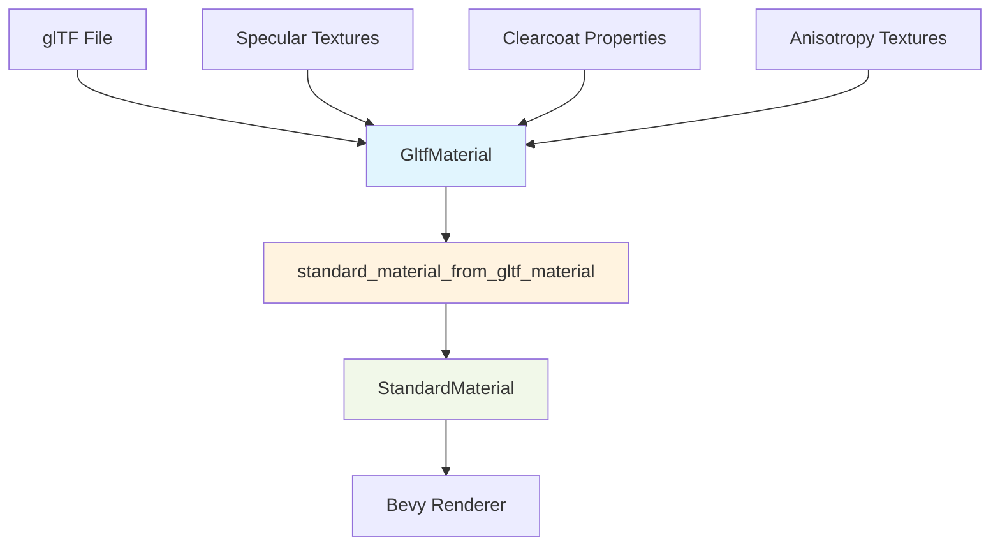

+++
title = "#22845 add missing channels/textures on conversion from gltf to standard material"
date = "2026-02-07T00:00:00"
draft = false
template = "pull_request_page.html"
in_search_index = true

[taxonomies]
list_display = ["show"]

[extra]
current_language = "en"
available_languages = {"en" = { name = "English", url = "/pull_request/bevy/2026-02/pr-22845-en-20260207" }, "zh-cn" = { name = "中文", url = "/pull_request/bevy/2026-02/pr-22845-zh-cn-20260207" }}
labels = ["A-Rendering", "A-glTF"]
+++

# Title
add missing channels/textures on conversion from gltf to standard material

## Basic Information
- **Title**: add missing channels/textures on conversion from gltf to standard material
- **PR Link**: https://github.com/bevyengine/bevy/pull/22845
- **Author**: mockersf
- **Status**: MERGED
- **Labels**: A-Rendering, S-Ready-For-Final-Review, A-glTF
- **Created**: 2026-02-07T03:52:29Z
- **Merged**: 2026-02-07T05:28:10Z
- **Merged By**: alice-i-cecile

## Description Translation

### Objective

- https://github.com/bevyengine/bevy/pull/22569 added a conversion from `GltfMaterial` to `StandardMaterial` but missed a few channels/textures

### Solution

- Add them

## The Story of This Pull Request

This PR addresses a straightforward but important issue in Bevy's material system. The problem originated from PR #22569, which added conversion functionality from `GltfMaterial` to `StandardMaterial`. However, that initial implementation was incomplete - it missed several material channels and textures that are part of the glTF material specification but weren't being copied over during the conversion.

The core issue was that the conversion function `standard_material_from_gltf_material` in `crates/bevy_pbr/src/lib.rs` didn't include assignments for all the fields available on the `GltfMaterial` struct. This meant that when loading glTF files with advanced material features like specular textures, clearcoat properties, or anisotropy, those material properties would be lost during the conversion to Bevy's internal `StandardMaterial` representation.

The solution approach was simple and direct: identify the missing fields and add them to the conversion function. However, this required careful attention to Bevy's conditional compilation system. Several of these material features are guarded by feature flags (like `pbr_specular_textures`, `pbr_multi_layer_material_textures`, and `pbr_anisotropy_texture`), so the new field assignments needed to be wrapped in appropriate `#[cfg(feature = "...")]` attributes to ensure they only compile when the corresponding feature is enabled.

From a technical perspective, this fix demonstrates several important patterns in the Bevy codebase:

1. **Conditional compilation for render features**: Bevy uses feature flags to control which PBR (Physically Based Rendering) features are included in the build. This allows users to opt into more advanced (and potentially more expensive) rendering features only when needed.

2. **Material system design**: The `GltfMaterial` struct serves as an intermediate representation that captures all the material data from a glTF file, while `StandardMaterial` is Bevy's runtime material representation. The conversion function acts as a bridge between these two representations.

3. **Data mapping patterns**: The fix follows a consistent pattern where each field from `GltfMaterial` is cloned and assigned to the corresponding field in `StandardMaterial`. The use of `.clone()` is appropriate here since these are typically handle types (like texture handles) that implement cheap cloning.

The implementation required adding assignments for three categories of missing fields:

- Specular textures and channels (guarded by `pbr_specular_textures`)
- Clearcoat roughness and normal textures/channels (guarded by `pbr_multi_layer_material_textures`)
- Anisotropy textures and channels (guarded by `pbr_anisotropy_texture`)

Each addition follows the same pattern: check if the feature is enabled, then clone the corresponding field from the source `GltfMaterial` to the destination `StandardMaterial`.

The impact of this fix is that glTF files with advanced material properties will now render correctly in Bevy. Without this fix, models using these advanced features would appear with missing or incorrect material properties, which could significantly affect visual quality for users who rely on these PBR extensions.

This PR also highlights an important lesson about conversion functions: when mapping between two structs with many fields, it's easy to miss some fields, especially when they're conditionally compiled. A systematic approach - perhaps comparing field-by-field or using a macro - could help prevent similar issues in the future.

## Visual Representation



## Key Files Changed

### `crates/bevy_pbr/src/lib.rs` (+20/-0)

This is the only file modified in this PR. The changes are all in the `standard_material_from_gltf_material` function, which converts a `GltfMaterial` to a `StandardMaterial`. The function was missing assignments for several material channels and textures that are conditionally compiled based on feature flags.

**Key modifications:**

```rust
// Before: (simplified - showing only the missing fields context)
fn standard_material_from_gltf_material(material: &GltfMaterial) -> StandardMaterial {
    StandardMaterial {
        // ... existing assignments ...
        normal_map_texture: material.normal_map_texture.clone(),
        occlusion_channel: material.occlusion_channel.clone(),
        occlusion_texture: material.occlusion_texture.clone(),
        clearcoat: material.clearcoat,
        clearcoat_perceptual_roughness: material.clearcoat_perceptual_roughness,
        anisotropy_strength: material.anisotropy_strength,
        anisotropy_rotation: material.anisotropy_rotation,
        double_sided: material.double_sided,
        cull_mode: material.cull_mode,
        unlit: material.unlit,
        // Missing: specular, clearcoat, and anisotropy textures/channels
    }
}

// After:
fn standard_material_from_gltf_material(material: &GltfMaterial) -> StandardMaterial {
    StandardMaterial {
        // ... existing assignments ...
        normal_map_texture: material.normal_map_texture.clone(),
        occlusion_channel: material.occlusion_channel.clone(),
        occlusion_texture: material.occlusion_texture.clone(),
        #[cfg(feature = "pbr_specular_textures")]
        specular_channel: material.specular_channel.clone(),
        #[cfg(feature = "pbr_specular_textures")]
        specular_texture: material.specular_texture.clone(),
        #[cfg(feature = "pbr_specular_textures")]
        specular_tint_channel: material.specular_tint_channel.clone(),
        #[cfg(feature = "pbr_specular_textures")]
        specular_tint_texture: material.specular_tint_texture.clone(),
        clearcoat: material.clearcoat,
        clearcoat_perceptual_roughness: material.clearcoat_perceptual_roughness,
        #[cfg(feature = "pbr_multi_layer_material_textures")]
        clearcoat_roughness_channel: material.clearcoat_roughness_channel.clone(),
        #[cfg(feature = "pbr_multi_layer_material_textures")]
        clearcoat_roughness_texture: material.clearcoat_roughness_texture.clone(),
        #[cfg(feature = "pbr_multi_layer_material_textures")]
        clearcoat_normal_channel: material.clearcoat_normal_channel.clone(),
        #[cfg(feature = "pbr_multi_layer_material_textures")]
        clearcoat_normal_texture: material.clearcoat_normal_texture.clone(),
        anisotropy_strength: material.anisotropy_strength,
        anisotropy_rotation: material.anisotropy_rotation,
        #[cfg(feature = "pbr_anisotropy_texture")]
        anisotropy_channel: material.anisotropy_channel.clone(),
        #[cfg(feature = "pbr_anisotropy_texture")]
        anisotropy_texture: material.anisotropy_texture.clone(),
        double_sided: material.double_sided,
        cull_mode: material.cull_mode,
        unlit: material.unlit,
    }
}
```

**How these changes relate to the overall purpose:**
The added lines ensure that when converting from `GltfMaterial` to `StandardMaterial`, all material properties are preserved, including those that are conditionally compiled. This fixes the issue where advanced glTF material features would be lost during the conversion process.

## Further Reading

1. **glTF Material Specification**: [Khronos glTF 2.0 Specification - Materials](https://github.com/KhronosGroup/glTF/tree/main/specification/2.0#materials) - Reference for understanding glTF material properties
2. **Bevy PBR Rendering**: [Bevy PBR Documentation](https://docs.rs/bevy_pbr/latest/bevy_pbr/) - Documentation for Bevy's physically based rendering system
3. **Conditional Compilation in Rust**: [The Rust Reference - Conditional Compilation](https://doc.rust-lang.org/reference/conditional-compilation.html) - How `#[cfg]` attributes work in Rust
4. **Previous PR #22569**: [Add From<GltfMaterial> for StandardMaterial](https://github.com/bevyengine/bevy/pull/22569) - The original implementation that this PR fixes

# Full Code Diff
```
diff --git a/crates/bevy_pbr/src/lib.rs b/crates/bevy_pbr/src/lib.rs
index 8e67727ccf990..5fc8e83a22cf2 100644
--- a/crates/bevy_pbr/src/lib.rs
+++ b/crates/bevy_pbr/src/lib.rs
@@ -413,10 +413,30 @@ fn standard_material_from_gltf_material(material: &GltfMaterial) -> StandardMate
         normal_map_texture: material.normal_map_texture.clone(),
         occlusion_channel: material.occlusion_channel.clone(),
         occlusion_texture: material.occlusion_texture.clone(),
+        #[cfg(feature = "pbr_specular_textures")]
+        specular_channel: material.specular_channel.clone(),
+        #[cfg(feature = "pbr_specular_textures")]
+        specular_texture: material.specular_texture.clone(),
+        #[cfg(feature = "pbr_specular_textures")]
+        specular_tint_channel: material.specular_tint_channel.clone(),
+        #[cfg(feature = "pbr_specular_textures")]
+        specular_tint_texture: material.specular_tint_texture.clone(),
         clearcoat: material.clearcoat,
         clearcoat_perceptual_roughness: material.clearcoat_perceptual_roughness,
+        #[cfg(feature = "pbr_multi_layer_material_textures")]
+        clearcoat_roughness_channel: material.clearcoat_roughness_channel.clone(),
+        #[cfg(feature = "pbr_multi_layer_material_textures")]
+        clearcoat_roughness_texture: material.clearcoat_roughness_texture.clone(),
+        #[cfg(feature = "pbr_multi_layer_material_textures")]
+        clearcoat_normal_channel: material.clearcoat_normal_channel.clone(),
+        #[cfg(feature = "pbr_multi_layer_material_textures")]
+        clearcoat_normal_texture: material.clearcoat_normal_texture.clone(),
         anisotropy_strength: material.anisotropy_strength,
         anisotropy_rotation: material.anisotropy_rotation,
+        #[cfg(feature = "pbr_anisotropy_texture")]
+        anisotropy_channel: material.anisotropy_channel.clone(),
+        #[cfg(feature = "pbr_anisotropy_texture")]
+        anisotropy_texture: material.anisotropy_texture.clone(),
         double_sided: material.double_sided,
         cull_mode: material.cull_mode,
         unlit: material.unlit,
```