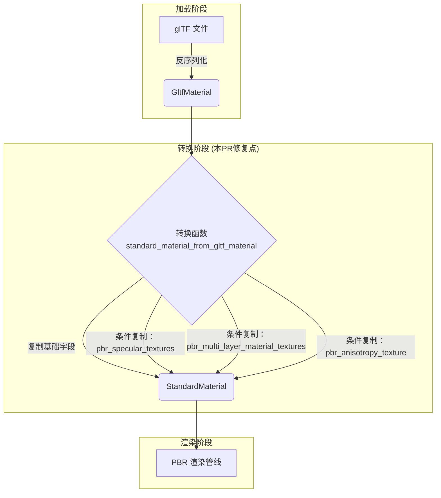

+++
title = "#22845 add missing channels/textures on conversion from gltf to standard material"
date = "2026-02-07T00:00:00"
draft = false
template = "pull_request_page.html"
in_search_index = false

[extra]
current_language = "zh-cn"
available_languages = {"en" = { name = "English", url = "/pull_request/bevy/2026-02/pr-22845-en-20260207" }, "zh-cn" = { name = "中文", url = "/pull_request/bevy/2026-02/pr-22845-zh-cn-20260207" }}
+++

# Title

## 基本信息
- **标题**: add missing channels/textures on conversion from gltf to standard material
- **PR链接**: https://github.com/bevyengine/bevy/pull/22845
- **作者**: mockersf
- **状态**: 已合并
- **标签**: A-Rendering, S-Ready-For-Final-Review, A-glTF
- **创建时间**: 2026-02-07T03:52:29Z
- **合并时间**: 2026-02-07T05:28:10Z
- **合并者**: alice-i-cecile

## 描述翻译

# Objective (目标)

- https://github.com/bevyengine/bevy/pull/22569 添加了从 `GltfMaterial` 到 `StandardMaterial` 的转换，但遗漏了一些通道(channels)/纹理(textures)

## Solution (解决方案)

- 添加上它们

## 此Pull Request的故事

这个PR的核心是一个修复补丁，它填补了之前一个功能增强PR中引入的数据转换漏洞。在Bevy渲染管线中，`GltfMaterial` 是用于解析和存储glTF格式模型材质数据的结构体，而 `StandardMaterial` 是Bevy内部用于PBR（基于物理的渲染）渲染的标准材质结构。PR #22569 为两者之间添加了直接的转换函数 `standard_material_from_gltf_material`，这是一个必要的优化，可以减少数据复制并简化材质加载流程。然而，这个初始实现是不完整的。

问题的根本原因在于 `GltfMaterial` 结构体随着Bevy的PBR功能演进，已经包含了多个由可选编译特性(features)控制的扩展属性，例如高光纹理(specular textures)、多层材质纹理(multi-layer material textures)和各向异性纹理(anisotropy texture)。在最初的转换函数实现中，开发者只复制了基础PBR属性（如`base_color`， `normal_map_texture`），遗漏了这些条件编译的特性所对应的字段。这意味着当一个glTF模型使用了这些高级材质特性，并且Bevy引擎启用了对应的编译特性时，转换后的 `StandardMaterial` 会丢失这些重要的渲染信息，导致模型在渲染时外观不正确。

解决方案是直接且具有防御性的：在转换函数中，为每一个遗漏的字段添加对应的赋值语句。关键在于，这些字段的添加被正确地包裹在相应的条件编译属性 `#[cfg(feature = "...")]` 中。这与 `GltfMaterial` 和 `StandardMaterial` 结构体自身对这些字段的定义方式保持一致，确保了代码的编译一致性。如果项目没有启用 `pbr_specular_textures` 特性，那么相关的 `specular_channel` 等字段在结构体定义中就不存在，尝试在转换函数中访问它们会导致编译错误。通过使用相同的 `#[cfg]` 属性，转换函数仅在相关特性启用时才包含这些字段的赋值逻辑，从而安全地解决了编译问题。

这个修复的工程价值在于其**完整性**和**一致性**。它没有引入新的算法或架构，而是细致地审计并补全了数据映射的每一个环节。对于游戏引擎这类复杂系统，资源加载路径的正确性至关重要，任何数据丢失都会直接导致视觉错误。此PR确保了材质数据在从glTF格式反序列化到内存中的 `GltfMaterial`，再转换到渲染可用的 `StandardMaterial` 的整个链条中，所有支持的特性数据都能无损地传递。

从代码模式来看，这次修改也提供了一个清晰的示例，展示了在Rust中如何处理特性开关(feature flags)与数据转换的协作。它强调了当编写在两个条件编译结构体之间转换数据的函数时，必须仔细镜像(mirror)源结构和目标结构的条件编译块，以避免编译时或运行时的不匹配。

## 视觉表征



## 关键文件变更

- `crates/bevy_pbr/src/lib.rs` (+20/-0)

**变更描述**:
此文件是Bevy的PBR渲染核心库。变更发生在 `standard_material_from_gltf_material` 函数内部，目的是将之前遗漏的、受特性开关控制的材质属性从 `GltfMaterial` 复制到 `StandardMaterial`。

**代码片段**:
```rust
// 文件：crates/bevy_pbr/src/lib.rs
// 函数：standard_material_from_gltf_material
// 以下是添加的部分（原函数中已存在的其他字段赋值未列出）

StandardMaterial {
    // ... 已有的基础字段赋值
    normal_map_texture: material.normal_map_texture.clone(),
    occlusion_channel: material.occlusion_channel.clone(),
    occlusion_texture: material.occlusion_texture.clone(),
    
    // +++ 新增：高光纹理相关字段 (由特性 `pbr_specular_textures` 控制)
    #[cfg(feature = "pbr_specular_textures")]
    specular_channel: material.specular_channel.clone(),
    #[cfg(feature = "pbr_specular_textures")]
    specular_texture: material.specular_texture.clone(),
    #[cfg(feature = "pbr_specular_textures")]
    specular_tint_channel: material.specular_tint_channel.clone(),
    #[cfg(feature = "pbr_specular_textures")]
    specular_tint_texture: material.specular_tint_texture.clone(),
    
    clearcoat: material.clearcoat,
    clearcoat_perceptual_roughness: material.clearcoat_perceptual_roughness,
    
    // +++ 新增：清漆层纹理相关字段 (由特性 `pbr_multi_layer_material_textures` 控制)
    #[cfg(feature = "pbr_multi_layer_material_textures")]
    clearcoat_roughness_channel: material.clearcoat_roughness_channel.clone(),
    #[cfg(feature = "pbr_multi_layer_material_textures")]
    clearcoat_roughness_texture: material.clearcoat_roughness_texture.clone(),
    #[cfg(feature = "pbr_multi_layer_material_textures")]
    clearcoat_normal_channel: material.clearcoat_normal_channel.clone(),
    #[cfg(feature = "pbr_multi_layer_material_textures")]
    clearcoat_normal_texture: material.clearcoat_normal_texture.clone(),
    
    anisotropy_strength: material.anisotropy_strength,
    anisotropy_rotation: material.anisotropy_rotation,
    
    // +++ 新增：各向异性纹理相关字段 (由特性 `pbr_anisotropy_texture` 控制)
    #[cfg(feature = "pbr_anisotropy_texture")]
    anisotropy_channel: material.anisotropy_channel.clone(),
    #[cfg(feature = "pbr_anisotropy_texture")]
    anisotropy_texture: material.anisotropy_texture.clone(),
    
    // ... 已有的其他字段赋值
    double_sided: material.double_sided,
    cull_mode: material.cull_mode,
    unlit: material.unlit,
}
```
**与PR目的的关系**:
这些新增的赋值语句直接对应了PR的目标——补全转换过程中缺失的通道和纹理数据。每一个 `#[cfg]` 块都精确地对应一个Bevy的PBR扩展特性，确保了代码只在启用特定功能时编译，保持了模块化和兼容性。

## 延伸阅读

1.  **Bevy PBR 材质文档**: 了解 `StandardMaterial` 的所有属性和其对应的编译特性。
    - 链接: [Bevy Cheatbook - Standard Material](https://bevy-cheatbook.github.io/3d/standard-material.html)
2.  **glTF 2.0 材质规范**: 理解glTF格式中材质、纹理和通道的原始定义，有助于明白这些数据在 `GltfMaterial` 中的来源。
    - 链接: [Khronos glTF 2.0 Specification - Materials](https://github.com/KhronosGroup/glTF/tree/main/specification/2.0#materials)
3.  **Rust 条件编译 (`#[cfg]`)**: 学习Rust中如何使用特性开关来管理平台特定代码或可选功能。
    - 链接: [The Rust Reference - Conditional Compilation](https://doc.rust-lang.org/reference/conditional-compilation.html)

# 完整代码差异
```diff
diff --git a/crates/bevy_pbr/src/lib.rs b/crates/bevy_pbr/src/lib.rs
index 8e67727ccf990..5fc8e83a22cf2 100644
--- a/crates/bevy_pbr/src/lib.rs
+++ b/crates/bevy_pbr/src/lib.rs
@@ -413,10 +413,30 @@ fn standard_material_from_gltf_material(material: &GltfMaterial) -> StandardMate
         normal_map_texture: material.normal_map_texture.clone(),
         occlusion_channel: material.occlusion_channel.clone(),
         occlusion_texture: material.occlusion_texture.clone(),
+        #[cfg(feature = "pbr_specular_textures")]
+        specular_channel: material.specular_channel.clone(),
+        #[cfg(feature = "pbr_specular_textures")]
+        specular_texture: material.specular_texture.clone(),
+        #[cfg(feature = "pbr_specular_textures")]
+        specular_tint_channel: material.specular_tint_channel.clone(),
+        #[cfg(feature = "pbr_specular_textures")]
+        specular_tint_texture: material.specular_tint_texture.clone(),
         clearcoat: material.clearcoat,
         clearcoat_perceptual_roughness: material.clearcoat_perceptual_roughness,
+        #[cfg(feature = "pbr_multi_layer_material_textures")]
+        clearcoat_roughness_channel: material.clearcoat_roughness_channel.clone(),
+        #[cfg(feature = "pbr_multi_layer_material_textures")]
+        clearcoat_roughness_texture: material.clearcoat_roughness_texture.clone(),
+        #[cfg(feature = "pbr_multi_layer_material_textures")]
+        clearcoat_normal_channel: material.clearcoat_normal_channel.clone(),
+        #[cfg(feature = "pbr_multi_layer_material_textures")]
+        clearcoat_normal_texture: material.clearcoat_normal_texture.clone(),
         anisotropy_strength: material.anisotropy_strength,
         anisotropy_rotation: material.anisotropy_rotation,
+        #[cfg(feature = "pbr_anisotropy_texture")]
+        anisotropy_channel: material.anisotropy_channel.clone(),
+        #[cfg(feature = "pbr_anisotropy_texture")]
+        anisotropy_texture: material.anisotropy_texture.clone(),
         double_sided: material.double_sided,
         cull_mode: material.cull_mode,
         unlit: material.unlit,
```