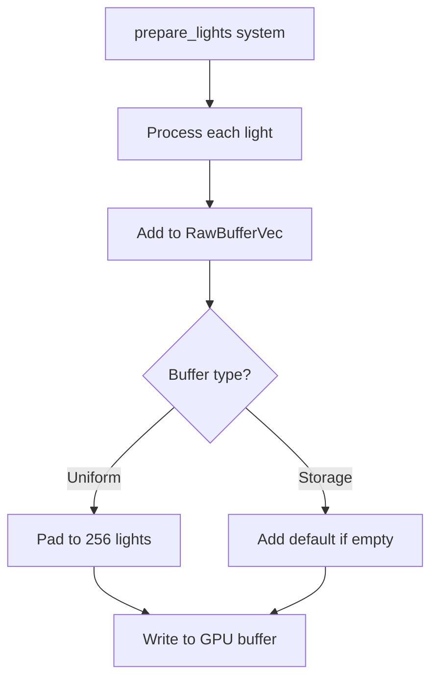

+++
title = "#22846 Stop using `encase` for clusterable lights."
date = "2026-02-09T00:00:00"
draft = false
template = "pull_request_page.html"
in_search_index = true

[taxonomies]
list_display = ["show"]

[extra]
current_language = "en"
available_languages = {"en" = { name = "English", url = "/pull_request/bevy/2026-02/pr-22846-en-20260209" }, "zh-cn" = { name = "中文", url = "/pull_request/bevy/2026-02/pr-22846-zh-cn-20260209" }}
labels = ["A-Rendering", "C-Performance"]
+++

# Title

## Basic Information
- **Title**: Stop using `encase` for clusterable lights.
- **PR Link**: https://github.com/bevyengine/bevy/pull/22846
- **Author**: pcwalton
- **Status**: MERGED
- **Labels**: A-Rendering, C-Performance, S-Ready-For-Final-Review
- **Created**: 2026-02-07T05:06:53Z
- **Merged**: 2026-02-09T06:51:44Z
- **Merged By**: superdump

## Description Translation
`encase` has a lot of overhead, and it's not buying us anything for `GpuClusteredLight`. Switching to `RawBufferVec` improved performance of `prepare_lights` in `many_lights` from 6.27 ms to 5.2 ms, a 20% speedup.


## The Story of This Pull Request

This PR addresses a performance bottleneck in Bevy's rendering system related to how clustered light data is prepared and uploaded to the GPU. The issue was that the `encase` library, used for serializing structured data to GPU buffers, was introducing unnecessary overhead for the `GpuClusteredLight` data structure.

The problem stemmed from the design of the `GpuClusteredLights` enum, which had two variants: `Uniform` for platforms that don't support storage buffers, and `Storage` for platforms that do. Both variants used `encase`-backed buffers (`UniformBuffer` and `StorageBuffer`). The `prepare_lights` system would first collect all lights into a `Vec<GpuClusteredLight>`, then copy this data into the appropriate buffer type. This approach required multiple data copies and the serialization overhead of `encase`.

The solution replaces the entire `GpuClusteredLights` enum with a simpler struct that directly uses `RawBufferVec<GpuClusteredLight>`. `RawBufferVec` is Bevy's own buffer abstraction that provides efficient, low-overhead buffer management. To make this work, `GpuClusteredLight` needed to be marked as `Pod` (Plain Old Data) and `Zeroable` from the `bytemuck` crate, which allows for safe transmutation of the struct to bytes.

The implementation changes the data flow significantly. Instead of building a temporary vector and then copying it to the buffer, lights are now added directly to the `RawBufferVec` as they're processed. This eliminates intermediate allocations and copies. The `add` method handles the uniform buffer size limit (256 lights) by only adding lights when there's room, while storage buffers have no such limit.

The buffer writing logic also needed adjustment. For storage buffers, if the buffer is empty, a default light is pushed to ensure the buffer is valid. For uniform buffers, the buffer is padded with default lights up to the maximum size (256) to maintain consistent buffer layout. This padding is necessary because uniform buffers require fixed sizes at shader compilation time.

The performance improvement of 20% (6.27 ms to 5.2 ms) in the `prepare_lights` system for the `many_lights` example demonstrates the impact of removing the `encase` serialization overhead. This is particularly important because `prepare_lights` runs every frame for scenes with dynamic lighting.

## Visual Representation



## Key Files Changed

### `crates/bevy_pbr/src/cluster.rs` (+47/-48)

This file contains the core data structure changes. The `GpuClusteredLights` enum was completely replaced with a struct using `RawBufferVec`.

**Key changes:**
1. Added `Pod` and `Zeroable` derives to `GpuClusteredLight` to enable direct byte manipulation
2. Replaced the enum-based design with a struct containing `RawBufferVec`

```rust
// Before: Enum with two variants
pub enum GpuClusteredLights {
    Uniform(UniformBuffer<GpuClusteredLightsUniform>),
    Storage(StorageBuffer<GpuClusteredLightsStorage>),
}

// After: Single struct with RawBufferVec
pub struct GpuClusteredLights {
    data: RawBufferVec<GpuClusteredLight>,
    is_storage_buffer: bool,
}
```

3. Added new methods for direct buffer manipulation:

```rust
pub(crate) fn clear(&mut self) {
    self.data.clear();
}

pub(crate) fn add(&mut self, light: GpuClusteredLight) {
    if self.is_storage_buffer || self.data.len() < MAX_UNIFORM_BUFFER_CLUSTERABLE_OBJECTS {
        self.data.push(light);
    }
}
```

4. Updated buffer writing logic to handle padding for uniform buffers:

```rust
pub(crate) fn write_buffer(&mut self, render_device: &RenderDevice, render_queue: &RenderQueue) {
    if self.is_storage_buffer {
        if self.data.is_empty() {
            self.data.push(GpuClusteredLight::default());
        }
    } else {
        while self.data.len() < MAX_UNIFORM_BUFFER_CLUSTERABLE_OBJECTS {
            self.data.push(GpuClusteredLight::default());
        }
    }
    
    self.data.write_buffer(render_device, render_queue);
}
```

### `crates/bevy_pbr/src/render/light.rs` (+31/-31)

This file contains the changes to the `prepare_lights` system to use the new API.

**Key changes:**
1. Removed the temporary `Vec<GpuClusteredLight>` collection
2. Directly add lights to the buffer during processing:

```rust
// Before: Collect all lights first, then set
let mut gpu_clustered_lights = Vec::new();
// ... populate vector
global_clusterable_object_meta
    .gpu_clustered_lights
    .set(gpu_clustered_lights);

// After: Add directly to buffer
global_clusterable_object_meta.gpu_clustered_lights.clear();
// ... for each light
global_clusterable_object_meta
    .gpu_clustered_lights
    .add(GpuClusteredLight { ... });
```

## Further Reading

1. **RawBufferVec documentation**: Bevy's `RawBufferVec` provides efficient GPU buffer management
2. **bytemuck crate**: Used for safe transmutation of POD types to bytes
3. **WGSL buffer layout**: Understanding uniform vs storage buffer requirements in WebGPU
4. **Bevy rendering architecture**: How Bevy's ECS integrates with GPU data preparation