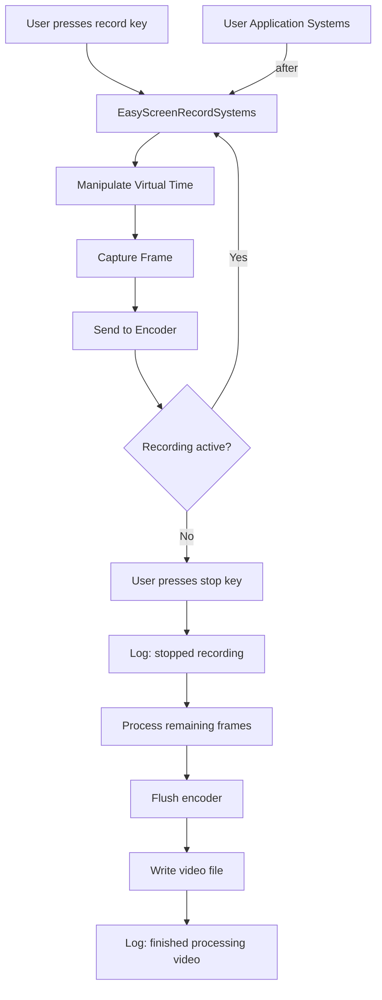

+++
title = "#22847 Small `EasyScreenRecordingPlugin` Usability Improvements: expose system set, more helpful `info`'s"
date = "2026-02-08T00:00:00"
draft = false
template = "pull_request_page.html"
in_search_index = true

[taxonomies]
list_display = ["show"]

[extra]
current_language = "en"
available_languages = {"en" = { name = "English", url = "/pull_request/bevy/2026-02/pr-22847-en-20260208" }, "zh-cn" = { name = "中文", url = "/pull_request/bevy/2026-02/pr-22847-zh-cn-20260208" }}
labels = ["C-Usability", "A-Dev-Tools", "D-Straightforward"]
+++

# Small `EasyScreenRecordingPlugin` Usability Improvements: expose system set, more helpful `info`'s

## Basic Information
- **Title**: Small `EasyScreenRecordingPlugin` Usability Improvements: expose system set, more helpful `info`'s
- **PR Link**: https://github.com/bevyengine/bevy/pull/22847
- **Author**: kfc35
- **Status**: MERGED
- **Labels**: C-Usability, S-Ready-For-Final-Review, A-Dev-Tools, D-Straightforward
- **Created**: 2026-02-07T05:55:55Z
- **Merged**: 2026-02-08T01:14:54Z
- **Merged By**: mockersf

## Description Translation

# Objective

- Fixes #22736 

## Solution

- Add and expose a system set (`EasyScreenRecordSystems`) for the `Update` systems run in `EasyScreenRecordingPlugin`. Users who have apps with behavior that depend on virtual time, and who want that behavior recorded, should have their own `Update` systems run after `EasyScreenRecordSystems`.
- While testing out recording, I found the `info` statements could be improved slightly, so I added one and edited another.

## Testing

- I tested the reproduction example in #22736 and waited very patiently for the video to process (A 6 second video took 5 minutes to save! Don't know if it's just me... Maybe worth making an issue...). I used ffmpeg to process the h264 file into an mp4, and it looks like I expect.

## The Story of This Pull Request

This PR addresses a specific usability issue in Bevy's screen recording functionality. When users record their applications, they may encounter unexpected behavior if their game logic depends on virtual time and runs concurrently with the screen recording systems. The core problem is that the `EasyScreenRecordingPlugin` manipulates virtual time to capture frames at a consistent rate, but there was no clear way for application developers to ensure their own systems run in the correct order relative to these time manipulations.

The issue (#22736) likely manifested as applications behaving differently during recording versus normal playback, particularly for systems that depend on `bevy_time::Virtual` time. When recording, the plugin pauses virtual time to capture frames, then advances it in discrete steps. If application systems run before the recording systems have adjusted the time, they'll see an incorrect time state.

The solution approach is straightforward and follows Bevy's established patterns for system ordering. The developer added a public system set `EasyScreenRecordSystems` that contains all the update systems from the screen recording plugin. This allows users to explicitly order their own systems relative to the recording systems using Bevy's scheduling API, specifically by making their systems run `after(EasyScreenRecordSystems)`.

From an implementation perspective, the changes are minimal but effective. The new system set is defined with the standard Bevy system set derive macro and includes comprehensive documentation explaining when and why users should order their systems after it. The documentation explicitly states that while the application may run slower during recording due to time manipulation, the resulting video will play back at normal speed.

The second set of changes improves the user experience by making the logging more informative. Originally, when stopping a recording, the system would log "stopping recording" at the beginning of the stop process. The new implementation provides better feedback by:
1. Logging "stopped recording. still processing video" immediately when the user initiates the stop command
2. Logging "finished processing video" only after the video encoding is complete and the file is written

This distinction is important because, as noted in the PR description, video processing can take significantly longer than the recording itself (5 minutes to save a 6-second video in the developer's testing). The updated logs give users clear feedback about what stage the system is in, preventing confusion about whether the system is still working or has hung.

The implementation changes are technically sound. The system set is added to the chain of systems using `.in_set(EasyScreenRecordSystems)`, which integrates cleanly with Bevy's existing system chaining pattern. The logging changes are simple but thoughtful, moving the "stopping recording" log to a more appropriate location and adding a completion log.

One technical insight from this PR is the importance of clear system ordering in time-sensitive applications. By exposing the system set, the plugin follows the principle of making implicit dependencies explicit, which is crucial for a game engine where timing can affect gameplay, physics, and visual effects.

The impact of these changes is primarily improved developer experience. Users who need precise control over system ordering relative to screen recording now have the tools to achieve it. The better logging reduces confusion during what can be a lengthy video processing operation. These are small quality-of-life improvements that make the screen recording feature more usable and predictable.

## Visual Representation



## Key Files Changed

### `crates/bevy_dev_tools/src/easy_screenshot.rs` (+19/-2)

1. **What changed and why**: Added a public system set `EasyScreenRecordSystems` to allow users to order their application systems relative to screen recording systems. Also improved logging messages to provide better user feedback during the recording stop and processing phases.

2. **Key modifications**:

```rust
// Added: New system set definition
#[derive(SystemSet, Debug, Clone, Copy, PartialEq, Eq, Hash)]
pub struct EasyScreenRecordSystems;

// Modified: System chain now includes the system set
.chain()
.in_set(EasyScreenRecordSystems),

// Modified: Logging improvements in the stop handling
// Before:
// info!("stopping recording");
// After removing the early log and adding two more informative logs:

// When user stops recording:
info!("stopped recording. still processing video");

// After video processing completes:
info!("finished processing video");
```

3. **How these changes relate to the overall purpose**: The system set addresses the core issue of system ordering for applications that depend on virtual time. The logging improvements provide better user feedback about the recording process state.

## Further Reading

1. [Bevy System Sets Documentation](https://docs.rs/bevy/latest/bevy/ecs/schedule/trait.IntoScheduleConfigs.html) - Understanding how to order systems relative to each other
2. [Bevy Time Documentation](https://docs.rs/bevy/latest/bevy/time/index.html) - Working with virtual time and understanding time manipulation
3. [Bevy Screen Recording Example](https://github.com/bevyengine/bevy/tree/main/examples) - Look for examples using screen recording to see practical implementations
4. [FFmpeg Documentation](https://ffmpeg.org/documentation.html) - Useful for processing the generated h264 files into other video formats