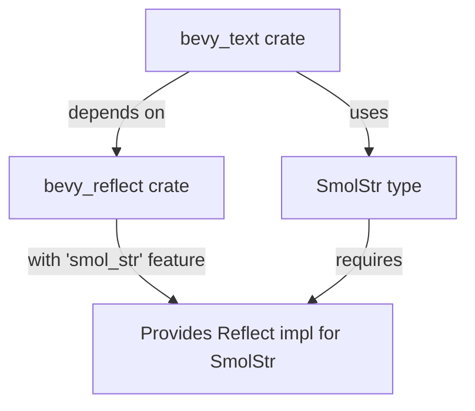

+++
title = "#22848 Add smol_str feature to bevy_reflect dependency for bevy_text."
date = "2026-02-09T00:00:00"
draft = false
template = "pull_request_page.html"
in_search_index = true

[taxonomies]
list_display = ["show"]

[extra]
current_language = "en"
available_languages = {"en" = { name = "English", url = "/pull_request/bevy/2026-02/pr-22848-en-20260209" }, "zh-cn" = { name = "中文", url = "/pull_request/bevy/2026-02/pr-22848-zh-cn-20260209" }}
labels = ["C-Bug", "D-Trivial", "A-Build-System"]
+++

# Title
Add smol_str feature to bevy_reflect dependency for bevy_text.

## Basic Information
- **Title**: Add smol_str feature to bevy_reflect dependency for bevy_text.
- **PR Link**: https://github.com/bevyengine/bevy/pull/22848
- **Author**: andriyDev
- **Status**: MERGED
- **Labels**: C-Bug, D-Trivial, A-Build-System, S-Ready-For-Final-Review, P-Compile-Failure
- **Created**: 2026-02-07T07:55:25Z
- **Merged**: 2026-02-09T22:43:09Z
- **Merged By**: alice-i-cecile

## Description Translation
# Objective

- `cargo b -p bevy_text` fails to compile due to missing `Reflect` impl on `SmolStr`.
- Fixes #22497.

## Solution

- Add the `smol_str` feature to `bevy_text`s `bevy_reflect` dependency.

## Testing

- `cargo b -p bevy_text` fails to compile on main, but it succeeds with this PR.

## The Story of This Pull Request

This PR addresses a straightforward build failure in the Bevy engine's text module. The problem was that compiling `bevy_text` would fail because the `SmolStr` type, which is used somewhere in the text system, lacked a `Reflect` implementation. `Reflect` is Bevy's reflection system that enables runtime type inspection, serialization, and other dynamic operations.

The root cause was that the `bevy_reflect` crate provides the `Reflect` implementation for `SmolStr` only when its optional `smol_str` feature is enabled. However, the `bevy_text` crate's dependency declaration for `bevy_reflect` didn't include this feature, even though `bevy_text` uses `SmolStr` types that need to be reflectable.

The fix is minimal and precise. The developer modified a single line in `crates/bevy_text/Cargo.toml` to add the `smol_str` feature flag to the `bevy_reflect` dependency. This ensures that when `bevy_text` is built, the `bevy_reflect` dependency is compiled with the `smol_str` feature enabled, making the necessary `Reflect` implementations available.

This type of issue is common in Rust projects with optional features—when one crate uses functionality from a dependency that's gated behind a feature flag, that feature must be explicitly enabled in the dependency declaration. The fix follows standard Cargo feature management patterns and resolves the compilation error without changing any runtime code.

The PR demonstrates good dependency management practice: when adding a feature flag to a dependency, it's formatted as a list for clarity and maintainability, even when only containing a single feature. This makes it easy to add more features in the future if needed.

## Visual Representation



## Key Files Changed

**File: `crates/bevy_text/Cargo.toml`**
This is the only file changed in the PR. The modification adds the `smol_str` feature to the `bevy_reflect` dependency declaration.

```toml
# Before:
bevy_reflect = { path = "../bevy_reflect", version = "0.19.0-dev" }

# After:
bevy_reflect = { path = "../bevy_reflect", version = "0.19.0-dev", features = [
  "smol_str",
] }
```

The change ensures that `bevy_reflect` is compiled with the `smol_str` feature enabled when building `bevy_text`, providing the necessary `Reflect` implementation for `SmolStr` types used in the text system.

## Further Reading

1. [Cargo Features Documentation](https://doc.rust-lang.org/cargo/reference/features.html) - Official Rust documentation on managing optional features in Cargo
2. [Bevy Reflection System](https://bevyengine.org/learn/quick-start/reflection/) - Overview of Bevy's reflection system
3. [SmolStr Crate](https://crates.io/crates/smol_str) - Information about the SmolStr string type used in Bevy
4. [Issue #22497](https://github.com/bevyengine/bevy/issues/22497) - The original issue report that this PR fixes

# Full Code Diff
```diff
diff --git a/crates/bevy_text/Cargo.toml b/crates/bevy_text/Cargo.toml
index 4a8a5201c9c62..f52bc45949594 100644
--- a/crates/bevy_text/Cargo.toml
+++ b/crates/bevy_text/Cargo.toml
@@ -21,7 +21,9 @@ bevy_ecs = { path = "../bevy_ecs", version = "0.19.0-dev" }
 bevy_image = { path = "../bevy_image", version = "0.19.0-dev" }
 bevy_log = { path = "../bevy_log", version = "0.19.0-dev" }
 bevy_math = { path = "../bevy_math", version = "0.19.0-dev" }
-bevy_reflect = { path = "../bevy_reflect", version = "0.19.0-dev" }
+bevy_reflect = { path = "../bevy_reflect", version = "0.19.0-dev", features = [
+  "smol_str",
+] }
 bevy_utils = { path = "../bevy_utils", version = "0.19.0-dev" }
 bevy_platform = { path = "../bevy_platform", version = "0.19.0-dev", default-features = false, features = [
   "std",
```