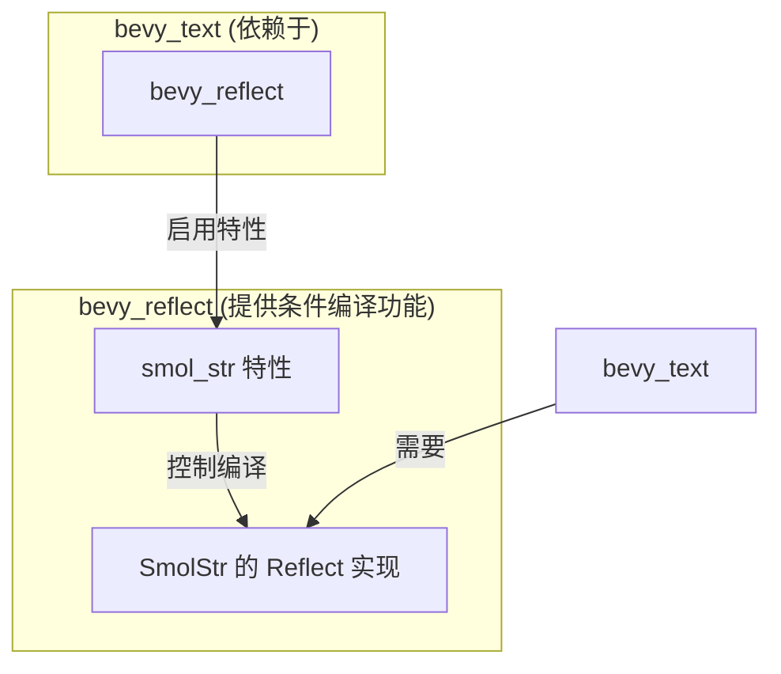

+++
title = "#22848 Add smol_str feature to bevy_reflect dependency for bevy_text."
date = "2026-02-09T00:00:00"
draft = false
template = "pull_request_page.html"
in_search_index = false

[extra]
current_language = "zh-cn"
available_languages = {"en" = { name = "English", url = "/pull_request/bevy/2026-02/pr-22848-en-20260209" }, "zh-cn" = { name = "中文", url = "/pull_request/bevy/2026-02/pr-22848-zh-cn-20260209" }}
labels = ["C-Bug", "D-Trivial", "A-Build-System"]
+++

# Title
Add smol_str feature to bevy_reflect dependency for bevy_text.

## Basic Information
- **Title**: Add smol_str feature to bevy_reflect dependency for bevy_text.
- **PR Link**: https://github.com/bevyengine/bevy/pull/22848
- **Author**: andriyDev
- **Status**: MERGED
- **Labels**: C-Bug, D-Trivial, A-Build-System, S-Ready-For-Final-Review, P-Compile-Failure
- **Created**: 2026-02-07T07:55:25Z
- **Merged**: 2026-02-09T22:43:09Z
- **Merged By**: alice-i-cecile

## Description Translation
### 目的 (Objective)
- `cargo b -p bevy_text` 因 `SmolStr` 缺少 `Reflect` 实现而编译失败。
- 修复 #22497。

### 解决方案 (Solution)
- 在 `bevy_text` 的 `bevy_reflect` 依赖中启用 `smol_str` 特性。

### 测试 (Testing)
- `cargo b -p bevy_text` 在主分支编译失败，但在本 PR 中成功。

## The Story of This Pull Request

这个 PR 源于一个直接的构建失败问题。在尝试编译 `bevy_text` 独立 crate (`cargo build -p bevy_text`) 时，开发者遇到了一个编译错误，报告问题为 `SmolStr` 类型缺少 `Reflect` trait 的实现。这是一个典型的由特性门控 (feature-gating) 和条件编译引起的依赖问题。

问题的核心在于 `bevy_reflect` crate 为某些第三方类型（如 `SmolStr`）提供的 `Reflect` 派生实现被隐藏在可选的特性后面。具体来说，`bevy_reflect` 有一个名为 `smol_str` 的特性，当启用时，才会为 `smol_str` crate 中的 `SmolStr` 类型提供 `Reflect` 的实现。这是一种常见的模式，用于避免为未使用的依赖项引入不必要的编译开销和代码膨胀。

`bevy_text` crate 的内部代码（虽然没有在这个 PR 的差异中显示）显然以某种方式使用了 `SmolStr` 类型，并且很可能通过 `bevy_reflect` 的宏或 trait 边界要求该类型实现 `Reflect`。然而，在 PR 修改之前，`bevy_text` 的 `Cargo.toml` 文件中对 `bevy_reflect` 的依赖声明没有启用 `smol_str` 特性。因此，当编译器处理 `bevy_text` 的代码并遇到对 `SmolStr` 的 `Reflect` 实现的需求时，它在 `bevy_reflect` 中找不到该实现，因为相应的代码由于特性未启用而被条件编译排除在外，从而导致编译失败。

解决方案非常直接且符合 Rust 的包管理惯例：在声明依赖时显式启用所需的特性。开发者修改了 `crates/bevy_text/Cargo.toml` 文件，在 `bevy_reflect` 的依赖项中添加了 `features = [ "smol_str" ]`。这确保了当 `bevy_text` 被编译时，它所依赖的 `bevy_reflect` 会启用 `smol_str` 特性，从而使得 `SmolStr` 的 `Reflect` 实现可用，解决了编译错误。

虽然这个改动本身很小，但它揭示了在由多个可组合特性构成的复杂项目（如 Bevy 游戏引擎）中管理依赖关系的一个重要方面。特性必须在依赖图中正确地传递和启用。如果一个 crate (A) 使用了来自其依赖项 (B) 的某个特性门控功能，那么 crate A 必须在自己的 `Cargo.toml` 中声明对该特性 (在 B 上) 的启用。这有时会导致“特性蔓延”，但它是 Rust 提供精细控制以避免不必要依赖的代价。

从工程角度来看，这个修复是正确且必要的。它没有改变任何公共 API 或运行时行为，仅仅修正了构建配置，使隐藏的功能变得可用。这属于构建系统维护的常规工作。

## Visual Representation

这个关系图展示了 `bevy_text` 如何通过启用 `smol_str` 特性来访问其依赖项 `bevy_reflect` 中条件编译的功能。



## Key Files Changed

### `crates/bevy_text/Cargo.toml`
1.  **描述与原因**：这是此 PR 中唯一被修改的文件。更改内容是在 `bevy_text` 对 `bevy_reflect` 的依赖声明中，添加了 `features = [ "smol_str" ]`。这是为了解决编译错误，因为 `bevy_text` 的代码需要 `SmolStr` 类型实现 `Reflect` trait，而该实现仅在 `bevy_reflect` 的 `smol_str` 特性启用时才存在。
2.  **代码修改**：
    ```toml
    # File: crates/bevy_text/Cargo.toml
    # 修改前 (Before):
    bevy_reflect = { path = "../bevy_reflect", version = "0.19.0-dev" }

    # 修改后 (After):
    bevy_reflect = { path = "../bevy_reflect", version = "0.19.0-dev", features = [
      "smol_str",
    ] }
    ```
3.  **与 PR 目的的关系**：这个更改直接实现了 PR 的目标。它通过启用正确的特性，使 `bevy_reflect` 为 `SmolStr` 提供的 `Reflect` 实现对 `bevy_text` 可见，从而修复了编译失败。

## Further Reading
1.  **Rust Book - Features**: Rust 官方指南中关于 Cargo 特性的章节，解释了如何定义和使用特性。这对于理解此 PR 的上下文至关重要。
    https://doc.rust-lang.org/cargo/reference/features.html

2.  **Cargo Reference - Dependency Features**: Cargo 参考手册中关于在依赖项上启用特性的具体语法。
    https://doc.rust-lang.org/cargo/reference/specifying-dependencies.html#enabling-features

3.  **Bevy 官方文档 - Cargo Features**: Bevy 项目自身的文档，很可能解释了其不同 crate 中可用的特性，这是管理 Bevy 项目依赖时的实用资源。
    https://github.com/bevyengine/bevy/tree/main/docs#cargo-features

4.  **Conditional Compilation (`#[cfg]`)**: 虽然这个 PR 是关于 Cargo 特性，但特性通常与 Rust 的 `#[cfg]` 属性一起使用，用于条件编译。了解 `#[cfg]` 有助于理解特性在代码层面是如何生效的。
    https://doc.rust-lang.org/reference/conditional-compilation.html