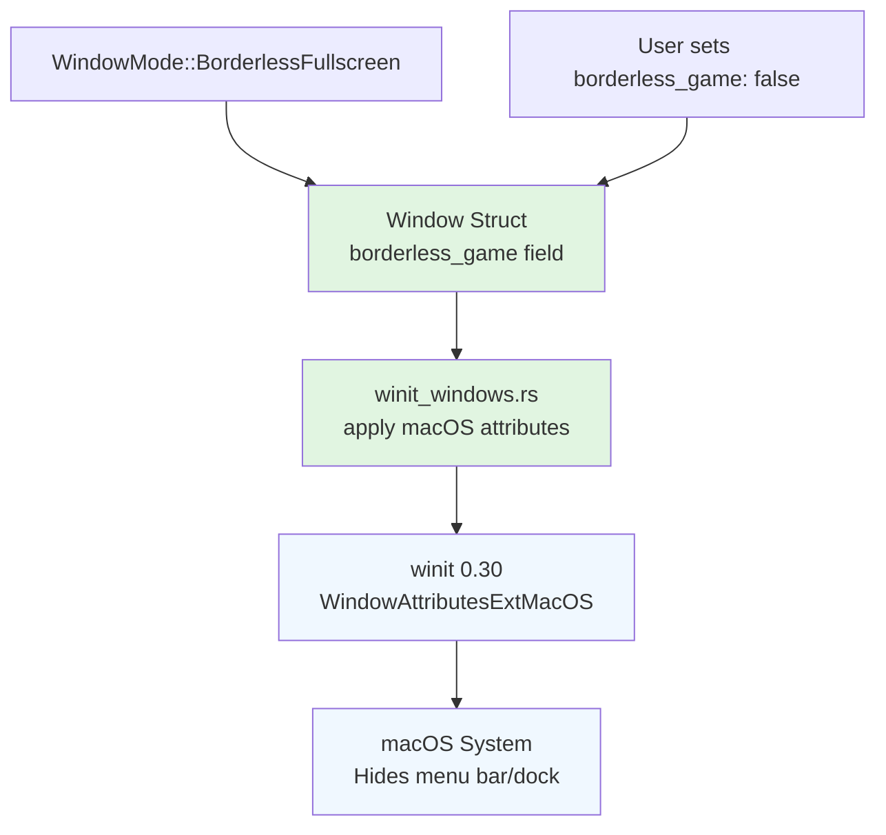

+++
title = "#22853 Enable borderless_game for winit on macOS"
date = "2026-02-09T00:00:00"
draft = false
template = "pull_request_page.html"
in_search_index = true

[taxonomies]
list_display = ["show"]

[extra]
current_language = "en"
available_languages = {"en" = { name = "English", url = "/pull_request/bevy/2026-02/pr-22853-en-20260209" }, "zh-cn" = { name = "中文", url = "/pull_request/bevy/2026-02/pr-22853-zh-cn-20260209" }}
labels = ["A-Windowing", "O-MacOS", "D-Straightforward"]
+++

# Title: Enable borderless_game for winit on macOS

## Basic Information
- **Title**: Enable borderless_game for winit on macos
- **PR Link**: https://github.com/bevyengine/bevy/pull/22853
- **Author**: TarekAS
- **Status**: MERGED
- **Labels**: A-Windowing, O-MacOS, S-Ready-For-Final-Review, D-Straightforward
- **Created**: 2026-02-07T13:11:34Z
- **Merged**: 2026-02-09T22:52:06Z
- **Merged By**: alice-i-cecile

## Description Translation
The original description is in English, so it's included as-is:

### Problem

Borderless Fullscreen on macOS does not hide the menu bar. 

Fixes: #14783 

### Solution
winit 0.30 added a  window attribute that hides the dock and menu bar when using  on macOS. This exposes that option as a field on Bevy's component, defaulting to true since this is the expected behavior in games.

### Testing

Tested by setting
```
DefaultPlugins.set(WindowPlugin {
    primary_window: Some(Window {
        mode: WindowMode::BorderlessFullscreen(MonitorSelection::Primary),
...
``` 
Launch the bevy app, and you should see that the menu bar is hidden.


### Showcase
Before:


After:


### Known Issues

https://github.com/rust-windowing/winit/issues/4477 - when switching spaces (e.g. using mission control), the menu bar regains visibility -- fixed by https://github.com/rust-windowing/winit/pull/4482

## The Story of This Pull Request

This PR addresses a specific platform issue on macOS where borderless fullscreen windows don't hide the menu bar and dock, which breaks the immersive experience expected from games. The problem was tracked in issue #14783 and stemmed from macOS's default behavior of keeping the menu bar visible even when applications are in borderless fullscreen mode.

The solution leverages a feature introduced in winit 0.30 - the `borderless_game` window attribute. Winit is the cross-platform window handling library that Bevy uses, and version 0.30 added macOS-specific APIs to control this behavior. The PR exposes this functionality through Bevy's window system in a way that maintains consistency with existing platform-specific attributes.

The implementation follows Bevy's established pattern for exposing winit platform-specific features. When a developer creates a window with `WindowMode::BorderlessFullscreen` on macOS, the system now automatically hides the menu bar and dock by default. This aligns with typical game expectations where fullscreen modes should provide an immersive experience without system UI elements.

The change is minimal but impactful: adding a new field to the `Window` struct with proper documentation and defaulting it to `true`, then applying this setting when constructing the winit window. This approach ensures backward compatibility while fixing the issue for the majority of use cases. Developers who want to show the menu bar in borderless fullscreen can explicitly set `borderless_game: false`.

The PR includes visual documentation showing the before and after states, which clearly demonstrates the fix. The menu bar disappears in borderless fullscreen mode, providing the expected fullscreen gaming experience. There's also acknowledgment of a known issue in the underlying winit library (since fixed upstream) where the menu bar could reappear when switching spaces via Mission Control.

This fix is particularly important for game developers targeting macOS who want to provide a proper fullscreen experience. Without this change, borderless fullscreen on macOS was essentially broken for gaming purposes, as the persistent menu bar and dock would distract from the game content and reduce the available screen real estate.

## Visual Representation



## Key Files Changed

### `crates/bevy_window/src/window.rs` (+13/-0)

This file defines the main `Window` struct that represents window configuration in Bevy. The change adds a new field to expose the borderless game functionality.

**Key changes:**
```rust
// File: crates/bevy_window/src/window.rs

// Before: No borderless_game field existed
// The struct had various macOS-specific fields but not this one

// After: Added borderless_game field with documentation and default
pub struct Window {
    // ... existing fields ...
    
    /// Hides the dock and menu bar when a borderless fullscreen window is active.
    ///
    /// Corresponds to [`WindowAttributesExtMacOS::with_borderless_game`].
    ///
    /// Defaults to `true` as this is the expected behavior for games.
    ///
    /// # Platform-specific
    ///
    /// - Only used on macOS.
    ///
    /// [`WindowAttributesExtMacOS::with_borderless_game`]: https://docs.rs/winit/latest/x86_64-apple-darwin/winit/platform/macos/trait.WindowAttributesExtMacOS.html#tymethod.with_borderless_game
    pub borderless_game: bool,
    
    // ... more fields ...
}

// In the Default implementation:
impl Default for Window {
    fn default() -> Self {
        Self {
            // ... other defaults ...
            borderless_game: true,  // Added this line
            // ... other defaults ...
        }
    }
}
```

### `crates/bevy_winit/src/winit_windows.rs` (+2/-1)

This file handles the conversion from Bevy's `Window` configuration to winit's window attributes. The change applies the new field when creating windows on macOS.

**Key changes:**
```rust
// File: crates/bevy_winit/src/winit_windows.rs

// Before: macOS attributes were set without borderless_game
#[cfg(target_os = "macos")]
{
    window_builder = window_builder
        .with_titlebar_hidden(!window.titlebar_shown)
        .with_titlebar_transparent(window.titlebar_transparent)
        .with_title_hidden(!window.titlebar_show_title)
        .with_titlebar_buttons_hidden(!window.titlebar_show_buttons);
}

// After: Added with_borderless_game() call
#[cfg(target_os = "macos")]
{
    window_builder = window_builder
        .with_titlebar_hidden(!window.titlebar_shown)
        .with_titlebar_transparent(window.titlebar_transparent)
        .with_title_hidden(!window.titlebar_show_title)
        .with_titlebar_buttons_hidden(!window.titlebar_show_buttons)
        .with_borderless_game(window.borderless_game);  // Added this line
}
```

## Further Reading

1. **Winit Documentation**: The [WindowAttributesExtMacOS trait documentation](https://docs.rs/winit/latest/x86_64-apple-darwin/winit/platform/macos/trait.WindowAttributesExtMacOS.html) provides details on platform-specific window attributes for macOS.

2. **Original Issue**: Issue [#14783](https://github.com/bevyengine/bevy/issues/14783) documents the problem with borderless fullscreen on macOS not hiding the menu bar.

3. **Winit Issue and Fix**: The [winit issue #4477](https://github.com/rust-windowing/winit/issues/4477) discusses the space switching problem, and [PR #4482](https://github.com/rust-windowing/winit/pull/4482) contains the upstream fix.

4. **Bevy Window Configuration**: The [Bevy window documentation](https://docs.rs/bevy_window/latest/bevy_window/struct.Window.html) explains all window configuration options available in Bevy.

5. **macOS Fullscreen Best Practices**: Apple's [Human Interface Guidelines for fullscreen apps](https://developer.apple.com/design/human-interface-guidelines/full-screen) provide context for why hiding the menu bar is important for immersive experiences.

# Full Code Diff
The full code diff is included as provided. Note that only the relevant sections are shown above in the Key Files Changed section for clarity.