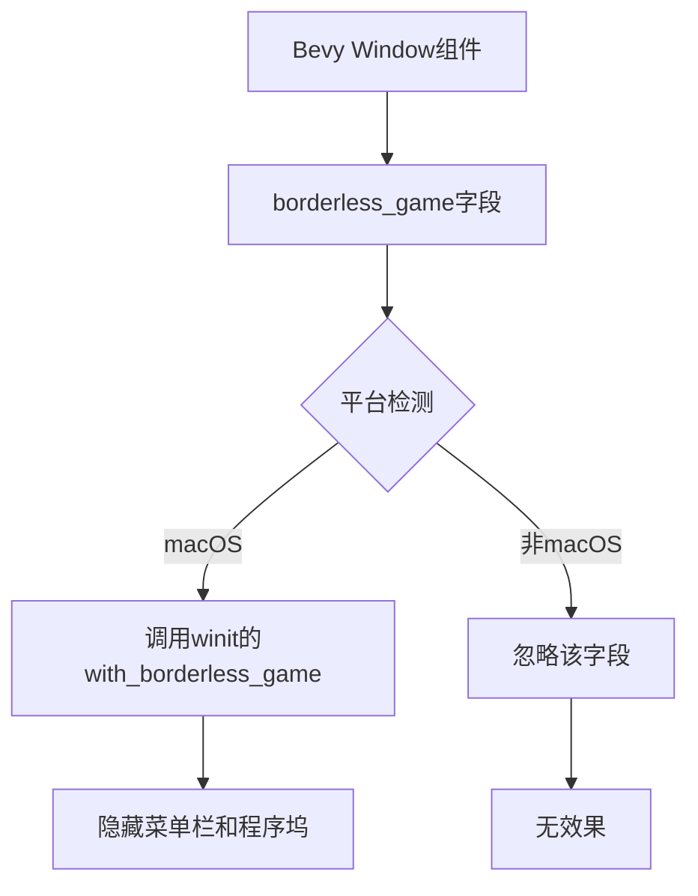

+++
title = "#22853 Enable borderless_game for winit on macos"
date = "2026-02-09T00:00:00"
draft = false
template = "pull_request_page.html"
in_search_index = false

[extra]
current_language = "zh-cn"
available_languages = {"en" = { name = "English", url = "/pull_request/bevy/2026-02/pr-22853-en-20260209" }, "zh-cn" = { name = "中文", url = "/pull_request/bevy/2026-02/pr-22853-zh-cn-20260209" }}
+++

# Title

## 基本信息
- **标题**: Enable borderless_game for winit on macos
- **PR链接**: https://github.com/bevyengine/bevy/pull/22853
- **作者**: TarekAS
- **状态**: 已合并
- **标签**: A-Windowing, O-MacOS, S-Ready-For-Final-Review, D-Straightforward
- **创建时间**: 2026-02-07T13:11:34Z
- **合并时间**: 2026-02-09T22:52:06Z
- **合并者**: alice-i-cecile

## 描述翻译

### 问题

macOS上的无边全屏模式没有隐藏菜单栏。

修复: #14783

### 解决方案

winit 0.30 添加了一个窗口属性，可以在macOS上使用无边全屏时隐藏程序坞和菜单栏。这将该选项作为Bevy组件的一个字段公开，默认值为true，因为这是游戏中预期的行为。

### 测试

通过设置以下代码进行测试：
```
DefaultPlugins.set(WindowPlugin {
    primary_window: Some(Window {
        mode: WindowMode::BorderlessFullscreen(MonitorSelection::Primary),
...
```
启动bevy应用程序，您应该看到菜单栏被隐藏。

### 展示

之前:


之后:


### 已知问题

https://github.com/rust-windowing/winit/issues/4477 - 当切换空间（例如使用Mission Control）时，菜单栏会重新显示——已由 https://github.com/rust-windowing/winit/pull/4482 修复

## 这个Pull Request的故事

这个PR解决了一个在macOS平台上的具体问题：当游戏使用无边框全屏模式（Borderless Fullscreen）时，菜单栏仍然会显示在屏幕顶部。这不符合游戏开发者的期望，因为真正的全屏游戏体验应该隐藏菜单栏，让玩家完全沉浸在游戏中。

问题的根源在于macOS的无边全屏模式与传统的全屏模式不同。传统的全屏模式会完全接管整个屏幕，而macOS的无边全屏模式实际上是一个普通窗口，只是移除了窗口装饰并调整到覆盖整个屏幕。这种模式下，菜单栏默认会显示。

在技术层面，Bevy使用winit库来处理底层窗口操作。winit 0.30版本为macOS平台添加了一个新的API：`with_borderless_game()`方法，该方法可以隐藏程序坞和菜单栏，提供真正的游戏全屏体验。

解决方案相对直接。首先，在Bevy的`Window`组件中添加一个新的`borderless_game`字段，默认设置为`true`，因为这符合游戏开发的常规预期。这个字段通过文档注释详细说明了其平台特异性——仅适用于macOS，并链接到对应的winit API文档。

然后在Bevy的winit后端中，当构建macOS窗口时，将这个字段的值传递给winit的`with_borderless_game()`方法。这样就将Bevy的高级API映射到底层winit API。

从实现细节来看，这个PR采用了保守的默认值策略。将`borderless_game`默认设为`true`确保了向后兼容性，因为现有的无边框全屏游戏将自动获得正确的行为，而无需修改代码。如果需要显示菜单栏，开发者可以显式地将该字段设为`false`。

PR还指出了winit中的一个已知问题：当使用Mission Control切换空间时，菜单栏可能会重新出现。这个问题已经在winit的更高版本中得到修复，这表明了依赖管理的重要性，也显示了开源生态系统中组件之间的相互影响。

从架构角度看，这个更改遵循了Bevy已有的模式：将平台特定的窗口属性封装在跨平台的结构体中，并通过条件编译和平台特性文档来处理平台差异。这种设计保持了API的整洁性，同时提供了必要的平台特定功能。

## 视觉表示



## 关键文件更改

### `crates/bevy_window/src/window.rs` (+13/-0)

这个文件中的`Window`结构体添加了新的`borderless_game`字段，并在`Default`实现中设置了默认值。

**关键代码片段：**

```rust
// File: crates/bevy_window/src/window.rs
// 添加的字段：
    /// Hides the dock and menu bar when a borderless fullscreen window is active.
    ///
    /// Corresponds to [`WindowAttributesExtMacOS::with_borderless_game`].
    ///
    /// Defaults to `true` as this is the expected behavior for games.
    ///
    /// # Platform-specific
    ///
    /// - Only used on macOS.
    ///
    /// [`WindowAttributesExtMacOS::with_borderless_game`]: https://docs.rs/winit/latest/x86_64-apple-darwin/winit/platform/macos/trait.WindowAttributesExtMacOS.html#tymethod.with_borderless_game
    pub borderless_game: bool,

// 在Default实现中添加：
            borderless_game: true,
```

### `crates/bevy_winit/src/winit_windows.rs` (+2/-1)

这个文件修改了macOS平台特定代码，将`borderless_game`字段的值传递给winit API。

**关键代码片段：**

```rust
// File: crates/bevy_winit/src/winit_windows.rs
// 修改前的代码（部分）：
                .with_titlebar_hidden(!window.titlebar_shown)
                .with_titlebar_transparent(window.titlebar_transparent)
                .with_title_hidden(!window.titlebar_show_title)
                .with_titlebar_buttons_hidden(!window.titlebar_show_buttons);

// 修改后的代码：
                .with_titlebar_hidden(!window.titlebar_shown)
                .with_titlebar_transparent(window.titlebar_transparent)
                .with_title_hidden(!window.titlebar_show_title)
                .with_titlebar_buttons_hidden(!window.titlebar_show_buttons)
                .with_borderless_game(window.borderless_game);  // 新增行
```

## 进一步阅读

1. [winit文档 - WindowAttributesExtMacOS::with_borderless_game](https://docs.rs/winit/latest/x86_64-apple-darwin/winit/platform/macos/trait.WindowAttributesExtMacOS.html#tymethod.with_borderless_game)
2. [Bevy窗口系统文档](https://bevyengine.org/learn/quick-start/platform-specific/window/)
3. [macOS无边框窗口开发指南](https://developer.apple.com/documentation/appkit/nswindow/1419161-setstylemask)
4. [winit问题#4477 - 切换空间时菜单栏重新显示](https://github.com/rust-windowing/winit/issues/4477)

# 完整代码差异

```
diff --git a/crates/bevy_window/src/window.rs b/crates/bevy_window/src/window.rs
index 98c9973e2f7ce..01e023793ca89 100644
--- a/crates/bevy_window/src/window.rs
+++ b/crates/bevy_window/src/window.rs
@@ -432,6 +432,18 @@ pub struct Window {
     ///
     /// [`WindowAttributesExtMacOS::with_titlebar_buttons_hidden`]: https://docs.rs/winit/latest/x86_64-apple-darwin/winit/platform/macos/trait.WindowAttributesExtMacOS.html#tymethod.with_titlebar_buttons_hidden
     pub titlebar_show_buttons: bool,
+    /// Hides the dock and menu bar when a borderless fullscreen window is active.
+    ///
+    /// Corresponds to [`WindowAttributesExtMacOS::with_borderless_game`].
+    ///
+    /// Defaults to `true` as this is the expected behavior for games.
+    ///
+    /// # Platform-specific
+    ///
+    /// - Only used on macOS.
+    ///
+    /// [`WindowAttributesExtMacOS::with_borderless_game`]: https://docs.rs/winit/latest/x86_64-apple-darwin/winit/platform/macos/trait.WindowAttributesExtMacOS.html#tymethod.with_borderless_game
+    pub borderless_game: bool,
     /// Sets whether the Window prefers the home indicator hidden.
     ///
     /// Corresponds to [`WindowAttributesExtIOS::with_prefers_home_indicator_hidden`].
@@ -504,6 +516,7 @@ impl Default for Window {
             titlebar_transparent: false,
             titlebar_show_title: true,
             titlebar_show_buttons: true,
+            borderless_game: true,
             prefers_home_indicator_hidden: false,
             prefers_status_bar_hidden: false,
             preferred_screen_edges_deferring_system_gestures: Default::default(),
diff --git a/crates/bevy_winit/src/winit_windows.rs b/crates/bevy_winit/src/winit_windows.rs
index ea885efa90402..3afc49bac85cb 100644
--- a/crates/bevy_winit/src/winit_windows.rs
+++ b/crates/bevy_winit/src/winit_windows.rs
@@ -152,7 +152,8 @@ impl WinitWindows {
                 .with_titlebar_hidden(!window.titlebar_shown)
                 .with_titlebar_transparent(window.titlebar_transparent)
                 .with_title_hidden(!window.titlebar_show_title)
-                .with_titlebar_buttons_hidden(!window.titlebar_show_buttons);
+                .with_titlebar_buttons_hidden(!window.titlebar_show_buttons)
+                .with_borderless_game(window.borderless_game);
         }
 
         #[cfg(target_os = "ios")]
```