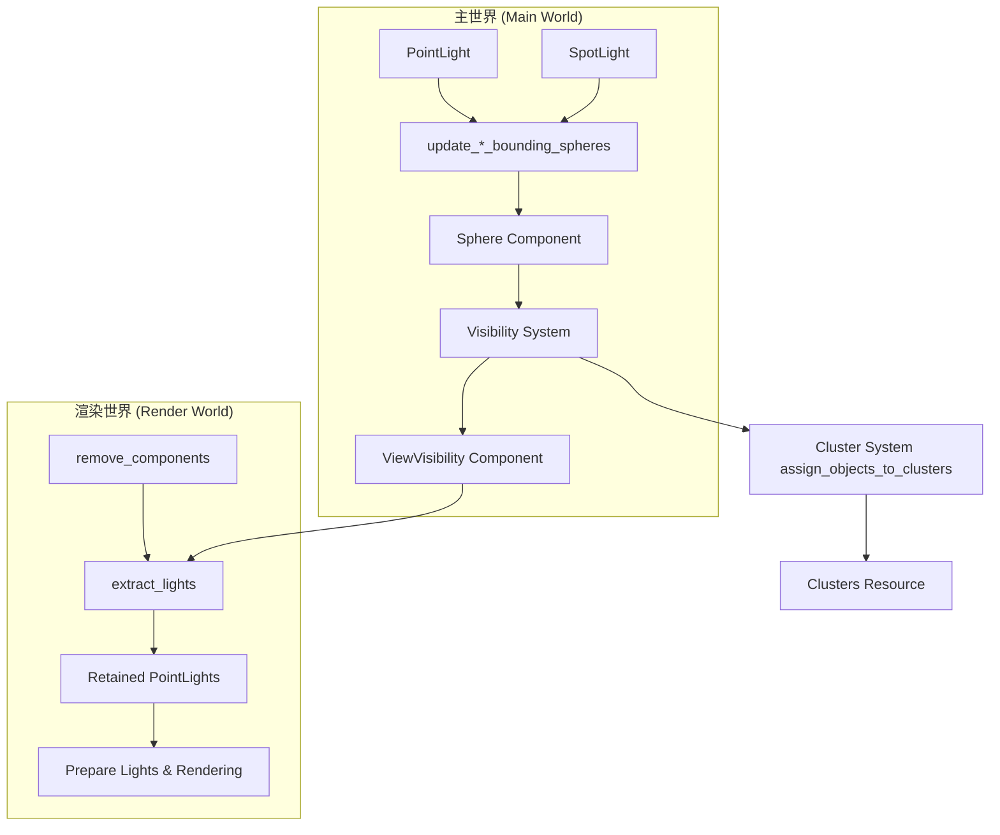

+++
title = "#22857 Make light extraction retained, and clean up lights that became newly invisible."
date = "2026-02-09T00:00:00"
draft = false
template = "pull_request_page.html"
in_search_index = false

[extra]
current_language = "zh-cn"
available_languages = {"en" = { name = "English", url = "/pull_request/bevy/2026-02/pr-22857-en-20260209" }, "zh-cn" = { name = "中文", url = "/pull_request/bevy/2026-02/pr-22857-zh-cn-20260209" }}
+++

# Title

## 基本信息
- **标题**: Make light extraction retained, and clean up lights that became newly invisible.
- **PR 链接**: https://github.com/bevyengine/bevy/pull/22857
- **作者**: pcwalton
- **状态**: 已合并
- **标签**: C-Bug, A-Rendering, C-Performance, P-Regression
- **创建时间**: 2026-02-07T18:21:08Z
- **合并时间**: 2026-02-09T07:36:06Z
- **合并者**: superdump

## 描述翻译

光照代码的设计原则是：任何视图中都不可见的光源不应存在于渲染世界（render world）中。不幸的是，当渲染世界变为保留模式（retained mode）时，光源提取（light extraction）代码并未完全更新以清理那些变得不可见的光源对应的组件。因此，Bevy 当前并未强制执行这一约束。这导致 `many_lights` 示例的性能随着时间推移而下降，因为更多光源进入视图并被提取到渲染世界，而视图外的光源却没有被移除。

本 PR 通过两种方式修复了此问题：

1. 光源提取现在正确地考虑了保留的渲染世界，遵循了网格（mesh）等其他对象使用的模式。从前一帧以来未发生变化的光源不会被重新提取，而是跨帧保留。

2. 光源和其他可聚类对象（clusterable objects）的可见性现在由确定网格可见性的同一系统来确定。`GlobalVisibleClusterableObjects` 这个侧表（side table）已被移除。为了实现这一点，我将现有的 `Sphere` 类型转换为一个组件，可以替代 `Aabb` 添加到那些使用球体而非轴对齐包围盒（AABB）进行视锥剔除（frustum culling）的实体上。这对于可见性代码的添加出人意料地简单，因为它已经使用球体进行快速剔除（quick rejection）。

除了简化代码外，本 PR 将 `many_lights` 的帧率从大约 30 FPS 提升到大约 100 FPS（在我的 Ryzen 9 8945HS 上），使其从 CPU 瓶颈变为明显的 GPU 瓶颈。之前的性能分析主要由 `extract_lights` 和 `prepare_lights` 主导。保留模式将 `extract_lights` 的时间从 8.9 毫秒加上 8.0 毫秒的命令处理时间降低到 0.4 毫秒，而 `prepare_lights` 的时间降低到大约每帧 1.2 毫秒（如果应用我的额外 PR #22846，将进一步降低到 0.9 毫秒）。

`main` 分支上的 `many_lights`:


本 PR 中的 `many_lights`:


`main` 分支和本 PR 中 `many_lights` 的 `prepare_lights` 对比:


`main` 分支和本 PR 中 `many_lights` 的 `extract_lights` 对比:


## 该 Pull Request 的技术分析

这个 PR 解决了一个在渲染世界切换到保留模式后引入的性能回归问题。根本原因在于光照系统的提取逻辑没有完全适配新的保留模式架构，导致不可见光源的组件没有被及时清理，从而造成内存泄漏和性能下降。

### 问题与背景

在 Bevy 的渲染架构中，渲染世界是一个独立的世界，用于存放实际参与渲染的实体和组件。为了优化性能，Bevy 实现了“保留模式”渲染，这意味着渲染世界中的实体和组件会跨帧保留，只有当它们对应的主世界（main world）对象发生变化或被移除时才进行更新或清理。

光照系统有一个重要的设计约束：任何在视图中不可见的光源都不应存在于渲染世界中。然而，在切换到保留模式后，光源提取系统 `extract_lights` 没有正确实现这一点。具体来说：

1. 光源提取仍然使用一个全局的 `GlobalVisibleClusterableObjects` 资源来追踪所有可见的光源，但这个资源的更新逻辑可能没有与新的保留模式完全同步。
2. 当光源变得不可见时，其对应的渲染世界组件（如 `ExtractedPointLight`）没有被移除。
3. 这导致了 `many_lights` 示例中，随着光源进入和离开视图，渲染世界中的光源数量只增不减，最终造成性能严重下降。

问题的影响是显著的：在 `main` 分支上，`many_lights` 示例的帧率大约为 30 FPS，并且是 CPU 瓶颈。性能分析显示，`extract_lights` 和 `prepare_lights` 系统占据了大部分时间。

### 解决方案

PR 作者采用了双管齐下的方法来解决这个问题：

**1. 使光源提取系统变为保留模式**

这是通过修改 `extract_lights` 系统来实现的，使其遵循与其他保留模式系统（如网格提取）相同的模式：
- 只处理自上一帧以来发生变化的组件（通过 `Changed` 查询）。
- 当光源在主世界中被移除时，相应地移除渲染世界中的组件。
- 引入辅助函数 `remove_components` 来安全地处理组件移除，同时考虑同一帧内组件被移除又添加的边缘情况。

**2. 统一可见性判定系统，移除 `GlobalVisibleClusterableObjects`**

之前，光源的可见性是通过一个独立的聚类（clustering）系统来判定的，并将结果存储在 `GlobalVisibleClusterableObjects` 资源中。这个 PR 移除了这个资源，改为使用与网格相同的可见性系统。

为了实现这一点，作者进行了以下关键修改：
- 将 `Sphere` 结构体升级为一个组件（`#[derive(Component, ...)]`），并添加了详细的文档。
- 为点光源（`PointLight`）和聚光灯（`SpotLight`）添加了系统（`update_point_light_bounding_spheres` 和 `update_spot_light_bounding_spheres`），当光源的 `range` 或变换（`GlobalTransform`）发生变化时，更新其关联的 `Sphere` 组件。
- 修改了 `check_visibility` 系统，使其能够同时处理 `Aabb` 和 `Sphere` 组件，进行视锥剔除。
- 移除了聚类系统 `assign_objects_to_clusters` 中对 `GlobalVisibleClusterableObjects` 的依赖，现在它直接处理所有光源，而不需要先经过可见性筛选。
- 相应地，更新了 `update_point_light_frusta` 和 `update_spot_light_frusta` 系统，使其依赖 `ViewVisibility` 组件而不是 `GlobalVisibleClusterableObjects` 资源来判断是否需要更新光源的视锥体。

### 实现细节与代码分析

这个 PR 的修改涉及多个文件，但核心逻辑集中在几个关键系统中。以下是一些重要的代码变更：

**`Sphere` 组件化 (crates/bevy_camera/src/primitives.rs):**
```rust
#[derive(Component, Clone, Copy, Debug, Default, Reflect)]
#[reflect(Component, Clone, Debug, Default)]
pub struct Sphere {
    pub center: Vec3A,
    pub radius: f32,
}
```
现在 `Sphere` 是一个组件，可以被添加到实体上。这对于点光源和聚光灯非常合适，因为它们的照明范围（range）自然可以用球体来近似。

**更新光源的包围球体 (crates/bevy_light/src/point_light.rs):**
```rust
pub fn update_point_light_bounding_spheres(
    mut commands: Commands,
    point_lights_query: Query<
        (Entity, &PointLight, &GlobalTransform),
        Or<(Changed<PointLight>, Changed<GlobalTransform>)>,
    >,
) {
    for (point_light_entity, point_light, global_transform) in &point_lights_query {
        commands.entity(point_light_entity).insert(Sphere {
            center: global_transform.translation_vec3a(),
            radius: point_light.range,
        });
    }
}
```
这个系统监听点光源或其变换的变化，并更新（或插入）对应的 `Sphere` 组件。球体的中心是光源的世界位置，半径是光源的 `range`。聚光灯也有类似的系统。

**修改视锥剔除以支持 `Sphere` (crates/bevy_camera/src/visibility/mod.rs):**
```rust
// 在 check_visibility 系统中
if !no_frustum_culling && !no_cpu_culling_camera && !no_cpu_culling_entity {
    if let Some(model_aabb) = maybe_model_aabb {
        // ... 原有的 AABB 剔除逻辑
    } else if let Some(model_sphere) = maybe_model_sphere
        && !frustum.intersects_sphere(model_sphere, false)
    {
        // 新增：对 Sphere 组件进行球体剔除
        return;
    }
}
```
现在，如果一个实体有 `Sphere` 组件但没有 `Aabb` 组件，系统会使用球体进行快速的视锥剔除。

**重构光源提取系统 (crates/bevy_pbr/src/render/light.rs):**
这是改动最大的部分。`extract_lights` 系统被重写以支持保留模式：
- 查询现在使用 `Or<Changed<...>>` 过滤器，只处理发生变化的组件。
- 移除了对 `GlobalVisibleClusterableObjects` 资源的依赖。
- 添加了逻辑来移除那些光源组件已被删除的实体的渲染组件。

一个关键的辅助函数是 `remove_components`，它安全地处理了组件移除：
```rust
fn remove_components<MC, RWC>(
    commands: &mut Commands,
    mapper: &Query<RenderEntity>,
    removed_components: &mut RemovedComponents<MC>,
    seen_entities: &MainEntityHashSet,
) {
    for main_entity in removed_components.read() {
        if !seen_entities.contains(&MainEntity::from(main_entity))
            && let Ok(render_entity) = mapper.get(main_entity)
            && let Ok(mut entity_commands) = commands.get_entity(render_entity)
        {
            entity_commands.remove::<RWC>();
        }
    }
}
```
这个函数检查一个主世界组件是否被移除，并且在本帧的提取过程中没有被重新处理（通过 `seen_entities` 集合），然后从对应的渲染实体中移除相应的渲染世界组件。

**移除 `GlobalVisibleClusterableObjects` 资源:**
这个资源从多个地方被移除：`LightPlugin` 不再初始化它，聚类系统 `assign_objects_to_clusters` 不再使用它，光照提取系统也不再提取它。这简化了整体的数据流。

### 技术洞察与性能影响

这个 PR 展示了几个重要的工程原则：

1. **保留模式的一致性**: 当架构转向保留模式时，所有系统都需要适配。光源提取系统之前是“半保留”状态，现在通过只处理变更和正确清理组件，实现了完全保留。

2. **统一的可见性管道**: 将光源的可见性判定合并到通用的可见性系统中，减少了代码重复和潜在的不一致。这也利用了现有的优化，如视锥剔除的层级结构。

3. **性能提升的来源**: 主要的性能提升来自两个方面：
   - **减少每帧提取的开销**: 通过只处理变更的光源，`extract_lights` 系统的执行时间从 ~16.9 毫秒（8.9 毫秒提取 + 8.0 毫秒命令处理）降低到 0.4 毫秒。
   - **减少渲染世界的实体数量**: 通过及时清理不可见光源的组件，渲染世界中的光源数量保持在最低必要水平，减轻了后续渲染阶段（如 `prepare_lights`）的负担。

4. **简化与维护性**: 移除 `GlobalVisibleClusterableObjects` 资源简化了数据流，使得光照系统的行为更容易理解。现在，光源的可见性完全由标准的 `ViewVisibility` 组件驱动，与其他实体类型保持一致。

### 潜在注意事项

1. **包围球体的准确性**: 对于聚光灯，使用一个以光源位置为中心、以 `range` 为半径的球体进行剔除可能不够紧密（over-approximation），可能导致一些实际上不可见的聚光灯被包含进来。但这是一个合理的性能/精度权衡，因为球体剔除非常快速。

2. **组件添加顺序**: 新的 `update_point_light_bounding_spheres` 系统需要在可见性系统之前运行，以确保 `Sphere` 组件在视锥剔除时可用。这通过将其添加到 `SimulationLightSystems::UpdateBounds` 系统集并在 `VisibilitySystems::UpdateFrusta` 之前运行来保证。

3. **向后兼容性**: 由于 `Sphere` 现在是一个组件，并且被添加到点光源和聚光灯实体上，这可能影响那些依赖于实体组件布局的用户代码。不过，这应该是一个内部实现细节，对大多数用户透明。

## 可视化表示



## 关键文件变更

### `crates/bevy_pbr/src/render/light.rs` (+201/-126)
这是本次修改的核心文件，重写了 `extract_lights` 系统以实现保留模式。
- **变更要点**:
  1. 修改了所有光源查询，添加了 `Or<Changed<...>>` 过滤器，只提取发生变化的组件。
  2. 移除了对 `GlobalVisibleClusterableObjects` 资源的依赖。
  3. 添加了 `remove_components` 辅助函数，用于在光源组件被移除时清理渲染世界中的对应组件。
  4. 引入了 `seen_*_main_entities` 集合来跟踪本帧已处理的光源，防止在同一帧内被移除又添加的光源被错误地清理。

**关键代码片段**:
```rust
// 在 extract_lights 系统中，点光源查询现在包含 Changed 过滤器
let point_lights: Extract<
    Query<
        (
            Entity,
            RenderEntity,
            &PointLight,
            &CubemapVisibleEntities,
            &GlobalTransform,
            &ViewVisibility,
            &CubemapFrusta,
            Option<&VolumetricLight>,
        ),
        Or<(
            Changed<PointLight>,
            Changed<CubemapVisibleEntities>,
            Changed<GlobalTransform>,
            Changed<ViewVisibility>,
            Changed<CubemapFrusta>,
            Changed<VolumetricLight>,
        )>,
    >,
> = /* ... */;
```

### `crates/bevy_light/src/cluster/assign.rs` (+32/-49)
修改了 `assign_objects_to_clusters` 系统，移除了对 `GlobalVisibleClusterableObjects` 的依赖。
- **变更要点**:
  1. 移除了 `global_clusterable_objects` 参数。
  2. 不再过滤光源的 `ViewVisibility`，而是处理所有光源，因为可见性现在由通用的可见性系统处理。
  3. 不再将可见光源插入 `GlobalVisibleClusterableObjects`。

**关键代码片段**:
```rust
// 之前:
clusterable_objects.extend(
    point_lights_query
        .iter()
        .filter(|(.., visibility)| visibility.get())  // 过滤可见光源
        .map(/* ... */)
);

// 之后:
clusterable_objects.extend(point_lights_query.iter().map(/* ... */));  // 处理所有光源
```

### `crates/bevy_light/src/cluster/mod.rs` (+32/-23)
移除了 `GlobalVisibleClusterableObjects` 资源，并添加了一个新系统来为光探针（light probe）和贴花（decal）添加 AABB。
- **变更要点**:
  1. 删除了 `GlobalVisibleClusterableObjects` 结构体及其相关实现。
  2. 添加了 `add_light_probe_and_decal_aabbs` 系统，为光探针和聚类贴花添加 AABB 组件，以便它们也能通过通用的可见性系统进行剔除。

**关键代码片段**:
```rust
pub fn add_light_probe_and_decal_aabbs(
    mut commands: Commands,
    light_probes_and_decals_query: Query<
        Entity,
        (Or<(With<ClusteredDecal>, With<LightProbe>)>, Without<Aabb>),
    >,
) {
    for entity in &light_probes_and_decals_query {
        commands.entity(entity).insert(Aabb {
            center: Vec3A::ZERO,
            half_extents: Vec3A::splat(0.5),
        });
    }
}
```

### `crates/bevy_light/src/point_light.rs` (+33/-20)
添加了 `update_point_light_bounding_spheres` 系统，并修改了 `update_point_light_frusta` 系统。
- **变更要点**:
  1. 添加了 `update_point_light_bounding_spheres` 系统，用于更新点光源的 `Sphere` 组件。
  2. 修改了 `update_point_light_frusta` 系统，使其依赖 `ViewVisibility` 而不是 `GlobalVisibleClusterableObjects`。

**关键代码片段**:
```rust
pub fn update_point_light_frusta(
    mut views: Query<
        (
            &GlobalTransform,
            &PointLight,
            &mut CubemapFrusta,
            &ViewVisibility,  // 使用 ViewVisibility 组件
        ),
        Or<(
            Changed<GlobalTransform>,
            Changed<PointLight>,
            Changed<ViewVisibility>,  // 当可见性变化时也更新
        )>,
    >,
) {
    // ...
    for (transform, point_light, mut cubemap_frusta, view_visibility) in &mut views {
        if !point_light.shadow_maps_enabled || !view_visibility.get() {  // 检查 ViewVisibility
            continue;
        }
        // ...
    }
}
```

### `crates/bevy_camera/src/visibility/mod.rs` (+22/-17)
修改了 `check_visibility` 系统，使其能够处理 `Sphere` 组件。
- **变更要点**:
  1. 查询中现在包含 `Option<&Sphere>`。
  2. 在视锥剔除逻辑中，如果实体有 `Sphere` 组件但没有 `Aabb` 组件，则使用球体进行剔除。

**关键代码片段**:
```rust
pub fn check_visibility(
    // ...
    Option<&Aabb>,
    Option<&Sphere>,  // 新增参数
    // ...
) {
    // ...
    if !no_frustum_culling && !no_cpu_culling_camera && !no_cpu_culling_entity {
        if let Some(model_aabb) = maybe_model_aabb {
            // 原有的 AABB 剔除逻辑
        } else if let Some(model_sphere) = maybe_model_sphere
            && !frustum.intersects_sphere(model_sphere, false)
        {
            // 新增的 Sphere 剔除逻辑
            return;
        }
    }
    // ...
}
```

## 扩展阅读

1. **Bevy 保留模式渲染**: [Bevy 官方文档](https://bevyengine.org/learn/quick-start/architecture/)中关于 ECS 和渲染管道的部分。
2. **视锥剔除算法**: 《Real-Time Rendering, 4th Edition》第 19 章，详细介绍了各种剔除技术。
3. **光源聚类技术**: 关于延迟渲染和正向+（Forward+）渲染中光源聚类的经典论文，如 "Forward+: Bringing Deferred Lighting to the Next Level"。
4. **Filament 渲染引擎**: [Filament 文档](https://google.github.io/filament/Filament.html)中关于物理光源单位（luminous power 和 luminous intensity）的部分，Bevy 的光照计算参考了这些公式。