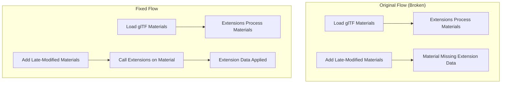

+++
title = "#22858 gltf: let extension handle late-added materials"
date = "2026-02-09T00:00:00"
draft = false
template = "pull_request_page.html"
in_search_index = true

[taxonomies]
list_display = ["show"]

[extra]
current_language = "en"
available_languages = {"en" = { name = "English", url = "/pull_request/bevy/2026-02/pr-22858-en-20260209" }, "zh-cn" = { name = "中文", url = "/pull_request/bevy/2026-02/pr-22858-zh-cn-20260209" }}
labels = ["A-glTF"]
+++

# Title

## Basic Information
- **Title**: gltf: let extension handle late-added materials
- **PR Link**: https://github.com/bevyengine/bevy/pull/22858
- **Author**: mockersf
- **Status**: MERGED
- **Labels**: S-Ready-For-Final-Review, A-glTF
- **Created**: 2026-02-07T19:04:28Z
- **Merged**: 2026-02-09T22:55:35Z
- **Merged By**: alice-i-cecile

## Description Translation
**Objective**
- #22569 broke some examples, some materials are not displayed

**Solution**
- Some materials are added late because we modify them depending on how they're used (for example, with an inverted scale). Also triggers extensions on those

**Testing**
examples `light_probe_blending`, `irradiance_volumes`, `pccm`, `pcss` are now fixed

## The Story of This Pull Request

This PR fixes a regression introduced by PR #22569 that caused materials to not display in several examples (`light_probe_blending`, `irradiance_volumes`, `pccm`, `pcss`). The issue occurred because some materials are added to the asset system late in the glTF loading process, after the initial material loading pass.

The problem stems from how Bevy's glTF loader handles materials that require runtime modifications. Some materials need to be adjusted based on their usage context - for instance, materials applied to meshes with inverted scales require special handling. These "late-added" materials were being added to the asset system, but the extension system wasn't being notified about them.

The core issue was that when the glTF loader processes materials that require modifications (like those for inverted scale meshes), it adds them to the asset context outside of the normal material loading flow. PR #22569 had changed how extensions interact with materials, but the change didn't account for these late-added materials. Extensions that needed to process material data weren't being called for these materials, leading to incomplete material setup and rendering issues.

The solution implemented here is straightforward: after adding a late-added material to the asset context, the code now explicitly calls the extension system to process that material. This ensures that extensions have the opportunity to set up any required material data, just like they do for materials loaded during the initial pass.

Looking at the implementation, the fix modifies the `load_node` function in the glTF loader. When a material needs to be added late (because it wasn't previously loaded and requires modification for inverted scale), the code now:
1. Loads the material as before
2. Adds it to the labeled asset context
3. Iterates through all registered extensions and calls their `on_material` method with the newly created material

This approach ensures consistency - all materials, whether loaded during the initial pass or added later with modifications, go through the same extension processing pipeline. The fix is minimal and surgical, targeting exactly the gap in the processing flow.

From an architectural perspective, this fix reinforces the pattern that all asset creation in the glTF loader should go through the extension system when appropriate. It also highlights the importance of considering edge cases when refactoring asset loading pipelines - in this case, the "late addition" pattern for modified materials.

The impact is immediate and positive: the four broken examples now work correctly again. No performance impact is expected since we're simply ensuring existing extension logic runs on a previously missed subset of materials. The fix maintains backward compatibility and doesn't introduce any new APIs or breaking changes.

This case demonstrates a common pattern in game engine development: asset loaders often need to handle multiple passes or late modifications due to runtime context. The solution shows good separation of concerns - the core loader handles the basic material loading and modification, while extensions get a chance to process all materials regardless of when they enter the system.

## Visual Representation



## Key Files Changed

**crates/bevy_gltf/src/loader/mod.rs** (+15/-6)

This file contains the core glTF loading logic. The change modifies how materials that are added late in the loading process (due to runtime modifications like inverted scale) are processed by extensions.

**Key Changes:**

1. **Added extension processing for late-added materials**: The code now explicitly calls extension handlers for materials that are added after the initial loading pass.

```rust
// File: crates/bevy_gltf/src/loader/mod.rs
// Before (simplified):
if !root_load_context.has_labeled_asset(&material_label)
    && !load_context.has_labeled_asset(&material_label)
{
    let (label, material) = load_material(
        &material,
        textures,
        is_scale_inverted,
        load_context.path().clone(),
    );
    load_context.add_labeled_asset(label, material);
}

// After:
if !root_load_context.has_labeled_asset(&material_label)
    && !load_context.has_labeled_asset(&material_label)
{
    let (label, gltf_material) = load_material(
        &material,
        textures,
        is_scale_inverted,
        load_context.path().clone(),
    );
    let handle = load_context.add_labeled_asset(label.clone(), gltf_material.clone());

    // let extensions handle material data
    for extension in extensions.iter_mut() {
        extension.on_material(
            load_context,
            &material,
            handle.clone(),
            &gltf_material,
            &label.clone(),
        );
    }
}
```

The key addition is the loop that calls `extension.on_material()` for each extension. This ensures that extensions can process the material even when it's added late in the loading process. The comment was also updated to better reflect what's happening: "This adds materials that Bevy modifies depending on how they're used, like those with inverted scale."

## Further Reading

1. **Bevy glTF Extension System**: The [Bevy glTF documentation](https://docs.rs/bevy_gltf/latest/bevy_gltf/) covers how extensions work in the glTF loader
2. **glTF Material Extensions**: The [glTF specification on extensions](https://github.com/KhronosGroup/glTF/tree/main/extensions) provides context on why extension systems are needed
3. **Asset Loading Patterns**: The [Bevy Asset System documentation](https://bevy-cheatbook.github.io/features/assets.html) explains Bevy's asset loading patterns
4. **Previous PR #22569**: Understanding the changes in the previous PR that introduced this regression provides context for why this fix was necessary
5. **Inverted Scale Handling**: The concept of handling inverted scale in rendering is common in 3D graphics; resources on normal transformation and rendering with negative scale can provide background on why materials need modification

# Full Code Diff
diff --git a/crates/bevy_gltf/src/loader/mod.rs b/crates/bevy_gltf/src/loader/mod.rs
index 6fece7e3702e..916ed1a5701ba 100644
--- a/crates/bevy_gltf/src/loader/mod.rs
+++ b/crates/bevy_gltf/src/loader/mod.rs
@@ -1585,21 +1585,30 @@ fn load_node(
                 let mat_label = material_label(&material, is_scale_inverted);
                 let material_label = mat_label.to_string();
 
-                // This will make sure we load the default material now since it would not have been
-                // added when iterating over all the gltf materials (since the default material is
-                // not explicitly listed in the gltf).
-                // It also ensures an inverted scale copy is instantiated if required.
+                // This adds materials that Bevy modifies depending on how they're used, like those with inverted scale.
                 if !root_load_context.has_labeled_asset(&material_label)
                     && !load_context.has_labeled_asset(&material_label)
                 {
-                    let (label, material) = load_material(
+                    let (label, gltf_material) = load_material(
                         &material,
                         textures,
                         is_scale_inverted,
                         load_context.path().clone(),
                     );
                     // TODO: maybe move this into `load_material` ?
-                    load_context.add_labeled_asset(label, material);
+                    let handle =
+                        load_context.add_labeled_asset(label.clone(), gltf_material.clone());
+
+                    // let extensions handle material data
+                    for extension in extensions.iter_mut() {
+                        extension.on_material(
+                            load_context,
+                            &material,
+                            handle.clone(),
+                            &gltf_material,
+                            &label.clone(),
+                        );
+                    }
                 }
 
                 let primitive_label = GltfAssetLabel::Primitive {