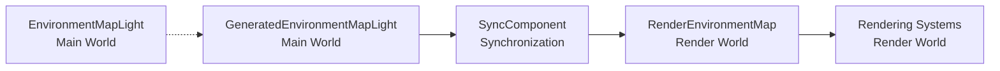

+++
title = "#22860 Fix wrong component sync for GeneratedEnvironmentMapLight"
date = "2026-02-07T00:00:00"
draft = false
template = "pull_request_page.html"
in_search_index = true

[taxonomies]
list_display = ["show"]

[extra]
current_language = "en"
available_languages = {"en" = { name = "English", url = "/pull_request/bevy/2026-02/pr-22860-en-20260207" }, "zh-cn" = { name = "中文", url = "/pull_request/bevy/2026-02/pr-22860-zh-cn-20260207" }}
labels = ["C-Bug", "D-Trivial", "A-Rendering"]
+++

# Title

## Basic Information
- **Title**: Fix wrong component sync for GeneratedEnvironmentMapLight
- **PR Link**: https://github.com/bevyengine/bevy/pull/22860
- **Author**: kristoff3r
- **Status**: MERGED
- **Labels**: C-Bug, D-Trivial, A-Rendering, S-Ready-For-Final-Review
- **Created**: 2026-02-07T21:42:53Z
- **Merged**: 2026-02-07T23:23:20Z
- **Merged By**: alice-i-cecile

## Description Translation

# Objective

Fixes the following log spam (and wrong sync behavior) introduced by #22766:

```
ERROR bevy_pbr::cluster: Clustered light or decal 5v0 had no assigned index!
```

## Solution

The components here are named in an interesting way. We have 3 components:
* `EnvironmentMapLight`
* `GeneratedEnvironmentMapLight`
* `RenderEnvironmentMap`

When I added the `SyncComponent` impl I pattern matched on the upper two names, and assumed that `EnvironmentMapLight` was the main world component and `GeneratedEnvironmentMapLight` was in the render world.

Actually `GeneratedEnvironmentMapLight` is a specific way to generate an `EnvironmentMapLight`, and the render world entity is called `RenderEnvironmentMap`. Fixing the `SyncComponent` impl to reflect that fixes the issue.

I still feel like there are other issues after this fix:
* `GeneratedEnvironmentMapLight` could really use a better name (`GenerateEnvironmentMapLight`? `RuntimeEnvironmentMapLight`?), and better docs.
* I think it's still missing some syncing logic, as far as I can tell nothing handles the generated `EnvironmentMapLight` if a `GeneratedEnvironmentMapLight` is updated or deleted? I didn't do a deep dive so I might have missed something.

## Testing

Tested with the `light_probe_blending` and `reflection_probes` examples.

## The Story of This Pull Request

This PR addresses a bug introduced in a previous change (#22766) that caused incorrect synchronization between the main world and render world for environment map lights. The bug manifested as log spam with error messages about clustered lights having no assigned index, indicating a mismatch between how lights were registered and synchronized between worlds.

The root cause was a misunderstanding of the component naming and relationships in Bevy's environment map system. The developer initially implemented a `SyncComponent` trait for the wrong component pair. They assumed that `EnvironmentMapLight` was the main world component that should sync to `GeneratedEnvironmentMapLight` in the render world, based on the naming pattern of the first two components they encountered.

However, the actual architecture uses three distinct components:
1. `EnvironmentMapLight` - The actual light component used in the main world
2. `GeneratedEnvironmentMapLight` - A marker component indicating that an `EnvironmentMapLight` should be generated at runtime
3. `RenderEnvironmentMap` - The render world representation that handles the actual rendering logic

The correct synchronization path is from `GeneratedEnvironmentMapLight` (main world) to `RenderEnvironmentMap` (render world), not from `EnvironmentMapLight` to `GeneratedEnvironmentMapLight`. This incorrect sync meant that render world entities weren't being properly created or tracked, leading to the "no assigned index" errors when the clustered lighting system tried to reference them.

The fix is straightforward but important: update the `SyncComponent` implementation to use the correct component types. This ensures that when a `GeneratedEnvironmentMapLight` is added to an entity in the main world, a corresponding `RenderEnvironmentMap` entity is created in the render world with all the necessary bindings and resources for rendering.

Beyond the immediate fix, the PR author notes some broader issues with the component naming and synchronization logic. The name `GeneratedEnvironmentMapLight` is somewhat confusing since it doesn't directly correspond to a render world component. Additionally, there may be missing synchronization logic for updates or deletions of generated environment maps, though this wasn't explored in depth for this bug fix.

The implementation shows a common pattern in Bevy's ECS architecture where components in the main world need corresponding representations in the render world. The `SyncComponent` trait and associated systems handle this cross-world synchronization automatically when properly configured.

## Visual Representation



## Key Files Changed

**File:** `crates/bevy_pbr/src/light_probe/generate.rs`

**Changes:** Fixed incorrect component synchronization for environment map generation.

**Key modifications:**

1. **Updated the plugin registration to sync the correct component:**
   ```rust
   // Before:
   app.add_plugins(SyncComponentPlugin::<EnvironmentMapLight, Self>::default())
   
   // After:
   app.add_plugins(SyncComponentPlugin::<GeneratedEnvironmentMapLight, Self>::default())
   ```

2. **Simplified a query by removing unnecessary filter:**
   ```rust
   // Before:
   light_probes: Query<
       (Entity, &IntermediateTextures, &RenderEnvironmentMap),
       With<RenderEnvironmentMap>,
   >
   
   // After:
   light_probes: Query<(Entity, &IntermediateTextures, &RenderEnvironmentMap)>
   ```
   This change removes a redundant `With<RenderEnvironmentMap>` filter since the query already requires `RenderEnvironmentMap` in its tuple.

3. **Fixed the SyncComponent implementation:**
   ```rust
   // Before:
   impl SyncComponent<EnvironmentMapGenerationPlugin> for EnvironmentMapLight {
       type Out = GeneratedEnvironmentMapLight;
   }
   
   // After:
   impl SyncComponent<EnvironmentMapGenerationPlugin> for GeneratedEnvironmentMapLight {
       type Out = RenderEnvironmentMap;
   }
   ```
   This is the core fix that changes the synchronization from `EnvironmentMapLight → GeneratedEnvironmentMapLight` to `GeneratedEnvironmentMapLight → RenderEnvironmentMap`.

These changes ensure that when a `GeneratedEnvironmentMapLight` component is added to an entity in the main world, the synchronization system correctly creates a corresponding `RenderEnvironmentMap` entity in the render world, which is necessary for proper rendering of environment maps.

## Further Reading

- [Bevy's ECS Architecture](https://bevyengine.org/learn/book/getting-started/ecs/) - Understanding how Bevy's Entity Component System works
- [Bevy Render World Pattern](https://bevyengine.org/learn/book/getting-started/app-builder/#render-app) - How Bevy separates main world and render world logic
- [Previous PR #22766](https://github.com/bevyengine/bevy/pull/22766) - The PR that introduced the bug, for context on what changed
- [Environment Maps in Computer Graphics](https://en.wikipedia.org/wiki/Reflection_mapping) - Background on environment mapping techniques in rendering

# Full Code Diff
```
diff --git a/crates/bevy_pbr/src/light_probe/generate.rs b/crates/bevy_pbr/src/light_probe/generate.rs
index 7d902d6baf199..99c30e2d81180 100644
--- a/crates/bevy_pbr/src/light_probe/generate.rs
+++ b/crates/bevy_pbr/src/light_probe/generate.rs
@@ -17,7 +17,7 @@ use bevy_core_pipeline::mip_generation::{self, DownsampleShaders, DownsamplingCo
 use bevy_ecs::{
     component::Component,
     entity::Entity,
-    query::{With, Without},
+    query::Without,
     resource::Resource,
     schedule::IntoScheduleConfigs,
     system::{Commands, Query, Res, ResMut},
@@ -128,7 +128,7 @@ impl Plugin for EnvironmentMapGenerationPlugin {
         embedded_asset!(app, "environment_filter.wgsl");
         embedded_asset!(app, "copy.wgsl");
 
-        app.add_plugins(SyncComponentPlugin::<EnvironmentMapLight, Self>::default())
+        app.add_plugins(SyncComponentPlugin::<GeneratedEnvironmentMapLight, Self>::default())
             .add_systems(Update, generate_environment_map_light);
 
         let Some(render_app) = app.get_sub_app_mut(RenderApp) else {
@@ -557,10 +557,7 @@ pub struct GeneratorBindGroups {
 
 /// Prepares bind groups for environment map generation pipelines
 pub fn prepare_generated_environment_map_bind_groups(
-    light_probes: Query<
-        (Entity, &IntermediateTextures, &RenderEnvironmentMap),
-        With<RenderEnvironmentMap>,
-    >,
+    light_probes: Query<(Entity, &IntermediateTextures, &RenderEnvironmentMap)>,
     render_device: Res<RenderDevice>,
     pipeline_cache: Res<PipelineCache>,
     queue: Res<RenderQueue>,
@@ -1109,6 +1106,6 @@ pub fn generate_environment_map_light(
     }
 }
 
-impl SyncComponent<EnvironmentMapGenerationPlugin> for EnvironmentMapLight {
-    type Out = GeneratedEnvironmentMapLight;
+impl SyncComponent<EnvironmentMapGenerationPlugin> for GeneratedEnvironmentMapLight {
+    type Out = RenderEnvironmentMap;
 }
```