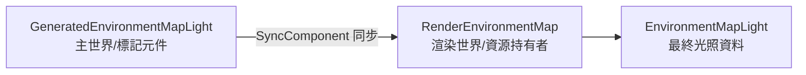

+++
title = "#22860"
date = "2026-02-07T00:00:00"
draft = false
template = "pull_request_page.html"
in_search_index = false

[extra]
current_language = "zh-cn"
available_languages = {"en" = { name = "English", url = "/pull_request/bevy/2026-02/pr-22860-en-20260207" }, "zh-cn" = { name = "中文", url = "/pull_request/bevy/2026-02/pr-22860-zh-cn-20260207" }}
+++

# Title
Fix wrong component sync for GeneratedEnvironmentMapLight

## 基本資訊
- **標題**: Fix wrong component sync for GeneratedEnvironmentMapLight
- **PR連結**: https://github.com/bevyengine/bevy/pull/22860
- **作者**: kristoff3r
- **狀態**: MERGED
- **標籤**: C-Bug, D-Trivial, A-Rendering, S-Ready-For-Final-Review
- **創建時間**: 2026-02-07T21:42:53Z
- **合併時間**: 2026-02-07T23:23:20Z
- **合併者**: alice-i-cecile

## 描述翻譯

### Objective
修復由 #22766 引入的以下日誌垃圾訊息（以及錯誤的同步行為）：
```
ERROR bevy_pbr::cluster: Clustered light or decal 5v0 had no assigned index!
```

### Solution
這裡的元件命名方式很有趣。我們有三個元件：
* `EnvironmentMapLight`
* `GeneratedEnvironmentMapLight`
* `RenderEnvironmentMap`

當我添加 `SyncComponent` 的實作時，我使用模式匹配來檢查前兩個名稱，並假設 `EnvironmentMapLight` 是主世界元件，而 `GeneratedEnvironmentMapLight` 在渲染世界。

實際上，`GeneratedEnvironmentMapLight` 是一種生成 `EnvironmentMapLight` 的特定方式，而渲染世界中的實體叫做 `RenderEnvironmentMap`。修正 `SyncComponent` 的實作以反映這一點可以解決問題。

我仍然感覺在這次修復之後還有其他問題：
* `GeneratedEnvironmentMapLight` 真的需要一個更好的名字（`GenerateEnvironmentMapLight`？ `RuntimeEnvironmentMapLight`？），以及更好的文件。
* 我認為它仍然缺少一些同步邏輯，就我所知，如果 `GeneratedEnvironmentMapLight` 被更新或刪除，沒有任何東西處理生成的 `EnvironmentMapLight`？我沒有深入研究，所以可能漏掉了什麼。

### Testing
已使用 `light_probe_blending` 和 `reflection_probes` 範例進行測試。

## 本PR的故事

這個PR源自於一個由之前的改動（PR #22766）不小心引入的錯誤。錯誤表現為在日誌中重複出現的錯誤訊息 `ERROR bevy_pbr::cluster: Clustered light or decal 5v0 had no assigned index!`。這不只是日誌汙染，更意味著光照系統沒有正確處理特定的光探測元件，導致同步邏輯失效和潛在的渲染錯誤。

問題的核心在於對幾個相關但功能不同的元件產生了混淆。在Bevy的PBR渲染系統中，處理環境光貼圖（Environment Map）涉及三個關鍵的Component：
1.  `EnvironmentMapLight`: 代表最終用於著色的環境光資料。
2.  `GeneratedEnvironmentMapLight`: 一個標記元件，指示系統需要為此實體**生成**一個`EnvironmentMapLight`。
3.  `RenderEnvironmentMap`: 在渲染世界（Render World）中存在的元件，負責持有渲染所需的GPU資源（如紋理）。

這些元件橫跨了Bevy的應用世界（App World）與渲染世界這兩個隔離的ECS環境。為了讓資料能在兩個世界間傳遞，Bevy使用了`SyncComponent`機制。在問題發生前，開發者錯誤地將`SyncComponent`實作在了`EnvironmentMapLight`上，並指定其輸出為`GeneratedEnvironmentMapLight`。

```rust
// 錯誤的實作（修改前）
impl SyncComponent<EnvironmentMapGenerationPlugin> for EnvironmentMapLight {
    type Out = GeneratedEnvironmentMapLight;
}
```

這個實作基於一個錯誤的假設：以為`EnvironmentMapLight`是主世界的主要元件，需要同步到渲染世界成為`GeneratedEnvironmentMapLight`。但實際上，需要從主世界同步到渲染世界的邏輯是相反的：主世界的`GeneratedEnvironmentMapLight`（一個生成指令）需要被同步，並在渲染世界轉化為實際持有資源的`RenderEnvironmentMap`。

這個錯誤導致了連鎖反應：當系統試圖為一個標記了`GeneratedEnvironmentMapLight`的實體生成環境貼圖時，由於同步路徑錯誤，渲染世界可能沒有收到正確的指令或資料，最終導致該實體的光照資訊未被分配索引，觸發了日誌中的錯誤。

解決方案非常直接：修正`SyncComponent`的實作，讓它反映正確的同步方向。我們將同步的來源（主世界元件）從`EnvironmentMapLight`改為`GeneratedEnvironmentMapLight`，並將同步的目標（渲染世界元件）指定為`RenderEnvironmentMap`。

```rust
// 正確的實作（修改後）
impl SyncComponent<EnvironmentMapGenerationPlugin> for GeneratedEnvironmentMapLight {
    type Out = RenderEnvironmentMap;
}
```

與此同時，PR中還清理了兩個相關的查詢（Query），移除了多餘的`With<RenderEnvironmentMap>`篩選條件，因為函式`prepare_generated_environment_map_bind_groups`本身就只查詢包含`RenderEnvironmentMap`的實體，這個篩選是冗餘的。

這個修復雖然很小，只涉及幾行程式碼，但精確地糾正了系統對元件角色和資料流的誤解。它確保了當開發者在主世界為一個實體添加`GeneratedEnvironmentMapLight`元件時，這個「生成環境貼圖」的指令能夠被可靠地傳遞到渲染世界，並轉化為具體的`RenderEnvironmentMap`資源準備工作。

PR作者在描述中也指出了潛在的改進空間。首先，元件的命名具有誤導性。`GeneratedEnvironmentMapLight`聽起來像是一個已經生成的、具體的物件，但實際上它是一個「請求生成」的標記或配置。像`EnvironmentMapLightGenerator`或`EnvironmentMapLightSource`這樣的命名可能更能反映其意圖。其次，目前可能缺乏當`GeneratedEnvironmentMapLight`元件被更新或移除時，對已生成的`EnvironmentMapLight`進行清理或更新的邏輯，這可能會導致資源洩漏或陳舊資料。不過，這屬於更進階的狀態管理問題，可以在後續的迭代中解決。

總的來說，這是一個典型的「小而重要」的修復。它不改變架構，但修正了一個關鍵的資料流斷點，確保了環境光貼圖生成系統的基礎功能正常運作，並消除了令人困惑的錯誤日誌。

## 視覺化表示


*圖解：修正後的元件同步關係。`GeneratedEnvironmentMapLight`作為指令從主世界同步到渲染世界，產生`RenderEnvironmentMap`，後者用於生成最終的`EnvironmentMapLight`。*

## 關鍵檔案更改

- `crates/bevy_pbr/src/light_probe/generate.rs` (+5/-8)

這是本次PR中唯一被修改的檔案，所有變更都圍繞著修正元件同步邏輯和清理冗餘程式碼。

1.  **修正 `SyncComponent` 實作**：這是核心修復，確保了正確的元件從主世界同步到渲染世界。
    ```rust
    // 檔案: crates/bevy_pbr/src/light_probe/generate.rs
    // 修改前:
    app.add_plugins(SyncComponentPlugin::<EnvironmentMapLight, Self>::default())
    // ...
    impl SyncComponent<EnvironmentMapGenerationPlugin> for EnvironmentMapLight {
        type Out = GeneratedEnvironmentMapLight;
    }

    // 修改後:
    app.add_plugins(SyncComponentPlugin::<GeneratedEnvironmentMapLight, Self>::default())
    // ...
    impl SyncComponent<EnvironmentMapGenerationPlugin> for GeneratedEnvironmentMapLight {
        type Out = RenderEnvironmentMap;
    }
    ```

2.  **清理冗餘查詢篩選器**：在函式 `prepare_generated_environment_map_bind_groups` 中，查詢語句移除了不必要的 `With<RenderEnvironmentMap>` 篩選條件，因為查詢的型別已經包含了 `&RenderEnvironmentMap`，這使得篩選器變得多餘。同時，移除了不必要的 `use` 宣告。
    ```rust
    // 檔案: crates/bevy_pbr/src/light_probe/generate.rs
    // 修改前 (引入和查詢):
    use bevy_ecs::query::{With, Without};
    // ...
    pub fn prepare_generated_environment_map_bind_groups(
        light_probes: Query<
            (Entity, &IntermediateTextures, &RenderEnvironmentMap),
            With<RenderEnvironmentMap>, // 冗餘的篩選器
        >,
        ...
    )

    // 修改後:
    use bevy_ecs::query::Without; // 移除了 With
    // ...
    pub fn prepare_generated_environment_map_bind_groups(
        light_probes: Query<(Entity, &IntermediateTextures, &RenderEnvironmentMap)>, // 移除了 With 篩選器
        ...
    )
    ```

## 延伸閱讀

對於想深入了解此PR背後概念的讀者，可以參考以下資源：

1.  **Bevy 官方文件 - 渲染階段與子應用程式**：
    *   瞭解 Bevy 如何將應用邏輯（App World）與渲染邏輯（Render World）分離，這是理解 `SyncComponent` 機制的前提。
    *   [Bevy 官方手冊](https://bevy-cheatbook.github.io/) 中關於「渲染」和「階段」的章節。

2.  **Bevy 原始碼中的 `bevy_render::renderer::render_resource`**：
    *   研究 `SyncComponent` trait 及其相關的 `SyncComponentPlugin`，以理解元件跨世界同步的通用模式。
    *   查看 `bevy_ecs::schedule::IntoSystemConfigs` 來了解系統如何被配置和排程到不同的 `Schedule` 和 `App` 中。

3.  **基於圖像的照明技術**：
    *   瞭解什麼是環境光貼圖，以及它在 PBR 渲染管線中的作用，有助於理解這些元件的業務目的。
    *   搜尋「Image-based lighting」和「Environment Map」相關的圖形學資料。