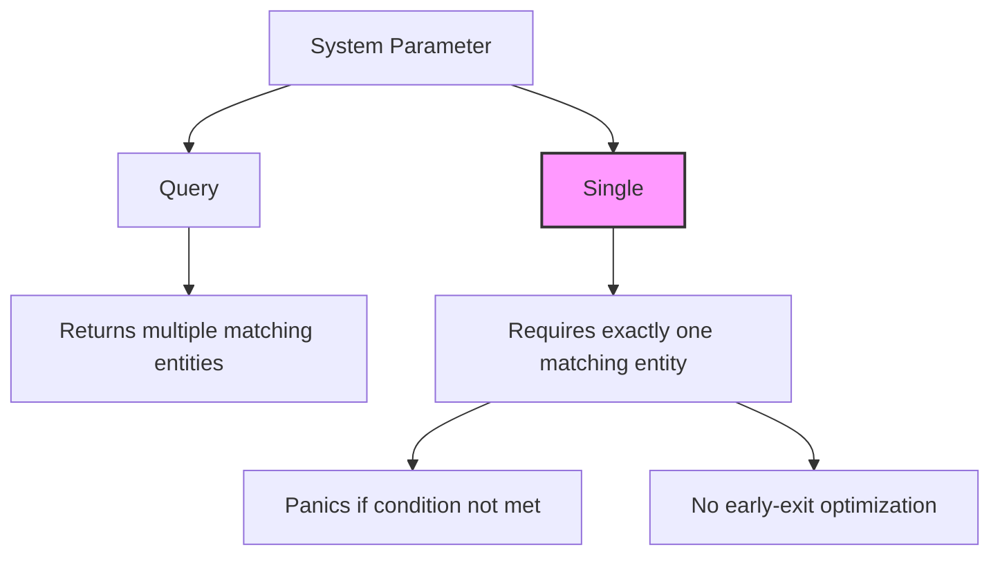

+++
title = "#22861 Add performance clarification to `Single`"
date = "2026-02-08T00:00:00"
draft = false
template = "pull_request_page.html"
in_search_index = true

[taxonomies]
list_display = ["show"]

[extra]
current_language = "en"
available_languages = {"en" = { name = "English", url = "/pull_request/bevy/2026-02/pr-22861-en-20260208" }, "zh-cn" = { name = "中文", url = "/pull_request/bevy/2026-02/pr-22861-zh-cn-20260208" }}
labels = ["C-Docs", "D-Trivial", "A-ECS"]
+++

# Title
Add performance clarification to `Single`

## Basic Information
- **Title**: Add performance clarification to `Single`
- **PR Link**: https://github.com/bevyengine/bevy/pull/22861
- **Author**: Saratii
- **Status**: MERGED
- **Labels**: C-Docs, D-Trivial, A-ECS, S-Ready-For-Final-Review
- **Created**: 2026-02-08T03:21:14Z
- **Merged**: 2026-02-08T19:03:34Z
- **Merged By**: alice-i-cecile

## Description Translation
**Objective**

Many users reasonably assume that `Single` is faster than `Query` because it can early-exit after finding a match.
After reviewing the implementation, I found that it is not used as an optimization and instead exists to perform additional validation.

**Solution**

Add documentation clarifying that Single is intended for validation and may incur slight overhead, since this behavior is not immediately obvious.

## The Story of This Pull Request

This documentation-only PR addresses a subtle but important misconception about Bevy's Entity Component System (ECS) API. The `Single` query type is a specialized system parameter that developers might reasonably assume offers performance benefits over regular `Query` types, but in practice serves a different purpose entirely.

The issue stems from intuitive but incorrect reasoning about how `Single` works. When developers see a type called `Single` that returns exactly one matching entity, they naturally think it might be optimized to stop searching after finding the first match. This would be a logical performance optimization, similar to how database queries with `LIMIT 1` can be faster. However, the Bevy ECS implementation doesn't use this early-exit optimization - the system still evaluates all entities that match the query criteria.

The real purpose of `Single` is validation. When a system requires exactly one entity to exist (not zero, not multiple), using `Single<Component>` will panic at runtime if this condition isn't met. This provides a form of runtime type safety and prevents logic errors from propagating silently through the system. The alternative would be using `Query<Component>` and manually checking the result count, which is more verbose and error-prone.

The author discovered this discrepancy by examining the implementation and realized the documentation needed to clarify this behavior. Without explicit documentation, developers might choose `Single` for performance reasons and be disappointed when they don't see the expected speed improvements. Worse, they might incorrectly assume their systems are more performant than they actually are.

The solution is straightforward: add a single clarifying sentence to the `Single` struct's documentation. The sentence needs to accomplish two things: first, explicitly state that `Single` is not a search optimization, and second, explain its true purpose as a validation mechanism with some associated overhead.

The implementation change is minimal but significant. By adding this documentation, the PR prevents future misunderstandings and helps developers make informed decisions about when to use `Single` versus other query types. It also sets clear expectations about performance characteristics, which is particularly important in game engines where performance considerations are critical.

This type of documentation improvement is valuable because it addresses a cognitive mismatch between API naming/design and actual implementation behavior. The name "Single" naturally suggests a singular result, but doesn't inherently convey whether it's an optimization or a validation tool. The documentation now makes this explicit, improving the developer experience and reducing potential confusion.

## Visual Representation



## Key Files Changed

**File: `crates/bevy_ecs/src/system/query.rs`**
- **Change**: Added documentation clarifying the performance characteristics and purpose of `Single`
- **Lines**: +2/-0
- **Impact**: Prevents developer misconceptions about performance optimizations

**Code Snippet:**
```rust
// Before:
///
/// Use [`Option<Single<D, F>>`] instead if zero or one matching entities can exist.
///
/// See [`Query`] for more details.
///
/// [System parameter]: crate::system::SystemParam

// After:
///
/// Use [`Option<Single<D, F>>`] instead if zero or one matching entities can exist.
///
/// Note that [`Single`] is not used as a search optimization. It is used as a validation with slight overhead compared to [`Query`].
///
/// See [`Query`] for more details.
///
/// [System parameter]: crate::system::SystemParam
```

The added documentation clarifies that:
1. `Single` is not a performance optimization (it doesn't use early-exit)
2. Its primary purpose is validation
3. It has slight overhead compared to regular `Query`

This change directly addresses the PR's objective by preventing developers from incorrectly assuming performance benefits while helping them understand the actual use case for `Single`.

## Further Reading

1. **Bevy ECS Documentation**: https://bevyengine.org/learn/book/ecs/
2. **System Parameters in Bevy**: Understanding the different types of system parameters and their use cases
3. **Query Optimization Techniques**: General database query optimization patterns that developers might be assuming apply to Bevy's ECS
4. **API Design Principles**: How to design APIs that minimize developer confusion between naming and behavior