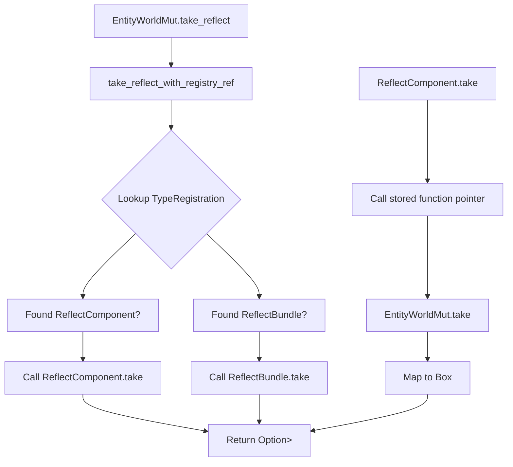

+++
title = "#22862 Adding `take` Method to ReflectComponent for Consistent Reflection API"
date = "2026-02-09T00:00:00"
draft = false
template = "pull_request_page.html"
in_search_index = true

[taxonomies]
list_display = ["show"]

[extra]
current_language = "en"
available_languages = {"en" = { name = "English", url = "/pull_request/bevy/2026-02/pr-22862-en-20260209" }, "zh-cn" = { name = "中文", url = "/pull_request/bevy/2026-02/pr-22862-zh-cn-20260209" }}
labels = ["C-Feature", "A-Reflection", "D-Straightforward"]
+++

# Title: Adding `take` Method to ReflectComponent for Consistent Reflection API

## Basic Information
- **Title**: Feat: adds `take` method to ReflectComponent
- **PR Link**: https://github.com/bevyengine/bevy/pull/22862
- **Author**: kfc35
- **Status**: MERGED
- **Labels**: C-Feature, S-Ready-For-Final-Review, A-Reflection, X-Uncontroversial, D-Straightforward
- **Created**: 2026-02-08T04:30:28Z
- **Merged**: 2026-02-09T02:56:24Z
- **Merged By**: alice-i-cecile

## Description Translation
# Objective

- Closes #22726

## Solution

- Adds a `take` method to `ReflectComponent` that utilizes [`EntityWorldMut::take`](https://github.com/bevyengine/bevy/blob/main/crates/bevy_ecs/src/world/entity_access/world_mut.rs#L1212). This is implemented basically in the same way as what [`ReflectBundle`](https://github.com/bevyengine/bevy/blob/main/crates/bevy_ecs/src/reflect/bundle.rs#L227-L230) does.
- Adds `take_reflect` methods to `EntityWorldMut`, following a similar pattern to other methods in the module.

## Testing

- I did not test this. There are no unit tests to be added to. However, it's a simple enough change that follows a previously walked path.

## The Story of This Pull Request

The issue #22726 identified a gap in the reflection API: while `ReflectBundle` already had a `take` method that could remove and return a bundle's components from an entity, `ReflectComponent` was missing this capability. This inconsistency meant developers working with reflected components couldn't use the same patterns available for bundles when they needed to retrieve and remove components simultaneously.

The problem was straightforward: the `take` operation is useful when you need to both remove a component from an entity and work with its value afterwards. Without a `take` method on `ReflectComponent`, developers had to implement workarounds, first retrieving the component value through reflection and then removing it separately.

The solution approach was to mirror the existing pattern already established by `ReflectBundle`. Since `ReflectBundle` had successfully implemented a `take` method, the same approach could be applied to `ReflectComponent` for consistency. This follow-the-existing-pattern approach reduces cognitive load for developers and maintains API consistency across the reflection system.

Looking at the implementation, we can see the changes follow a clear pattern. In `component.rs`, the `ReflectComponentFns` struct was extended with a new function pointer field:

```rust
/// Function pointer implementing [`ReflectComponent::take()`].
pub take: fn(&mut EntityWorldMut) -> Option<Box<dyn Reflect>>,
```

This function pointer follows the same signature pattern as the existing `remove` method but returns an `Option<Box<dyn Reflect>>` to capture the removed component's value. The `ReflectComponent` struct then exposes this through a public method:

```rust
/// Removes this [`Component`] from the entity and returns its previous value.
pub fn take(&self, entity: &mut EntityWorldMut) -> Option<Box<dyn Reflect>> {
    (self.0.take)(entity)
}
```

The actual implementation for concrete component types is provided in the `FromType<C>` implementation. Here's the key addition:

```rust
take: |entity| {
    entity
        .take::<C>()
        .map(|component| Box::new(component).into_reflect())
},
```

This closure calls the existing typed `EntityWorldMut::take` method, which already handles the actual removal and value return. The result is then converted to a boxed `dyn Reflect` using `into_reflect()`. This implementation is efficient because it leverages the existing typed infrastructure while adding the reflection layer on top.

In `entity_commands.rs`, the changes extend the reflection API at the `EntityWorldMut` level. Two new methods were added:

```rust
pub fn take_reflect(
    &mut self,
    component_type_path: Cow<'static, str>,
) -> Option<Box<dyn Reflect>> {
    self.assert_not_despawned();
    self.resource_scope(|entity, registry: Mut<AppTypeRegistry>| {
        let type_registry = &registry.as_ref().read();
        take_reflect_with_registry_ref(entity, type_registry, component_type_path)
    })
}
```

This method follows the established pattern of other reflection methods like `remove_reflect`. It first checks that the entity hasn't been despawned, then scopes into the type registry resource to look up the reflection data. The actual work is delegated to a helper function:

```rust
fn take_reflect_with_registry_ref(
    entity: &mut EntityWorldMut,
    type_registry: &TypeRegistry,
    component_type_path: Cow<'static, str>,
) -> Option<Box<dyn Reflect>> {
    let type_registration = type_registry.get_with_type_path(&component_type_path)?;
    if let Some(reflect_component) = type_registration.data::<ReflectComponent>() {
        reflect_component.take(entity)
    } else if let Some(reflect_bundle) = type_registration.data::<ReflectBundle>() {
        reflect_bundle.take(entity)
    } else {
        None
    }
}
```

This helper function demonstrates good code reuse - it checks for both `ReflectComponent` and `ReflectBundle` data, allowing a single code path to handle both component and bundle reflection. This pattern is consistent with how `remove_reflect_with_registry_ref` works.

A technical insight here is the use of `Box<dyn Reflect>` as the return type. This follows Rust's trait object pattern for type-erased values, which is appropriate for a reflection system that needs to handle arbitrary types. The boxing is necessary because we don't know the concrete type at compile time, and we need to return ownership of the value.

The implementation also includes a second method `take_reflect_with_registry` that accepts a custom type registry resource, following the same pattern as other reflection methods in the module. This provides flexibility for use cases where the type registry isn't stored in the default `AppTypeRegistry` resource.

One important note in the documentation is the performance warning: "Prefer to use the typed [`EntityWorldMut::take`] if possible. Taking a reflected component is much slower." This is expected because reflection involves runtime type lookups and dynamic dispatch, whereas the typed version can be optimized at compile time.

The impact of this change is primarily API completeness and consistency. Developers can now use the same patterns for both components and bundles when working with reflection. This reduces mental overhead and makes the API more predictable. The changes are minimal and focused, adding only the necessary infrastructure without modifying existing behavior.

From an architectural perspective, this PR demonstrates good practice in extending an existing system by following established patterns. Each change builds on existing infrastructure: the function pointer pattern in `ReflectComponentFns`, the resource scoping pattern in `EntityWorldMut`, and the helper function pattern for shared logic. This approach minimizes risk and makes the code easier to understand for developers familiar with the existing codebase.

## Visual Representation



## Key Files Changed

### `crates/bevy_ecs/src/reflect/component.rs` (+13/-0)
This file contains the core implementation of the `take` method for `ReflectComponent`. The changes are minimal but essential for adding the new capability.

Key modifications:
1. Added a `take` field to the `ReflectComponentFns` struct to store the function pointer
2. Added a public `take` method to `ReflectComponent` that calls the stored function pointer
3. Implemented the `take` function in the `FromType<C>` implementation

Code snippets:
```rust
// Added field to ReflectComponentFns
pub take: fn(&mut EntityWorldMut) -> Option<Box<dyn Reflect>>,

// Added method to ReflectComponent
pub fn take(&self, entity: &mut EntityWorldMut) -> Option<Box<dyn Reflect>> {
    (self.0.take)(entity)
}

// Added implementation in FromType<C> for ReflectComponent
take: |entity| {
    entity
        .take::<C>()
        .map(|component| Box::new(component).into_reflect())
},
```

### `crates/bevy_ecs/src/reflect/entity_commands.rs` (+66/-2)
This file adds the public API methods to `EntityWorldMut` and the helper function that implements the logic.

Key modifications:
1. Added `take_reflect` and `take_reflect_with_registry` methods to `EntityWorldMut`
2. Added the `take_reflect_with_registry_ref` helper function
3. Updated documentation comments

Code snippets:
```rust
// New method on EntityWorldMut
pub fn take_reflect(
    &mut self,
    component_type_path: Cow<'static, str>,
) -> Option<Box<dyn Reflect>> {
    self.assert_not_despawned();
    self.resource_scope(|entity, registry: Mut<AppTypeRegistry>| {
        let type_registry = &registry.as_ref().read();
        take_reflect_with_registry_ref(entity, type_registry, component_type_path)
    })
}

// New helper function
fn take_reflect_with_registry_ref(
    entity: &mut EntityWorldMut,
    type_registry: &TypeRegistry,
    component_type_path: Cow<'static, str>,
) -> Option<Box<dyn Reflect>> {
    let type_registration = type_registry.get_with_type_path(&component_type_path)?;
    if let Some(reflect_component) = type_registration.data::<ReflectComponent>() {
        reflect_component.take(entity)
    } else if let Some(reflect_bundle) = type_registration.data::<ReflectBundle>() {
        reflect_bundle.take(entity)
    } else {
        None
    }
}
```

## Further Reading

- [Bevy Reflection Documentation](https://docs.rs/bevy_reflect/latest/bevy_reflect/) - Understanding the reflection system in Bevy
- [Rust Trait Objects](https://doc.rust-lang.org/book/ch17-02-trait-objects.html) - How `Box<dyn Trait>` works in Rust
- [Entity Component System Pattern](https://en.wikipedia.org/wiki/Entity_component_system) - Background on ECS architecture
- [Previous PR #22726](https://github.com/bevyengine/bevy/issues/22726) - The issue that prompted this change