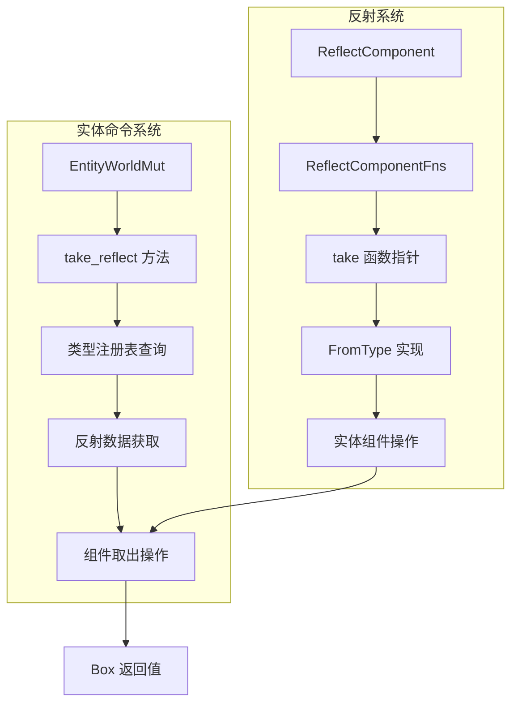

+++
title = "#22862 为 ReflectComponent 添加 `take` 方法"
date = "2026-02-09T00:00:00"
draft = false
template = "pull_request_page.html"
in_search_index = false

[extra]
current_language = "zh-cn"
available_languages = {"en" = { name = "English", url = "/pull_request/bevy/2026-02/pr-22862-en-20260209" }, "zh-cn" = { name = "中文", url = "/pull_request/bevy/2026-02/pr-22862-zh-cn-20260209" }}
labels = ["C-Feature", "A-Reflection", "D-Straightforward"]
+++

# Title: 为 ReflectComponent 添加 `take` 方法

## Basic Information
- **Title**: Feat: adds `take` method to ReflectComponent
- **PR Link**: https://github.com/bevyengine/bevy/pull/22862
- **Author**: kfc35
- **Status**: MERGED
- **Labels**: C-Feature, S-Ready-For-Final-Review, A-Reflection, X-Uncontroversial, D-Straightforward
- **Created**: 2026-02-08T04:30:28Z
- **Merged**: 2026-02-09T02:56:24Z
- **Merged By**: alice-i-cecile

## Description Translation
# 目标

- 关闭 #22726

## 解决方案

- 向 `ReflectComponent` 添加一个 `take` 方法，该方法利用 [`EntityWorldMut::take`](https://github.com/bevyengine/bevy/blob/main/crates/bevy_ecs/src/world/entity_access/world_mut.rs#L1212)。其实现方式基本上与 [`ReflectBundle`](https://github.com/bevyengine/bevy/blob/main/crates/bevy_ecs/src/reflect/bundle.rs#L227-L230) 相同。
- 向 `EntityWorldMut` 添加 `take_reflect` 方法，遵循该模块中其他方法的类似模式。

## 测试

- 我没有测试此功能。没有需要添加的单元测试。然而，这是一个足够简单的更改，遵循了先前已有的路径。

## The Story of This Pull Request

这个 PR 源于一个具体的需求：在反射系统中实现组件的"取出"操作。Bevy 的反射系统允许在运行时动态地操作组件，但之前缺少一个关键功能——从实体中取出组件并获取其值，而不仅仅是移除它。

### 问题背景
在 Issue #22726 中，开发者提出了一个实际需求：需要通过反射系统取出组件。现有的反射系统提供了 `remove` 方法，但该方法只是移除组件而不返回其值。在某些场景下，开发者在移除组件时需要获取组件的当前值，以便进行后续处理或状态迁移。没有 `take` 方法意味着开发者无法通过反射系统完整地实现某些组件管理逻辑。

### 解决方案设计
开发者采用了最直接的实现方式：遵循现有模式。Bevy 的反射系统已经为 `ReflectBundle` 实现了 `take` 方法，因此为 `ReflectComponent` 添加相同功能是合理的扩展。这种一致性保持了 API 的对称性和可预测性。

实现方案包含三个关键部分：
1. 在 `ReflectComponentFns` 结构体中添加 `take` 函数指针
2. 在 `ReflectComponent` trait 中暴露 `take` 方法
3. 在 `EntityWorldMut` 中添加方便的包装方法

### 具体实现分析

首先，在 `ReflectComponentFns` 结构体中添加了新的函数指针：

```rust
// 在 ReflectComponentFns 中添加
pub take: fn(&mut EntityWorldMut) -> Option<Box<dyn Reflect>>,
```

这与其他函数指针（如 `remove`、`insert` 等）保持了一致的设计模式。`Box<dyn Reflect>` 类型确保了返回的值可以被反射系统正确处理。

接着，在 `ReflectComponent` 的实现中添加了实际的 `take` 方法：

```rust
pub fn take(&self, entity: &mut EntityWorldMut) -> Option<Box<dyn Reflect>> {
    (self.0.take)(entity)
}
```

这个方法简单地调用了存储在 `ReflectComponentFns` 中的函数指针，保持了与其他方法的相同调用模式。

最重要的部分是在 `FromType<C>` 的实现中，为具体组件类型 `C` 定义了 `take` 函数的实际行为：

```rust
take: |entity| {
    entity
        .take::<C>()
        .map(|component| Box::new(component).into_reflect())
},
```

这里使用了 `EntityWorldMut::take::<C>()` 方法来实际取出组件，然后使用 `into_reflect()` 方法将具体类型转换为反射类型。这种转换是必要的，因为反射系统需要统一处理所有类型的组件。

对于 `EntityWorldMut`，添加了两个新方法：

```rust
pub fn take_reflect(
    &mut self,
    component_type_path: Cow<'static, str>,
) -> Option<Box<dyn Reflect>> {
    // 实现细节...
}
```

这些方法提供了方便的 API，允许开发者通过类型路径字符串来取出组件，而不需要知道具体的类型。这与现有的 `remove_reflect`、`insert_reflect` 等方法保持了一致的 API 设计。

### 技术细节与考量

值得注意的是，这个实现正确处理了错误情况。当实体没有指定组件，或者类型注册表中没有该组件的反射数据时，方法会返回 `None` 而不是 panic。这种设计让调用者可以优雅地处理缺失的情况。

另一个技术细节是类型转换的处理。取出组件时，具体类型的值需要被转换为 `dyn Reflect` trait 对象：

```rust
.map(|component| Box::new(component).into_reflect())
```

这里的 `into_reflect()` 方法来自 `bevy_reflect` crate，它能够将任何实现了 `Reflect` trait 的类型转换为 `dyn Reflect` trait 对象。

### 对现有代码的影响

这个变化是向后兼容的，它只是添加了新功能而没有修改现有行为。现有的 `remove` 方法继续工作，新的 `take` 方法提供了额外的功能。由于这是一个新增的 API 功能，且遵循了现有的设计模式，因此被标记为 "X-Uncontroversial" 和 "D-Straightforward"。

### 潜在的使用场景

`take` 方法在实际开发中有几个重要用途：
1. 状态迁移：取出组件，修改其状态，然后重新插入
2. 组件重用：在不同实体间转移组件值
3. 序列化前处理：取出组件进行序列化前的转换或清理
4. 动态系统：在不知道具体类型的情况下操作组件值

### 代码质量考虑

开发者没有添加新的测试，这基于几个考虑：
1. 实现非常简单，基本上是现有模式的复制
2. 遵循了已经测试过的 `ReflectBundle::take` 的实现方式
3. 没有修改现有逻辑，只是添加新功能
4. 代码变化足够小，容易通过代码审查验证正确性

然而，在生产环境中，即使是简单的更改也通常建议添加测试，特别是对于核心系统功能。由于这是核心的 ECS 反射系统，未来可能会考虑添加集成测试来确保功能正确性。

## Visual Representation



## Key Files Changed

### `crates/bevy_ecs/src/reflect/component.rs` (+13/-0)
**更改描述**：为反射组件系统添加了 `take` 方法，允许通过反射取出组件值。

**关键修改**：
```rust
// 在 ReflectComponentFns 结构体中添加
pub take: fn(&mut EntityWorldMut) -> Option<Box<dyn Reflect>>,

// 在 ReflectComponent 中新增方法
pub fn take(&self, entity: &mut EntityWorldMut) -> Option<Box<dyn Reflect>> {
    (self.0.take)(entity)
}

// 在 FromType<C> 实现中添加 take 函数指针的实现
take: |entity| {
    entity
        .take::<C>()
        .map(|component| Box::new(component).into_reflect())
},
```

**与 PR 目标的关系**：这是核心实现，为 `ReflectComponent` 添加了 `take` 功能。

### `crates/bevy_ecs/src/reflect/entity_commands.rs` (+66/-2)
**更改描述**：为实体命令系统添加了 `take_reflect` 方法，提供方便的 API 来通过类型路径取出组件。

**关键修改**：
```rust
// 新增 take_reflect 方法
pub fn take_reflect(
    &mut self,
    component_type_path: Cow<'static, str>,
) -> Option<Box<dyn Reflect>> {
    self.assert_not_despawned();
    self.resource_scope(|entity, registry: Mut<AppTypeRegistry>| {
        let type_registry = &registry.as_ref().read();
        take_reflect_with_registry_ref(entity, type_registry, component_type_path)
    })
}

// 新增辅助函数
fn take_reflect_with_registry_ref(
    entity: &mut EntityWorldMut,
    type_registry: &TypeRegistry,
    component_type_path: Cow<'static, str>,
) -> Option<Box<dyn Reflect>> {
    let type_registration = type_registry.get_with_type_path(&component_type_path)?;
    if let Some(reflect_component) = type_registration.data::<ReflectComponent>() {
        reflect_component.take(entity)
    } else if let Some(reflect_bundle) = type_registration.data::<ReflectBundle>() {
        reflect_bundle.take(entity)
    } else {
        None
    }
}
```

**与 PR 目标的关系**：这是用户友好的 API 层，让开发者能够方便地使用新添加的 `take` 功能。

## Further Reading

1. **Bevy ECS 反射系统文档**：了解 Bevy 的反射系统如何工作
   - https://bevy-cheatbook.github.io/programming/reflection.html

2. **EntityWorldMut API 文档**：理解实体操作的各种方法
   - https://docs.rs/bevy-ecs/latest/bevy_ecs/world/struct.EntityWorldMut.html

3. **反射 trait 设计模式**：学习如何在 Rust 中设计灵活的类型系统
   - https://doc.rust-lang.org/book/ch17-02-trait-objects.html

4. **类型擦除与动态分发**：理解 `Box<dyn Reflect>` 背后的概念
   - https://doc.rust-lang.org/rust-by-example/trait/dyn.html