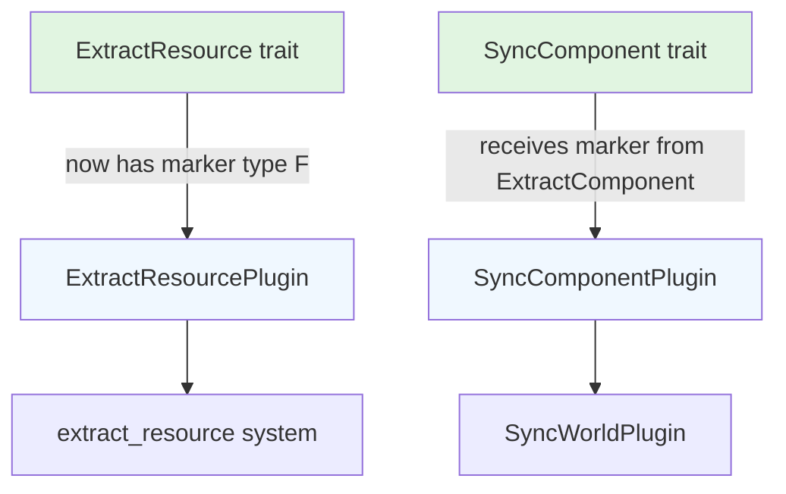

+++
title = "#22867 Add marker for Extract Resource"
date = "2026-02-09T00:00:00"
draft = false
template = "pull_request_page.html"
in_search_index = true

[taxonomies]
list_display = ["show"]

[extra]
current_language = "en"
available_languages = {"en" = { name = "English", url = "/pull_request/bevy/2026-02/pr-22867-en-20260209" }, "zh-cn" = { name = "中文", url = "/pull_request/bevy/2026-02/pr-22867-zh-cn-20260209" }}
labels = ["A-Rendering", "C-Usability", "D-Straightforward"]
+++

# Title
Add marker for ExtractResource

## Basic Information
- **Title**: Add marker for Extract Resource
- **PR Link**: https://github.com/bevyengine/bevy/pull/22867
- **Author**: Zeophlite
- **Status**: MERGED
- **Labels**: A-Rendering, C-Usability, S-Ready-For-Final-Review, D-Straightforward
- **Created**: 2026-02-08T08:37:07Z
- **Merged**: 2026-02-09T23:06:33Z
- **Merged By**: alice-i-cecile

## Description Translation

# Objective

- Followup to https://github.com/bevyengine/bevy/pull/22766
- Step towards https://github.com/bevyengine/bevy/pull/22852

## Solution

- Add marker to `ExtractResouce`
- Pass marker to `SyncComponent`

## Testing

- `cargo run --example animated_mesh`

## The Story of This Pull Request

This PR is part of an ongoing effort to improve the extensibility of Bevy's rendering system by addressing Rust's orphan rules. The orphan rule in Rust prevents implementing a trait for a type unless either the trait or the type is defined in the current crate. This limitation becomes problematic when developers want to implement Bevy's extraction traits for types from external crates.

The problem manifests in two key rendering systems: component extraction and resource extraction. Component extraction had already received a marker type solution in a previous PR (#22766), allowing developers to work around orphan rules by using a local type as a marker parameter. However, resource extraction remained limited by the same constraints.

The approach taken here follows the established pattern from the component extraction system. The developer added a generic marker type parameter `F` to the `ExtractResource` trait and propagated this marker through the related systems. This creates a consistent pattern across both extraction systems, making the API more predictable and easier to understand.

The implementation required changes to three main areas of the codebase. First, the `ExtractResource` trait itself now accepts a marker type parameter with a default of `()`. This maintains backward compatibility while allowing custom markers. Second, the `ExtractResourcePlugin` needed to be updated to handle this marker type and pass it through to the extraction system. Third, the related `SyncComponent` system was updated to accept the marker type from `ExtractComponent`, ensuring consistency across the extraction pipeline.

The technical pattern used here is straightforward but effective. By adding a phantom type parameter that implements `Send + Sync`, developers can now create local wrapper types that act as markers, allowing them to implement extraction traits for foreign types. This is a common Rust pattern for working around orphan rules without requiring complex workarounds or unsafe code.

From an architectural perspective, this change aligns the resource extraction system with the component extraction system, creating a more consistent API. Both systems now support marker types, making the rendering pipeline more extensible. The changes are minimal and focused, affecting only the type signatures and trait bounds without modifying the core extraction logic.

The impact of this PR is that developers can now implement `ExtractResource` for resource types from external dependencies, increasing the flexibility of Bevy's rendering system. This is particularly useful for game developers who want to extract custom resources from external libraries or crates without having to wrap them in local types for every use.

The implementation maintains backward compatibility through default type parameters. Existing code that doesn't specify a marker type will continue to work with `()`, while new code can provide custom markers when needed. This approach balances extensibility with stability.

## Visual Representation



## Key Files Changed

### `crates/bevy_render/src/extract_resource.rs` (+14/-6)

This file contains the core changes to the resource extraction system. The `ExtractResource` trait now accepts a marker type parameter, and all related types and functions have been updated to handle this parameter.

```rust
// Before:
pub trait ExtractResource: Resource {
    type Source: Resource;
    
    fn extract_resource(source: &Self::Source) -> Self;
}

// After:
pub trait ExtractResource<F = ()>: Resource {
    type Source: Resource;
    
    fn extract_resource(source: &Self::Source) -> Self;
}
```

The `ExtractResourcePlugin` was updated to be generic over both the resource type and the marker type:

```rust
// Before:
pub struct ExtractResourcePlugin<R: ExtractResource>(PhantomData<R>);

// After:
pub struct ExtractResourcePlugin<R: ExtractResource<F>, F = ()>(PhantomData<(R, F)>);
```

The extraction function signature was also updated to include the marker type:

```rust
// Before:
pub fn extract_resource<R: ExtractResource>(
    mut commands: Commands,
    main_resource: Extract<Option<Res<R::Source>>>,
    target_resource: Option<ResMut<R>>,
) {
    // implementation
}

// After:
pub fn extract_resource<R: ExtractResource<F>, F>(
    mut commands: Commands,
    main_resource: Extract<Option<Res<R::Source>>>,
    target_resource: Option<ResMut<R>>,
) {
    // implementation
}
```

### `crates/bevy_render/src/sync_component.rs` (+9/-7)

This file was updated to ensure consistency between the component and resource extraction systems. The `SyncComponent` trait and related types now properly handle marker types passed from `ExtractComponent`.

```rust
// Before:
pub trait SyncComponent<Marker = ()>: Component {
    // trait methods
}

// After:
pub trait SyncComponent<F = ()>: Component {
    // trait methods
}
```

The plugin implementation was updated to handle the marker type consistently:

```rust
// Before:
impl<C: SyncComponent<Marker>, Marker: Send + Sync + 'static> Plugin
    for SyncComponentPlugin<C, Marker>
{
    // implementation
}

// After:
impl<C: SyncComponent<F>, F: Send + Sync + 'static> Plugin for SyncComponentPlugin<C, F> {
    // implementation
}
```

### `crates/bevy_render/src/extract_component.rs` (+12/-8)

This file received minor updates to improve documentation consistency and ensure proper marker type propagation. The parameter name was changed from `Marker` to `F` for consistency with the updated resource extraction system.

```rust
// Before:
pub trait ExtractComponent<Marker = ()>: SyncComponent {
    // trait methods
}

// After:
pub trait ExtractComponent<F = ()>: SyncComponent<F> {
    // trait methods
}
```

The documentation was updated to clarify the purpose of the marker type parameter:

```rust
// Updated documentation:
/// The marker type `F` is only used as a way to bypass the orphan rules. To
/// implement the trait for a foreign type you can use a local type as the
/// marker, e.g. the type of the plugin that calls [`ExtractResourcePlugin`].
```

## Further Reading

1. [Rust Orphan Rules](https://doc.rust-lang.org/reference/items/implementations.html#orphan-rules) - Official documentation on Rust's orphan rules
2. [PhantomData in Rust](https://doc.rust-lang.org/std/marker/struct.PhantomData.html) - Using phantom types for type system patterns
3. [Bevy's ECS System](https://bevy-cheatbook.github.io/programming/ecs-intro.html) - Understanding Bevy's Entity Component System
4. [Previous PR #22766](https://github.com/bevyengine/bevy/pull/22766) - The component extraction marker implementation that preceded this PR
5. [Target PR #22852](https://github.com/bevyengine/bevy/pull/22852) - The larger goal this PR is working towards