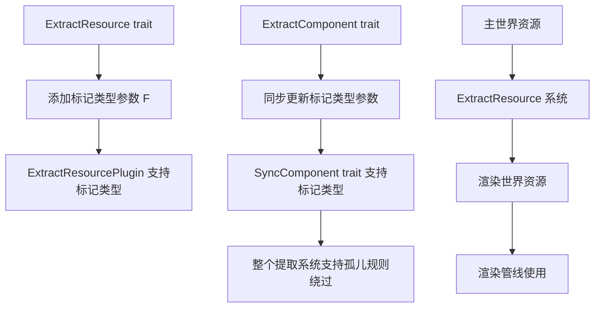

+++
title = "#22867 Add marker for Extract Resource"
date = "2026-02-09T00:00:00"
draft = false
template = "pull_request_page.html"
in_search_index = false

[extra]
current_language = "zh-cn"
available_languages = {"en" = { name = "English", url = "/pull_request/bevy/2026-02/pr-22867-en-20260209" }, "zh-cn" = { name = "中文", url = "/pull_request/bevy/2026-02/pr-22867-zh-cn-20260209" }}
labels = ["A-Rendering", "C-Usability", "D-Straightforward"]
+++

# Title
Add marker for ExtractResource

## Basic Information
- **Title**: Add marker for Extract Resource
- **PR Link**: https://github.com/bevyengine/bevy/pull/22867
- **Author**: Zeophlite
- **Status**: MERGED
- **Labels**: A-Rendering, C-Usability, S-Ready-For-Final-Review, D-Straightforward
- **Created**: 2026-02-08T08:37:07Z
- **Merged**: 2026-02-09T23:06:33Z
- **Merged By**: alice-i-cecile

## Description Translation

# Objective

- 作为 https://github.com/bevyengine/bevy/pull/22766 的后续工作
- 作为实现 https://github.com/bevyengine/bevy/pull/22852 的一步

## Solution

- 为 `ExtractResource` 添加标记类型（marker）
- 将标记类型传递给 `SyncComponent`

## Testing

- `cargo run --example animated_mesh`

## The Story of This Pull Request

这个 PR 解决了 Bevy 渲染系统中一个关于类型实现的限制问题。问题的核心是 Rust 的孤儿规则（orphan rule），该规则禁止为外部类型实现外部 trait。在 Bevy 的渲染系统中，`ExtractResource` trait 用于在渲染管线的提取阶段将资源从主世界（main world）转移到渲染世界（render world）。当用户需要为第三方库中的类型实现这个 trait 时，就会遇到孤儿规则的阻碍。

之前，`ExtractComponent` 已经通过引入标记类型（marker type）解决了类似问题。这个 PR 将相同的解决方案应用到 `ExtractResource` 上，使得整个提取系统保持一致的 API 设计。

具体实现是通过在 `ExtractResource` trait 中添加一个泛型参数 `F`，默认值为 `()`。这个标记类型只用于绕过孤儿规则，实际的资源提取逻辑并不使用它。用户可以通过使用本地类型（例如插件类型）作为标记，来为外部类型实现 `ExtractResource` trait。

由于 `ExtractComponent` 依赖于 `SyncComponent`，而 `SyncComponent` 也需要支持标记类型，因此相关代码也进行了相应调整。这些改动包括：
- 将 `ExtractComponent` trait 的泛型参数从 `Marker` 重命名为 `F`，以保持一致性
- 更新 `ExtractComponentPlugin` 和 `SyncComponentPlugin` 以支持标记类型
- 修改相关的系统函数签名

整个改动是向后兼容的，因为标记类型有默认值 `()`，现有代码无需修改即可继续工作。这个解决方案遵循了 Rust 的类型系统设计原则，通过引入一个无关的标记类型来绕过语言限制，同时保持了 API 的简洁性。

这种模式在 Bevy 中已经证明是有效的，现在 `ExtractResource` 也采用了相同的方法，为后续的渲染系统改进打下了基础。特别是对于 PR #22852 中提到的目标，这种统一的标记类型支持将是必要的。

## Visual Representation



## Key Files Changed

### 1. `crates/bevy_render/src/extract_resource.rs`
这个文件是主要修改对象，为 `ExtractResource` trait 添加了标记类型支持。

**修改前**:
```rust
pub trait ExtractResource: Resource {
    type Source: Resource;

    fn extract_resource(source: &Self::Source) -> Self;
}
```

**修改后**:
```rust
pub trait ExtractResource<F = ()>: Resource {
    type Source: Resource;

    fn extract_resource(source: &Self::Source) -> Self;
}
```

同时更新了相关的插件和系统函数：
```rust
// 插件现在支持标记类型
pub struct ExtractResourcePlugin<R: ExtractResource<F>, F = ()>(PhantomData<(R, F)>);

// 系统函数也添加了标记类型参数
pub fn extract_resource<R: ExtractResource<F>, F>(
    mut commands: Commands,
    main_resource: Extract<Option<Res<R::Source>>>,
    target_resource: Option<ResMut<R>>,
) {
    // ... 实现保持不变
}
```

### 2. `crates/bevy_render/src/extract_component.rs`
为了保持一致性和依赖关系，更新了 `ExtractComponent` trait 和相关代码。

**关键修改**:
```rust
// 泛型参数重命名并保持一致
pub trait ExtractComponent<F = ()>: SyncComponent<F> {
    // ... 内部定义保持不变
}

// 更新插件实现以支持标记类型
impl<C: ExtractComponent<F>, F: 'static + Send + Sync> Plugin for ExtractComponentPlugin<C, F> {
    fn build(&self, app: &mut App) {
        app.add_plugins(SyncComponentPlugin::<C, F>::default());
        // ... 其余代码
    }
}
```

### 3. `crates/bevy_render/src/sync_component.rs`
由于 `ExtractComponent` 依赖 `SyncComponent`，需要更新以支持标记类型。

**修改内容**:
```rust
// SyncComponent trait 添加标记类型参数
pub trait SyncComponent<F = ()>: Component {
    // ... 内部定义保持不变
}

// 插件支持标记类型
pub struct SyncComponentPlugin<C, F = ()>(PhantomData<(C, F)>);

impl<C: SyncComponent<F>, F: Send + Sync + 'static> Plugin for SyncComponentPlugin<C, F> {
    // ... 实现
}
```

## Further Reading

1. [Rust 孤儿规则（Orphan Rule）](https://doc.rust-lang.org/book/ch10-02-traits.html#implementing-a-trait-on-a-type) - 理解为什么需要标记类型
2. [Bevy 渲染管线架构](https://bevyengine.org/learn/quick-start/getting-started/systems/) - 了解提取系统在渲染管线中的作用
3. [Bevy ECS 模式](https://bevyengine.org/learn/quick-start/getting-started/ecs/) - 理解组件和资源在 Bevy 中的使用
4. [PhantomData 模式](https://doc.rust-lang.org/std/marker/struct.PhantomData.html) - 了解如何在泛型中使用幽灵数据

# Full Code Diff
（完整代码差异已在上述分析中包含）