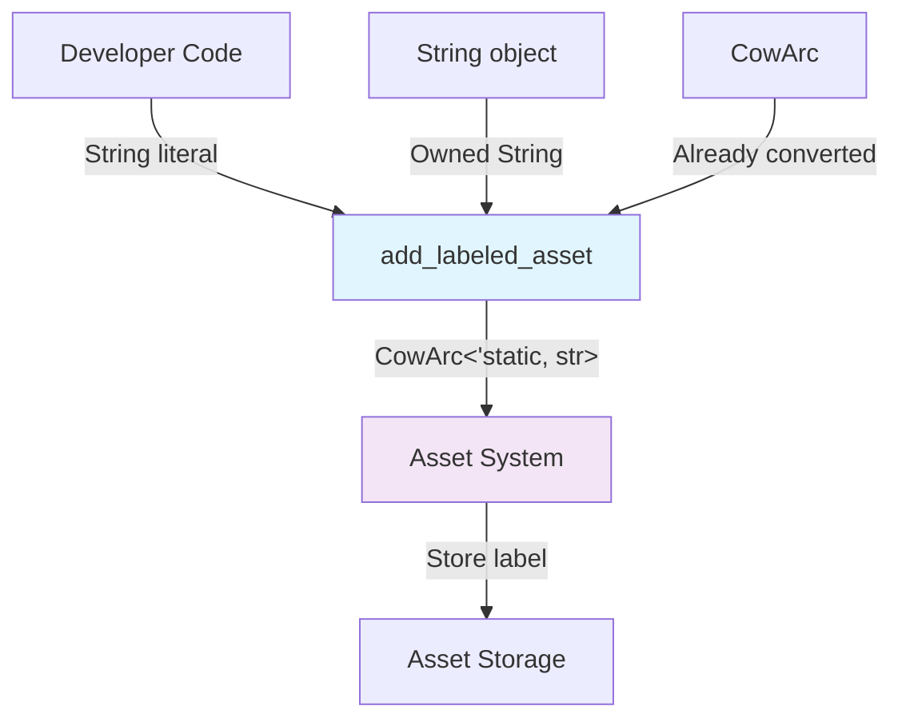

+++
title = "#22869 Use CowArc everywhere for asset labels"
date = "2026-02-09T00:00:00"
draft = false
template = "pull_request_page.html"
in_search_index = true

[taxonomies]
list_display = ["show"]

[extra]
current_language = "en"
available_languages = {"en" = { name = "English", url = "/pull_request/bevy/2026-02/pr-22869-en-20260209" }, "zh-cn" = { name = "中文", url = "/pull_request/bevy/2026-02/pr-22869-zh-cn-20260209" }}
labels = ["A-Assets", "C-Usability", "D-Straightforward"]
+++

# Title

## Basic Information
- **Title**: Use CowArc everywhere for asset labels
- **PR Link**: https://github.com/bevyengine/bevy/pull/22869
- **Author**: Demiu
- **Status**: MERGED
- **Labels**: A-Assets, C-Usability, S-Ready-For-Final-Review, D-Straightforward
- **Created**: 2026-02-08T11:04:39Z
- **Merged**: 2026-02-09T23:09:57Z
- **Merged By**: alice-i-cecile

## Description

# Objective

Make the API consistent

## Solution

Change the types.

## Testing

I ran `cargo test --workspace --lib --bins --tests` and fixed the warnings and errors. Also `cargo check --workspace --examples`

On cargo 1.93.0 on windows 10

## The Story of This Pull Request

The Bevy asset system allows assets to have labeled sub-assets, which are accessed via paths like `main_asset.glb#Mesh0` where `Mesh0` is the label. The implementation had an inconsistency where some API methods accepted `String` parameters for asset labels while others used `CowArc<'static, str>`. This PR addresses this inconsistency by standardizing on `CowArc` across the asset label API.

When working with the asset loading system, developers often need to create labeled assets programmatically. The `LoadContext` struct provides methods like `add_labeled_asset` and `labeled_asset_scope` for this purpose. Prior to this change, these methods required passing a `String`, which meant developers had to explicitly convert string literals using `.into()` or `.to_string()`. This was inconsistent with other parts of the Bevy API that use `CowArc` for string parameters, which provides more flexibility by accepting both owned strings and string slices without requiring explicit conversions.

The core issue was that the API wasn't ergonomic. When calling `add_labeled_asset("subasset".into(), asset)`, the `.into()` call was unnecessary boilerplate. `CowArc` (a clone-on-write atomic reference-counted string) can accept string literals directly through its `Into` implementation, making the API cleaner.

The implementation changed two key methods in `loader.rs`:
- `labeled_asset_scope` now takes `label: impl Into<CowArc<'static, str>>` instead of `String`
- `add_labeled_asset` now takes `label: impl Into<CowArc<'static, str>>` instead of `String`

This change required updating the method signatures and removing the now-unused `String` import from the module's imports. The `Into` trait bound allows the methods to accept any type that can be converted into a `CowArc<'static, str>`, including string literals, `String`, and existing `CowArc` instances.

In the tests (`lib.rs`), this change simplified the code by removing the `.into()` calls. For example:
```rust
// Before
load_context.add_labeled_asset("A".into(), TestAsset);

// After  
load_context.add_labeled_asset("A", TestAsset);
```

This change aligns with Rust API design best practices, where accepting `impl Into<T>` for parameters provides maximum flexibility to callers. The use of `CowArc` specifically is consistent with Bevy's approach to string handling in performance-sensitive contexts, as it allows for zero-copy operations when using string literals while still supporting owned strings when needed.

From a technical perspective, `CowArc` provides several advantages:
1. **Reduced allocations**: String literals can be used without heap allocation
2. **Flexibility**: Both static and dynamic strings are supported through a single type
3. **Thread safety**: `CowArc` uses atomic reference counting, making it safe to share across threads
4. **Clone efficiency**: Cloning `CowArc` is cheap (incrementing a reference count) compared to cloning a `String` (allocating new memory)

The PR also demonstrates good engineering practice by updating all call sites in the codebase to match the new API. The author ran comprehensive tests (`cargo test --workspace --lib --bins --tests`) to ensure no regressions were introduced and also checked examples to verify the changes worked correctly.

This change improves the developer experience by making the API more intuitive and consistent. Developers no longer need to remember to add `.into()` when passing string literals to asset labeling methods, reducing cognitive overhead and potential errors.

## Visual Representation



## Key Files Changed

### `crates/bevy_asset/src/loader.rs` (+7/-7)

This file contains the core asset loading logic. The changes update the method signatures to use `CowArc` instead of `String` for asset labels.

**Key changes:**
1. Removed unnecessary `String` import since it's no longer used in function signatures
2. Updated `labeled_asset_scope` and `add_labeled_asset` to accept `impl Into<CowArc<'static, str>>`

```rust
// File: crates/bevy_asset/src/loader.rs
// Before:
pub fn labeled_asset_scope<A: Asset, E>(
    &mut self,
    label: String,
    load: impl FnOnce(&mut LoadContext) -> Result<A, E>,
) -> Result<Handle<A>, E>

pub fn add_labeled_asset<A: Asset>(&mut self, label: String, asset: A) -> Handle<A>

// After:
pub fn labeled_asset_scope<A: Asset, E>(
    &mut self,
    label: impl Into<CowArc<'static, str>>,
    load: impl FnOnce(&mut LoadContext) -> Result<A, E>,
) -> Result<Handle<A>, E>

pub fn add_labeled_asset<A: Asset>(
    &mut self,
    label: impl Into<CowArc<'static, str>>,
    asset: A,
) -> Handle<A>
```

### `crates/bevy_asset/src/lib.rs` (+3/-3)

This file contains test code that exercises the asset loading functionality. The changes update test calls to remove the `.into()` conversions now that the API accepts string literals directly.

```rust
// File: crates/bevy_asset/src/lib.rs
// Before:
load_context.add_labeled_asset("A".into(), TestAsset);
load_context.add_labeled_asset("B".into(), TestAsset);
load_context.add_labeled_asset("subasset".into(), AssetWithDep { dep });

// After:
load_context.add_labeled_asset("A", TestAsset);
load_context.add_labeled_asset("B", TestAsset);
load_context.add_labeled_asset("subasset", AssetWithDep { dep });
```

## Further Reading

1. **Rust API Guidelines - Flexibility**: The Rust API Guidelines recommend accepting `impl Into<T>` parameters for flexibility: https://rust-lang.github.io/api-guidelines/flexibility.html
2. **Bevy's CowArc documentation**: Understanding `CowArc` and its use cases in Bevy
3. **Rust's Cow (Clone-on-Write) type**: The standard library's `Cow` type which inspired `CowArc`: https://doc.rust-lang.org/std/borrow/enum.Cow.html
4. **Bevy Asset System Documentation**: Official documentation for Bevy's asset system and labeled assets

# Full Code Diff
```
diff --git a/crates/bevy_asset/src/lib.rs b/crates/bevy_asset/src/lib.rs
index e533fc094ea13..97969fbe5f064 100644
--- a/crates/bevy_asset/src/lib.rs
+++ b/crates/bevy_asset/src/lib.rs
@@ -2574,8 +2574,8 @@ mod tests {
                 _settings: &Self::Settings,
                 load_context: &mut LoadContext<'_>,
             ) -> Result<Self::Asset, Self::Error> {
-                load_context.add_labeled_asset("A".into(), TestAsset);
-                load_context.add_labeled_asset("B".into(), TestAsset);
+                load_context.add_labeled_asset("A", TestAsset);
+                load_context.add_labeled_asset("B", TestAsset);
                 Ok(TestAsset)
             }
 
@@ -2852,7 +2852,7 @@ mod tests {
                 // Load the asset in the root context, but then put the handle in the subasset. So
                 // the subasset's (internal) load context never loaded `dep`.
                 let dep = load_context.load::<TestAsset>("abc.ron");
-                load_context.add_labeled_asset("subasset".into(), AssetWithDep { dep });
+                load_context.add_labeled_asset("subasset", AssetWithDep { dep });
                 Ok(TestAsset)
             }
 
diff --git a/crates/bevy_asset/src/loader.rs b/crates/bevy_asset/src/loader.rs
index d0c5bac1d4f90..3ec4daf539948 100644
--- a/crates/bevy_asset/src/loader.rs
+++ b/crates/bevy_asset/src/loader.rs
@@ -6,11 +6,7 @@ use crate::{
     Asset, AssetIndex, AssetLoadError, AssetServer, AssetServerMode, Assets, ErasedAssetIndex,
     Handle, UntypedAssetId, UntypedHandle,
 };
-use alloc::{
-    boxed::Box,
-    string::{String, ToString},
-    vec::Vec,
-};
+use alloc::{boxed::Box, string::ToString, vec::Vec};
 use atomicow::CowArc;
 use bevy_ecs::{error::BevyError, world::World};
 use bevy_platform::collections::{HashMap, HashSet};
@@ -400,7 +396,7 @@ impl<'a> LoadContext<'a> {
     /// See [`AssetPath`] for more on labeled assets.
     pub fn labeled_asset_scope<A: Asset, E>(
         &mut self,
-        label: String,
+        label: impl Into<CowArc<'static, str>>,
         load: impl FnOnce(&mut LoadContext) -> Result<A, E>,
     ) -> Result<Handle<A>, E> {
         let mut context = self.begin_labeled_asset();
@@ -419,7 +415,11 @@ impl<'a> LoadContext<'a> {
     /// new [`LoadContext`] to track the dependencies for the labeled asset.
     ///
     /// See [`AssetPath`] for more on labeled assets.
-    pub fn add_labeled_asset<A: Asset>(&mut self, label: String, asset: A) -> Handle<A> {
+    pub fn add_labeled_asset<A: Asset>(
+        &mut self,
+        label: impl Into<CowArc<'static, str>>,
+        asset: A,
+    ) -> Handle<A> {
         self.labeled_asset_scope(label, |_| Ok::<_, ()>(asset))
             .expect("the closure returns Ok")
     }
```