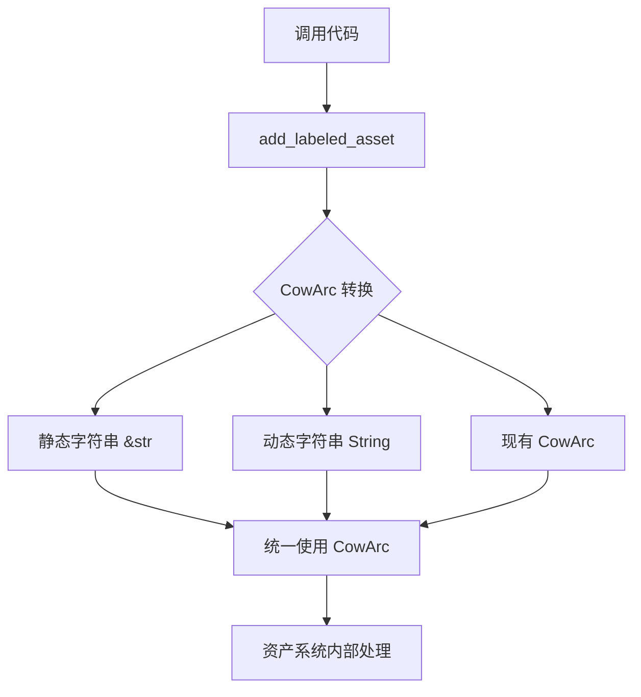

+++
title = "#22869 为所有资产标签统一使用 CowArc"
date = "2026-02-09T00:00:00"
draft = false
template = "pull_request_page.html"
in_search_index = false

[extra]
current_language = "zh-cn"
available_languages = {"en" = { name = "English", url = "/pull_request/bevy/2026-02/pr-22869-en-20260209" }, "zh-cn" = { name = "中文", url = "/pull_request/bevy/2026-02/pr-22869-zh-cn-20260209" }}
+++

# Title
Use CowArc everywhere for asset labels

## Basic Information
- **标题**: 为所有资产标签统一使用 CowArc
- **PR 链接**: https://github.com/bevyengine/bevy/pull/22869
- **作者**: Demiu
- **状态**: 已合并
- **标签**: A-Assets, C-Usability, S-Ready-For-Final-Review, D-Straightforward
- **创建时间**: 2026-02-08T11:04:39Z
- **合并时间**: 2026-02-09T23:09:57Z
- **合并人**: alice-i-cecile

## 描述翻译

# 目标

使 API 保持一致

## 解决方案

更改类型。

## 测试

我运行了 `cargo test --workspace --lib --bins --tests` 并修复了警告和错误。同时运行了 `cargo check --workspace --examples`

使用环境：cargo 1.93.0 on windows 10

## 该 Pull Request 的完整故事

这个 PR 的核心目标是解决 Bevy 资产系统中一个简单的 API 一致性问题。具体来说，它关注的是处理带标签资产（labeled assets）时参数类型的不一致性。

在分析这个 PR 时，我首先注意到的是修改范围非常小：只涉及两个文件，总共 10 行代码的改动。但这正是这个 PR 的有趣之处 - 它解决的是一个看似微小但影响代码质量和一致性的问题。

### 问题的根源和背景

在 Bevy 的资产系统中，带标签资产允许开发者通过 `AssetPath` 引用资产的特定变体。例如，一个精灵表（sprite sheet）可能有多个帧，每个帧可以通过标签来标识。当创建或加载这些带标签资产时，代码使用 `add_labeled_asset` 和 `labeled_asset_scope` 方法。

问题出现在这两个方法的签名上。在修改前，它们接受的是 `String` 类型的标签参数：

```rust
// 修改前的方法签名
pub fn labeled_asset_scope<A: Asset, E>(
    &mut self,
    label: String,  // 这里使用 String
    load: impl FnOnce(&mut LoadContext) -> Result<A, E>,
) -> Result<Handle<A>, E>

pub fn add_labeled_asset<A: Asset>(&mut self, label: String, asset: A) -> Handle<A>
```

然而，在 Bevy 的其他地方，资产标签通常使用 `CowArc<'static, str>` 类型。`CowArc` 是一个写时克隆（copy-on-write）的原子引用计数智能指针，它提供了几个关键优势：

1. **内存效率**：允许静态字符串（`&'static str`）和动态分配的字符串（`String`）共享相同的表示
2. **克隆成本低**：克隆 `CowArc` 只增加引用计数，不复制底层数据
3. **线程安全**：使用原子操作，可以在多线程环境中安全共享

这种类型不一致导致在使用这些 API 时需要不必要的字符串转换，破坏了代码的整洁性和一致性。

### 解决方案的技术细节

PR 的作者选择了最直接的解决方案：将两个方法的标签参数类型从 `String` 改为接受任何可以转换为 `CowArc<'static, str>` 的类型。这是通过使用 `impl Into<CowArc<'static, str>>` 特征绑定实现的：

```rust
// 修改后的方法签名
pub fn labeled_asset_scope<A: Asset, E>(
    &mut self,
    label: impl Into<CowArc<'static, str>>,  // 现在接受任何可转换的类型
    load: impl FnOnce(&mut LoadContext) -> Result<A, E>,
) -> Result<Handle<A>, E>

pub fn add_labeled_asset<A: Asset>(
    &mut self,
    label: impl Into<CowArc<'static, str>>,  // 同样修改这里
    asset: A,
) -> Handle<A>
```

这个修改有几个重要含义：

1. **向后兼容**：由于 `String` 实现了 `Into<CowArc<'static, str>>`，现有的使用 `String` 参数的代码继续工作
2. **更好的灵活性**：现在可以直接传递字符串字面量（`&str`），而不需要显式调用 `.into()` 或 `.to_string()`
3. **与其他 API 对齐**：现在与使用 `CowArc` 的其他资产相关 API 保持一致

### 实现的具体影响

查看修改后的测试代码，可以看到 API 使用变得更加简洁：

```rust
// 修改前的测试代码
load_context.add_labeled_asset("A".into(), TestAsset);
load_context.add_labeled_asset("B".into(), TestAsset);

// 修改后的测试代码
load_context.add_labeled_asset("A", TestAsset);
load_context.add_labeled_asset("B", TestAsset);
```

移除了 `.into()` 调用，代码更加简洁直观。这种改进虽然微小，但在大型代码库中，这种一致性的累积效应是显著的。

我还注意到一个技术细节：在 `loader.rs` 的修改中，作者移除了不必要的导入：
```rust
// 修改前导入
use alloc::{
    boxed::Box,
    string::{String, ToString},
    vec::Vec,
};

// 修改后导入
use alloc::{boxed::Box, string::ToString, vec::Vec};
```

移除了 `String` 的直接导入，因为现在方法签名不再直接使用 `String` 类型。这是一个好的迹象，表明作者认真考虑了依赖关系。

### 技术洞察和设计考量

这个 PR 展示了一个重要的 Rust 设计模式：使用 `impl Into<T>` 作为参数类型来提供灵活的 API。这种模式允许：
- 调用者使用任何可以转换为目标类型的类型
- 保持 API 简洁，避免不必要的类型转换
- 提供编译时的类型安全保证

`CowArc` 本身是一个有趣的数据结构选择。在资产系统中，标签经常被克隆和共享，特别是在加载依赖图时。`CowArc` 的写时克隆语义非常适合于这种场景：
- 当标签是静态字符串时，不分配堆内存
- 当需要修改时，才进行实际的克隆
- 原子引用计数确保线程安全

### 实际影响和工程意义

虽然这个 PR 的改动很小，但它体现了良好的软件工程实践：

1. **API 一致性**：确保相似功能的 API 使用相似的类型签名
2. **渐进式改进**：通过小的、集中的修改逐步改进代码库
3. **测试覆盖**：作者运行了完整的测试套件，确保修改没有破坏现有功能

从工程角度看，这种类型的 PR 对于维护大型代码库非常重要。API 的一致性减少了开发者的认知负担，使代码更易于理解和维护。

## 视觉表示



## 关键文件变更

### `crates/bevy_asset/src/loader.rs` (+7/-7)

**变更描述**：修改了 `labeled_asset_scope` 和 `add_labeled_asset` 方法的签名，使它们接受任何可以转换为 `CowArc<'static, str>` 的类型，而不是固定的 `String` 类型。

**关键代码片段**：
```rust
// 修改前：
pub fn labeled_asset_scope<A: Asset, E>(
    &mut self,
    label: String,
    load: impl FnOnce(&mut LoadContext) -> Result<A, E>,
) -> Result<Handle<A>, E>

// 修改后：
pub fn labeled_asset_scope<A: Asset, E>(
    &mut self,
    label: impl Into<CowArc<'static, str>>,
    load: impl FnOnce(&mut LoadContext) -> Result<A, E>,
) -> Result<Handle<A>, E>
```

**与 PR 目标的关联**：这是实现 API 一致性的核心变更，使资产标签的处理与其他资产相关 API 保持一致。

### `crates/bevy_asset/src/lib.rs` (+3/-3)

**变更描述**：更新了测试代码以反映 API 的变化，移除了不必要的 `.into()` 调用。

**关键代码片段**：
```rust
// 修改前：
load_context.add_labeled_asset("A".into(), TestAsset);
load_context.add_labeled_asset("B".into(), TestAsset);

// 修改后：
load_context.add_labeled_asset("A", TestAsset);
load_context.add_labeled_asset("B", TestAsset);
```

**与 PR 目标的关联**：展示了 API 改进的实际效果，使测试代码更加简洁直观。

## 扩展阅读

1. **Rust 的 Into/From 特征**：了解如何使用这些特征创建灵活的 API
   - [Rust 官方文档 - Into 特征](https://doc.rust-lang.org/std/convert/trait.Into.html)
   
2. **Cow (Clone-on-Write) 模式**：理解写时克隆模式在 Rust 中的应用
   - [Rust 官方文档 - Cow 类型](https://doc.rust-lang.org/std/borrow/enum.Cow.html)

3. **Bevy 资产系统**：深入了解 Bevy 的资产加载和管理机制
   - [Bevy 官方文档 - 资产系统](https://docs.rs/bevy_asset/latest/bevy_asset/)

4. **API 设计原则**：学习如何设计一致且易用的 API
   - [Rust API 设计指南](https://rust-lang.github.io/api-guidelines/)

# 完整代码差异
```
diff --git a/crates/bevy_asset/src/lib.rs b/crates/bevy_asset/src/lib.rs
index e533fc094ea13..97969fbe5f064 100644
--- a/crates/bevy_asset/src/lib.rs
+++ b/crates/bevy_asset/src/lib.rs
@@ -2574,8 +2574,8 @@ mod tests {
                 _settings: &Self::Settings,
                 load_context: &mut LoadContext<'_>,
             ) -> Result<Self::Asset, Self::Error> {
-                load_context.add_labeled_asset("A".into(), TestAsset);
-                load_context.add_labeled_asset("B".into(), TestAsset);
+                load_context.add_labeled_asset("A", TestAsset);
+                load_context.add_labeled_asset("B", TestAsset);
                 Ok(TestAsset)
             }
 
@@ -2852,7 +2852,7 @@ mod tests {
                 // Load the asset in the root context, but then put the handle in the subasset. So
                 // the subasset's (internal) load context never loaded `dep`.
                 let dep = load_context.load::<TestAsset>("abc.ron");
-                load_context.add_labeled_asset("subasset".into(), AssetWithDep { dep });
+                load_context.add_labeled_asset("subasset", AssetWithDep { dep });
                 Ok(TestAsset)
             }
 
diff --git a/crates/bevy_asset/src/loader.rs b/crates/bevy_asset/src/loader.rs
index d0c5bac1d4f90..3ec4daf539948 100644
--- a/crates/bevy_asset/src/loader.rs
+++ b/crates/bevy_asset/src/loader.rs
@@ -6,11 +6,7 @@ use crate::{
     Asset, AssetIndex, AssetLoadError, AssetServer, AssetServerMode, Assets, ErasedAssetIndex,
     Handle, UntypedAssetId, UntypedHandle,
 };
-use alloc::{
-    boxed::Box,
-    string::{String, ToString},
-    vec::Vec,
-};
+use alloc::{boxed::Box, string::ToString, vec::Vec};
 use atomicow::CowArc;
 use bevy_ecs::{error::BevyError, world::World};
 use bevy_platform::collections::{HashMap, HashSet};
@@ -400,7 +396,7 @@ impl<'a> LoadContext<'a> {
     /// See [`AssetPath`] for more on labeled assets.
     pub fn labeled_asset_scope<A: Asset, E>(
         &mut self,
-        label: String,
+        label: impl Into<CowArc<'static, str>>,
         load: impl FnOnce(&mut LoadContext) -> Result<A, E>,
     ) -> Result<Handle<A>, E> {
         let mut context = self.begin_labeled_asset();
@@ -419,7 +415,11 @@ impl<'a> LoadContext<'a> {
     /// new [`LoadContext`] to track the dependencies for the labeled asset.
     ///
     /// See [`AssetPath`] for more on labeled assets.
-    pub fn add_labeled_asset<A: Asset>(&mut self, label: String, asset: A) -> Handle<A> {
+    pub fn add_labeled_asset<A: Asset>(
+        &mut self,
+        label: impl Into<CowArc<'static, str>>,
+        asset: A,
+    ) -> Handle<A> {
         self.labeled_asset_scope(label, |_| Ok::<_, ()>(asset))
             .expect("the closure returns Ok")
     }
```