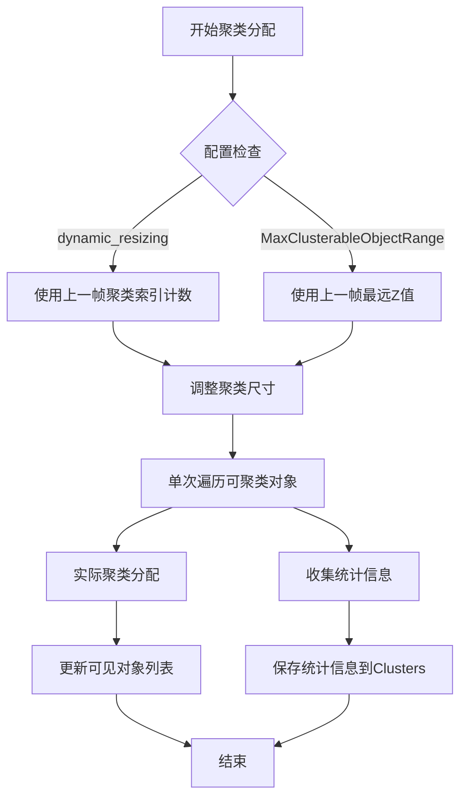

+++
title = "#22874 Make the automatic clustering heuristics use statistics from the previous frame instead of clustering multiple times."
date = "2026-02-17T00:00:00"
draft = false
template = "pull_request_page.html"
in_search_index = false

[extra]
current_language = "zh-cn"
available_languages = {"en" = { name = "English", url = "/pull_request/bevy/2026-02/pr-22874-en-20260217" }, "zh-cn" = { name = "中文", url = "/pull_request/bevy/2026-02/pr-22874-zh-cn-20260217" }}
+++

# 标题：Make the automatic clustering heuristics use statistics from the previous frame instead of clustering multiple times.

## 基本信息
- **标题**: Make the automatic clustering heuristics use statistics from the previous frame instead of clustering multiple times.
- **PR链接**: https://github.com/bevyengine/bevy/pull/22874
- **作者**: pcwalton
- **状态**: 已合并
- **标签**: A-Rendering, C-Performance, S-Ready-For-Review
- **创建时间**: 2026-02-09T08:10:41Z
- **合并时间**: 2026-02-17T17:23:27Z
- **合并者**: alice-i-cecile

## 描述翻译

当前，在将对象分配给聚类（cluster）之前，如果启用了 `dynamic_resizing` 功能，`assign_objects_to_clusters` 会遍历可聚类对象列表处理边界球体（bounding spheres）；如果启用了 `ClusterFarZMode::MaxClusterableObjectRange` 功能，`assign_objects_to_clusters` 会再次遍历可聚类对象列表处理边界球体。这意味着我们每帧可能遍历可聚类对象列表多达3次，这会导致糟糕的缓存行为。更糟糕的是，这意味着我们必须在CPU上处理可聚类对象，即使在我的[branch]中启用了GPU聚类，也会增加显著的CPU开销。实际上，当我们有能力在GPU上生成光照和贴花（decals）而不需要CPU参与时，这种方法将完全失效，因为CPU一开始就不会知道索引计数和Z范围。

这个补丁将 `assign_objects_to_clusters` 改为只遍历列表一次，并在遍历过程中收集相关统计信息。这些统计信息被保存到*下一*帧，用作这些功能的启发式信息。这确实意味着偶尔可能会有单帧的PBR着色效率较低。然而，节省是显著的——`assign_objects_to_clusters` 性能提升了28%——而且启发式信息实际上*更好*，因为它们现在可以使用剔除的*实际*结果，而不是为了速度而依赖保守的边界球体。另请注意，这个补丁永远不会导致*错误*的帧，只可能导致单帧*不那么优化*。


[branch]: https://github.com/pcwalton/bevy/tree/gpu-clustering

## 本次PR的技术分析

### 问题背景与性能瓶颈

在Bevy的渲染系统中，聚簇（clustering）是一种将光照和贴花分配到空间网格中的技术，用于优化着色性能。`assign_objects_to_clusters` 函数负责将可聚类对象（如点光源、聚光灯、反射探针等）分配到三维空间聚类中。

原始实现存在显著的性能问题。当启用 `dynamic_resizing`（动态调整聚类尺寸）功能时，函数需要遍历所有可聚类对象来计算聚类索引的估计值。当启用 `ClusterFarZMode::MaxClusterableObjectRange`（基于对象范围的最大Z值）模式时，函数需要再次遍历所有对象来计算最远的Z值。

这意味着每帧最多需要进行三次完整的对象列表遍历：
1. 计算聚类索引估计（`dynamic_resizing`）
2. 计算最远Z值（`MaxClusterableObjectRange`）
3. 实际的聚类分配

这种设计导致：
- 缓存局部性差，因为相同数据被多次遍历
- 增加了CPU开销，即使在GPU聚类可用时也无法避免
- 无法支持未来在GPU上生成光照和贴花而无需CPU参与的架构

### 解决方案：基于前一帧统计的启发式算法

PR作者采取了一种更高效的方法：在单次遍历中收集统计信息，并将其保存供下一帧使用。这种方法有几个关键优势：

1. **减少遍历次数**：从最多三次减少到一次
2. **更好的缓存行为**：单次连续遍历提高了数据局部性
3. **更准确的启发式信息**：使用实际的聚类分配结果而非保守的边界球体估计
4. **为GPU驱动架构铺平道路**：CPU不再需要知道每帧的确切对象统计数据

### 实现细节与技术考量

#### 数据结构扩展

首先，`Clusters` 结构体增加了两个新字段来保存前一帧的统计信息：

```rust
pub struct Clusters {
    // ... 原有字段
    pub last_frame_farthest_z: Option<f32>,
    pub last_frame_total_cluster_index_count: Option<usize>,
}
```

- `last_frame_farthest_z`：前一帧中任何可聚类对象边界球体的最远Z值，用于 `ClusterFarZMode::MaxClusterableObjectRange`
- `last_frame_total_cluster_index_count`：前一帧所有聚类中包含的对象总数，用于 `dynamic_resizing`

#### 聚类分配流程重构

`assign_objects_to_clusters` 函数的主要变化集中在三个方面：

**1. 最远Z值的计算**

之前：在聚类分配之前，单独遍历所有对象计算最远Z值
```rust
let far_z = match config.far_z_mode() {
    ClusterFarZMode::MaxClusterableObjectRange => {
        let view_from_world_row_2 = view_from_world.row(2);
        clusterable_objects
            .iter()
            .map(|object| {
                -view_from_world_row_2.dot(object.transform.translation().extend(1.0))
                    + object.range * view_from_world_scale.z
            })
            .reduce(f32::max)
            .unwrap_or(0.0)
    }
    ClusterFarZMode::Constant(far) => far,
};
```

之后：直接使用前一帧保存的值
```rust
let far_z = match config.far_z_mode() {
    ClusterFarZMode::MaxClusterableObjectRange => {
        clusters.last_frame_farthest_z.unwrap_or(DEFAULT_FAR_DEPTH)
    }
    ClusterFarZMode::Constant(far) => far,
};
```

**2. 动态聚类尺寸调整**

之前：在聚类分配之前，单独遍历所有对象进行保守估计
```rust
if config.dynamic_resizing() {
    let mut cluster_index_estimate = 0.0;
    for clusterable_object in &clusterable_objects {
        // 复杂的边界球体估计计算
        // ...
        cluster_index_estimate += ...;
    }
    // 基于估计值调整聚类尺寸
}
```

之后：使用前一帧的实际聚类索引计数
```rust
if config.dynamic_resizing()
    && let Some(last_frame_cluster_index_count) = clusters.last_frame_total_cluster_index_count
    && last_frame_cluster_index_count > global_cluster_settings.view_cluster_bindings_max_indices
{
    // 基于前一帧的实际值调整聚类尺寸
    let index_ratio = global_cluster_settings.view_cluster_bindings_max_indices as f32
        / last_frame_cluster_index_count as f32;
    let xy_ratio = index_ratio.sqrt();
    // 调整聚类尺寸
}
```

**3. 统计信息收集**

在单次遍历中同时进行实际聚类分配和统计信息收集：

```rust
let (mut total_cluster_index_count, mut farthest_z) = (0, 0.0f32);
let view_from_world_row_2 = view_from_world.row(2);

// 遍历可聚类对象
for clusterable_object in &clusterable_objects {
    // 收集最远Z值
    let this_object_far_z = -view_from_world_row_2
        .dot(clusterable_object.transform.translation().extend(1.0))
        + clusterable_object.range * view_from_world_scale.z;
    farthest_z = farthest_z.max(this_object_far_z);
    
    // 进行实际聚类分配
    // ...
    
    // 根据对象类型累加聚类索引计数
    match clusterable_object.object_type {
        ClusterableObjectType::SpotLight => {
            // ... 聚光灯分配逻辑
            total_cluster_index_count += 1;
        }
        ClusterableObjectType::PointLight => {
            // ... 点光源分配逻辑
            total_cluster_index_count += (max_x - min_x + 1) as usize;
        }
        // 其他对象类型...
    }
}

// 保存统计信息供下一帧使用
clusters.last_frame_total_cluster_index_count = Some(total_cluster_index_count);
clusters.last_frame_farthest_z = Some(farthest_z);
```

### 技术权衡与设计决策

**延迟一帧的启发式信息**：这是本方案的核心权衡。使用前一帧的统计数据意味着当场景发生剧烈变化时，聚类配置可能会有一帧的延迟调整。然而，这种延迟通常是可以接受的，因为：
- 场景的剧烈变化在连续帧中不常见
- 即使聚类配置不是最优的，渲染结果仍然是正确的
- 性能损失通常仅限于单帧

**第一帧的处理**：对于没有前一帧数据的情况，`MaxClusterableObjectRange` 模式使用默认值 `DEFAULT_FAR_DEPTH`（1000.0），而 `dynamic_resizing` 在首帧不进行任何调整。

**统计信息的准确性**：使用实际聚类分配结果作为启发式信息比保守的边界球体估计更准确。边界球体通常是保守的（即可能比实际对象大），而实际聚类分配考虑了对象的实际影响范围。

### 性能影响与优化效果

作者报告了28%的 `assign_objects_to_clusters` 性能提升，这主要来自：
1. **减少内存访问**：单次遍历减少了CPU缓存未命中的可能性
2. **消除重复计算**：不再计算保守的边界球体估计
3. **简化算法**：动态聚类尺寸调整的逻辑大大简化

### 未来兼容性

这个改动为未来的GPU驱动架构铺平了道路。当光照和贴花可以在GPU上生成而无需CPU参与时，CPU将不再能够访问每帧的对象统计数据。使用前一帧的统计数据允许CPU基于历史信息进行启发式决策，而无需实时访问GPU生成的数据。

## 视觉表示



## 关键文件变更

### 1. `crates/bevy_light/src/cluster/assign.rs`

**变更概述**：重构了 `assign_objects_to_clusters` 函数，将多次遍历合并为单次遍历，并添加统计信息收集机制。

**关键代码片段**：

```rust
// 添加默认最远深度常量
const DEFAULT_FAR_DEPTH: f32 = 1000.0;

// 最远Z值计算的变化
let far_z = match config.far_z_mode() {
    ClusterFarZMode::MaxClusterableObjectRange => {
        // 之前: 遍历所有对象计算最远Z值
        // 之后: 使用上一帧保存的值
        clusters.last_frame_farthest_z.unwrap_or(DEFAULT_FAR_DEPTH)
    }
    ClusterFarZMode::Constant(far) => far,
};

// 动态聚类尺寸调整的变化
if config.dynamic_resizing()
    && let Some(last_frame_cluster_index_count) = clusters.last_frame_total_cluster_index_count
    && last_frame_cluster_index_count > global_cluster_settings.view_cluster_bindings_max_indices
{
    // 使用上一帧的实际聚类索引计数进行调整
    let index_ratio = global_cluster_settings.view_cluster_bindings_max_indices as f32
        / last_frame_cluster_index_count as f32;
    let xy_ratio = index_ratio.sqrt();
    // ... 调整聚类尺寸
}

// 在聚类分配过程中收集统计信息
let (mut total_cluster_index_count, mut farthest_z) = (0, 0.0f32);
let view_from_world_row_2 = view_from_world.row(2);

// 在遍历中收集统计信息
let this_object_far_z = -view_from_world_row_2
    .dot(clusterable_object.transform.translation().extend(1.0))
    + clusterable_object.range * view_from_world_scale.z;
farthest_z = farthest_z.max(this_object_far_z);

// 根据对象类型累加索引计数
total_cluster_index_count += (max_x - min_x + 1) as usize;

// 保存统计信息
clusters.last_frame_total_cluster_index_count = Some(total_cluster_index_count);
clusters.last_frame_farthest_z = Some(farthest_z);
```

### 2. `crates/bevy_light/src/cluster/mod.rs`

**变更概述**：扩展了 `Clusters` 结构体以保存前一帧的统计信息，并更新了相关文档。

**关键代码片段**：

```rust
pub struct Clusters {
    // ... 原有字段
    pub last_frame_farthest_z: Option<f32>,
    pub last_frame_total_cluster_index_count: Option<usize>,
}

// 更新了 ClusterFarZMode 的文档
pub enum ClusterFarZMode {
    /// 基于上一帧可见的可聚类对象计算所需的最大Z深度
    MaxClusterableObjectRange,
    /// 恒定最大Z深度
    Constant(f32),
}
```

## 进一步阅读

1. **Bevy聚类系统文档**：了解Bevy中聚类渲染的基本原理
2. **GPU驱动渲染架构**：探索GPU生成光照和贴花的现代渲染技术
3. **缓存友好的算法设计**：学习如何设计利用CPU缓存局部性的高效算法
4. **帧间数据持久化模式**：研究在实时渲染中如何有效利用历史帧数据

这个PR展示了在性能优化中常见的权衡：用单帧的潜在性能损失换取整体性能的显著提升，同时为未来的架构演进做好准备。