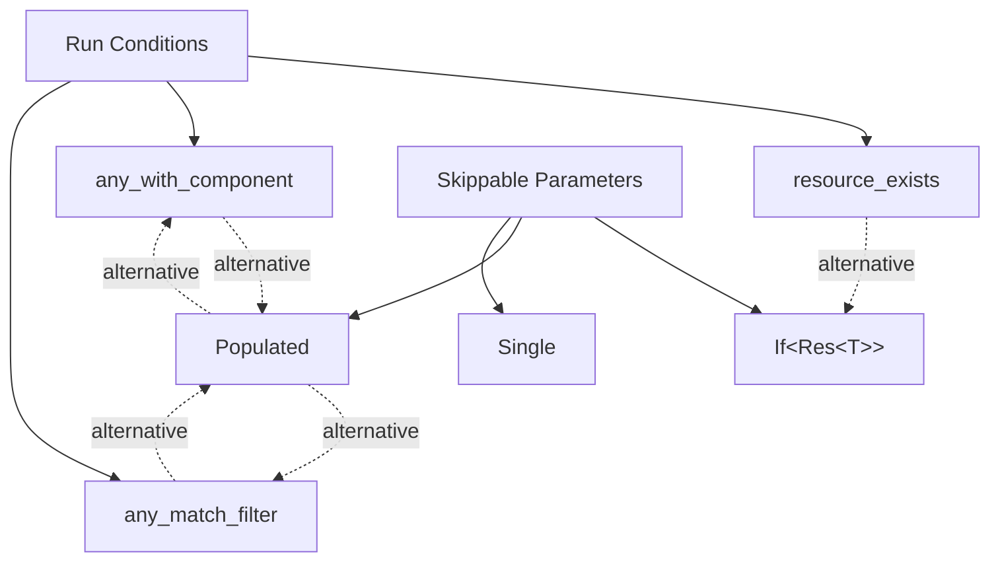

+++
title = "#22878 Add documentation links between common run conditions and skippable parameters"
date = "2026-02-12T00:00:00"
draft = false
template = "pull_request_page.html"
in_search_index = true

[taxonomies]
list_display = ["show"]

[extra]
current_language = "en"
available_languages = {"en" = { name = "English", url = "/pull_request/bevy/2026-02/pr-22878-en-20260212" }, "zh-cn" = { name = "中文", url = "/pull_request/bevy/2026-02/pr-22878-zh-cn-20260212" }}
labels = ["C-Docs", "D-Trivial", "A-ECS"]
+++

# Title
Add documentation links between common run conditions and skippable parameters

## Basic Information
- **Title**: Add documentation links between common run conditions and skippable parameters
- **PR Link**: https://github.com/bevyengine/bevy/pull/22878
- **Author**: chescock
- **Status**: MERGED
- **Labels**: C-Docs, D-Trivial, A-ECS, S-Ready-For-Final-Review
- **Created**: 2026-02-09T15:43:17Z
- **Merged**: 2026-02-12T19:50:12Z
- **Merged By**: alice-i-cecile

## Description Translation
The PR description is already in English, so no translation is needed:

# Objective

Better documentation.  

Run conditions and skippable system parameters are both ways to skip running a system in some circumstances, and there is some overlap between the features.  Add some documentation links between features that do similar things.  

## Solution

Mention `If<Res<R>>` from the `resource_exists` common run condition.  

Mention `Populated` from the `any_match_filter` and `any_with_component` common run conditions, and vice versa, and add links between the two run conditions.  

## The Story of This Pull Request

This PR addresses a documentation gap in Bevy's ECS system by adding cross-references between two related but distinct features: run conditions and skippable system parameters. Both mechanisms allow skipping system execution under certain conditions, but they're implemented differently and weren't clearly connected in the documentation.

The problem was that developers might not realize these features are alternatives for similar use cases. For example, when checking if a resource exists, you could either use the `resource_exists` run condition or wrap your resource parameter with `If<Res<T>>`. Without clear documentation linking these approaches, developers might not discover the alternative that better fits their specific needs or coding style.

The solution approach was straightforward: add documentation comments that explicitly mention the alternative approaches. This required modifying documentation strings in two key files without changing any functional code. The implementation is minimal and focused - just adding clarifying text with proper cross-references between modules.

From a technical perspective, this PR highlights an important design pattern in Bevy's ECS: the separation between conditional execution logic (run conditions) and conditional parameter access (skippable parameters). Run conditions are evaluated before system execution and can prevent the system from running entirely. Skippable parameters, on the other hand, allow systems to run but conditionally provide or skip certain parameters based on runtime conditions. Both approaches have their place: run conditions are better when you want to skip all of a system's work, while skippable parameters are useful when you want to conditionally process certain data within a system that still needs to run.

The impact of these changes is purely educational but valuable. By explicitly documenting the relationships between these features, developers can make more informed architectural decisions. They can choose between run conditions and skippable parameters based on their specific needs rather than potentially missing one approach entirely. This improves the discoverability of Bevy's features and helps developers write more efficient and maintainable code.

One technical insight worth noting is how Bevy's documentation uses Rust's doc comment system to create these cross-references. The `[`crate::prelude::If`]` syntax creates proper intra-doc links that will work in the generated documentation, making these connections immediately accessible to developers reading the API docs.

## Visual Representation



## Key Files Changed

1. **crates/bevy_ecs/src/schedule/condition.rs** (+15/-0)
   
   This file contains Bevy's common run conditions. The changes add documentation that links these run conditions to their corresponding skippable parameter alternatives.

   Key modifications:
   - Added documentation to `resource_exists` mentioning `If<Res<T>>` and `If<ResMut<T>>` as alternatives
   - Added documentation to `any_with_component` mentioning its equivalence to `any_match_filter::<With<T>>()` and `Populated`/`Single` as alternatives
   - Added documentation to `any_match_filter` mentioning its equivalence to `any_with_component` for simple `With<T>` filters and `Populated`/`Single` as alternatives

   Code snippets showing the added documentation:
   ```rust
   // In the resource_exists function documentation:
   /// To skip a system with a [`Res`] or [`ResMut`](crate::prelude::ResMut) parameter if the resource does not exist,
   /// you may instead wrap the parameter in [`If`](crate::prelude::If), like `If<Res<T>>` or `If<ResMut<T>>`.
   
   // In the any_with_component function documentation:
   /// This is equivalent to [`any_match_filter::<With<T>>()`]
   ///
   /// To skip a system with a [`Query`] parameter if the query is empty,
   /// you may instead use [`Populated`](crate::prelude::Populated), if the query may match multiple entities,
   /// or [`Single`](crate::prelude::Single), if it will only match one.
   
   // In the any_match_filter function documentation:
   /// For a simple `With<T>` filter, this is equivalent to [`any_with_component::<T>()`].
   ///
   /// To skip a system with a [`Query`] parameter if the query is empty,
   /// you may instead use [`Populated`](crate::prelude::Populated), if the query may match multiple entities,
   /// or [`Single`](crate::prelude::Single), if it will only match one.
   ```

2. **crates/bevy_ecs/src/system/query.rs** (+3/-0)

   This file contains the `Populated` skippable parameter. The change adds documentation mentioning the run condition alternatives.

   Code snippet showing the added documentation:
   ```rust
   // In the Populated struct documentation:
   /// If the system doesn't need to perform the query but should still be skipped if it is empty,
   /// you may use the [`any_with_component`](crate::schedule::common_conditions::any_with_component) or [`any_match_filter`](crate::schedule::common_conditions::any_match_filter) run conditions.
   ```

## Further Reading

- [Bevy ECS System Conditions Documentation](https://docs.rs/bevy_ecs/latest/bevy_ecs/schedule/condition/index.html) - Official documentation for Bevy's system conditions
- [Bevy Skippable System Parameters](https://docs.rs/bevy_ecs/latest/bevy_ecs/system/trait.SystemParam.html) - Documentation for system parameters including skippable variants
- [Rust Documentation Comments](https://doc.rust-lang.org/rustdoc/how-to-write-documentation.html) - Guide to writing effective documentation in Rust
- [Bevy Cheatbook: Conditions](https://bevy-cheatbook.github.io/programming/conditions.html) - Practical guide to using conditions in Bevy

## Full Code Diff
```
diff --git a/crates/bevy_ecs/src/schedule/condition.rs b/crates/bevy_ecs/src/schedule/condition.rs
index 1bb39c529f944..dde82d6551024 100644
--- a/crates/bevy_ecs/src/schedule/condition.rs
+++ b/crates/bevy_ecs/src/schedule/condition.rs
@@ -432,6 +432,9 @@ pub mod common_conditions {
     /// A [`SystemCondition`]-satisfying system that returns `true`
     /// if the resource exists.
     ///
+    /// To skip a system with a [`Res`] or [`ResMut`](crate::prelude::ResMut) parameter if the resource does not exist,
+    /// you may instead wrap the parameter in [`If`](crate::prelude::If), like `If<Res<T>>` or `If<ResMut<T>>`.
+    ///
     /// # Example
     ///
     /// ```
@@ -874,6 +877,12 @@ pub mod common_conditions {
     /// A [`SystemCondition`]-satisfying system that returns `true`
     /// if there are any entities with the given component type.
     ///
+    /// This is equivalent to [`any_match_filter::<With<T>>()`]
+    ///
+    /// To skip a system with a [`Query`] parameter if the query is empty,
+    /// you may instead use [`Populated`](crate::prelude::Populated), if the query may match multiple entities,
+    /// or [`Single`](crate::prelude::Single), if it will only match one.
+    ///
     /// # Example
     ///
     /// ```
@@ -921,6 +930,12 @@ pub mod common_conditions {
 
     /// A [`SystemCondition`]-satisfying system that returns `true`
     /// if there are any entities that match the given [`QueryFilter`].
+    ///
+    /// For a simple `With<T>` filter, this is equivalent to [`any_with_component::<T>()`].
+    ///
+    /// To skip a system with a [`Query`] parameter if the query is empty,
+    /// you may instead use [`Populated`](crate::prelude::Populated), if the query may match multiple entities,
+    /// or [`Single`](crate::prelude::Single), if it will only match one.
     pub fn any_match_filter<F: QueryFilter>(query: Query<(), F>) -> bool {
         !query.is_empty()
     }
diff --git a/crates/bevy_ecs/src/system/query.rs b/crates/bevy_ecs/src/system/query.rs
index c6293ede5c0b1..83b6b38240644 100644
--- a/crates/bevy_ecs/src/system/query.rs
+++ b/crates/bevy_ecs/src/system/query.rs
@@ -2786,6 +2786,9 @@ impl<'w, 's, D: QueryData, F: QueryFilter> Single<'w, 's, D, F> {
 ///
 /// See [`Query`] for more details.
 ///
+/// If the system doesn't need to perform the query but should still be skipped if it is empty,
+/// you may use the [`any_with_component`](crate::schedule::common_conditions::any_with_component) or [`any_match_filter`](crate::schedule::common_conditions::any_match_filter) run conditions.
+///
 /// [System parameter]: crate::system::SystemParam
 pub struct Populated<'w, 's, D: QueryData, F: QueryFilter = ()>(pub(crate) Query<'w, 's, D, F>);
```