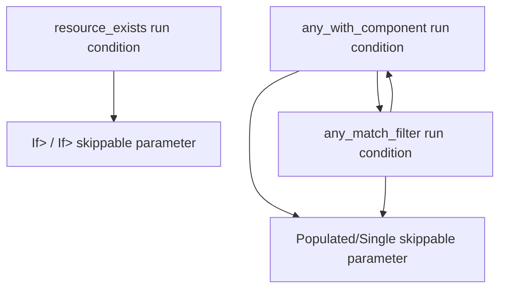

+++
title = "#22878 Add documentation links between common run conditions and skippable parameters"
date = "2026-02-12T00:00:00"
draft = false
template = "pull_request_page.html"
in_search_index = false

[extra]
current_language = "zh-cn"
available_languages = {"en" = { name = "English", url = "/pull_request/bevy/2026-02/pr-22878-en-20260212" }, "zh-cn" = { name = "中文", url = "/pull_request/bevy/2026-02/pr-22878-zh-cn-20260212" }}
labels = ["C-Docs", "D-Trivial", "A-ECS"]
+++

# Title

## Basic Information
- **Title**: Add documentation links between common run conditions and skippable parameters
- **PR Link**: https://github.com/bevyengine/bevy/pull/22878
- **Author**: chescock
- **Status**: MERGED
- **Labels**: C-Docs, D-Trivial, A-ECS, S-Ready-For-Final-Review
- **Created**: 2026-02-09T15:43:17Z
- **Merged**: 2026-02-12T19:50:12Z
- **Merged By**: alice-i-cecile

## Description Translation
**目标**

更好的文档。

运行条件（run conditions）和可跳过系统参数（skippable system parameters）都是在某些情况下跳过系统运行的两种方式，这两个功能之间有一些重叠。在实现相似功能的部分之间添加一些文档链接。

**解决方案**

在 `resource_exists` 公共运行条件中提到 `If<Res<R>>`。

在 `any_match_filter` 和 `any_with_component` 公共运行条件中提到 `Populated`，反之亦然，并在两个运行条件之间添加链接。

## The Story of This Pull Request

这个PR处理了一个文档清晰度问题。在Bevy的ECS（实体组件系统）中，开发者有多种方法可以控制系统的执行：可以使用运行条件（在系统调度期间评估的条件），也可以使用可跳过系统参数（包装查询或资源的特殊参数类型，当它们为空或不存时跳过系统）。这两种方法功能相似，但文档中之前没有明确说明它们之间的关系，这可能导致开发者不知道有替代方案或不清楚何时选择哪种方法。

PR作者意识到，`resource_exists` 运行条件与使用 `If<Res<T>>` 或 `If<ResMut<T>>` 包装资源参数在功能上是等效的。同样，`any_with_component` 和 `any_match_filter` 运行条件与在查询参数上使用 `Populated` 包装器（或对于单实体查询使用 `Single`）有重叠的功能。当前的文档中这些信息是缺失的，开发者需要自己发现这些等价关系。

解决方案直接明了：在相关函数的文档注释中添加交叉引用。这种方法不需要修改任何实际代码，只增加文档字符串，因此风险极低，但能显著改善开发者体验。这是一个典型的文档改进PR，旨在帮助开发者更有效地使用现有API。

具体来说，在 `resource_exists` 的文档中，添加了一个说明，指出如果只是想在有资源时才运行系统，也可以使用 `If<Res<T>>` 或 `If<ResMut<T>>` 来包装参数。这样，开发者就知道他们有两种选择：使用单独的运行条件，或者使用可跳过的参数。选择哪种方式可能取决于代码组织偏好或具体使用场景。

对于查询相关的条件，情况类似。`any_with_component` 和 `any_match_filter` 运行条件都检查查询是否非空。但有时，系统本身就需要执行查询，在这种情况下，使用 `Populated` 或 `Single` 包装查询参数更合适，因为它既提供了查询功能，又内置了空检查。文档现在明确指出这两者之间的关系，并说明何时可能选择其中一种。

从技术角度看，这些更改都遵循Rust的文档注释标准，使用Markdown格式和内部链接（`[link](...)`）。这些链接使用了 `crate::prelude::...` 路径，这是典型的做法，因为 `prelude` 模块通常重新导入了常用的类型。

这些文档改进虽然简单，但通过显式连接功能上等效但语法不同的API，降低了学习曲线的陡峭度。对于刚接触Bevy ECS的开发者来说，发现这些模式可能需要时间，而现在文档直接指出了它们。

## Visual Representation



## Key Files Changed

### `crates/bevy_ecs/src/schedule/condition.rs` (+15/-0)

这个文件包含了Bevy ECS的公共运行条件定义。修改为三个函数的文档添加了交叉引用。

1. **在 `resource_exists` 函数文档中添加了到 `If` 包装器的链接**：
```rust
/// To skip a system with a [`Res`] or [`ResMut`](crate::prelude::ResMut) parameter if the resource does not exist,
/// you may instead wrap the parameter in [`If`](crate::prelude::If), like `If<Res<T>>` or `If<ResMut<T>>`.
```

2. **在 `any_with_component` 函数文档中添加了到 `any_match_filter` 和 `Populated`/`Single` 的链接**：
```rust
/// This is equivalent to [`any_match_filter::<With<T>>()`]
///
/// To skip a system with a [`Query`] parameter if the query is empty,
/// you may instead use [`Populated`](crate::prelude::Populated), if the query may match multiple entities,
/// or [`Single`](crate::prelude::Single), if it will only match one.
```

3. **在 `any_match_filter` 函数文档中添加了到 `any_with_component` 和 `Populated`/`Single` 的链接**：
```rust
/// For a simple `With<T>` filter, this is equivalent to [`any_with_component::<T>()`].
///
/// To skip a system with a [`Query`] parameter if the query is empty,
/// you may instead use [`Populated`](crate::prelude::Populated), if the query may match multiple entities,
/// or [`Single`](crate::prelude::Single), if it will only match one.
```

### `crates/bevy_ecs/src/system/query.rs` (+3/-0)

这个文件定义了查询相关的系统参数，包括 `Populated` 包装器。

**在 `Populated` 结构体的文档中添加了到运行条件的反向链接**：
```rust
/// If the system doesn't need to perform the query but should still be skipped if it is empty,
/// you may use the [`any_with_component`](crate::schedule::common_conditions::any_with_component) or [`any_match_filter`](crate::schedule::common_conditions::any_match_filter) run conditions.
```

这个更改完成了双向文档链接：运行条件文档指向可跳过参数，可跳过参数文档也指回运行条件。

## Further Reading

- [Bevy ECS System Conditions Documentation](https://docs.rs/bevy_ecs/latest/bevy_ecs/schedule/common_conditions/index.html) - Bevy官方文档中关于公共运行条件的部分
- [Bevy Cheatbook - Conditions](https://bevy-cheatbook.github.io/programming/conditions.html) - 社区维护的Bevy指南，详细介绍了运行条件的使用
- [Rust Documentation Guidelines](https://rust-lang.github.io/rfcs/1574-more-api-documentation-conventions.html) - Rust API文档编写的最佳实践，包括如何编写有效的文档注释
- [Bevy官方的ECS指南](https://github.com/bevyengine/bevy/blob/main/examples/ecs/README.md) - 官方示例，展示了各种ECS模式的实际应用