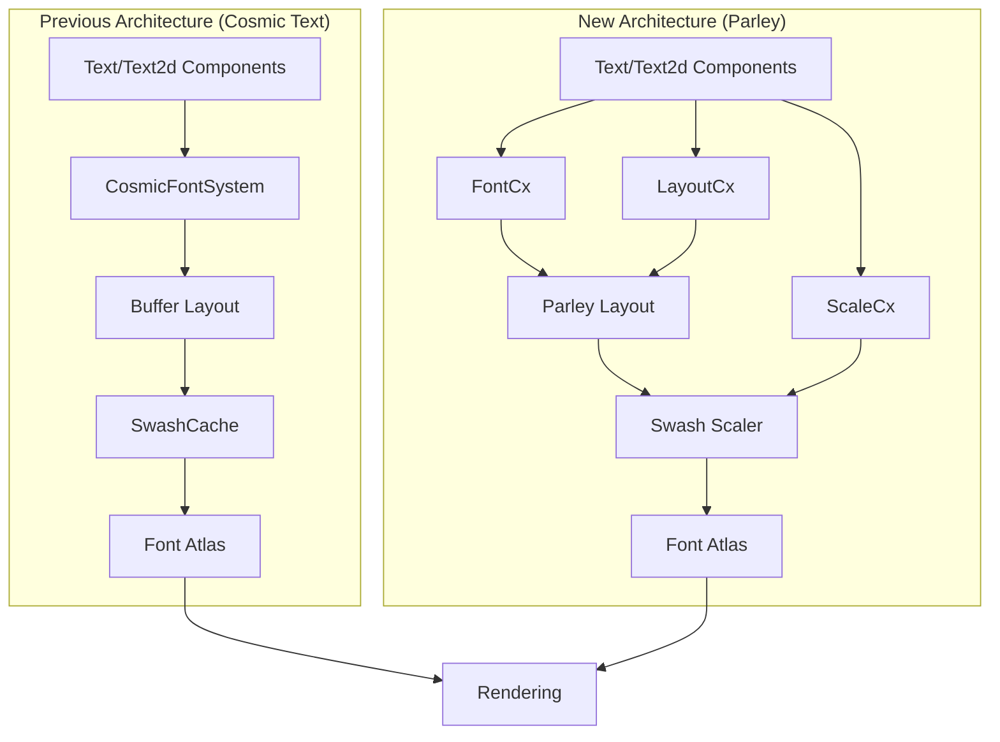

+++
title = "#22879 `bevy_text` parley migration"
date = "2026-02-11T00:00:00"
draft = false
template = "pull_request_page.html"
in_search_index = true

[taxonomies]
list_display = ["show"]

[extra]
current_language = "en"
available_languages = {"en" = { name = "English", url = "/pull_request/bevy/2026-02/pr-22879-en-20260211" }, "zh-cn" = { name = "中文", url = "/pull_request/bevy/2026-02/pr-22879-zh-cn-20260211" }}
labels = ["C-Feature", "C-Dependencies", "D-Complex", "A-Text", "X-Blessed", "M-Deliberate-Rendering-Change"]
+++

# Title

## Basic Information
- **Title**: `bevy_text` parley migration
- **PR Link**: https://github.com/bevyengine/bevy/pull/22879
- **Author**: ickshonpe
- **Status**: MERGED
- **Labels**: C-Feature, C-Dependencies, S-Ready-For-Final-Review, D-Complex, A-Text, X-Blessed, M-Deliberate-Rendering-Change
- **Created**: 2026-02-09T20:18:12Z
- **Merged**: 2026-02-11T06:25:13Z
- **Merged By**: alice-i-cecile

## Description Translation
**Objective**

Migrate `bevy_text` from Cosmic Text to Parley.

Closes #21940. Fixes #21767, fixes #21768. Part of #21676.

**Solution**

I came down with the flu yesterday when I was about halfway done. I managed to work through it and drag this to a sort of finished state anyway but there's probably some weird decisions because I haven't been entirely coherent.

Most of the significant changes are to the pipeline module. There is also a new `parley_context` module.
`FontAtlasKey` has a bunch of new fields, I can't remember why there's both an `id` and a `index` now.

**Testing**

Weird bug in `testbed_2d`:


Most other things seem to work the same as main, ymmv.

**Showcase**

`testbed_2d`'s text scene on main with Cosmic Text:


`testbed_2d`'s text scene on this PR with Parley:


`testbed_ui`'s text scene on main with Cosmic Text:


`testbed_ui`'s text scene on this PR with Parley:


## The Story of This Pull Request

This pull request implements a major architectural change to Bevy's text rendering system by migrating from Cosmic Text to Parley. The migration addresses several issues with the previous implementation while modernizing the text layout engine.

The core problem was that Cosmic Text had limitations in terms of API flexibility, performance characteristics, and maintenance burden. The migration to Parley provides better font fallback handling, more flexible text styling options, and a cleaner API integration with Bevy's existing systems.

The implementation approach involved replacing the entire text pipeline infrastructure. Instead of using Cosmic Text's `FontSystem` and `Buffer` types, the new implementation uses Parley's three-context architecture: `FontContext` for font management, `LayoutContext` for text layout, and `ScaleContext` for glyph scaling. This separation of concerns allows for more modular and maintainable code.

One of the key technical decisions was to create new wrapper types (`FontCx`, `LayoutCx`, `ScaleCx`) that encapsulate Parley's contexts while integrating with Bevy's ECS system. These resources replace the previous `CosmicFontSystem` and `SwashCache` resources. The migration also required significant changes to how fonts are loaded and managed, moving from Cosmic Text's font database to Parley's font collection system.

The glyph rasterization process was rewritten to use Swash directly through Parley's APIs rather than through Cosmic Text's intermediary layer. This change provides more control over the rasterization process and eliminates some of the complexity in the previous implementation.

The font atlas system was updated to work with Parley's font identification scheme. `FontAtlasKey` now includes additional fields (`id`, `index`, `variations_hash`, `hinting`) to uniquely identify font instances with their specific variations and rendering settings.

From a performance perspective, the migration introduces some changes to the caching strategy. The shape run cache from Cosmic Text is replaced with Parley's source cache, which is pruned every few frames to manage memory usage while maintaining performance for dynamic text.

The impact of these changes is significant but largely transparent to users of the high-level text APIs. The visual comparisons show that text rendering remains consistent, with minor differences in layout and glyph positioning due to the different layout algorithms used by Parley versus Cosmic Text.

## Visual Representation



## Key Files Changed

### 1. `crates/bevy_text/src/pipeline.rs` (+269/-380)
This file underwent the most significant changes, replacing Cosmic Text's text layout pipeline with Parley's.

**Key modifications:**
- Replaced `CosmicFontSystem` and `SwashCache` with `FontCx`, `LayoutCx`, and `ScaleCx`
- Rewrote `update_buffer` to use Parley's `LayoutContext` for text layout
- Updated `update_text_layout_info` to process Parley's layout results

**Code example:**
```rust
// Before (Cosmic Text):
let cosmic_buffer = &mut computed.buffer;
cosmic_buffer.set_rich_text(
    font_system,
    sections.drain(..),
    &Attrs::new(),
    Shaping::Advanced,
    Some(justify.into()),
);

// After (Parley):
let layout = &mut computed.layout;
let mut builder = layout_cx
    .0
    .ranged_builder(&mut font_system.0, text, scale_factor, true);
builder.build_into(layout, text);
```

### 2. `crates/bevy_text/src/text.rs` (+123/-120)
Updated text components and styling to work with Parley.

**Key modifications:**
- Replaced `CosmicBuffer` with Parley's `Layout<(u32, FontSmoothing)>`
- Extended `Justify` enum with `Start` and `End` for bidirectional text support
- Updated `FontStyle::Oblique` to optionally accept an angle parameter

**Code example:**
```rust
// Before:
pub struct ComputedTextBlock {
    pub(crate) buffer: CosmicBuffer,
    // ...
}

// After:
pub struct ComputedTextBlock {
    pub(crate) layout: Layout<(u32, FontSmoothing)>,
    // ...
}
```

### 3. `crates/bevy_text/src/parley_context.rs` (+138/-0)
New module providing Parley context wrappers for Bevy's ECS.

**Key components:**
- `FontCx`: Wraps `parley::FontContext` for font management
- `LayoutCx`: Wraps `parley::LayoutContext` for text layout
- `ScaleCx`: Wraps `swash::scale::ScaleContext` for glyph scaling

**Code example:**
```rust
#[derive(Resource, Default, Deref, DerefMut)]
pub struct FontCx(pub FontContext);

impl FontCx {
    pub fn get_family<'a>(&'a mut self, source: &'a FontSource) -> Option<&'a str> {
        // Resolve font source to family name
    }
}
```

### 4. `crates/bevy_text/src/font_atlas.rs` (+61/-60)
Updated font atlas management for Parley integration.

**Key modifications:**
- Changed glyph cache key from `cosmic_text::CacheKey` to custom `GlyphCacheKey`
- Updated `get_outlined_glyph_texture` to use Swash directly via Parley
- Modified font atlas key to include additional font variation data

**Code example:**
```rust
// Before:
let image = swash_cache
    .get_image_uncached(font_system, physical_glyph.cache_key)
    .ok_or(TextError::FailedToGetGlyphImage(physical_glyph.cache_key))?;

// After:
let image = swash::scale::Render::new(&[
    swash::scale::Source::ColorOutline(0),
    swash::scale::Source::ColorBitmap(swash::scale::StrikeWith::BestFit),
    swash::scale::Source::Outline,
])
.format(swash::zeno::Format::Alpha)
.render(scaler, glyph_id)
.ok_or(TextError::FailedToGetGlyphImage(glyph_id))?;
```

### 5. `crates/bevy_text/src/font.rs` (+24/-40)
Updated font asset handling for Parley compatibility.

**Key modifications:**
- Changed `Font` struct to use Parley's `Blob<u8>` for font data
- Updated font loading system to register fonts with Parley's collection
- Removed Cosmic Text-specific font ID tracking

**Code example:**
```rust
// Before:
pub struct Font {
    pub data: Arc<Vec<u8>>,
    pub ids: SmallVec<[ID; 8]>,
    pub family_name: SmolStr,
}

// After:
pub struct Font {
    pub data: Blob<u8>,
    pub family_name: SmolStr,
}
```

## Further Reading

- [Parley Documentation](https://docs.rs/parley/latest/parley/) - The text layout library used in this migration
- [Swash Documentation](https://docs.rs/swash/latest/swash/) - Font rendering library used by Parley
- [Bevy Text Migration Guide](release-content/migration-guides/bevy_text_now_uses_parley.md) - Guide for migrating from Cosmic Text to Parley
- [Issue #21676](https://github.com/bevyengine/bevy/issues/21676) - Epic tracking text system improvements
- [Issue #21940](https://github.com/bevyengine/bevy/issues/21940) - Main issue for migrating to Parley

## Full Code Diff

See the original PR for the complete diff: https://github.com/bevyengine/bevy/pull/22879