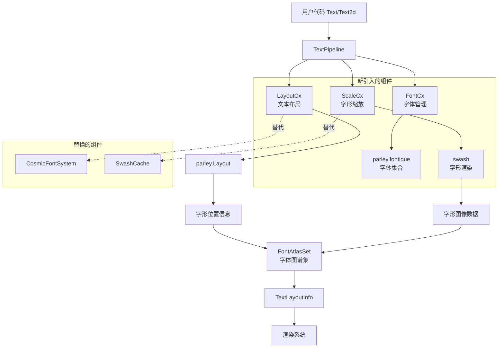

+++
title = "#22879 bevy_text` parley migration"
date = "2026-02-11T00:00:00"
draft = false
template = "pull_request_page.html"
in_search_index = false

[extra]
current_language = "zh-cn"
available_languages = {"en" = { name = "English", url = "/pull_request/bevy/2026-02/pr-22879-en-20260211" }, "zh-cn" = { name = "中文", url = "/pull_request/bevy/2026-02/pr-22879-zh-cn-20260211" }}
+++

# Title

## 基本信息
- **标题**: `bevy_text` parley migration
- **PR链接**: https://github.com/bevyengine/bevy/pull/22879
- **作者**: ickshonpe
- **状态**: 已合并
- **标签**: C-Feature, C-Dependencies, S-Ready-For-Final-Review, D-Complex, A-Text, X-Blessed, M-Deliberate-Rendering-Change
- **创建时间**: 2026-02-09T20:18:12Z
- **合并时间**: 2026-02-11T06:25:13Z
- **合并人**: alice-i-cecile

## 描述翻译
将PR描述翻译为目标语言，保留：
- 英文技术术语
- 所有图片引用和链接完全按原样保留
- 代码块和格式

**目标**：

将 `bevy_text` 从 Cosmic Text 迁移到 Parley。

关闭 #21940。修复 #21767，修复 #21768。属于 #21676 的一部分。

**解决方案**：

我昨天在完成大约一半时得了流感。尽管如此，我还是设法坚持完成了这项工作，并把它推到了一个基本完成的状态，但由于我头脑不太清醒，可能做出了一些奇怪的决定。

大部分重要的改动都在 pipeline 模块中。此外还新增了一个 `parley_context` 模块。
`FontAtlasKey` 现在有许多新字段，我记不清为什么现在既有 `id` 又有 `index` 了。

**测试**：

`testbed_2d` 中有一个奇怪的bug：


大多数其他功能看起来和主分支一样，因人而异。

**展示**：

主分支使用 Cosmic Text 的 `testbed_2d` 文本场景：


本PR使用 Parley 的 `testbed_2d` 文本场景：


主分支使用 Cosmic Text 的 `testbed_ui` 文本场景：


本PR使用 Parley 的 `testbed_ui` 文本场景：


## 本PR的故事

### 问题与背景

这个PR的核心任务是迁移 Bevy 引擎的文本渲染系统。在迁移之前，Bevy 使用 Cosmic Text 库处理文本布局和渲染。然而，Cosmic Text 存在几个问题：它不支持某些文本渲染功能（如亚像素抗锯齿），并且其 API 设计在某些方面与 Bevy 的架构不完全匹配。

具体来说，开发者在 Issue #21940 中计划迁移到 Parley，这是一个更现代、功能更完整的文本布局引擎。同时，迁移也能解决 #21767 和 #21768 中报告的问题。这个迁移是更大规模文本系统重构的一部分（#21676）。

迁移的主要技术挑战包括：
1. Cosmic Text 和 Parley 的 API 差异很大，需要重写大部分文本处理逻辑
2. 字体管理、文本布局和字形（glyph）渲染都需要适配新库
3. 需要确保向后兼容性，不影响现有项目的文本渲染

### 解决方案方法

开发者选择了 Parley 作为新的文本布局引擎，主要是因为 Parley 提供了更完整的文本布局功能，并且其架构更符合 Bevy 的 ECS（实体组件系统）设计模式。Parley 通过其 `fontique` 子库提供了字体管理功能，通过 `swash` 库处理字形渲染。

迁移策略包括：
1. 用 Parley 的 `LayoutContext` 和 `FontContext` 替换 Cosmic Text 的 `FontSystem` 和 `Buffer`
2. 用 `swash` 替换 Cosmic Text 的 `SwashCache` 进行字形渲染
3. 重新设计字体图谱（font atlas）管理系统以适应新的字形缓存键
4. 保持高层 API（如 `Text`、`Text2d` 组件）基本不变，减少用户迁移成本

### 实现细节

迁移主要集中在 `bevy_text` crate 的几个关键文件：

**1. 新的上下文管理 (`parley_context.rs`)**
新增了三个资源来管理文本处理的各个阶段：
```rust
#[derive(Resource, Default, Deref, DerefMut)]
pub struct FontCx(pub FontContext);

#[derive(Resource, Default, Deref, DerefMut)]
pub struct LayoutCx(pub LayoutContext<(u32, FontSmoothing)>);

#[derive(Resource, Default, Deref, DerefMut)]
pub struct ScaleCx(pub ScaleContext);
```
这三个资源分别处理字体管理、文本布局和字形缩放，替代了原来的 `CosmicFontSystem` 和 `SwashCache`。

**2. 文本管道重构 (`pipeline.rs`)**
文本处理管道的核心逻辑完全重写。之前使用 `cosmic_text::Buffer`：
```rust
// 之前：使用 Cosmic Text Buffer
let cosmic_buffer = &mut computed.buffer;
cosmic_buffer.set_rich_text(...);
```
现在使用 Parley 的布局器：
```rust
// 现在：使用 Parley Layout
let layout = &mut computed.layout;
let mut builder = layout_cx
    .0
    .ranged_builder(&mut font_system.0, text, scale_factor, true);
builder.build_into(layout, text);
```

字形处理也从基于 Cosmic Text 的 `LayoutGlyph` 改为基于 `swash` 的直接渲染：
```rust
// 之前：通过 Cosmic Text 获取字形
let image = swash_cache
    .get_image_uncached(font_system, physical_glyph.cache_key)
    .ok_or(...)?;

// 现在：直接使用 swash 渲染
let image = swash::scale::Render::new(&[...])
    .render(scaler, glyph_id)
    .ok_or(...)?;
```

**3. 字体图谱键扩展 (`font_atlas_set.rs`)**
`FontAtlasKey` 结构体扩展了字段以支持 Parley 的字体识别方式：
```rust
#[derive(Debug, Hash, PartialEq, Eq, Clone, Copy)]
pub struct FontAtlasKey {
    pub id: u32,           // 字体数据 ID
    pub index: u32,        // 字体数据索引
    pub font_size_bits: u32,
    pub variations_hash: u64, // 变体哈希
    pub hinting: FontHinting,
    pub font_smoothing: FontSmoothing,
}
```
新增的 `variations_hash` 字段用于处理字体变体（如粗细、斜体等），这是 Cosmic Text 不直接支持的功能。

**4. 字体系统集成 (`font.rs`)**
字体加载逻辑从 Cosmic Text 的 `fontdb` 迁移到 Parley 的 `fontique`：
```rust
// 之前：加载到 Cosmic Text 数据库
font_system
    .db_mut()
    .load_font_source(cosmic_text::fontdb::Source::Binary(data));

// 现在：注册到 Parley 字体集合
font_cx.0.collection.register_fonts(
    font.data.clone(),
    Some(FontInfoOverride {
        family_name: Some(font.family_name.as_str()),
        ..Default::default()
    }),
);
```

**5. 字形缓存键简化 (`font_atlas.rs`)**
用简单的 `GlyphCacheKey` 替换了 Cosmic Text 的复杂 `CacheKey`：
```rust
#[derive(Copy, Clone, Debug, PartialEq, Eq, Hash)]
pub struct GlyphCacheKey {
    pub glyph_id: u16,
}
```
这简化了字形缓存逻辑，因为 Parley 通过 `swash` 直接处理字体的变体和缩放。

### 技术洞察

**架构分离**
迁移后的系统实现了更好的关注点分离：
- `FontCx`：管理字体加载和字体系列解析
- `LayoutCx`：处理文本布局和换行
- `ScaleCx`：负责字形缩放和渲染

这种分离使得每个组件可以独立优化和测试。

**字体变体支持**
Parley 通过 `normalized_coords` 支持 OpenType 字体变体，这是 Cosmic Text 缺乏的功能。`variations_hash` 字段允许系统缓存不同变体的字形，提高了性能。

**系统字体发现**
迁移引入了可选的系统字体发现功能。用户可以通过启用 `system_font_discovery` 特性来使用系统字体，这需要 Linux 上的 `fontconfig` 库支持：
```toml
# Cargo.toml
system_font_discovery = ["bevy_internal/system_font_discovery"]
```

**字形渲染优化**
新的渲染管道直接使用 `swash`，提供了更多的控制权。特别是字体平滑（font smoothing）的实现更加直接：
```rust
match font_smoothing {
    FontSmoothing::AntiAliased => {
        rgba[i * 4 + 3] = a; // 使用抗锯齿的Alpha值
    }
    FontSmoothing::None => {
        rgba[i * 4 + 3] = if 127 < a { 255 } else { 0 }; // 二值化Alpha
    }
}
```

### 影响

**性能影响**
迁移对性能的影响是中性的。虽然 Parley 在某些方面可能更高效，但主要优势在于功能完整性和架构清晰度。缓存策略从 Cosmic Text 的 `shape_run_cache.trim(2)` 改为 Parley 的 `source_cache.prune(2, false)`，保持了类似的性能特征。

**API 变化**
高层 API 基本保持兼容，但底层 API 有显著变化：
- `CosmicFontSystem` 和 `SwashCache` 被移除
- 新增 `FontCx`、`LayoutCx`、`ScaleCx` 三个资源
- `FontAtlasKey` 字段扩展，可能影响自定义字体缓存逻辑的用户

**向后兼容性**
对于大多数用户，迁移应该是透明的。现有的 `Text` 和 `Text2d` 组件继续工作，但内部实现完全改变。需要自定义文本渲染的用户需要更新他们的代码以适应新的 API。

**构建系统影响**
迁移引入了新的依赖项（`parley`、`swash`），并移除了 `cosmic-text`。Linux 构建现在需要 `libfontconfig1-dev` 来支持系统字体发现功能。

## 可视化表示



## 关键文件变更

### `crates/bevy_text/src/pipeline.rs` (+269/-380)
**变更描述**：完全重写文本处理管道，从 Cosmic Text 迁移到 Parley。
**关键修改**：
```rust
// 之前：使用 Cosmic Text Buffer
pub struct TextPipeline {
    sections_buffer: Vec<(&'static str, Attrs<'static>)>,
}

// 之后：使用 Parley Layout
pub struct TextPipeline {
    sections_buffer: Vec<(usize, &'static str, &'static TextFont, f32, LineHeight)>,
    text_buffer: String,
}
```
**关联性**：这是迁移的核心，重新实现了文本布局和字形处理的整个流程。

### `crates/bevy_text/src/text.rs` (+123/-120)
**变更描述**：更新文本相关类型定义，适配 Parley API。
**关键修改**：
```rust
// 之前：包装 Cosmic Text Buffer
pub struct CosmicBuffer(pub Buffer);

// 之后：直接使用 Parley Layout
pub struct ComputedTextBlock {
    pub(crate) layout: Layout<(u32, FontSmoothing)>,
    // ... 其他字段
}
```
**关联性**：更新了核心数据结构以使用 Parley 的类型系统。

### `crates/bevy_text/src/parley_context.rs` (+138/-0)
**变更描述**：新增 Parley 上下文管理模块。
**关键修改**：
```rust
// 三个新的资源类型
pub struct FontCx(pub FontContext);
pub struct LayoutCx(pub LayoutContext<(u32, FontSmoothing)>);
pub struct ScaleCx(pub ScaleContext);
```
**关联性**：提供了 Parley 集成的基础设施，替代了原来的 `CosmicFontSystem`。

### `crates/bevy_text/src/font_atlas.rs` (+61/-60)
**变更描述**：重构字体图谱系统，使用新的字形缓存键。
**关键修改**：
```rust
// 之前：使用 Cosmic Text 的 CacheKey
pub struct FontAtlas {
    pub glyph_to_atlas_index: HashMap<cosmic_text::CacheKey, GlyphAtlasLocation>,
}

// 之后：使用简化的 GlyphCacheKey
pub struct FontAtlas {
    pub glyph_to_atlas_index: HashMap<GlyphCacheKey, GlyphAtlasLocation>,
}
```
**关联性**：适配新的字形识别方式，简化了缓存逻辑。

### `crates/bevy_text/src/font.rs` (+24/-40)
**变更描述**：更新字体加载逻辑，集成 Parley 字体集合。
**关键修改**：
```rust
// 之前：加载到 Cosmic Text 数据库
pub fn load_font_assets_into_fontdb_system(
    mut cosmic_font_system: ResMut<CosmicFontSystem>,
) {
    font_system.db_mut().load_font_source(...);
}

// 之后：注册到 Parley 字体集合
pub fn load_font_assets_into_font_collection(
    mut font_cx: ResMut<FontCx>,
) {
    font_cx.0.collection.register_fonts(...);
}
```
**关联性**：将字体管理从 Cosmic Text 迁移到 Parley 的 `fontique` 系统。

## 延伸阅读

1. **Parley 文档**: https://github.com/yeslogic/parley - Parley 文本布局引擎的官方文档和示例
2. **Swash 文档**: https://github.com/yeslogic/swash - 字形渲染库，用于字体解析和光栅化
3. **OpenType 字体变体**: https://docs.microsoft.com/en-us/typography/opentype/spec/fvar - OpenType 字体变体规范
4. **Bevy 文本系统设计**: https://github.com/bevyengine/bevy/issues/21676 - Bevy 文本系统重构的总体设计讨论
5. **字体缓存策略**: 关于字体缓存和性能优化的相关讨论可以在 Bevy 的渲染优化文档中找到