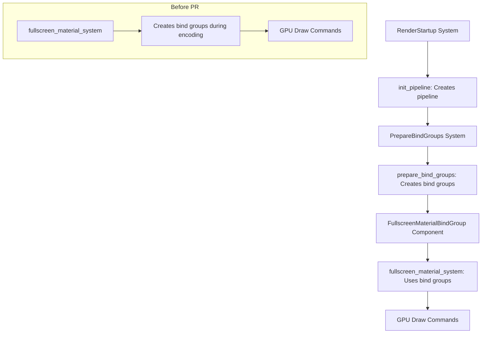

+++
title = "#22886 Prepare fullscreen material bind groups in a prepare system"
date = "2026-02-10T00:00:00"
draft = false
template = "pull_request_page.html"
in_search_index = true

[taxonomies]
list_display = ["show"]

[extra]
current_language = "en"
available_languages = {"en" = { name = "English", url = "/pull_request/bevy/2026-02/pr-22886-en-20260210" }, "zh-cn" = { name = "中文", url = "/pull_request/bevy/2026-02/pr-22886-zh-cn-20260210" }}
labels = ["A-Rendering", "C-Code-Quality"]
+++

# Title

## Basic Information
- **Title**: Prepare fullscreen material bind groups in a prepare system
- **PR Link**: https://github.com/bevyengine/bevy/pull/22886
- **Author**: IceSentry
- **Status**: MERGED
- **Labels**: A-Rendering, C-Code-Quality, S-Ready-For-Final-Review
- **Created**: 2026-02-10T04:11:52Z
- **Merged**: 2026-02-10T18:47:46Z
- **Merged By**: alice-i-cecile

## Description Translation
# Objective

- FullscreenMaterial bind groups can be created ahead of time instead of creating them in the encoding system

## Solution

- Create the bind groups in a prepare system

## Testing

- I ran the example and it worked

## The Story of This Pull Request

This pull request addresses a performance optimization in Bevy's rendering pipeline by restructuring how fullscreen material bind groups are created. The problem was straightforward: bind groups for fullscreen materials were being created during the encoding phase of rendering, which happens just before draw calls are submitted to the GPU. This is a critical path where any unnecessary work can impact frame times.

In the original implementation, the `fullscreen_material_system` used a local cache to store bind groups and would create them on-demand during encoding. This approach worked but had two issues. First, bind group creation is a relatively expensive operation that involves allocating GPU resources. Second, doing this work in the encoding system meant it happened right before drawing, potentially causing CPU-GPU synchronization issues or frame time spikes.

The solution moves bind group creation to a prepare system that runs earlier in the render schedule. Prepare systems are designed for this type of work - setting up resources ahead of time so the encoding phase can focus on issuing draw commands efficiently.

Looking at the code changes, the implementation introduces a new component `FullscreenMaterialBindGroup<T>` that stores bind groups for both possible source textures. This is necessary because we can't know ahead of time which texture will be the source versus destination - Bevy's view targets use a double-buffering approach where textures swap roles each frame. The component stores bind groups for both textures identified by their TextureViewId.

The new `prepare_bind_groups` system queries for views with `ViewTarget` and checks if they already have bind groups. If not, it creates bind groups for both textures using the render device. If bind groups exist but the texture IDs have changed (due to resize or other changes), it updates them. This system runs in the `RenderSystems::PrepareBindGroups` set, which is specifically designed for this type of preparation work.

The `fullscreen_material_system` is simplified significantly - it no longer needs to create bind groups or manage a local cache. Instead, it retrieves the appropriate bind group from the component based on which texture is currently the source. The system just selects between the two pre-created bind groups using a simple ID comparison.

This change follows Bevy's established patterns for resource preparation. By moving work out of the encoding phase, we reduce the likelihood of frame time spikes and improve overall rendering performance. The implementation is clean and maintainable - it separates concerns clearly between preparation (creating resources) and encoding (using resources to draw).

## Visual Representation



## Key Files Changed

### `crates/bevy_core_pipeline/src/fullscreen_material.rs` (+86/-31)

This file contains the core changes that move bind group creation from the encoding system to a prepare system.

**Before the change**, the system used a local cache and created bind groups on-demand:

```rust
#[derive(Default)]
struct FullscreenMaterialBindGroupCache {
    cached: Option<(TextureViewId, BindGroup)>,
}

fn fullscreen_material_system<T: FullscreenMaterial>(
    view: ViewQuery<(&ViewTarget, &DynamicUniformIndex<T>)>,
    fullscreen_pipeline: Option<Res<FullscreenMaterialPipeline<T>>>,
    pipeline_cache: Res<PipelineCache>,
    data_uniforms: Res<ComponentUniforms<T>>,
    mut cache: Local<FullscreenMaterialBindGroupCache>,
    mut ctx: RenderContext,
) {
    // ...
    let bind_group = match &mut cache.cached {
        Some((texture_id, bind_group)) if source.id() == *texture_id => bind_group,
        cached => {
            let bind_group = ctx.render_device().create_bind_group(
                "fullscreen_material_bind_group",
                &pipeline_cache.get_bind_group_layout(&fullscreen_pipeline.layout),
                &BindGroupEntries::sequential((
                    source,
                    &fullscreen_pipeline.sampler,
                    settings_binding.clone(),
                )),
            );

            let (_, bind_group) = cached.insert((source.id(), bind_group));
            bind_group
        }
    };
    // ...
}
```

**After the change**, a new component stores pre-created bind groups:

```rust
#[derive(Component)]
struct FullscreenMaterialBindGroup<T: FullscreenMaterial> {
    a: (TextureViewId, BindGroup),
    b: (TextureViewId, BindGroup),
    _marker: PhantomData<T>,
}

fn prepare_bind_groups<T: FullscreenMaterial>(
    mut commands: Commands,
    mut view: Query<(
        Entity,
        &ViewTarget,
        Option<&mut FullscreenMaterialBindGroup<T>>,
    )>,
    fullscreen_pipeline: Option<Res<FullscreenMaterialPipeline<T>>>,
    pipeline_cache: Res<PipelineCache>,
    data_uniforms: Res<ComponentUniforms<T>>,
    render_device: Res<RenderDevice>,
) {
    // ...
    for (entity, view_target, mut maybe_bind_groups) in &mut view {
        let main_texture_view = view_target.main_texture_view();
        let main_texture_other_view = view_target.main_texture_other_view();

        let create_bind_group = |texture: &TextureView| {
            (
                texture.id(),
                render_device.create_bind_group(
                    "fullscreen_material_bind_group",
                    &pipeline_cache.get_bind_group_layout(&fullscreen_pipeline.layout),
                    &BindGroupEntries::sequential((
                        texture,
                        &fullscreen_pipeline.sampler,
                        settings_binding.clone(),
                    )),
                ),
            )
        };

        if let Some(bind_groups) = &mut maybe_bind_groups {
            if bind_groups.a.0 != main_texture_view.id() {
                bind_groups.a = create_bind_group(main_texture_view);
            }
            if bind_groups.b.0 != main_texture_other_view.id() {
                bind_groups.b = create_bind_group(main_texture_other_view);
            }
        } else {
            commands.entity(entity).insert(FullscreenMaterialBindGroup {
                a: create_bind_group(main_texture_view),
                b: create_bind_group(main_texture_other_view),
                _marker: PhantomData::<T>,
            });
        }
    }
}
```

And the main system is simplified to just use the pre-created bind groups:

```rust
fn fullscreen_material_system<T: FullscreenMaterial>(
    view: ViewQuery<(
        &ViewTarget,
        &DynamicUniformIndex<T>,
        &FullscreenMaterialBindGroup<T>,
    )>,
    fullscreen_pipeline: Option<Res<FullscreenMaterialPipeline<T>>>,
    pipeline_cache: Res<PipelineCache>,
    mut ctx: RenderContext,
) {
    // ...
    let (view_target, settings_index, bind_groups) = view.into_inner();
    // ...
    let (_, bind_group) = if bind_groups.a.0 == source.id() {
        &bind_groups.a
    } else {
        &bind_groups.b
    };
    // ...
}
```

## Further Reading

- [Bevy Render Schedule Documentation](https://bevyengine.org/learn/book/rendering/render-schedule/) - Explains the different phases of Bevy's render schedule including Prepare, Queue, and Render phases
- [WGPU Bind Groups](https://wgpu.rs/explainer/bindgroups.html) - Technical details on what bind groups are and why they're important for GPU performance
- [Bevy ECS Components](https://bevyengine.org/learn/book/ecs/components/) - Background on how components work in Bevy's Entity Component System
- [Double Buffering in Graphics](https://en.wikipedia.org/wiki/Multiple_buffering) - Explanation of why view targets use two textures and how they swap roles