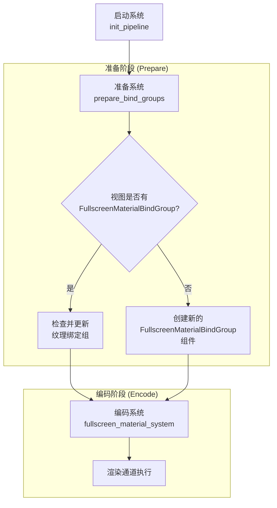

+++
title = "#22886 在准备系统中准备全屏材质绑定组"
date = "2026-02-10T00:00:00"
draft = false
template = "pull_request_page.html"
in_search_index = false

[extra]
current_language = "zh-cn"
available_languages = {"en" = { name = "English", url = "/pull_request/bevy/2026-02/pr-22886-en-20260210" }, "zh-cn" = { name = "中文", url = "/pull_request/bevy/2026-02/pr-22886-zh-cn-20260210" }}
+++

# Prepare fullscreen material bind groups in a prepare system

## Basic Information
- **标题**: 在准备系统中准备全屏材质绑定组
- **PR链接**: https://github.com/bevyengine/bevy/pull/22886
- **作者**: IceSentry
- **状态**: 已合并
- **标签**: A-Rendering, C-Code-Quality, S-Ready-For-Final-Review
- **创建时间**: 2026-02-10T04:11:52Z
- **合并时间**: 2026-02-10T18:47:46Z
- **合并者**: alice-i-cecile

## 描述翻译

### 目标
- FullscreenMaterial绑定组可以提前创建，而不是在编码系统中创建

### 解决方案
- 在准备系统中创建绑定组

### 测试
- 运行了示例，工作正常

## 这个Pull Request的故事

这个PR解决了一个在渲染管道的编码阶段创建绑定组所带来的性能问题。在原来的实现中，每次执行全屏材质渲染时，系统都需要动态创建绑定组，这引入了不必要的运行时开销。

### 问题和背景

在Bevy的渲染系统中，全屏材质（Fullscreen Material）用于后处理效果，需要为每个视图（view）创建绑定组。原先的实现使用了一个本地缓存系统`FullscreenMaterialBindGroupCache`，在`fullscreen_material_system`中动态检查纹理ID是否匹配，如果不匹配则创建新的绑定组。

这种方法存在几个问题：
1. **编码阶段开销**：绑定组的创建发生在渲染编码阶段，这会增加每帧的CPU开销
2. **局部状态管理**：使用`Local<FullscreenMaterialBindGroupCache>`使得状态管理不够清晰
3. **缺乏持久性**：缓存只存在于单次系统执行期间，无法跨帧复用

### 解决方案

作者采取了将绑定组创建移动到准备阶段（prepare phase）的方法。这是Bevy渲染架构的标准模式：准备阶段处理资源创建和状态设置，编码阶段专注于实际的渲染命令提交。

主要的技术改变包括：
1. **引入新的组件**：创建`FullscreenMaterialBindGroup<T>`组件来持久化存储绑定组
2. **分离系统职责**：将绑定组创建逻辑从主渲染系统拆分到专门的准备系统
3. **改进状态管理**：从局部状态转移到基于实体的组件状态

### 实现细节

核心的变化是在`fullscreen_material.rs`中。原先的`FullscreenMaterialBindGroupCache`结构体被移除，取而代之的是`FullscreenMaterialBindGroup<T>`组件：

```rust
/// 为两个主纹理保存绑定组
///
/// 我们无法提前知道哪个是源或目标，所以为两个都创建绑定组
#[derive(Component)]
struct FullscreenMaterialBindGroup<T: FullscreenMaterial> {
    a: (TextureViewId, BindGroup),
    b: (TextureViewId, BindGroup),
    // 这是为了防止每个相机想要多个`FullscreenMaterial`
    _marker: PhantomData<T>,
}
```

新的`prepare_bind_groups`系统在`RenderSystems::PrepareBindGroups`阶段运行：

```rust
fn prepare_bind_groups<T: FullscreenMaterial>(
    mut commands: Commands,
    mut view: Query<(
        Entity,
        &ViewTarget,
        Option<&mut FullscreenMaterialBindGroup<T>>,
    )>,
    fullscreen_pipeline: Option<Res<FullscreenMaterialPipeline<T>>>,
    pipeline_cache: Res<PipelineCache>,
    data_uniforms: Res<ComponentUniforms<T>>,
    render_device: Res<RenderDevice>,
) {
    // 实现逻辑
}
```

这个系统检查每个视图，如果还没有绑定组组件，就创建它。如果已有绑定组但纹理ID不匹配，就更新绑定组。这是通过比较纹理ID来避免不必要的重新创建的：

```rust
if let Some(bind_groups) = &mut maybe_bind_groups {
    if bind_groups.a.0 != main_texture_view.id() {
        bind_groups.a = create_bind_group(main_texture_view);
    }
    if bind_groups.b.0 != main_texture_other_view.id() {
        bind_groups.b = create_bind_group(main_texture_other_view);
    }
} else {
    commands.entity(entity).insert(FullscreenMaterialBindGroup {
        a: create_bind_group(main_texture_view),
        b: create_bind_group(main_texture_other_view),
        _marker: PhantomData::<T>,
    });
}
```

原来的渲染系统`fullscreen_material_system`现在只需要从组件中获取预创建的绑定组：

```rust
fn fullscreen_material_system<T: FullscreenMaterial>(
    view: ViewQuery<(
        &ViewTarget,
        &DynamicUniformIndex<T>,
        &FullscreenMaterialBindGroup<T>,
    )>,
    fullscreen_pipeline: Option<Res<FullscreenMaterialPipeline<T>>>,
    pipeline_cache: Res<PipelineCache>,
    mut ctx: RenderContext,
) {
    // 从绑定组组件中获取预创建的绑定组
    let (_, bind_group) = if bind_groups.a.0 == source.id() {
        &bind_groups.a
    } else {
        &bind_groups.b
    };
    
    // 使用绑定组进行渲染
}
```

### 技术洞察

这个重构展示了几个重要的设计模式：

1. **阶段分离原则**：将资源创建（准备阶段）与资源使用（编码阶段）分离，符合Bevy的渲染架构设计
2. **基于实件的状态管理**：将绑定组存储在组件中，而不是局部变量，使得状态可以跨系统和帧持久化
3. **按需更新**：通过比较纹理ID，只在纹理实际发生变化时才重新创建绑定组
4. **泛型设计**：使用泛型`<T: FullscreenMaterial>`保持系统的通用性，支持多种全屏材质类型

这种模式的一个重要优势是它减少了渲染线程的工作负载。绑定组创建可能涉及GPU资源分配，这些操作现在可以在准备阶段并行处理，而不是在必须按顺序执行的编码阶段。

### 影响

这个改动带来的主要改进包括：

1. **性能提升**：减少了编码阶段的CPU开销，绑定组创建被移动到可以并行处理的准备阶段
2. **代码清晰度**：通过将绑定组创建逻辑分离到专门的系统，提高了代码的可读性和可维护性
3. **架构一致性**：使全屏材质系统更符合Bevy渲染管道的标准模式
4. **更好的缓存利用**：绑定组现在可以跨帧复用，只要纹理没有发生变化

这个PR虽然改动不大，但体现了良好的系统设计原则：将昂贵的操作提前处理，减少关键路径上的开销。这对于需要保持高帧率的游戏和应用程序尤其重要。

## 可视化表示



## 关键文件更改

### `crates/bevy_core_pipeline/src/fullscreen_material.rs` (+86/-31)

这个文件包含了所有主要的更改：

1. **系统注册的更改** - 添加了新的准备系统：
```rust
// 之前：
render_app.add_systems(RenderStartup, init_pipeline::<T>);

// 之后：
render_app
    .add_systems(RenderStartup, init_pipeline::<T>)
    .add_systems(
        Render,
        prepare_bind_groups::<T>.in_set(RenderSystems::PrepareBindGroups),
    );
```

2. **新的组件定义** - 替换了旧的缓存结构：
```rust
// 之前：
#[derive(Default)]
struct FullscreenMaterialBindGroupCache {
    cached: Option<(TextureViewId, BindGroup)>,
}

// 之后：
#[derive(Component)]
struct FullscreenMaterialBindGroup<T: FullscreenMaterial> {
    a: (TextureViewId, BindGroup),
    b: (TextureViewId, BindGroup),
    _marker: PhantomData<T>,
}
```

3. **新的准备系统** - 创建和更新绑定组：
```rust
fn prepare_bind_groups<T: FullscreenMaterial>(
    mut commands: Commands,
    mut view: Query<(
        Entity,
        &ViewTarget,
        Option<&mut FullscreenMaterialBindGroup<T>>,
    )>,
    // ... 资源参数
) {
    // 实现绑定组的创建和更新逻辑
}
```

4. **渲染系统的简化** - 现在使用预创建的绑定组：
```rust
// 之前：
let bind_group = match &mut cache.cached {
    Some((texture_id, bind_group)) if source.id() == *texture_id => bind_group,
    cached => {
        // 动态创建绑定组
        let bind_group = ctx.render_device().create_bind_group(...);
        let (_, bind_group) = cached.insert((source.id(), bind_group));
        bind_group
    }
};

// 之后：
let (_, bind_group) = if bind_groups.a.0 == source.id() {
    &bind_groups.a
} else {
    &bind_groups.b
};
```

这些更改共同实现了将绑定组创建从渲染编码阶段移动到准备阶段的目标，提高了性能并使代码更符合Bevy的渲染架构模式。

## 进一步阅读

1. **Bevy渲染管线文档**：了解Bevy的渲染阶段（准备、编码、执行）如何工作
2. **ECS架构模式**：理解基于组件的系统设计如何提高代码组织和性能
3. **GPU资源管理**：学习绑定组、纹理和其他GPU资源的最佳实践
4. **系统调度优化**：研究如何通过系统阶段分离来优化性能
5. **Bevy的FullscreenMaterial trait**：了解全屏材质的实现和使用方式