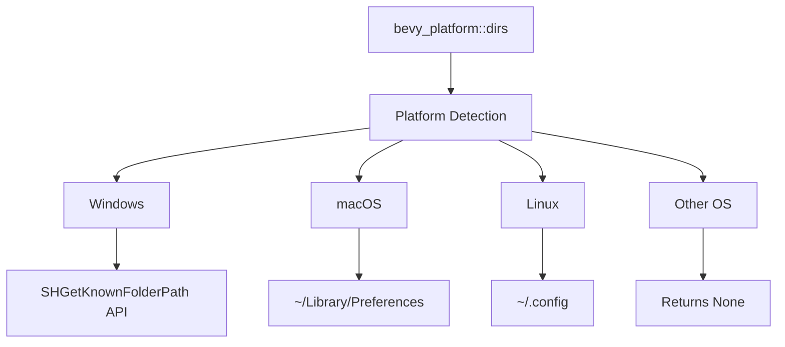

+++
title = "#22891 Add `dirs` module to bevy_platform"
date = "2026-02-10T00:00:00"
draft = false
template = "pull_request_page.html"
in_search_index = true

[taxonomies]
list_display = ["show"]

[extra]
current_language = "en"
available_languages = {"en" = { name = "English", url = "/pull_request/bevy/2026-02/pr-22891-en-20260210" }, "zh-cn" = { name = "中文", url = "/pull_request/bevy/2026-02/pr-22891-zh-cn-20260210" }}
labels = ["C-Feature", "A-Utils", "M-Release-Note", "A-Dev-Tools", "X-Blessed"]
+++

# Title
Add `dirs` module to bevy_platform

## Basic Information
- **Title**: Add `dirs` module to bevy_platform
- **PR Link**: https://github.com/bevyengine/bevy/pull/22891
- **Author**: viridia
- **Status**: MERGED
- **Labels**: C-Feature, A-Utils, M-Release-Note, A-Dev-Tools, X-Blessed, S-Needs-Review
- **Created**: 2026-02-10T18:52:56Z
- **Merged**: 2026-02-10T23:05:22Z
- **Merged By**: cart

## Description Translation
The PR description is already in English, so I'll include it exactly as-is:

```
# Objective

Adds a `dirs` module which provides the location of the application preferences directory.

Part of: #13311 
```

## The Story of This Pull Request

This PR addresses a common requirement in cross-platform game development: finding standard user directories for storing application data. Many applications need to save configuration files, save games, or user preferences in appropriate locations that follow platform conventions. Prior to this PR, Bevy didn't provide a built-in way to determine these directories, requiring developers to implement platform-specific solutions themselves or rely on external crates.

The implementation approach follows established patterns from existing Rust ecosystem crates, specifically modeling the API after the `dirs-sys-rs` crate. This ensures compatibility with user expectations and leverages proven cross-platform solutions. The PR starts with a focused implementation providing only the preferences directory, acknowledging this as a foundational piece that can be extended with more directory types in future iterations (as indicated by the reference to issue #13311).

The architectural approach uses conditional compilation to provide platform-specific implementations while maintaining a clean, unified public API. This is a standard pattern in Rust for handling platform differences. The main module (`mod.rs`) serves as the entry point, conditionally re-exporting platform-specific functions based on the target OS. For unsupported platforms, it provides a fallback implementation that returns `None`, ensuring the API remains usable across all targets even if functionality is limited.

The Windows implementation deserves particular attention due to its complexity compared to the Unix-like systems. It uses the Windows Shell API's `SHGetKnownFolderPath` function, which is the modern, recommended way to access standard folders on Windows. This approach properly handles localization, user permissions, and virtual folder redirection. The implementation includes proper memory management with `CoTaskMemFree` to avoid leaks, which is critical when dealing with COM APIs. The use of `windows-sys` crate follows Bevy's established patterns for Windows API access.

For macOS and Linux, the initial implementations are simpler but functional. The macOS implementation follows Apple's convention of using `~/Library/Preferences`, while Linux uses `~/.config` (with a TODO comment acknowledging the need for proper XDG_CONFIG support). These implementations use Rust's standard library `home_dir()` function, which provides a reasonable baseline but has known limitations on some platforms.

The release notes addition indicates this is considered a user-facing feature worth documenting. The straightforward documentation focuses on what the module provides rather than implementation details, which is appropriate for a utility module.

From an engineering perspective, this PR demonstrates several good practices: starting with minimal viable functionality, using established patterns from the broader ecosystem, implementing proper resource management for platform APIs, and providing graceful fallbacks for unsupported platforms. The implementation also shows awareness of future extensibility while delivering immediate value.

## Visual Representation



## Key Files Changed

### `crates/bevy_platform/src/dirs/mod.rs` (+28/-0)
This is the main module file that orchestrates the platform-specific implementations. It uses conditional compilation to include the appropriate platform module and export the `preferences_dir` function.

```rust
// File: crates/bevy_platform/src/dirs/mod.rs
// Before: File did not exist
// After:
//! APIs that return the location of standard user directories.

// Modeled after https://github.com/dirs-dev/dirs-sys-rs/

#[cfg(not(any(target_os = "windows", target_os = "macos", target_os = "linux")))]
use std::path::PathBuf;

#[cfg(target_os = "windows")]
mod windows;
#[cfg(target_os = "windows")]
pub use windows::preferences_dir;

#[cfg(target_os = "macos")]
mod macos;
#[cfg(target_os = "macos")]
pub use macos::preferences_dir;

#[cfg(target_os = "linux")]
mod linux;
#[cfg(target_os = "linux")]
pub use linux::preferences_dir;

/// Returns the path to the directory used for application settings. This version
/// always returns `None`.
#[cfg(not(any(target_os = "windows", target_os = "macos", target_os = "linux")))]
pub fn preferences_dir() -> Option<PathBuf> {
    None
}
```

### `crates/bevy_platform/src/dirs/windows.rs` (+33/-0)
This file contains the Windows-specific implementation using the Windows Shell API. It demonstrates proper handling of Windows API calls with appropriate memory management.

```rust
// File: crates/bevy_platform/src/dirs/windows.rs
// Before: File did not exist
// After:
extern crate windows_sys as windows;
use std::ffi::{c_void, OsString};
use std::os::windows::ffi::OsStringExt;
use std::path::PathBuf;
use std::slice;
use windows::Win32::UI::Shell;

/// Returns the path to the directory used for application settings.
// From https://github.com/dirs-dev/dirs-sys-rs/blob/main/src/lib.rs
#[allow(unsafe_code)]
fn known_folder(folder_id: windows::core::GUID) -> Option<PathBuf> {
    // SAFETY: SHGetKnownFolderPath allocates path_ptr which must be freed with CoTaskMemFree.
    unsafe {
        let mut path_ptr: windows::core::PWSTR = std::ptr::null_mut();
        let result =
            Shell::SHGetKnownFolderPath(&folder_id, 0, std::ptr::null_mut(), &mut path_ptr);
        if result == 0 {
            let len = windows::Win32::Globalization::lstrlenW(path_ptr) as usize;
            let path = slice::from_raw_parts(path_ptr, len);
            let ostr: OsString = OsStringExt::from_wide(path);
            windows::Win32::System::Com::CoTaskMemFree(path_ptr as *const c_void);
            Some(PathBuf::from(ostr))
        } else {
            windows::Win32::System::Com::CoTaskMemFree(path_ptr as *const c_void);
            None
        }
    }
}

/// Returns the path to the directory used for application settings.
pub fn preferences_dir() -> Option<PathBuf> {
    known_folder(Shell::FOLDERID_LocalAppData)
}
```

### `crates/bevy_platform/src/dirs/linux.rs` (+7/-0)
The Linux implementation provides a basic solution using the standard `home_dir()` function, with a TODO comment acknowledging the need for proper XDG_CONFIG support.

```rust
// File: crates/bevy_platform/src/dirs/linux.rs
// Before: File did not exist
// After:
use std::{env::home_dir, path::PathBuf};

/// Returns the path to the directory used for application settings.
pub fn preferences_dir() -> Option<PathBuf> {
    // TODO: Support XDG_CONFIG
    home_dir().map(|home| home.join(".config"))
}
```

### `crates/bevy_platform/src/dirs/macos.rs` (+6/-0)
The macOS implementation follows Apple's convention for preference storage.

```rust
// File: crates/bevy_platform/src/dirs/macos.rs
// Before: File did not exist
// After:
use std::{env::home_dir, path::PathBuf};

/// Returns the path to the directory used for application settings.
pub fn preferences_dir() -> Option<PathBuf> {
    home_dir().map(|home| home.join("Library/Preferences"))
}
```

### `crates/bevy_platform/Cargo.toml` (+8/-0)
Added Windows-specific dependency on the `windows-sys` crate with the necessary features for the Shell API calls.

```toml
// File: crates/bevy_platform/Cargo.toml
// Before: No windows-sys dependency
// After addition:
[target.'cfg(windows)'.dependencies]
windows-sys = { version = ">= 0.59.0", features = [
  "Win32_UI_Shell",
  "Win32_Foundation",
  "Win32_Globalization",
  "Win32_System_Com",
] }
```

### `crates/bevy_platform/src/lib.rs` (+2/-0)
Added the new `dirs` module to the public API when the standard library is available.

```rust
// File: crates/bevy_platform/src/lib.rs
// Before: No dirs module
// After addition (in the cfg::std! block):
    pub mod dirs;
```

### `release-content/release-notes/platform_dirs.md` (+8/-0)
Created release notes to document the new feature for users.

```markdown
// File: release-content/release-notes/platform_dirs.md
// Before: File did not exist
// After:
---
title: "bevy_platform standard directories"
authors: ["@viridia"]
pull_requests: [22891]
---

The `dirs` module in `bevy_platform` provides the location of standard directories in the
filesystem. Currently this includes the directory for storing application preferences.
```

## Further Reading

1. [dirs-rs GitHub Repository](https://github.com/dirs-dev/dirs-rs) - A popular Rust crate for accessing standard directories, which served as inspiration for this implementation
2. [Windows Shell API Documentation](https://docs.microsoft.com/en-us/windows/win32/api/shlobj_core/) - Microsoft's official documentation for the Windows Shell APIs used in this PR
3. [XDG Base Directory Specification](https://specifications.freedesktop.org/basedir-spec/basedir-spec-latest.html) - The standard for user directories on Linux and other Unix-like systems
4. [Rust Conditional Compilation](https://doc.rust-lang.org/reference/conditional-compilation.html) - Rust's `cfg` attribute for platform-specific code
5. [Bevy Issue #13311](https://github.com/bevyengine/bevy/issues/13311) - The larger issue tracking cross-platform utility development in Bevy

# Full Code Diff
```
diff --git a/crates/bevy_platform/Cargo.toml b/crates/bevy_platform/Cargo.toml
index d1af7a805be4f..ecfffdc105e02 100644
--- a/crates/bevy_platform/Cargo.toml
+++ b/crates/bevy_platform/Cargo.toml
@@ -97,6 +97,14 @@ spin = { version = "0.10.0", default-features = false, features = [
 [target.'cfg(not(target_has_atomic = "ptr"))'.dependencies]
 portable-atomic-util = { version = "0.2.4", default-features = false }
 
+[target.'cfg(windows)'.dependencies]
+windows-sys = { version = ">= 0.59.0", features = [
+  "Win32_UI_Shell",
+  "Win32_Foundation",
+  "Win32_Globalization",
+  "Win32_System_Com",
+] }
+
 [lints]
 workspace = true
 
diff --git a/crates/bevy_platform/src/dirs/linux.rs b/crates/bevy_platform/src/dirs/linux.rs
new file mode 100644
index 0000000000000..c5cce1461c214
--- /dev/null
+++ b/crates/bevy_platform/src/dirs/linux.rs
@@ -0,0 +1,7 @@
+use std::{env::home_dir, path::PathBuf};
+
+/// Returns the path to the directory used for application settings.
+pub fn preferences_dir() -> Option<PathBuf> {
+    // TODO: Support XDG_CONFIG
+    home_dir().map(|home| home.join(".config"))
+}
diff --git a/crates/bevy_platform/src/dirs/macos.rs b/crates/bevy_platform/src/dirs/macos.rs
new file mode 100644
index 0000000000000..31eb77dbdd6bf
--- /dev/null
+++ b/crates/bevy_platform/src/dirs/macos.rs
@@ -0,0 +1,6 @@
+use std::{env::home_dir, path::PathBuf};
+
+/// Returns the path to the directory used for application settings.
+pub fn preferences_dir() -> Option<PathBuf> {
+    home_dir().map(|home| home.join("Library/Preferences"))
+}
diff --git a/crates/bevy_platform/src/dirs/mod.rs b/crates/bevy_platform/src/dirs/mod.rs
new file mode 100644
index 0000000000000..a4b2a9d2331f2
--- /dev/null
+++ b/crates/bevy_platform/src/dirs/mod.rs
@@ -0,0 +1,28 @@
+//! APIs that return the location of standard user directories.
+
+// Modeled after https://github.com/dirs-dev/dirs-sys-rs/
+
+#[cfg(not(any(target_os = "windows", target_os = "macos", target_os = "linux")))]
+use std::path::PathBuf;
+
+#[cfg(target_os = "windows")]
+mod windows;
+#[cfg(target_os = "windows")]
+pub use windows::preferences_dir;
+
+#[cfg(target_os = "macos")]
+mod macos;
+#[cfg(target_os = "macos")]
+pub use macos::preferences_dir;
+
+#[cfg(target_os = "linux")]
+mod linux;
+#[cfg(target_os = "linux")]
+pub use linux::preferences_dir;
+
+/// Returns the path to the directory used for application settings. This version
+/// always returns `None`.
+#[cfg(not(any(target_os = "windows", target_os = "macos", target_os = "linux")))]
+pub fn preferences_dir() -> Option<PathBuf> {
+    None
+}
diff --git a/crates/bevy_platform/src/dirs/windows.rs b/crates/bevy_platform/src/dirs/windows.rs
new file mode 100644
index 0000000000000..983ef26b7e3c4
--- /dev/null
+++ b/crates/bevy_platform/src/dirs/windows.rs
@@ -0,0 +1,33 @@
+extern crate windows_sys as windows;
+use std::ffi::{c_void, OsString};
+use std::os::windows::ffi::OsStringExt;
+use std::path::PathBuf;
+use std::slice;
+use windows::Win32::UI::Shell;
+
+/// Returns the path to the directory used for application settings.
+// From https://github.com/dirs-dev/dirs-sys-rs/blob/main/src/lib.rs
+#[allow(unsafe_code)]
+fn known_folder(folder_id: windows::core::GUID) -> Option<PathBuf> {
+    // SAFETY: SHGetKnownFolderPath allocates path_ptr which must be freed with CoTaskMemFree.
+    unsafe {
+        let mut path_ptr: windows::core::PWSTR = std::ptr::null_mut();
+        let result =
+            Shell::SHGetKnownFolderPath(&folder_id, 0, std::ptr::null_mut(), &mut path_ptr);
+        if result == 0 {
+            let len = windows::Win32::Globalization::lstrlenW(path_ptr) as usize;
+            let path = slice::from_raw_parts(path_ptr, len);
+            let ostr: OsString = OsStringExt::from_wide(path);
+            windows::Win32::System::Com::CoTaskMemFree(path_ptr as *const c_void);
+            Some(PathBuf::from(ostr))
+        } else {
+            windows::Win32::System::Com::CoTaskMemFree(path_ptr as *const c_void);
+            None
+        }
+    }
+}
+
+/// Returns the path to the directory used for application settings.
+pub fn preferences_dir() -> Option<PathBuf> {
+    known_folder(Shell::FOLDERID_LocalAppData)
+}
diff --git a/crates/bevy_platform/src/lib.rs b/crates/bevy_platform/src/lib.rs
index b4ff694f1187f..3422bcd0b1607 100644
--- a/crates/bevy_platform/src/lib.rs
+++ b/crates/bevy_platform/src/lib.rs
@@ -11,6 +11,8 @@
 
 cfg::std! {
     extern crate std;
+
+    pub mod dirs;
 }
 
 cfg::alloc! {
diff --git a/release-content/release-notes/platform_dirs.md b/release-content/release-notes/platform_dirs.md
new file mode 100644
index 0000000000000..26a424da9acc0
--- /dev/null
+++ b/release-content/release-notes/platform_dirs.md
@@ -0,0 +1,8 @@
+---
+title: "bevy_platform standard directories"
+authors: ["@viridia"]
+pull_requests: [22891]
+---
+
+The `dirs` module in `bevy_platform` provides the location of standard directories in the
+filesystem. Currently this includes the directory for storing application preferences.
```