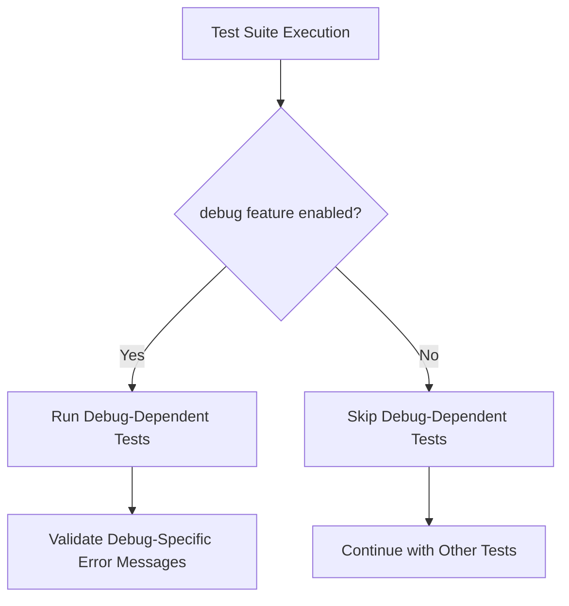

+++
title = "#22895 conditionally skip test cases that use the debug feature"
date = "2026-02-11T00:00:00"
draft = false
template = "pull_request_page.html"
in_search_index = true

[taxonomies]
list_display = ["show"]

[extra]
current_language = "en"
available_languages = {"en" = { name = "English", url = "/pull_request/bevy/2026-02/pr-22895-en-20260211" }, "zh-cn" = { name = "中文", url = "/pull_request/bevy/2026-02/pr-22895-zh-cn-20260211" }}
labels = ["D-Trivial", "A-ECS", "C-Testing"]
+++

# Title
## Basic Information
- **Title**: conditionally skip test cases that use the debug feature
- **PR Link**: https://github.com/bevyengine/bevy/pull/22895
- **Author**: Person-93
- **Status**: MERGED
- **Labels**: D-Trivial, A-ECS, S-Ready-For-Final-Review, C-Testing
- **Created**: 2026-02-11T00:12:52Z
- **Merged**: 2026-02-11T05:03:50Z
- **Merged By**: alice-i-cecile

## Description Translation
# Objective

Two test cases in the `ecs` crate use the `debug` feature to produce the expected panic message. This causes those tests to fail while testing without `debug`.

## Solution

Conditionally ignore those test cases.

## Testing

Run the tests for `ecs` with no additional features enabled.

# The Story of This Pull Request

This PR addresses a straightforward issue in Bevy's ECS test suite: two specific tests were failing when the `debug` feature flag wasn't enabled. The core problem is that these tests rely on specific panic message formatting that only occurs when the debug feature is active.

When the `debug` feature is disabled, Bevy's error reporting uses a different, more minimal format. The tests in question use Rust's `#[should_panic]` attribute with an `expected` parameter that checks for an exact panic message match. Since the panic message changes depending on the feature flag, these tests fail when running without `debug` enabled.

The developer took a pragmatic approach to solving this problem. Instead of trying to make the tests work in both configurations or splitting them into separate implementations, they used Rust's conditional compilation attributes to simply skip these tests when the `debug` feature isn't present. This is achieved by adding `#[cfg_attr(not(feature = "debug"), ignore)]` to each test.

This approach has several advantages. First, it's minimal and maintainable - only two lines of code are added. Second, it preserves the existing test behavior when the debug feature *is* enabled, ensuring those tests still validate the debug-specific error formatting. Third, it allows the test suite to pass cleanly in all configurations, which is important for CI/CD pipelines and development workflows that might test with different feature combinations.

The implementation is technically simple but demonstrates good testing practices. When tests depend on specific feature flags or configurations, it's often better to conditionally skip them rather than make them fail or create complex conditional logic within the test itself. This keeps the test suite clean and prevents false failures that don't indicate actual bugs.

One alternative approach would have been to use conditional compilation to change the expected panic message based on the feature flag. However, this would require more complex code and potentially obscure the test's intent. The chosen solution of simply skipping the tests when the required feature isn't available is cleaner and more maintainable.

The impact of this change is that the Bevy ECS test suite now passes correctly regardless of whether the `debug` feature is enabled. This improves the developer experience for anyone running tests with different feature configurations and ensures CI systems don't report false failures.

## Visual Representation



## Key Files Changed

### `crates/bevy_ecs/src/system/mod.rs` (+2/-0)

This file contains the system module tests for Bevy's ECS. Two test functions were modified to conditionally skip execution when the `debug` feature is not enabled.

**Before the change:**
```rust
#[test]
#[should_panic(
    expected = "Encountered an error in system `bevy_ecs::system::tests::simple_fallible_system::sys`: error"
)]
fn simple_fallible_system() {
    // Test implementation
}

#[test]
#[should_panic(
    expected = "Encountered an error in system `bevy_ecs::system::tests::simple_fallible_exclusive_system::sys`: error"
)]
fn simple_fallible_exclusive_system() {
    // Test implementation
}
```

**After the change:**
```rust
#[test]
#[cfg_attr(not(feature = "debug"), ignore)]
#[should_panic(
    expected = "Encountered an error in system `bevy_ecs::system::tests::simple_fallible_system::sys`: error"
)]
fn simple_fallible_system() {
    // Test implementation
}

#[test]
#[cfg_attr(not(feature = "debug"), ignore)]
#[should_panic(
    expected = "Encountered an error in system `bevy_ecs::system::tests::simple_fallible_exclusive_system::sys`: error"
)]
fn simple_fallible_exclusive_system() {
    // Test implementation
}
```

The key change is the addition of `#[cfg_attr(not(feature = "debug"), ignore)]` to both test functions. This attribute tells Rust: "If the `debug` feature is NOT enabled, apply the `ignore` attribute to this test." The `ignore` attribute causes the test runner to skip these tests entirely when the condition is met.

## Further Reading

1. Rust documentation on conditional compilation: https://doc.rust-lang.org/reference/conditional-compilation.html
2. Rust testing guide with `#[should_panic]`: https://doc.rust-lang.org/book/ch11-01-writing-tests.html#checking-for-panics-with-should_panic
3. Rust test attribute reference: https://doc.rust-lang.org/reference/attributes/testing.html
4. Bevy's feature flag documentation: https://bevyengine.org/learn/quick-start/features/
5. Cargo features documentation: https://doc.rust-lang.org/cargo/reference/features.html

# Full Code Diff
```
diff --git a/crates/bevy_ecs/src/system/mod.rs b/crates/bevy_ecs/src/system/mod.rs
index 1910232bb6d38..8c483c5c8ab9a 100644
--- a/crates/bevy_ecs/src/system/mod.rs
+++ b/crates/bevy_ecs/src/system/mod.rs
@@ -1884,6 +1884,7 @@ mod tests {
     }
 
     #[test]
+    #[cfg_attr(not(feature = "debug"), ignore)]
     #[should_panic(
         expected = "Encountered an error in system `bevy_ecs::system::tests::simple_fallible_system::sys`: error"
     )]
@@ -1898,6 +1899,7 @@ mod tests {
     }
 
     #[test]
+    #[cfg_attr(not(feature = "debug"), ignore)]
     #[should_panic(
         expected = "Encountered an error in system `bevy_ecs::system::tests::simple_fallible_exclusive_system::sys`: error"
     )]
```