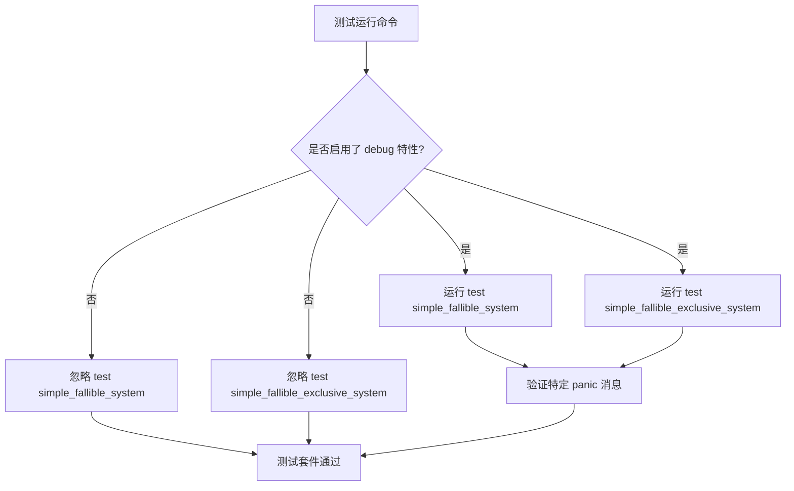

+++
title = "#22895 conditionally skip test cases that use the debug feature"
date = "2026-02-11T00:00:00"
draft = false
template = "pull_request_page.html"
in_search_index = false

[extra]
current_language = "zh-cn"
available_languages = {"en" = { name = "English", url = "/pull_request/bevy/2026-02/pr-22895-en-20260211" }, "zh-cn" = { name = "中文", url = "/pull_request/bevy/2026-02/pr-22895-zh-cn-20260211" }}
+++

# Title

## 基本信息
- **标题**: conditionally skip test cases that use the debug feature
- **PR链接**: https://github.com/bevyengine/bevy/pull/22895
- **作者**: Person-93
- **状态**: 已合并
- **标签**: D-Trivial, A-ECS, S-Ready-For-Final-Review, C-Testing
- **创建时间**: 2026-02-11T00:12:52Z
- **合并时间**: 2026-02-11T05:03:50Z
- **合并者**: alice-i-cecile

## 描述翻译

**目标**

`ecs` crate 中的两个测试用例使用了 `debug` 特性来生成预期的恐慌(panic)消息。这导致在未启用 `debug` 特性进行测试时，这些测试会失败。

**解决方案**

有条件地忽略这些测试用例。

**测试**

在不启用任何额外特性的情况下运行 `ecs` 的测试。

## 该Pull Request的故事

这个问题源于一个常见的CI（持续集成）场景：项目（在本例中是Bevy引擎）可能通过不同的特性组合进行编译和测试。`bevy_ecs` crate 中定义了两个单元测试，它们使用 `#[should_panic(expected = "...")]` 属性来验证系统在出错时会抛出包含特定错误信息的恐慌。然而，这些预期的错误信息字符串似乎依赖于 `debug` Cargo 特性被启用。当在CI流水线或其他构建配置中运行测试且未启用 `debug` 特性时，由于实际抛出的恐慌信息与预期字符串不匹配，这两个测试就会失败。

这不是功能上的缺陷，而是测试用例本身与环境的不兼容。开发者 Person-93 识别到了这个问题。解决方案不是去修改恐慌信息或测试逻辑，而是让这些测试只在支持它们的环境中运行。这是处理特性依赖测试的标准做法。

Rust 提供了 `#[cfg_attr]` 属性，它允许根据编译条件来有条件地添加另一个属性。开发者利用这个机制，为这两个测试添加了 `#[cfg_attr(not(feature = "debug"), ignore)]`。这个指令的意思是：“如果 *没有* 启用 `debug` 特性，则对此测试应用 `ignore` 属性”。`#[ignore]` 属性会让测试运行器跳过该测试。

通过查看代码变更，我们可以清晰地看到这一模式被一致地应用到了两个受影响的测试函数上：
```rust
#[test]
#[cfg_attr(not(feature = "debug"), ignore)] // 新增的行
#[should_panic(expected = "...")]
fn test_function() {
    // ... 测试体
}
```
这个改动非常精准。它没有改变任何功能代码或测试逻辑，只是增加了元数据来指导测试运行器。测试本身的行为在启用 `debug` 特性时保持不变，确保了原有的测试覆盖。而在不满足条件时，测试会被静默跳过，从而保证了整个测试套件能够在不同配置下顺利通过。

从工程角度看，这是一个维护构建稳定性的典型修复。它体现了对测试分类管理的良好实践：将依赖于特定环境或配置的测试隔离出来，并确保它们不会破坏通用的构建流程。其他维护者在遇到类似问题时，也可以借鉴这种使用 `cfg_attr` 与 `ignore` 组合的模式来处理条件编译下的测试。

## 视觉表示



## 关键文件变更

**修改的文件: `crates/bevy_ecs/src/system/mod.rs`**

这个文件包含了 `bevy_ecs::system` 模块的单元测试。修改为两个特定的测试函数添加了条件忽略属性。

**变更详情:**

在名为 `simple_fallible_system` 的测试上添加了 `#[cfg_attr(not(feature = "debug"), ignore)]` 属性。
```rust
// 代码位置: crates/bevy_ecs/src/system/mod.rs 第 1887 行附近
#[test]
#[cfg_attr(not(feature = "debug"), ignore)] // <- 此行被添加
#[should_panic(
    expected = "Encountered an error in system `bevy_ecs::system::tests::simple_fallible_system::sys`: error"
)]
fn simple_fallible_system() {
    // ... 测试实现
}
```

在名为 `simple_fallible_exclusive_system` 的测试上添加了相同的属性。
```rust
// 代码位置: crates/bevy_ecs/src/system/mod.rs 第 1902 行附近
#[test]
#[cfg_attr(not(feature = "debug"), ignore)] // <- 此行被添加
#[should_panic(
    expected = "Encountered an error in system `bevy_ecs::system::tests::simple_fallible_exclusive_system::sys`: error"
)]
fn simple_fallible_exclusive_system() {
    // ... 测试实现
}
```

**与PR目标的关系:**
这两个改动直接实现了PR描述中的解决方案：当未启用 `debug` 特性时，忽略这两个依赖于该特性来匹配精确恐慌消息的测试，从而消除测试失败。

## 扩展阅读

1.  **Rust 官方文档：条件编译 (`cfg`)**
    *   链接: https://doc.rust-lang.org/reference/conditional-compilation.html
    *   说明: 了解 `#[cfg]` 和 `#[cfg_attr]` 的工作原理，这是管理不同特性或平台下代码块的基础。

2.  **Rust 官方文档：属性**
    *   链接: https://doc.rust-lang.org/reference/attributes.html
    *   说明: 深入理解Rust中属性的语法和用法，包括 `#[test]`、`#[should_panic]` 和 `#[ignore]`。

3.  **Cargo 手册：特性**
    *   链接: https://doc.rust-lang.org/cargo/reference/features.html
    *   说明: 学习Cargo中如何定义和使用特性，这对于管理像本PR中涉及的 `debug` 这样的可选功能至关重要。

4.  **《Rust 编程语言》第11章：测试**
    *   链接: https://kaisery.github.io/trpl-zh-cn/ch11-00-testing.html
    *   说明: 如果对Rust的测试框架不熟悉，本章提供了从基础到进阶的全面介绍，包括如何编写和运行测试。

# Full Code Diff
diff --git a/crates/bevy_ecs/src/system/mod.rs b/crates/bevy_ecs/src/system/mod.rs
index 1910232bb6d38..8c483c5c8ab9a 100644
--- a/crates/bevy_ecs/src/system/mod.rs
+++ b/crates/bevy_ecs/src/system/mod.rs
@@ -1884,6 +1884,7 @@ mod tests {
     }
 
     #[test]
+    #[cfg_attr(not(feature = "debug"), ignore)]
     #[should_panic(
         expected = "Encountered an error in system `bevy_ecs::system::tests::simple_fallible_system::sys`: error"
     )]
@@ -1898,6 +1899,7 @@ mod tests {
     }
 
     #[test]
+    #[cfg_attr(not(feature = "debug"), ignore)]
     #[should_panic(
         expected = "Encountered an error in system `bevy_ecs::system::tests::simple_fallible_exclusive_system::sys`: error"
     )]