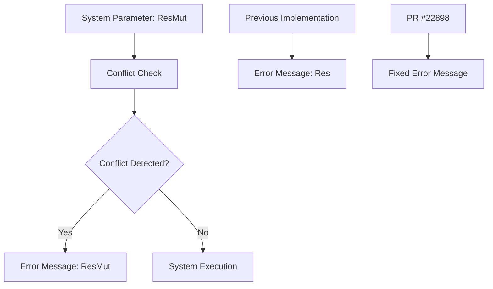

+++
title = "#22898 fix error message when resmut conflict with query"
date = "2026-02-11T00:00:00"
draft = false
template = "pull_request_page.html"
in_search_index = true

[taxonomies]
list_display = ["show"]

[extra]
current_language = "en"
available_languages = {"en" = { name = "English", url = "/pull_request/bevy/2026-02/pr-22898-en-20260211" }, "zh-cn" = { name = "中文", url = "/pull_request/bevy/2026-02/pr-22898-zh-cn-20260211" }}
labels = ["A-ECS", "C-Usability"]
+++

# Title
fix error message when resmut conflict with query

## Basic Information
- **Title**: fix error message when resmut conflict with query
- **PR Link**: https://github.com/bevyengine/bevy/pull/22898
- **Author**: mockersf
- **Status**: MERGED
- **Labels**: A-ECS, C-Usability, S-Ready-For-Final-Review
- **Created**: 2026-02-11T02:40:16Z
- **Merged**: 2026-02-11T05:03:50Z
- **Merged By**: alice-i-cecile

## Description Translation
The PR description is already in English, so it is included as-is:

**Objective**
- since #20934 res/resmut can conflict with queries
- the resmut error message mention res

**Solution**
- fix it

## The Story of This Pull Request

This pull request addresses a minor but important usability issue in Bevy's error messaging system. The problem was straightforward: when a `ResMut` parameter in a system conflicts with a query, the generated error message incorrectly referenced `Res` instead of `ResMut`. This discrepancy could cause confusion for developers debugging system conflicts.

The issue originated from PR #20934, which introduced the possibility for resource access (both `Res` and `ResMut`) to conflict with queries. This was a change in the behavior of the Entity Component System (ECS), as previously resources and queries operated in separate access spaces. With that change, the error messages needed to accurately reflect the type of resource involved in the conflict.

Looking at the implementation, the `SystemParam` trait for `ResMut` includes an assertion that checks for conflicts with existing queries. The assertion failure message was using a hardcoded string that said "Res<{}>", which was a copy-paste error from the `Res` implementation. This meant developers using `ResMut` would see an error message that didn't match the code they wrote.

The fix is a one-line change that replaces "Res<{}>" with "ResMut<{}>" in the error message format string. This ensures that when a `ResMut` conflicts with a query, the error message correctly identifies the parameter type. The change is minimal but improves the debugging experience by providing accurate information.

The error message format is part of Bevy's error code system (error B0002), which includes a link to documentation. By fixing the type name, developers can more easily correlate the error with their code and follow the provided documentation link for further guidance on resolving the conflict.

This change demonstrates the importance of accurate error messages in developer tools. Even small inaccuracies can lead to confusion and increased debugging time. The fix is low-risk because it only changes the text of an error message without altering any system behavior or logic.

## Visual Representation



## Key Files Changed

**File:** `crates/bevy_ecs/src/system/system_param.rs`

This file contains the implementation of system parameters in Bevy's ECS. The change is in the `SystemParam` implementation for `ResMut`.

**Change Description:**
The error message in the assertion for `ResMut` was incorrectly referencing `Res` instead of `ResMut`. This was fixed by updating the format string.

**Code Diff:**
```rust
// Before:
assert!(component_access_set
    .get_conflicts_single(&filter)
    .is_empty(),
    "error[B0002]: Res<{}> in system {} conflicts with a previous query. Consider removing the duplicate access. See: https://bevy.org/learn/errors/b0002",
    DebugName::type_name::<T>(),
    system_meta.name
);

// After:
assert!(component_access_set
    .get_conflicts_single(&filter)
    .is_empty(),
    "error[B0002]: ResMut<{}> in system {} conflicts with a previous query. Consider removing the duplicate access. See: https://bevy.org/learn/errors/b0002",
    DebugName::type_name::<T>(),
    system_meta.name
);
```

**Why This Change Matters:**
- **Accuracy:** The error message now correctly identifies the parameter type as `ResMut` instead of `Res`.
- **Debugging:** Developers can quickly identify which system parameter is causing the conflict.
- **Consistency:** The error message for `ResMut` now matches the pattern used for `Res` (which has its own correct error message).

## Further Reading

1. **Bevy Error B0002 Documentation:** https://bevy.org/learn/errors/b0002
2. **PR #20934:** The change that allowed resources to conflict with queries.
3. **Bevy ECS System Parameters:** Official documentation on system parameters in Bevy.
4. **Rust Assert Macros:** Understanding how `assert!` works for runtime checks in Rust.