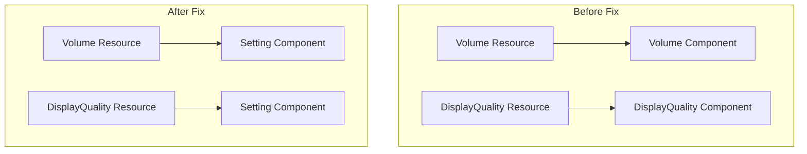

+++
title = "#22899 get game_menu running again"
date = "2026-02-11T00:00:00"
draft = false
template = "pull_request_page.html"
in_search_index = true

[taxonomies]
list_display = ["show"]

[extra]
current_language = "en"
available_languages = {"en" = { name = "English", url = "/pull_request/bevy/2026-02/pr-22899-en-20260211" }, "zh-cn" = { name = "中文", url = "/pull_request/bevy/2026-02/pr-22899-zh-cn-20260211" }}
labels = ["A-ECS", "A-UI"]
+++

# Title

## Basic Information
- **Title**: get game_menu running again
- **PR Link**: https://github.com/bevyengine/bevy/pull/22899
- **Author**: ChristopherBiscardi
- **Status**: MERGED
- **Labels**: A-ECS, A-UI, S-Ready-For-Final-Review
- **Created**: 2026-02-11T02:52:59Z
- **Merged**: 2026-02-11T05:03:50Z
- **Merged By**: alice-i-cecile

## Description

# Objective

fixes #22897

## Solution

Introduces a new generic `Setting` component to differentiate between the Resource and the Component. This example was using one type as both uses.

## Testing

```
cargo run --example game_menu
```

https://github.com/user-attachments/assets/409f60c5-92cf-4201-a09f-820475194f86


## The Story of This Pull Request

The issue was straightforward: the `game_menu` example was broken because it was using the same Rust type as both a Resource and a Component in the Bevy ECS. In Bevy, a type can be registered as a Resource or as a Component, but not both simultaneously for the same type. The example was trying to use the `Volume` and `DisplayQuality` types in both capacities, which caused a conflict.

The problem manifested when running the example, and the issue (#22897) documented this breakage. The root cause was a recent change in Bevy's ECS that enforced stricter type registration rules, preventing the same type from being used as both a Resource and a Component.

The solution took a direct approach: create a wrapper component type that can hold the same data as the Resource types. This wrapper, called `Setting<T>`, is a generic component that stores a value of type `T`. By using `Setting<Volume>` and `Setting<DisplayQuality>` as components, we differentiate them from the `Volume` and `DisplayQuality` Resources, resolving the type registration conflict.

From an implementation perspective, the changes were minimal but precise. First, the `Setting<T>` struct was defined and marked as a Component:

```rust
#[derive(Component)]
struct Setting<T>(T);
```

Then, the `setting_button` system's query was updated to look for `Setting<T>` instead of `T` directly:

```rust
fn setting_button<T: Resource + Component + PartialEq + Copy>(
    interaction_query: Query<
        (&Interaction, &Setting<T>, Entity),
        (Changed<Interaction>, With<Button>),
    >,
    // ... rest of parameters
) {
    // ... system logic
}
```

Inside the system, when comparing and assigning the setting value, we now access the inner value via `.0`:

```rust
if *interaction == Interaction::Pressed && *setting != button_setting.0 {
    // ... update selected button
    *setting = button_setting.0;
}
```

Finally, when creating the UI buttons, the setting values were wrapped in the `Setting` component:

```rust
// For DisplayQuality:
Setting(quality_setting)

// For Volume:
Setting(Volume(volume_setting))
```

This approach maintains the separation of concerns while preserving the example's functionality. The `Setting<T>` component acts as a marker that holds configuration values for UI elements, while the Resource stores the actual application state. The system reads from the component when a button is pressed and updates the Resource accordingly.

The fix is a good example of how to handle cases where the same data needs to exist in different contexts within the ECS. By creating a distinct component type, we adhere to Bevy's type registration requirements while maintaining clean data flow. This pattern could be useful in other scenarios where UI elements need to reference configuration values that are also stored as Resources.

## Visual Representation



## Key Files Changed

**`examples/games/game_menu.rs` (+12/-6)**

This is the only file modified in the PR. The changes fix the type conflict by introducing a wrapper component for settings.

Key modifications:

1. **Added the `Setting<T>` component wrapper:**
```rust
#[derive(Component)]
struct Setting<T>(T);
```

2. **Updated the `setting_button` system signature and logic:**
```rust
// Before:
fn setting_button<T: Resource + Component + PartialEq + Copy>(
    interaction_query: Query<(&Interaction, &T, Entity), (Changed<Interaction>, With<Button>)>,
    // ...

// After:
fn setting_button<T: Resource + Component + PartialEq + Copy>(
    interaction_query: Query<
        (&Interaction, &Setting<T>, Entity),
        (Changed<Interaction>, With<Button>),
    >,
    // ...
```

3. **Updated value access in the system logic:**
```rust
// Before:
if *interaction == Interaction::Pressed && *setting != *button_setting {
    *setting = *button_setting;
}

// After:
if *interaction == Interaction::Pressed && *setting != button_setting.0 {
    *setting = button_setting.0;
}
```

4. **Updated UI button creation to use the wrapper component:**
```rust
// For DisplayQuality buttons - Before:
quality_setting,

// For DisplayQuality buttons - After:
Setting(quality_setting),

// For Volume buttons - Before:
Volume(volume_setting),

// For Volume buttons - After:
Setting(Volume(volume_setting)),
```

These changes ensure that the Resource types (`Volume` and `DisplayQuality`) are only used as Resources, while their component counterparts are wrapped in `Setting<T>`, resolving the type registration conflict.

## Further Reading

- [Bevy ECS Components Documentation](https://bevyengine.org/learn/quick-start/ecs/#components)
- [Bevy Resources Documentation](https://bevyengine.org/learn/quick-start/ecs/#resources)
- [Bevy UI Example - Game Menu](https://github.com/bevyengine/bevy/blob/main/examples/games/game_menu.rs)
- [Rust Generics Documentation](https://doc.rust-lang.org/book/ch10-01-syntax.html)