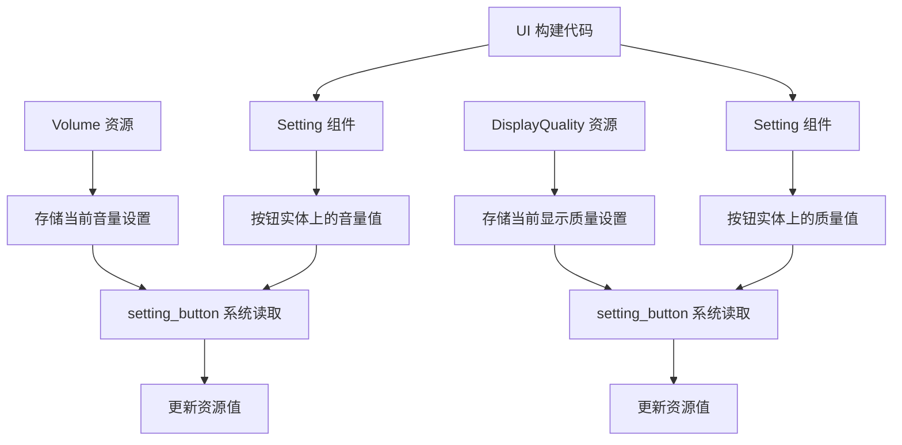

+++
title = "#22899 get game_menu running again"
date = "2026-02-11T00:00:00"
draft = false
template = "pull_request_page.html"
in_search_index = false

[extra]
current_language = "zh-cn"
available_languages = {"en" = { name = "English", url = "/pull_request/bevy/2026-02/pr-22899-en-20260211" }, "zh-cn" = { name = "中文", url = "/pull_request/bevy/2026-02/pr-22899-zh-cn-20260211" }}
+++

# Title
get game_menu running again

## Basic Information
- **标题**: get game_menu running again
- **PR 链接**: https://github.com/bevyengine/bevy/pull/22899
- **作者**: ChristopherBiscardi
- **状态**: MERGED
- **标签**: A-ECS, A-UI, S-Ready-For-Final-Review
- **创建时间**: 2026-02-11T02:52:59Z
- **合并时间**: 2026-02-11T05:03:50Z
- **合并人**: alice-i-cecile

## 描述翻译
### Objective
修复 #22897

### Solution
引入一个新的通用 `Setting` 组件来区分资源（Resource）和组件（Component）。这个示例之前使用同一个类型同时作为两种用途。

### Testing
```
cargo run --example game_menu
```

https://github.com/user-attachments/assets/409f60c5-92cf-4201-a09f-820475194f86

## 本次 PR 的技术分析

### 问题和背景
这个 PR 解决了一个具体的编译错误问题（issue #22897）。在 Bevy 的 `game_menu` 示例中，开发者遇到了一个类型系统的冲突问题。问题的核心在于 `Volume` 和 `DisplayQuality` 这两个类型同时被用作资源（Resource）和组件（Component）。在 Bevy 的 ECS 架构中，一个类型不能同时以这两种角色存在，因为 ECS 系统需要明确区分实体组件和全局资源。

具体来说，在设置按钮的交互系统中，`setting_button` 系统期望查询到某个类型 `T` 的组件，但这个类型 `T` 同时又被用作资源来存储当前设置。这种设计在之前的 Bevy 版本中可能可以工作，但在当前版本中由于类型系统的限制导致了编译错误。

### 解决方案
开发者采用了一个简洁的包装器模式来解决这个问题。他们创建了一个通用的 `Setting<T>` 组件，这是一个简单的元组结构体，用于包装原始的设置值。通过这种方式：
1. `Volume` 和 `DisplayQuality` 类型继续作为资源使用
2. `Setting<Volume>` 和 `Setting<DisplayQuality>` 作为组件附加到按钮实体上

这样就在类型层面明确区分了资源的 `Volume` 和组件的 `Setting<Volume>`，解决了类型冲突问题。

### 实现细节
主要改动集中在 `setting_button` 系统和 UI 构建代码中。以下是关键的修改点：

**系统查询的更新**：
```rust
// 之前：
fn setting_button<T: Resource + Component + PartialEq + Copy>(
    interaction_query: Query<(&Interaction, &T, Entity), (Changed<Interaction>, With<Button>)>,
    // ...
)

// 之后：
fn setting_button<T: Resource + Component + PartialEq + Copy>(
    interaction_query: Query<
        (&Interaction, &Setting<T>, Entity),
        (Changed<Interaction>, With<Button>),
    >,
    // ...
)
```
系统的泛型签名保持不变，但查询现在要求的是 `Setting<T>` 而不是直接的 `T`。

**值比较和赋值的更新**：
```rust
// 之前：
if *interaction == Interaction::Pressed && *setting != *button_setting {
    // ...
    *setting = *button_setting;
}

// 之后：
if *interaction == Interaction::Pressed && *setting != button_setting.0 {
    // ...
    *setting = button_setting.0;
}
```
现在需要从 `Setting` 包装器中提取实际值（`.0`）进行比较和赋值。

**UI 构建的更新**：
```rust
// 之前：
entity.insert((/* 按钮样式 */, quality_setting));

// 之后：
entity.insert((/* 按钮样式 */, Setting(quality_setting)));
```
创建按钮时，现在将设置值包装在 `Setting` 组件中。

### 技术洞察
这个修复展示了几个重要的 Bevy ECS 概念：

1. **资源与组件的分离**：Bevy 明确区分全局状态（资源）和实体相关数据（组件）。虽然同一个数据可能需要以两种形式存在，但类型系统要求它们是不同的类型。

2. **包装器模式**：`Setting<T>` 是一个典型的包装器（wrapper）或新类型（newtype）模式。它创建了一个新的类型，但在运行时包含与原始类型相同的数据。这种方法在需要区分同一数据的不同语义角色时非常有用。

3. **泛型系统设计**：`setting_button` 系统使用泛型来处理不同类型的设置，这种设计使得系统可以复用，无论是音量设置还是显示质量设置都可以使用同一个系统逻辑。

4. **零成本抽象**：`Setting<T>` 是一个元组结构体，在编译时会进行优化，运行时不会有额外的开销。Rust 的零成本抽象原则在这里得到体现。

### 影响和意义
这个修复虽然看起来是一个小的改动，但有几个重要的影响：

1. **恢复示例功能**：`game_menu` 示例现在可以正常编译和运行，这对于用户学习和理解 Bevy 的 UI 和状态管理非常重要。

2. **类型安全的改进**：通过明确区分资源和组件类型，代码现在更加类型安全，减少了潜在的混淆和错误。

3. **模式示例**：这个解决方案为处理类似问题提供了一个清晰的模式。当其他开发者遇到需要同一数据同时作为资源和组件的情况时，可以参考这个包装器方法。

4. **向后兼容性**：这个改动保持了 API 的向后兼容性，没有改变现有系统的行为，只是增加了类型包装层。

## 可视化关系图



## 关键文件变更

### `examples/games/game_menu.rs` (+12/-6)

**变更描述**：
这个文件包含了主要的修复。新增了一个通用的 `Setting<T>` 组件，并更新了设置按钮系统以使用这个包装器组件。

**关键代码片段**：
```rust
// 新增：Setting 包装器组件
#[derive(Component)]
struct Setting<T>(T);

// 系统查询的变更
// 之前：
interaction_query: Query<(&Interaction, &T, Entity), (Changed<Interaction>, With<Button>)>

// 之后：
interaction_query: Query<
    (&Interaction, &Setting<T>, Entity),
    (Changed<Interaction>, With<Button>),
>

// 值比较的变更
// 之前：
if *interaction == Interaction::Pressed && *setting != *button_setting {

// 之后：
if *interaction == Interaction::Pressed && *setting != button_setting.0 {

// 值赋值的变更
// 之前：
*setting = *button_setting;

// 之后：
*setting = button_setting.0;

// UI 构建的变更
// 之前：
entity.insert((/* ... */, quality_setting));

// 之后：
entity.insert((/* ... */, Setting(quality_setting)));

// 之前：
entity.insert((/* ... */, Volume(volume_setting)));

// 之后：
entity.insert((/* ... */, Setting(Volume(volume_setting))));
```

**与 PR 目的的关系**：
这些变更共同解决了类型冲突问题，使 `game_menu` 示例能够正常编译和运行。通过引入 `Setting<T>` 包装器，清晰地区分了作为资源的设置类型和作为组件的设置类型。

## 进一步阅读建议

1. **Bevy ECS 文档**：了解资源和组件的区别以及如何在 Bevy 中使用它们
   - https://bevyengine.org/learn/book/getting-started/ecs/

2. **Rust 新类型模式**：深入理解包装器模式在 Rust 中的应用
   - https://doc.rust-lang.org/rust-by-example/generics/new_types.html

3. **Bevy UI 系统**：学习如何构建交互式 UI，包括按钮和状态管理
   - https://bevyengine.org/examples/ui/ui/

4. **泛型编程**：了解如何在 Rust 和 Bevy 中使用泛型创建可复用系统
   - https://doc.rust-lang.org/book/ch10-00-generics.html