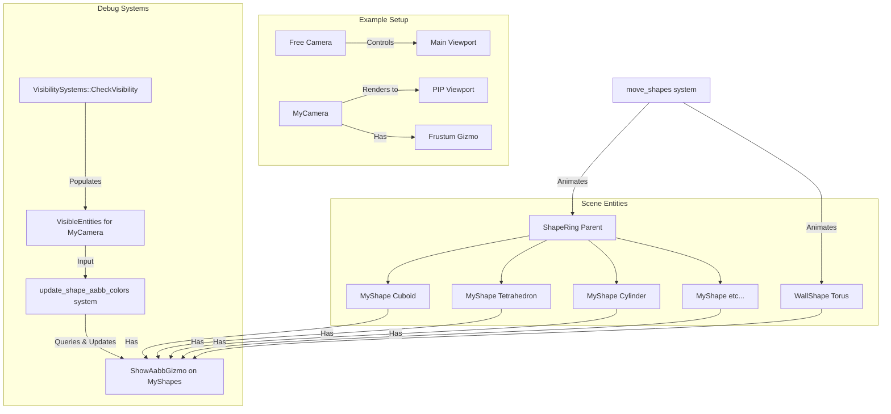

+++
title = "#22900 Debug Frustum Culling Usage Example"
date = "2026-02-13T00:00:00"
draft = false
template = "pull_request_page.html"
in_search_index = false

[extra]
current_language = "zh-cn"
available_languages = {"en" = { name = "English", url = "/pull_request/bevy/2026-02/pr-22900-en-20260213" }, "zh-cn" = { name = "中文", url = "/pull_request/bevy/2026-02/pr-22900-zh-cn-20260213" }}
labels = ["C-Examples", "A-Gizmos", "D-Straightforward"]
+++

# Title: Debug Frustum Culling Usage Example

## Basic Information
- **Title**: Debug Frustum Culling Usage Example
- **PR Link**: https://github.com/bevyengine/bevy/pull/22900
- **Author**: kfc35
- **Status**: MERGED
- **Labels**: C-Examples, S-Ready-For-Final-Review, A-Gizmos, X-Uncontroversial, D-Straightforward
- **Created**: 2026-02-11T03:11:06Z
- **Merged**: 2026-02-13T07:36:18Z
- **Merged By**: alice-i-cecile

## Description Translation

# Objective
- 修复 #22881。现在我们有了 Aabb & Frustum Gizmos，让我们提供一个它们的使用示例！

## Solution
- 一个新的使用示例，专注于调试视锥体剔除。使用一个自由相机，你可以检查一个包含另一个静止相机的场景，该静止相机的视锥体被可视化，并且有各种与视锥体交互的形状。

## Testing
`cargo run --example debug_frustum_culling --features=“free_camera”`

https://github.com/user-attachments/assets/08add970-4e80-4ac1-a81b-32b691f0a803

## The Story of This Pull Request

这个 Pull Request 源自一个明确的需求：Bevy 社区需要一个展示如何可视化和调试视锥体剔除（frustum culling）的示例。视锥体剔除是渲染管线中的一个关键优化步骤，它通过只渲染位于相机视锥体内的物体来显著提升性能。然而，这个过程对开发者来说通常是不可见的，使得调试相关问题和理解剔除边界变得困难。

此前，Bevy 引擎已经引入了用于可视化轴对齐包围盒（Aabb）和视锥体（Frustum）的 Gizmo 工具。这些工具是强大的调试辅助手段，但社区缺少一个完整的、集成的示例来展示如何将它们结合起来，实际应用于调试剔除逻辑。PR #22881 正是提出了这个需求。

为了解决这个问题，贡献者 `kfc35` 创建了一个名为 `debug_frustum_culling` 的新示例。这个示例的设计目标很明确：构建一个沙盒环境，让开发者能够直观地观察物体何时进入或离开相机的视锥体，并理解其背后的 Aabb 与 Frustum 的相交测试。

该示例的实现采用了经典的双相机设置，这是一个非常实用的模式。主相机是一个用户可以自由控制（通过 `FreeCameraPlugin`）的观察者相机，它占据了屏幕的大部分区域，允许用户从任意角度探索场景。第二个相机，标记为 `MyCamera`，是我们想要调试其剔除行为的对象。它的渲染输出通过设置 `Camera` 组件的 `viewport` 属性，以画中画（Picture-in-Picture）的形式显示在屏幕的右下角。这种设计让开发者可以同时看到全局场景和 `MyCamera` 的特定视角。

示例场景的构建也服务于调试目的。它创建了一个包含多种不同形状（立方体、四面体、圆柱体、球体等）的环形阵列，这些形状都在持续运动。此外，还有一个在墙后上下移动的环形（Torus）形状。所有 `MyShape` 实体都自动附加了 `ShowAabbGizmo` 组件（通过 `#[require]` 属性），因此它们的包围盒会被绘制出来。

技术实现的核心在于 `update_shape_aabb_colors` 系统。这个系统被安排在 `PostUpdate` 阶段，并且明确地在 `VisibilitySystems::CheckVisibility` 之后运行。这是一个关键的设计决策，因为它确保了我们的调试可视化能够读取到经过 Bevy 标准可见性计算后的最终结果。系统的工作流程很清晰：首先，它将所有形状的 Aabb Gizmo 颜色重置为配置的默认颜色（红色）。然后，它查询 `MyCamera` 的 `VisibleEntities` 列表。这个列表包含了经过视锥体剔除后，被认为对该相机可见的实体。对于列表中的每一个实体，系统将其 Aabb Gizmo 的颜色设置为绿色。这样，红色代表被剔除（不可见），绿色代表可见，提供了即时的视觉反馈。

为了增强示例的实用性，作者还添加了两个便捷功能：通过按键盘‘1’和‘2’，可以将自由相机瞬间移动到 `MyCamera` 的位置或重置回初始位置。这使得开发者可以快速地将观察视角对齐到调试相机的视锥体边缘，以便更精确地观察物体进出视锥体的临界状态。

总而言之，这个 PR 并非修改引擎核心逻辑，而是提供了一个高质量的、即用型的教学与调试工具。它有效地利用了 Bevy 现有的 Gizmo 和可见性系统 API，展示了如何在实际代码中组合这些功能来解决一个具体的开发问题——理解和调试视锥体剔除。这样的示例对于学习引擎工作原理和加速开发调试过程具有直接的价值。

## Visual Representation



## Key Files Changed

这个 PR 创建了一个全新的示例文件，并在配置文件和文档中进行了相应注册。

1.  **`examples/usage/debug_frustum_culling.rs`** (+367/-0)
    *   **描述**：这是本次 PR 新增的核心示例文件。它包含了构建调试场景、定义组件、实现动画和更新 Gizmo 颜色的所有逻辑。
    *   **关键代码片段 (启动系统)**：
        ```rust
        fn setup(
            mut commands: Commands,
            windows: Query<&Window>,
            mut config_store: ResMut<GizmoConfigStore>,
            mut meshes: ResMut<Assets<Mesh>>,
            mut materials: ResMut<Assets<StandardMaterial>>,
        ) -> Result {
            // ... 获取窗口等 ...
        
            // 创建自由观察相机
            let free_camera = commands
                .spawn((
                    Camera3d::default(),
                    FREE_CAMERA_START_TRANSFORM.looking_at(FREE_CAMERA_START_TARGET, Vec3::Y),
                    FreeCamera::default(),
                ))
                .id();
        
            // 创建要被调试的相机 (MyCamera)，并设置其视口为右下角画中画
            let my_camera = commands
                .spawn((
                    Camera3d::default(),
                    Transform::from_xyz(0., 1.5, 0.).looking_at(Vec3::new(1.0, 1.5, 0.), Vec3::Y),
                    Camera {
                        order: 1,
                        viewport: Some(Viewport {
                            physical_position: window.physical_size() * 2 / 3,
                            physical_size: window.physical_size() / 3,
                            ..default()
                        }),
                        msaa_writeback: MsaaWriteback::Off,
                        ..default()
                    },
                    MyCamera, // 标记组件
                ))
                .id();
            // ... 创建UI、地板、墙壁、灯光和形状 ...
            Ok(())
        }
        ```
    *   **关键代码片段 (颜色更新系统)**：
        ```rust
        fn update_shape_aabb_colors(
            view_query: Query<&VisibleEntities, With<MyCamera>>,
            mut gizmo_query: Query<&mut ShowAabbGizmo, With<MyShape>>,
        ) -> Result {
            // 重置所有形状的Gizmo颜色为默认值（红色）
            for mut shape_gizmo in &mut gizmo_query {
                shape_gizmo.color = None;
            }
        
            // 获取 MyCamera 可见的实体列表，并将它们的Gizmo设为绿色
            let visible_entities = view_query.single()?;
            for entity in visible_entities.entities.values().flatten() {
                if let Ok(mut shape_gizmo) = gizmo_query.get_mut(*entity) {
                    shape_gizmo.color = Some(Color::LinearRgba(LinearRgba::GREEN));
                }
            }
            Ok(())
        }
        ```
    *   **与PR目的的关系**：此文件完整实现了 PR 描述的目标，即提供一个使用 Aabb 和 Frustum Gizmo 来调试视锥体剔除的可运行示例。

2.  **`Cargo.toml`** (+14/-0)
    *   **描述**：在 Bevy 的示例列表中添加了新示例 `debug_frustum_culling` 的配置项，指定了文件路径、所需特性 (`free_camera`) 以及元数据（名称、描述、分类）。
    *   **关键代码片段**：
        ```toml
        [[example]]
        name = "debug_frustum_culling"
        path = "examples/usage/debug_frustum_culling.rs"
        # Causes an ICE on docs.rs
        doc-scrape-examples = false
        required-features = ["free_camera"]
        
        [package.metadata.example.debug_frustum_culling]
        name = "Debug Frustum Culling"
        description = "Example demonstrating how to debug frustum culling"
        category = "Usage"
        wasm = true
        ```
    *   **与PR目的的关系**：这是将新示例集成到项目构建系统中的必要步骤，使得用户可以通过 `cargo run --example debug_frustum_culling` 命令来运行它。

3.  **`examples/README.md`** (+1/-0)
    *   **描述**：在“Usage”类别的示例列表中新增了一行，添加了指向新示例的链接和简短描述。
    *   **关键代码片段**：
        ```markdown
        | [Debug Frustum Culling](../examples/usage/debug_frustum_culling.rs) | Example demonstrating how to debug frustum culling
        ```
    *   **与PR目的的关系**：更新文档以保持示例目录的完整性和可发现性，方便用户浏览和找到这个新示例。

## Further Reading
*   **Bevy 官方文档：可见性 (Visibility)**
    *   链接：`bevy::camera::visibility` 模块文档。这是理解 `VisibleEntities` 和 `VisibilitySystems::CheckVisibility` 系统的基础。
*   **Bevy 官方文档：Gizmos**
    *   链接：`bevy::gizmos` 模块文档。深入了解 AabbGizmo、FrustumGizmo 及其配置 (`GizmoConfigStore`)。
*   **Bevy 官方示例：`free_camera`**
    *   运行 `cargo run --example free_camera`。这是本示例所依赖的相机控制插件的独立演示，有助于理解其控制方式。
*   **计算机图形学概念：视锥体剔除 (Frustum Culling)**
    *   这是一个标准的实时渲染优化技术。可以查阅图形学教材或网络资料，了解其背后的数学原理（通常涉及包围体与视锥体六个平面的相交测试）。

# Full Code Diff
(Provided in the user‘s request, omitted here for brevity as the key changes have been detailed above.)