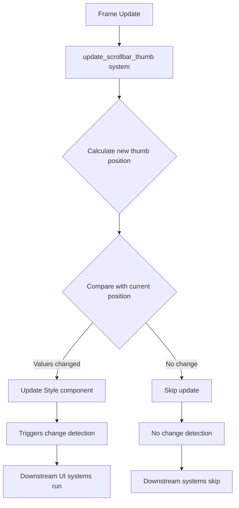

+++
title = "#22903 Do not trigger ui Node change in each frame while updating scrollbar"
date = "2026-02-12T00:00:00"
draft = false
template = "pull_request_page.html"
in_search_index = true

[taxonomies]
list_display = ["show"]

[extra]
current_language = "en"
available_languages = {"en" = { name = "English", url = "/pull_request/bevy/2026-02/pr-22903-en-20260212" }, "zh-cn" = { name = "中文", url = "/pull_request/bevy/2026-02/pr-22903-zh-cn-20260212" }}
labels = ["C-Bug", "C-Performance", "A-UI", "D-Straightforward"]
+++

# Title
Do not trigger ui Node change in each frame while updating scrollbar

## Basic Information
- **Title**: Do not trigger ui Node change in each frame while updating scrollbar
- **PR Link**: https://github.com/bevyengine/bevy/pull/22903
- **Author**: PPakalns
- **Status**: MERGED
- **Labels**: C-Bug, C-Performance, A-UI, S-Ready-For-Final-Review, D-Straightforward
- **Created**: 2026-02-11T09:01:23Z
- **Merged**: 2026-02-12T19:50:12Z
- **Merged By**: alice-i-cecile

## Description Translation

# Objective

Fixes https://github.com/bevyengine/bevy/issues/22893

## Testing

- Used Tracy profiler to see performance improvements and 'track_location' bevy feature.

## The Story of This Pull Request

The issue identified in PR #22903 was a performance problem in Bevy's UI scrollbar implementation. During each frame update, the scrollbar thumb position was being recalculated and set unconditionally, even when the values hadn't changed from the previous frame. This constant updating triggered unnecessary change detection in Bevy's ECS (Entity Component System), causing the UI system to process the scrollbar node every frame regardless of whether it actually needed updating.

The problem surfaced as a performance degradation in applications using scrollable UI elements. When developers profiled their applications using tools like Tracy, they observed that the `update_scrollbar_thumb` system was running more frequently than necessary, contributing to CPU overhead even in static or minimally changing UI scenarios.

The root cause was straightforward: the scrollbar update logic directly assigned new values to the style properties without checking if those values had changed from their current state. In Bevy's UI system, when a component like `Style` is modified, it marks the entity as changed, which triggers various downstream systems to re-evaluate the UI layout and rendering. This is necessary when values actually change, but wasteful when they remain the same.

The solution implemented is a classic change detection pattern. Instead of directly assigning the calculated values:
```rust
thumb.left = Val::Px(thumb_pos);
thumb.width = Val::Px(thumb_size);
```

The PR introduces temporary variables for the new values, compares them against the current values, and only applies the changes when a difference is detected:
```rust
let left = Val::Px(thumb_pos);
let width = Val::Px(thumb_size);
if left != thumb.left || width != thumb.width {
    thumb.left = left;
    thumb.width = width;
}
```

This approach is applied to both horizontal and vertical scrollbar orientations, covering all four style properties that control the thumb's position and size (top/bottom/left/right and width/height depending on orientation).

The implementation demonstrates an important optimization technique in ECS-based game engines: minimizing unnecessary change detection. When working with systems that run every frame, it's crucial to avoid writing to components unless the values have actually changed. This reduces the workload for downstream systems that only need to process entities when their data has been modified.

The fix is particularly effective because scrollbar thumb positions often remain constant across multiple frames, especially when the user isn't actively scrolling. Even during scrolling, the thumb position may not change every single frame depending on the scrolling velocity and frame timing.

From an engineering perspective, this fix follows the principle of idempotence - applying the same operation multiple times should produce the same result without unnecessary side effects. By adding the equality check, the system now behaves idempotently for unchanged scroll positions.

The PR author validated the fix using Tracy profiler and Bevy's `track_location` feature, which are appropriate tools for this type of performance optimization. Tracy provides detailed timing information to confirm reduced CPU usage, while `track_location` helps verify that change detection is only triggered when necessary.

## Visual Representation



## Key Files Changed

### `crates/bevy_ui_widgets/src/scrollbar.rs` (+28/-8)

This file contains the scrollbar widget implementation in Bevy's UI system. The changes are focused on the `update_scrollbar_thumb` function, which calculates and applies the position and size of the scrollbar thumb based on the current scroll position.

**Key Changes:**
The function now includes change detection logic before updating style properties, preventing unnecessary UI updates when scrollbar thumb values haven't changed.

**Code Snippet - Horizontal Scrollbar:**
```rust
// Before: Direct assignment every frame
thumb.top = Val::Px(0.);
thumb.bottom = Val::Px(0.);
thumb.left = Val::Px(thumb_pos);
thumb.width = Val::Px(thumb_size);

// After: Conditional assignment only on change
let top = Val::Px(0.);
let bottom = Val::Px(0.);
let left = Val::Px(thumb_pos);
let width = Val::Px(thumb_size);
if top != thumb.top
    || bottom != thumb.bottom
    || left != thumb.left
    || width != thumb.width
{
    thumb.top = top;
    thumb.bottom = bottom;
    thumb.left = left;
    thumb.width = width;
}
```

**Code Snippet - Vertical Scrollbar:**
```rust
// Before: Direct assignment every frame
thumb.left = Val::Px(0.);
thumb.right = Val::Px(0.);
thumb.top = Val::Px(thumb_pos);
thumb.height = Val::Px(thumb_size);

// After: Conditional assignment only on change
let left = Val::Px(0.);
let right = Val::Px(0.);
let top = Val::Px(thumb_pos);
let height = Val::Px(thumb_size);
if thumb.left != left
    || thumb.right != right
    || thumb.top != top
    || thumb.height != height
{
    thumb.left = left;
    thumb.right = right;
    thumb.top = top;
    thumb.height = height;
}
```

**Relationship to PR Purpose:**
These changes directly implement the performance optimization described in the PR title and objective. By adding conditional checks before updating style properties, the system avoids triggering UI node change detection when scrollbar thumb values remain unchanged between frames.

## Further Reading

1. **Bevy Change Detection Documentation**: https://bevyengine.org/learn/book/change-detection/
2. **Bevy UI System Architecture**: https://bevyengine.org/learn/book/ui/
3. **ECS Performance Optimization Patterns**: https://github.com/bevyengine/bevy/discussions/2690
4. **Tracy Profiler for Game Development**: https://github.com/wolfpld/tracy
5. **Idempotence in Game Engine Systems**: Common pattern in ECS architectures to minimize unnecessary processing

---

# Full Code Diff
```diff
diff --git a/crates/bevy_ui_widgets/src/scrollbar.rs b/crates/bevy_ui_widgets/src/scrollbar.rs
index db3a166ac0be9..6c3087d7576b5 100644
--- a/crates/bevy_ui_widgets/src/scrollbar.rs
+++ b/crates/bevy_ui_widgets/src/scrollbar.rs
@@ -308,10 +308,20 @@ fn update_scrollbar_thumb(
                             scroll_area.0.x,
                         );
 
-                        thumb.top = Val::Px(0.);
-                        thumb.bottom = Val::Px(0.);
-                        thumb.left = Val::Px(thumb_pos);
-                        thumb.width = Val::Px(thumb_size);
+                        let top = Val::Px(0.);
+                        let bottom = Val::Px(0.);
+                        let left = Val::Px(thumb_pos);
+                        let width = Val::Px(thumb_size);
+                        if top != thumb.top
+                            || bottom != thumb.bottom
+                            || left != thumb.left
+                            || width != thumb.width
+                        {
+                            thumb.top = top;
+                            thumb.bottom = bottom;
+                            thumb.left = left;
+                            thumb.width = width;
+                        }
                     }
                     ControlOrientation::Vertical => {
                         let (thumb_size, thumb_pos) = size_and_pos(
@@ -322,10 +332,20 @@ fn update_scrollbar_thumb(
                             scroll_area.0.y,
                         );
 
-                        thumb.left = Val::Px(0.);
-                        thumb.right = Val::Px(0.);
-                        thumb.top = Val::Px(thumb_pos);
-                        thumb.height = Val::Px(thumb_size);
+                        let left = Val::Px(0.);
+                        let right = Val::Px(0.);
+                        let top = Val::Px(thumb_pos);
+                        let height = Val::Px(thumb_size);
+                        if thumb.left != left
+                            || thumb.right != right
+                            || thumb.top != top
+                            || thumb.height != height
+                        {
+                            thumb.left = left;
+                            thumb.right = right;
+                            thumb.top = top;
+                            thumb.height = height;
+                        }
                     }
                 };
             }
```