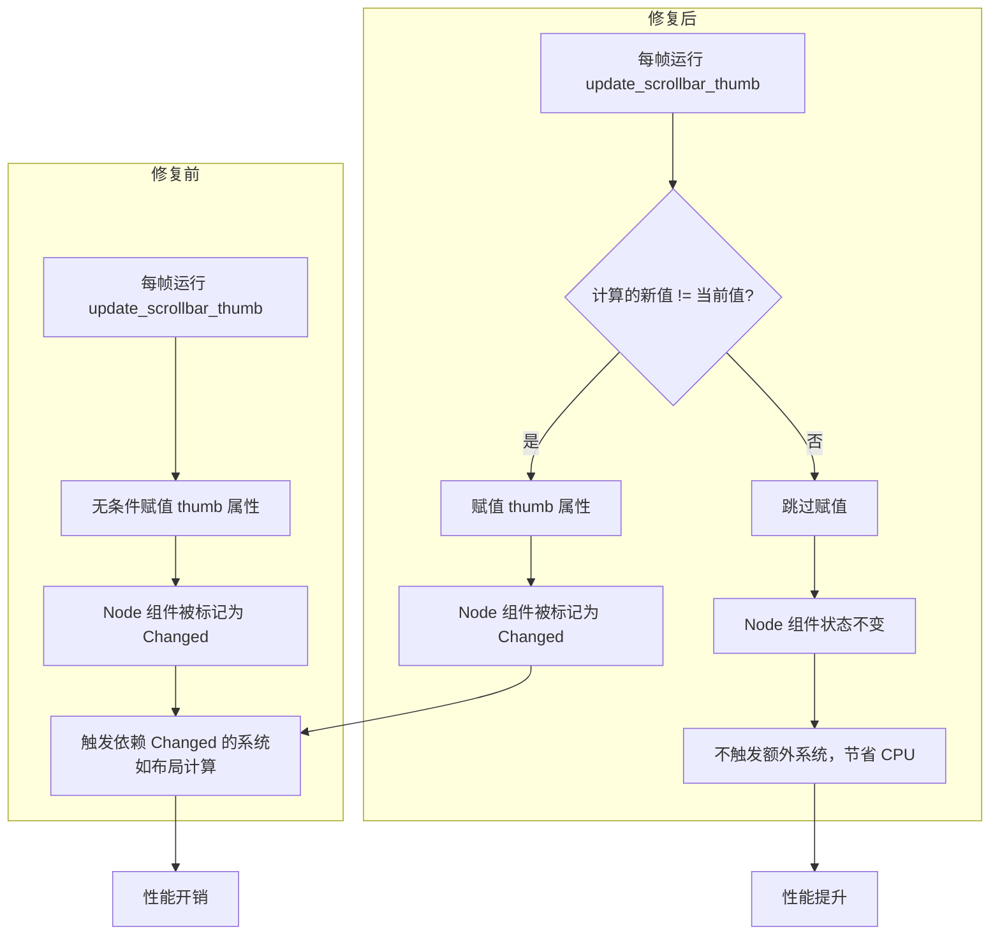

+++
title = "#22903 Do not trigger ui Node change in each frame while updating scrollbar"
date = "2026-02-12T00:00:00"
draft = false
template = "pull_request_page.html"
in_search_index = false

[extra]
current_language = "zh-cn"
available_languages = {"en" = { name = "English", url = "/pull_request/bevy/2026-02/pr-22903-en-20260212" }, "zh-cn" = { name = "中文", url = "/pull_request/bevy/2026-02/pr-22903-zh-cn-20260212" }}
labels = ["C-Bug", "C-Performance", "A-UI", "D-Straightforward"]
+++

# Title
不要在每个帧更新滚动条时触发 UI 节点变更检测

## Basic Information
- **Title**: Do not trigger ui Node change in each frame while updating scrollbar
- **PR Link**: https://github.com/bevyengine/bevy/pull/22903
- **Author**: PPakalns
- **Status**: MERGED
- **Labels**: C-Bug, C-Performance, A-UI, S-Ready-For-Final-Review, D-Straightforward
- **Created**: 2026-02-11T09:01:23Z
- **Merged**: 2026-02-12T19:50:12Z
- **Merged By**: alice-i-cecile

## Description Translation
**目标**
修复 https://github.com/bevyengine/bevy/issues/22893

**测试**
- 使用 Tracy profiler 观察性能改进和 'track_location' bevy 特性。

## The Story of This Pull Request

这个 PR 源于一个性能问题。在 Bevy 的 UI 系统中，滚动条的滑块（thumb）位置和大小需要根据滚动区域的内容动态更新。问题出现在 `update_scrollbar_thumb` 这个系统函数里。在修复前，该系统在每一帧运行时，无论滑块的属性（如 `top`， `left`， `width`）是否真的发生了变化，都会无条件地对其重新赋值。

从技术角度看，这触发了 Bevy ECS 内部的变化检测（Change Detection）机制。Bevy 的组件（`Component`）通过 `DerefMut` 实现变化追踪：每当对组件的字段进行赋值，即便赋的是相同的值，也会标记该组件为已变更（`Mut`）。对于 UI 节点（`Node`）组件来说，这会导致下游一系列依赖 `Changed<Node>` 查询的系统被不必要地执行，例如布局（Layout）重计算，从而造成了性能浪费。

开发者 PPakalns 通过 Tracy profiler 和 Bevy 的 `track_location` 特性定位到了这个问题。Profiler 的结果显示，即使 UI 处于静止状态（没有滚动操作），与 UI 节点变更相关的系统也持续消耗着 CPU 时间。

解决方案非常直接：在更新滑块组件的属性前，先进行一次比较。只有当计算出的新值与当前值确实不同时，才执行赋值操作。这个模式在优化中很常见，目的是避免触发无意义的变化检测，其核心是尊重 Bevy ECS 的变更检测语义。

具体实现上，代码为水平和垂直两种滚动条方向分别计算了新的位置（如 `thumb_pos`）和尺寸（如 `thumb_size`）。在修复前，这些 `Val::Px(...)` 值被直接赋给 `thumb`（一个 `Node` 组件）的对应字段。修复后，代码先将新值存储在局部变量（`top`， `left`， `width` 等）中，然后通过一个 `if` 条件语句，比较所有相关的新旧值。仅在任一值不相等时，才将局部变量的值赋给 `thumb` 的字段。

这种修改是一个典型的“空操作（no-op）优化”。它没有改变任何业务逻辑——滑块的视觉表现和之前完全一致。它只是减少了在数据未变化时产生的“噪音”，让 ECS 的变化检测机制能更准确地反映真实的变更。

这个修复的收益取决于 UI 的复杂度和滚动条的数量。对于一个拥有多个静态滚动条的应用，它可以消除几乎所有的、在空闲状态下由滚动条更新系统引起的冗余计算。对于动态滚动的场景，它确保变化检测只在滑块位置实际移动时才被触发，同样提高了效率。

从工程角度看，这是一个低风险、高回报的修改。它改动范围极小，只影响一个函数；逻辑清晰，仅仅是增加了条件判断；并且完美解决了报告的性能问题。这解释了为什么它被标记为 `D-Straightforward` 并在短时间内就被合并。

## Visual Representation



## Key Files Changed

**crates/bevy_ui_widgets/src/scrollbar.rs** (+28/-8)

这是本次 PR 修改的唯一文件。修改位于 `update_scrollbar_thumb` 函数内，该函数负责根据滚动区域（`ScrollArea`）的状态更新滚动条滑块的外观（位置和大小）。

**修改详情：**

修改的核心逻辑是从直接赋值改为条件赋值。以下是关键代码段的对比：

**水平滚动条方向处理部分：**
```rust
// 修改前：
thumb.top = Val::Px(0.);
thumb.bottom = Val::Px(0.);
thumb.left = Val::Px(thumb_pos);
thumb.width = Val::Px(thumb_size);

// 修改后：
let top = Val::Px(0.);
let bottom = Val::Px(0.);
let left = Val::Px(thumb_pos);
let width = Val::Px(thumb_size);
if top != thumb.top
    || bottom != thumb.bottom
    || left != thumb.left
    || width != thumb.width
{
    thumb.top = top;
    thumb.bottom = bottom;
    thumb.left = left;
    thumb.width = width;
}
```

**垂直滚动条方向处理部分：**
```rust
// 修改前：
thumb.left = Val::Px(0.);
thumb.right = Val::Px(0.);
thumb.top = Val::Px(thumb_pos);
thumb.height = Val::Px(thumb_size);

// 修改后：
let left = Val::Px(0.);
let right = Val::Px(0.);
let top = Val::Px(thumb_pos);
let height = Val::Px(thumb_size);
if thumb.left != left
    || thumb.right != right
    || thumb.top != top
    || thumb.height != height
{
    thumb.left = left;
    thumb.right = right;
    thumb.top = top;
    thumb.height = height;
}
```

**修改关系：**
这两处修改遵循完全相同的模式，分别处理滚动条的两种朝向。它们直接解决了 PR 描述中的问题：阻止在每一帧（即使滑块位置未变）都触发 UI `Node` 组件的变更。这是通过确保仅在组件值实际发生变化时才进行写操作来实现的，从而避免了 Bevy ECS 的误判。

## Further Reading

1.  **Bevy Change Detection Official Guide**：了解 Bevy ECS 变化检测的工作原理是其高效使用的关键。
    *   [Bevy 官方文档 - Change Detection](https://docs.rs/bevy/latest/bevy/ecs/change_detection/index.html)

2.  **《Bevy 游戏开发指南》相关章节**：对于更宏观的 UI 系统架构和性能考量，社区编写的指南可能提供更多上下文。
    *   [Bevy Cheatbook - UI](https://bevy-cheatbook.github.io/features/ui.html)

3.  **性能分析工具 Tracy**：像本 PR 作者一样，学习使用性能分析工具是定位性能瓶颈的必备技能。
    *   [Tracy Profiler 官方网站](https://github.com/wolfpld/tracy)

# Full Code Diff
```
diff --git a/crates/bevy_ui_widgets/src/scrollbar.rs b/crates/bevy_ui_widgets/src/scrollbar.rs
index db3a166ac0be9..6c3087d7576b5 100644
--- a/crates/bevy_ui_widgets/src/scrollbar.rs
+++ b/crates/bevy_ui_widgets/src/scrollbar.rs
@@ -308,10 +308,20 @@ fn update_scrollbar_thumb(
                             scroll_area.0.x,
                         );
 
-                        thumb.top = Val::Px(0.);
-                        thumb.bottom = Val::Px(0.);
-                        thumb.left = Val::Px(thumb_pos);
-                        thumb.width = Val::Px(thumb_size);
+                        let top = Val::Px(0.);
+                        let bottom = Val::Px(0.);
+                        let left = Val::Px(thumb_pos);
+                        let width = Val::Px(thumb_size);
+                        if top != thumb.top
+                            || bottom != thumb.bottom
+                            || left != thumb.left
+                            || width != thumb.width
+                        {
+                            thumb.top = top;
+                            thumb.bottom = bottom;
+                            thumb.left = left;
+                            thumb.width = width;
+                        }
                     }
                     ControlOrientation::Vertical => {
                         let (thumb_size, thumb_pos) = size_and_pos(
@@ -322,10 +332,20 @@ fn update_scrollbar_thumb(
                             scroll_area.0.y,
                         );
 
-                        thumb.left = Val::Px(0.);
-                        thumb.right = Val::Px(0.);
-                        thumb.top = Val::Px(thumb_pos);
-                        thumb.height = Val::Px(thumb_size);
+                        let left = Val::Px(0.);
+                        let right = Val::Px(0.);
+                        let top = Val::Px(thumb_pos);
+                        let height = Val::Px(thumb_size);
+                        if thumb.left != left
+                            || thumb.right != right
+                            || thumb.top != top
+                            || thumb.height != height
+                        {
+                            thumb.left = left;
+                            thumb.right = right;
+                            thumb.top = top;
+                            thumb.height = height;
+                        }
                     }
                 };
             }
```