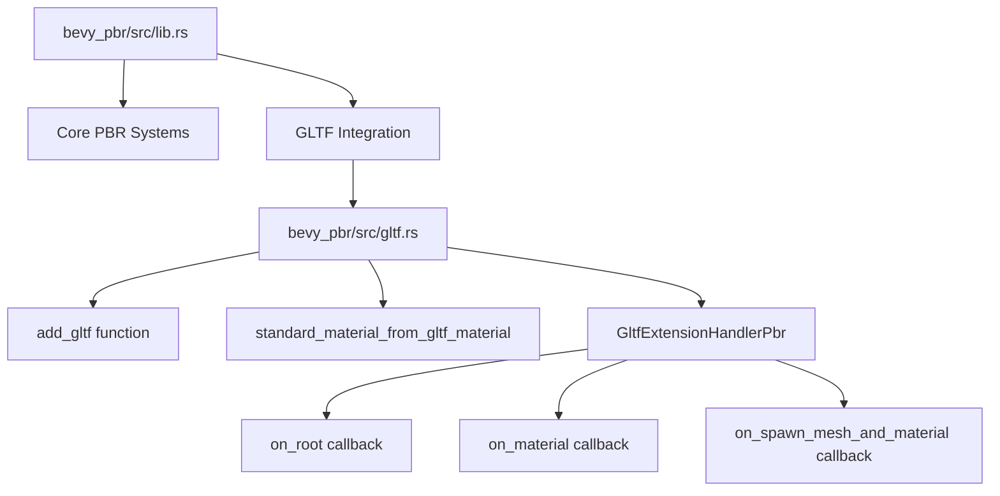

+++
title = "#22905 Move gltf stuff in pbr to its own file"
date = "2026-02-17T00:00:00"
draft = false
template = "pull_request_page.html"
in_search_index = true

[taxonomies]
list_display = ["show"]

[extra]
current_language = "en"
available_languages = {"en" = { name = "English", url = "/pull_request/bevy/2026-02/pr-22905-en-20260217" }, "zh-cn" = { name = "中文", url = "/pull_request/bevy/2026-02/pr-22905-zh-cn-20260217" }}
labels = ["D-Trivial", "A-Rendering", "C-Code-Quality"]
+++

# Title: Move gltf stuff in pbr to its own file

## Basic Information
- **Title**: Move gltf stuff in pbr to its own file
- **PR Link**: https://github.com/bevyengine/bevy/pull/22905
- **Author**: Zeophlite
- **Status**: MERGED
- **Labels**: D-Trivial, A-Rendering, C-Code-Quality, S-Ready-For-Final-Review
- **Created**: 2026-02-11T12:11:36Z
- **Merged**: 2026-02-17T00:14:46Z
- **Merged By**: alice-i-cecile

## Description Translation
# Objective

- Separation of concerns

## Solution

- Move GLTF stuff in pbr to its own files

## Testing

- `cargo run --example animated_mesh`

## The Story of This Pull Request

This PR is a straightforward code refactoring that addresses a common issue in growing codebases: the accumulation of related but distinct functionality in a single file. The `lib.rs` file in the `bevy_pbr` crate had grown to contain both the core PBR (Physically Based Rendering) logic and the GLTF-specific integration code.

The problem was one of organization and maintainability. With the GLTF handling code embedded directly in `lib.rs`, the file had become longer and harder to navigate. This made it more difficult for developers to understand the separation between the core PBR rendering system and the GLTF asset loading integration. The code worked correctly, but the organization didn't reflect the logical separation between these concerns.

The solution was simple and effective: extract all GLTF-related code into its own dedicated module. This approach follows established software engineering principles of modular design and separation of concerns. By moving the GLTF handling code to a separate file, the main `lib.rs` file becomes more focused on its primary responsibility - the PBR rendering system itself.

The implementation involved two main changes. First, a new `gltf.rs` file was created with 144 lines of code moved from `lib.rs`. This file contains the `add_gltf` function, the `standard_material_from_gltf_material` conversion function, and the `GltfExtensionHandlerPbr` struct with its trait implementation. Second, the main `lib.rs` file was updated to remove these 136 lines of GLTF code and instead include a simple module declaration and a call to the extracted function.

Looking at the code that was moved, we can see it handles several key responsibilities:

1. **GLTF Extension Registration**: The `add_gltf` function registers a GLTF extension handler, with platform-specific handling for WebAssembly versus native targets using conditional compilation.

2. **Material Conversion**: The `standard_material_from_gltf_material` function maps GLTF material properties to Bevy's `StandardMaterial` struct. This is a non-trivial mapping that needs to handle many material properties including base color, metallic roughness, normal maps, and various optional features controlled by feature flags.

3. **Extension Handler Implementation**: The `GltfExtensionHandlerPbr` struct implements the `GltfExtensionHandler` trait with three main callbacks:
   - `on_root`: Creates a default StandardMaterial for GLTF assets
   - `on_material`: Converts each GLTF material to a StandardMaterial
   - `on_spawn_mesh_and_material`: Attaches the converted materials to entities

The refactoring maintains the exact same functionality while improving code organization. The conditional compilation blocks (`#[cfg(target_family = "wasm")]` and `#[cfg(not(target_family = "wasm"))]`) are preserved exactly as they were, ensuring the same platform-specific behavior.

From an architectural perspective, this change makes the codebase more modular. The GLTF integration is now a self-contained module that can be understood and modified independently of the core PBR system. This separation also makes it easier to test the GLTF integration in isolation and reduces cognitive load when working on either the PBR system or the GLTF integration.

The testing approach was minimal but appropriate for a refactoring PR: running the `animated_mesh` example ensures that the GLTF functionality still works correctly after the code reorganization. Since this is a pure refactoring with no behavior changes, more extensive testing isn't necessary.

This type of refactoring is common in mature codebases as they evolve. What starts as a few related functions in a main file can grow into a substantial amount of code that deserves its own module. By proactively addressing this, the Bevy maintainers keep the codebase clean and maintainable, which pays dividends in long-term development velocity.

## Visual Representation



## Key Files Changed

### `crates/bevy_pbr/src/gltf.rs` (+144/-0)
This is a new file created to house all GLTF-related functionality that was previously in `lib.rs`. It contains:

1. **The `add_gltf` function**: Registers the GLTF extension handler with platform-specific logic
2. **The `standard_material_from_gltf_material` function**: Converts GLTF materials to Bevy's StandardMaterial
3. **The `GltfExtensionHandlerPbr` struct and implementation**: Handles GLTF extension callbacks

Key code snippet from the new file:
```rust
pub(crate) fn add_gltf(app: &mut App) {
    #[cfg(target_family = "wasm")]
    bevy_tasks::block_on(async {
        app.world_mut()
            .resource_mut::<GltfExtensionHandlers>()
            .0
            .write()
            .await
            .push(Box::new(GltfExtensionHandlerPbr))
    });

    #[cfg(not(target_family = "wasm"))]
    app.world_mut()
        .resource_mut::<GltfExtensionHandlers>()
        .0
        .write_blocking()
        .push(Box::new(GltfExtensionHandlerPbr));
}
```

### `crates/bevy_pbr/src/lib.rs` (+2/-136)
The main changes in this file are:
1. Added `mod gltf;` to declare the new module
2. Replaced the inline GLTF registration code with a call to `gltf::add_gltf(app)`
3. Removed 136 lines of GLTF-specific code that was moved to the new file

Key code snippet showing the simplified PbrPlugin implementation:
```rust
impl Plugin for PbrPlugin {
    fn build(&self, app: &mut App) {
        // ... other initialization code ...
        
        if self.gltf_render_enabled {
            gltf::add_gltf(app);  // Simple function call instead of inline code
        }
        
        // ... rest of the plugin initialization ...
    }
}
```

## Further Reading

1. **Bevy's GLTF Support Documentation**: For understanding how GLTF assets are handled in Bevy
2. **Rust Module System**: For understanding Rust's module organization patterns
3. **Separation of Concerns Principle**: A fundamental software design principle
4. **Refactoring Patterns**: Martin Fowler's refactoring catalog for similar code organization improvements
5. **Bevy's PBR Rendering System**: To understand the core rendering system that GLTF materials integrate with