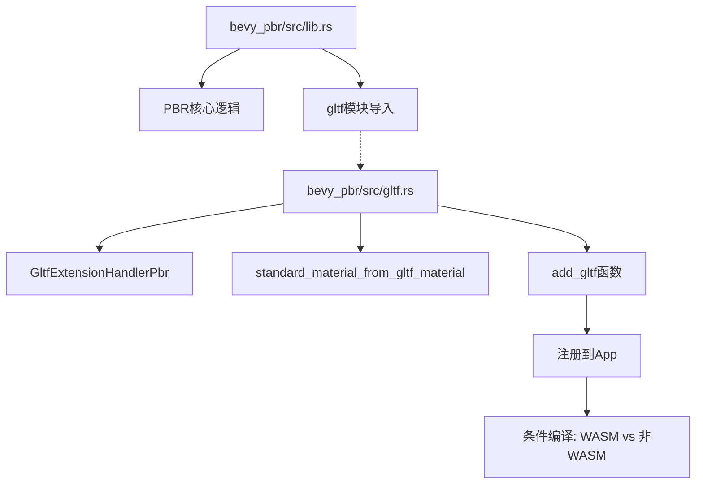

+++
title = "#22905 Move gltf stuff in pbr to its own file"
date = "2026-02-17T00:00:00"
draft = false
template = "pull_request_page.html"
in_search_index = false

[extra]
current_language = "zh-cn"
available_languages = {"en" = { name = "English", url = "/pull_request/bevy/2026-02/pr-22905-en-20260217" }, "zh-cn" = { name = "中文", url = "/pull_request/bevy/2026-02/pr-22905-zh-cn-20260217" }}
labels = ["D-Trivial", "A-Rendering", "C-Code-Quality"]
+++

# Title: Move gltf stuff in pbr to its own file

## Basic Information
- **Title**: Move gltf stuff in pbr to its own file
- **PR Link**: https://github.com/bevyengine/bevy/pull/22905
- **Author**: Zeophlite
- **Status**: MERGED
- **Labels**: D-Trivial, A-Rendering, C-Code-Quality, S-Ready-For-Final-Review
- **Created**: 2026-02-11T12:11:36Z
- **Merged**: 2026-02-17T00:14:46Z
- **Merged By**: alice-i-cecile

## Description Translation
**目标**
- 关注点分离

**解决方案**
- 将PBR模块中的GLTF相关代码移动到独立的文件中

**测试**
- `cargo run --example animated_mesh`

## The Story of This Pull Request

这个PR是一个典型的代码重构任务，涉及将GLTF相关的代码从PBR模块的主文件中提取到独立的模块中。这不是添加新功能或修复bug，而是一次代码组织结构优化。

### 问题的背景
在Bevy的PBR（基于物理的渲染）模块中，所有GLTF相关的处理代码都直接放在`lib.rs`主文件中。随着代码库的增长，这种做法导致了几个问题：

1. **关注点混合**：PBR核心渲染逻辑与GLTF格式处理的代码混杂在一起
2. **可维护性降低**：超过130行的GLTF相关代码增加了主文件的阅读和理解难度
3. **模块化程度不足**：违反了单一职责原则，单个文件承担了过多不同功能

原`lib.rs`文件包含了从GLTF材质到StandardMaterial的转换逻辑、GLTF扩展处理器的实现，以及这些组件的注册代码。这种结构使得想要理解PBR核心功能的开发者需要先浏览大量与GLTF格式处理相关的代码。

### 解决方案的实现
作者采取了一个直接而有效的重构策略：创建一个新的`gltf.rs`文件，将所有GLTF相关的代码迁移过去。这个方案的关键在于：

1. **完整迁移**：将所有GLTF相关的函数和结构体从`lib.rs`移动到新文件
2. **接口清晰化**：在新模块中暴露一个统一的`add_gltf`函数，封装了原来分散的注册逻辑
3. **条件编译处理**：正确处理了WASM和非WASM环境的差异

新创建的`gltf.rs`文件包含了三个主要部分：

```rust
// 核心转换函数
fn standard_material_from_gltf_material(material: &GltfMaterial) -> StandardMaterial {
    // 转换逻辑保持不变
}

// GLTF扩展处理器结构体和实现
struct GltfExtensionHandlerPbr;
impl GltfExtensionHandler for GltfExtensionHandlerPbr {
    // 实现各种回调方法
}

// 公开的注册函数
pub(crate) fn add_gltf(app: &mut App) {
    // 处理条件编译的注册逻辑
}
```

`add_gltf`函数的设计值得注意，它封装了原本直接写在`PbrPlugin`中的条件编译逻辑。这种封装使得主插件代码更加简洁，也提高了代码的复用性。

### 技术实现细节
重构过程中保持了几个重要的技术细节：

1. **功能完整性**：所有原有的条件编译特性标志（如`pbr_transmission_textures`、`pbr_specular_textures`等）都被完整保留
2. **访问控制**：使用`pub(crate)`限制模块的可见性，避免不必要的公开API
3. **零功能变更**：除了代码位置外，没有修改任何业务逻辑

迁移后的代码保持了完全相同的功能，这意味着：
- `standard_material_from_gltf_material`函数继续将GLTF材质属性映射到StandardMaterial
- `GltfExtensionHandlerPbr`继续在GLTF加载的各个阶段（root、material、spawn_mesh_and_material）执行相应的处理
- WASM环境的异步处理和桌面环境的阻塞处理逻辑保持不变

### 影响和价值
这次重构带来的主要好处包括：

1. **提高代码可读性**：现在开发者可以更清晰地看到PBR插件的主要结构，而不被GLTF相关代码干扰
2. **更好的关注点分离**：GLTF特定的代码现在有自己的"家"，便于未来的维护和扩展
3. **减少认知负担**：新开发者理解PBR模块时，可以选择先忽略GLTF相关的细节
4. **为未来扩展铺平道路**：如果未来需要添加更多GLTF相关的功能，可以在独立的文件中进行，避免主文件过度膨胀

从工程实践的角度看，这次重构展示了良好的模块化设计原则。虽然改动看似简单（只是移动代码），但它遵循了软件工程中的重要原则：将相关的代码组织在一起，将不相关的代码分开。

值得注意的是，作者在PR描述中提到的测试方法`cargo run --example animated_mesh`确保了重构没有破坏现有的GLTF渲染功能。这是一个有效的烟雾测试，验证了代码移动没有引入回归问题。

## Visual Representation



## Key Files Changed

### 1. `crates/bevy_pbr/src/gltf.rs` (+144/-0)
**变化描述**：新创建的模块文件，包含所有从原`lib.rs`迁移过来的GLTF相关代码

**关键代码片段**：
```rust
// 模块声明和导入
use bevy_gltf::{
    extensions::{GltfExtensionHandler, GltfExtensionHandlers},
    gltf, GltfAssetLabel, GltfMaterial,
};

use crate::{MeshMaterial3d, StandardMaterial};

// 主要的公开函数
pub(crate) fn add_gltf(app: &mut App) {
    #[cfg(target_family = "wasm")]
    bevy_tasks::block_on(async {
        app.world_mut()
            .resource_mut::<GltfExtensionHandlers>()
            .0
            .write()
            .await
            .push(Box::new(GltfExtensionHandlerPbr))
    });

    #[cfg(not(target_family = "wasm"))]
    app.world_mut()
        .resource_mut::<GltfExtensionHandlers>()
        .0
        .write_blocking()
        .push(Box::new(GltfExtensionHandlerPbr));
}
```

**与PR目的的关系**：这个文件是重构的核心，集中了所有GLTF相关的逻辑，实现了关注点分离。

### 2. `crates/bevy_pbr/src/lib.rs` (+2/-136)
**变化描述**：删除了所有GLTF相关代码，添加了对新模块的引用和调用

**关键代码片段**：
```rust
// 修改前（部分代码）:
// GLTF相关代码直接写在lib.rs中，包括：
// - standard_material_from_gltf_material函数
// - GltfExtensionHandlerPbr结构体和实现
// - 在PbrPlugin中直接注册GLTF处理器

// 修改后:
mod gltf;  // 新增模块声明

// 在PbrPlugin的impl中:
if self.gltf_render_enabled {
    gltf::add_gltf(app);  // 简化后的调用
}
```

**与PR目的的关系**：通过移除GLTF相关代码，lib.rs现在更专注于PBR的核心功能，提高了代码的可读性和可维护性。

## Further Reading

1. **Bevy模块系统文档**：了解Rust模块系统和Bevy如何组织代码
   - https://doc.rust-lang.org/book/ch07-00-managing-growing-projects-with-packages-crates-and-modules.html

2. **关注点分离原则**：深入了解这一软件设计原则
   - https://en.wikipedia.org/wiki/Separation_of_concerns

3. **GLTF格式规范**：理解GLTF材质如何映射到PBR材质
   - https://www.khronos.org/gltf/

4. **Bevy的PBR渲染系统**：学习Bevy中PBR渲染的工作原理
   - `crates/bevy_pbr`目录中的其他文件