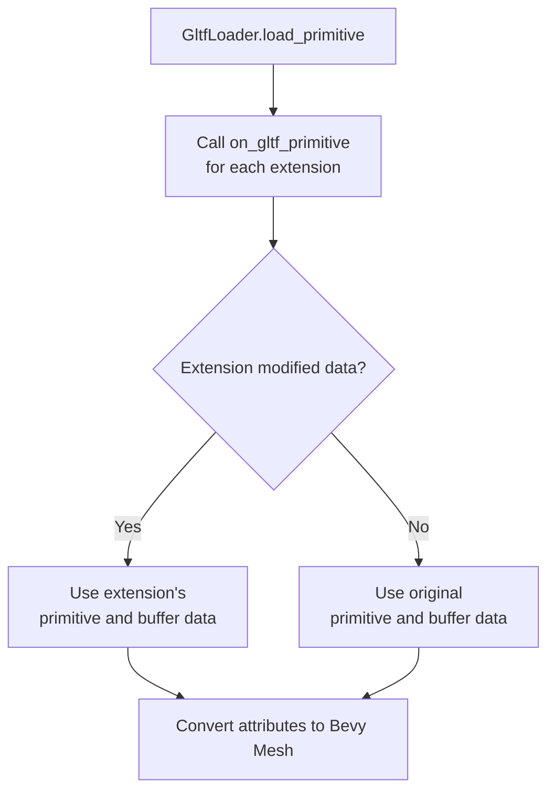

+++
title = "#22907 Add GltfExtensionHandler interface for draco"
date = "2026-02-24T00:00:00"
draft = false
template = "pull_request_page.html"
in_search_index = true

[taxonomies]
list_display = ["show"]

[extra]
current_language = "en"
available_languages = {"en" = { name = "English", url = "/pull_request/bevy/2026-02/pr-22907-en-20260224" }, "zh-cn" = { name = "中文", url = "/pull_request/bevy/2026-02/pr-22907-zh-cn-20260224" }}
labels = ["C-Feature", "D-Modest", "A-glTF"]
+++

# Title
Add GltfExtensionHandler interface for draco

## Basic Information
- **Title**: Add GltfExtensionHandler interface for draco
- **PR Link**: https://github.com/bevyengine/bevy/pull/22907
- **Author**: jiangheng90
- **Status**: MERGED
- **Labels**: C-Feature, S-Ready-For-Final-Review, D-Modest, A-glTF
- **Created**: 2026-02-11T13:57:17Z
- **Merged**: 2026-02-24T05:04:48Z
- **Merged By**: alice-i-cecile

## Description Translation

# Objective

- add a extension interface for draco decoder

## Solution

- add a function in `GltfExtensionHandler` before get geometry data from primitive buffer.

## Showcase

I have finish a extention plugin for draco decode in native. 
since `GltfExtensionHandler` do not support async function so wasm part can not be support yet.

the plugin will be something like 
```rust
#[derive(Default, Clone)]
struct GltfDracoDecoderExtensionHandler;

impl GltfExtensionHandler for GltfDracoDecoderExtensionHandler {
    fn dyn_clone(&self) -> Box<dyn GltfExtensionHandler> {
        Box::new((*self).clone())
    }

    fn on_gltf_primitive(
        &mut self,
        load_context: &mut LoadContext<'_>,
        gltf_json: &JsonGltf,
        gltf_primitive: &Primitive,
        buffer_data: &Vec<Vec<u8>>,
        out_doc: &mut Option<Document>,
        out_data: &mut Option<Vec<Vec<u8>>>,
    ) {
        if let Some(draco_ext) =
            DracoExtension::parse(load_context, &gltf_json, gltf_primitive).as_mut()
        {
            *out_data = draco_ext.decode_mesh(gltf_json, &buffer_data);
            *out_doc = draco_ext.build_document(&gltf_primitive);
        }
    }
}

struct GltfDracoDecoderPlugin;

impl Plugin for GltfDracoDecoderPlugin {
    fn build(&self, app: &mut App) {
        #[cfg(not(target_family = "wasm"))]
        app.world_mut()
            .resource_mut::<GltfExtensionHandlers>()
            .0
            .write_blocking()
            .push(Box::new(GltfDracoDecoderExtensionHandler));
    }
}
```

I'm not sure about the direction Bevy is taking regarding Draco decoding support, nor am I certain whether this API design is appropriate. I've already fully implemented Draco decoding for both Wasm and Native, but the implementation is based on asynchronous APIs and cxx FFI bindings. However, the existing GltfExtensionHandler only provides a synchronous interface, which makes it impossible to execute the Wasm part synchronously on the main thread.

For now, I'm just writing down this idea as a discussion point: under the current API framework, Draco is capable of synchronous decoding on the Native side.

## The Story of This Pull Request

This PR adds a new extension point to Bevy's glTF loader to support Draco mesh compression decoding through the existing `GltfExtensionHandler` system. The core issue was that while Draco compression is a widely used glTF extension (KHR_draco_mesh_compression), Bevy's glTF loader didn't have an appropriate hook to intercept primitive processing and decode compressed mesh data before it was converted to Bevy's mesh format.

The existing `GltfExtensionHandler` trait already provided several extension points for processing different aspects of glTF files, but it lacked a specific hook for individual primitives - the building blocks that become Bevy meshes. Without this hook, extensions like Draco decoders couldn't intercept the primitive data before the loader attempted to read vertex attributes and indices from the raw buffer data.

The solution was straightforward: add a new `on_gltf_primitive` method to the `GltfExtensionHandler` trait that gets called for each primitive during mesh loading. This method provides extensions with access to the raw buffer data and allows them to return modified buffer data or even a replacement glTF document structure. The implementation follows the same pattern as other extension methods in the trait, using `out_doc` and `out_data` parameters that extensions can optionally populate to override the loader's default behavior.

One important design consideration was that the interface had to be synchronous, which aligns with the existing extension system but creates limitations for WebAssembly targets where Draco decoding might require asynchronous APIs. The PR author noted this constraint and mentioned they have a complete Draco implementation that works natively but can't be adapted to WebAssembly without async support in the extension handler.

The implementation adds the extension point at the right moment in the loading pipeline - just before the loader reads vertex attributes from the buffer data. When extensions are registered, the loader iterates through them and calls `on_gltf_primitive` for each primitive. Extensions can modify the primitive being processed by returning a new glTF document with replacement primitive data, or they can modify the buffer data directly. The loader then uses whichever data the extensions provide, falling back to the original if no modifications were made.

A secondary but related change was adding a `validate` flag to `GltfLoaderSettings` that allows skipping glTF validation. This is useful for files with unsupported extensions that would otherwise fail validation. While not directly related to the Draco extension interface, this change complements it by making the loader more tolerant of non-standard glTF files that extensions might handle.

The PR demonstrates good API design by extending an existing pattern rather than creating a new one. The `on_gltf_primitive` method follows the same parameter structure as other methods in `GltfExtensionHandler`, maintaining consistency across the codebase. The implementation also includes appropriate error handling and warnings when extensions return unexpected document structures (like multiple meshes or primitives when exactly one is expected).

From a technical perspective, this change enables several use cases beyond Draco decoding. Any glTF extension that modifies primitive data or uses custom compression schemes can now be implemented through this interface. The ability to return both modified document structures and buffer data provides flexibility for different types of extensions - some might only need to decompress buffer data while preserving the original glTF structure, while others might need to completely reconstruct the primitive with different attributes or topology.

The main limitation, as noted by the author, is the synchronous nature of the interface. For WebAssembly targets where Draco decoding libraries often expose async APIs, this presents a challenge. However, for native targets where synchronous Draco decoding is feasible, this interface provides a clean way to integrate compression support without requiring major architectural changes to Bevy's asset loading system.

## Visual Representation



## Key Files Changed

### `crates/bevy_gltf/src/loader/extensions/mod.rs` (+31/-0)

Added the `on_gltf_primitive` method to the `GltfExtensionHandler` trait. This method provides extensions with access to the glTF document, primitive data, and raw buffer data, allowing them to return modified document structures or buffer data.

```rust
fn on_gltf_primitive(
    &mut self,
    load_context: &mut LoadContext<'_>,
    gltf_document: &gltf::Gltf,
    gltf_primitive: &gltf::Primitive,
    buffer_data: &[Vec<u8>],
    out_doc: &mut Option<gltf::Document>,
    out_data: &mut Option<Vec<Vec<u8>>>,
) {
}
```

### `crates/bevy_gltf/src/loader/mod.rs` (+55/-2)

1. Added `validate` field to `GltfLoaderSettings` to allow skipping glTF validation for files with unsupported extensions:
```rust
pub struct GltfLoaderSettings {
    // ...
    /// If false, the loader will load gltf json without validation, for unsupported extension it will ignore validation check.
    pub validate: bool,
}
```

2. Modified the `load` method to conditionally skip validation based on the `validate` setting:
```rust
let gltf = if settings.validate {
    gltf::Gltf::from_slice(bytes)?
} else {
    gltf::Gltf::from_slice_without_validation(bytes)?
};
```

3. Added the extension hook in the primitive loading logic. The loader now calls `on_gltf_primitive` for each extension before processing vertex attributes, and uses the extension's output if provided:
```rust
let mut out_doc: Option<gltf::Document> = None;
let mut out_data: Option<Vec<Vec<u8>>> = None;
for extension in extensions.iter_mut() {
    extension.on_gltf_primitive(
        load_context,
        &gltf,
        &primitive,
        &buffer_data,
        &mut out_doc,
        &mut out_data,
    );
}

// Use extension-provided data if available, otherwise use original data
let primitive = if let Some(doc) = &out_doc {
    // Logic to extract primitive from extension's document
} else {
    primitive
};

let buffer_data = if let Some(data) = &out_data {
    data
} else {
    &buffer_data
};
```

### `crates/bevy_gltf/src/lib.rs` (+1/-1)

Re-exported `Document` from the gltf crate to make it available in the public API:
```rust
pub use gltf::{Animation, Document, Gltf, Material, Mesh, Primitive, Scene, Texture};
```

## Further Reading

- [glTF 2.0 Specification](https://github.com/KhronosGroup/glTF/tree/main/specification/2.0)
- [KHR_draco_mesh_compression Extension](https://github.com/KhronosGroup/glTF/blob/main/extensions/2.0/Khronos/KHR_draco_mesh_compression/README.md)
- [Bevy's Asset System Documentation](https://bevyengine.org/learn/books/bevy-cheatbook/features/assets/index.html)
- [Bevy glTF Loader Source Code](https://github.com/bevyengine/bevy/tree/main/crates/bevy_gltf)