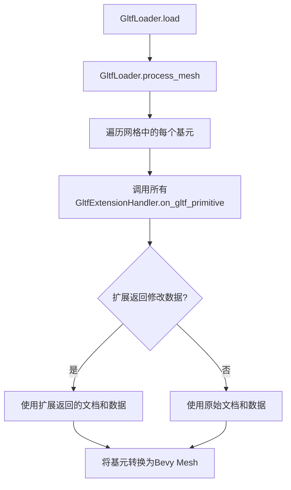

+++
title = "#22907 Add GltfExtensionHandler interface for draco"
date = "2026-02-24T00:00:00"
draft = false
template = "pull_request_page.html"
in_search_index = false

[extra]
current_language = "zh-cn"
available_languages = {"en" = { name = "English", url = "/pull_request/bevy/2026-02/pr-22907-en-20260224" }, "zh-cn" = { name = "中文", url = "/pull_request/bevy/2026-02/pr-22907-zh-cn-20260224" }}
labels = ["C-Feature", "D-Modest", "A-glTF"]
+++

# Title

## Basic Information
- **Title**: Add GltfExtensionHandler interface for draco
- **PR Link**: https://github.com/bevyengine/bevy/pull/22907
- **Author**: jiangheng90
- **Status**: MERGED
- **Labels**: C-Feature, S-Ready-For-Final-Review, D-Modest, A-glTF
- **Created**: 2026-02-11T13:57:17Z
- **Merged**: 2026-02-24T05:04:48Z
- **Merged By**: alice-i-cecile

## Description Translation
### 目标

- 为Draco解码器添加扩展接口

### 解决方案

- 在从原始缓冲区获取几何数据之前，向`GltfExtensionHandler`添加一个函数。

### 演示

我已经完成了一个用于原生解码Draco的扩展插件。由于`GltfExtensionHandler`不支持异步函数，所以WebAssembly部分暂时无法支持。

插件大致如下：

```rust
#[derive(Default, Clone)]
struct GltfDracoDecoderExtensionHandler;

impl GltfExtensionHandler for GltfDracoDecoderExtensionHandler {
    fn dyn_clone(&self) -> Box<dyn GltfExtensionHandler> {
        Box::new((*self).clone())
    }

    fn on_gltf_primitive(
        &mut self,
        load_context: &mut LoadContext<'_>,
        gltf_json: &JsonGltf,
        gltf_primitive: &Primitive,
        buffer_data: &Vec<Vec<u8>>,
        out_doc: &mut Option<Document>,
        out_data: &mut Option<Vec<Vec<u8>>>,
    ) {
        if let Some(draco_ext) =
            DracoExtension::parse(load_context, &gltf_json, gltf_primitive).as_mut()
        {
            *out_data = draco_ext.decode_mesh(gltf_json, &buffer_data);
            *out_doc = draco_ext.build_document(&gltf_primitive);
        }
    }
}

struct GltfDracoDecoderPlugin;

impl Plugin for GltfDracoDecoderPlugin {
    fn build(&self, app: &mut App) {
        #[cfg(not(target_family = "wasm"))]
        app.world_mut()
            .resource_mut::<GltfExtensionHandlers>()
            .0
            .write_blocking()
            .push(Box::new(GltfDracoDecoderExtensionHandler));
    }
}
```

我不确定Bevy在Draco解码支持方面的方向，也不确定这个API设计是否合适。我已经为Wasm和Native完全实现了Draco解码，但实现基于异步API和cxx FFI绑定。然而，现有的GltfExtensionHandler只提供同步接口，这使得无法在主线程上同步执行Wasm部分。

目前，我只是把这个想法写下来作为讨论点：在当前API框架下，Draco能够在原生端进行同步解码。

## The Story of This Pull Request

这个PR的核心是扩展Bevy的glTF加载器，使其能够支持Draco压缩网格的解码。Draco是Google开发的一种3D几何压缩算法，可以显著减少glTF文件的大小，但需要运行时解码。当前Bevy的glTF加载器缺乏处理这类扩展的标准接口。

开发者面临的问题是：如何在不修改核心加载器代码的情况下，为glTF添加自定义扩展支持？具体来说，如何支持像Draco这样的网格压缩扩展？传统的做法是在加载器中硬编码支持特定扩展，但这会导致核心代码膨胀，且难以维护多个扩展。

开发者采取的方法是扩展现有的`GltfExtensionHandler` trait。这个trait原本用于处理材质和纹理扩展，现在需要扩展到处理网格几何数据。关键的技术决策是在网格处理流程的特定点插入扩展钩子，即在原始缓冲区数据被转换为Bevy的`Mesh`之前。

实现分为三个主要部分：

1. **在`GltfExtensionHandler` trait中添加`on_gltf_primitive`方法**：这个方法在glTF基元（primitive）被处理时调用，提供对原始缓冲区数据的访问，并允许扩展返回修改后的文档和缓冲区数据。

2. **在加载器中调用扩展**：在`process_mesh`函数中，在处理每个基元之前，遍历所有已注册的扩展处理器并调用它们的`on_gltf_primitive`方法。

3. **处理扩展返回的数据**：扩展可以返回修改后的glTF文档和缓冲区数据。加载器需要安全地处理这些返回数据，确保文档包含预期的结构（恰好一个网格，网格中恰好一个基元）。

技术上的挑战包括：
- 同步接口的限制：当前的trait设计是同步的，但某些扩展（特别是在WebAssembly环境下）可能需要异步操作。
- 数据所有权和生命周期：扩展需要访问原始缓冲区数据，但也要能够返回新的数据。
- 向后兼容性：现有的扩展处理器不应该因为新方法的添加而破坏。

这个实现的一个巧妙之处在于使用了`out_doc`和`out_data`输出参数，允许扩展可选地提供修改后的数据。如果扩展不修改数据，加载器继续使用原始数据。

从工程角度看，这个设计遵循了开闭原则（对扩展开放，对修改关闭）。加载器不需要知道具体扩展的实现细节，只需调用标准接口。这为未来添加更多网格处理扩展（如meshopt压缩、自定义几何格式等）奠定了基础。

然而，开发者自己也指出了当前设计的局限性：异步支持缺失。在WebAssembly环境中，Draco解码可能需要异步操作以避免阻塞主线程，但当前的同步接口无法支持这一点。这是一个需要未来解决的技术债务。

## Visual Representation



## Key Files Changed

### 1. `crates/bevy_gltf/src/lib.rs` (+1/-1)
**变化描述**：重新导出了`gltf::Document`类型，因为新的`on_gltf_primitive`方法使用了这个类型作为输出参数。

**代码变化**：
```rust
// Before:
pub use gltf::{Animation, Gltf, Material, Mesh, Primitive, Scene, Texture};

// After:
pub use gltf::{Animation, Document, Gltf, Material, Mesh, Primitive, Scene, Texture};
```

### 2. `crates/bevy_gltf/src/loader/extensions/mod.rs` (+31/-0)
**变化描述**：向`GltfExtensionHandler` trait添加了`on_gltf_primitive`方法，为扩展提供了处理glTF基元的钩子。

**新增方法**：
```rust
fn on_gltf_primitive(
    &mut self,
    load_context: &mut LoadContext<'_>,
    gltf_document: &gltf::Gltf,
    gltf_primitive: &gltf::Primitive,
    buffer_data: &[Vec<u8>],
    out_doc: &mut Option<gltf::Document>,
    out_data: &mut Option<Vec<Vec<u8>>>,
) {
    // 默认实现为空操作
}
```

### 3. `crates/bevy_gltf/src/loader/mod.rs` (+55/-2)
**变化描述**：在glTF加载器中集成了扩展调用逻辑，并添加了验证开关。

**关键变化1**：添加了`validate`字段到`GltfLoaderSettings`：
```rust
pub struct GltfLoaderSettings {
    // ... 其他字段
    pub validate: bool,
}

impl Default for GltfLoaderSettings {
    fn default() -> Self {
        Self {
            // ... 其他字段
            validate: true,  // 默认启用验证
        }
    }
}
```

**关键变化2**：在`process_mesh`中添加扩展调用逻辑：
```rust
let mut out_doc: Option<gltf::Document> = None;
let mut out_data: Option<Vec<Vec<u8>>> = None;
for extension in extensions.iter_mut() {
    extension.on_gltf_primitive(
        load_context,
        &gltf,
        &primitive,
        &buffer_data,
        &mut out_doc,
        &mut out_data,
    );
}

// 处理扩展返回的文档和数据
let primitive = if let Some(doc) = &out_doc {
    // 验证文档结构，然后使用返回的基元
    // ... 验证逻辑
} else {
    primitive
};

let buffer_data = if let Some(data) = &out_data {
    data
} else {
    &buffer_data
};
```

**关键变化3**：在加载时根据`validate`设置选择验证模式：
```rust
let gltf = if settings.validate {
    gltf::Gltf::from_slice(bytes)?
} else {
    gltf::Gltf::from_slice_without_validation(bytes)?
};
```

## Further Reading

1. [glTF 2.0 Specification - Extensions](https://github.com/KhronosGroup/glTF/blob/main/specification/2.0/README.md#specifying-extensions)
2. [EXT_mesh_draco Extension](https://github.com/KhronosGroup/glTF/blob/main/extensions/2.0/Khronos/EXT_mesh_draco/README.md)
3. [Bevy Engine Documentation - Asset System](https://bevyengine.org/learn/books/0.12/assets/)
4. [Rust Trait Objects and Dynamic Dispatch](https://doc.rust-lang.org/book/ch17-02-trait-objects.html)