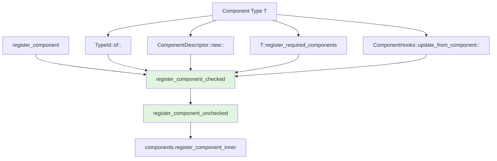

+++
title = "#22919 Cut down on register_component codegen"
date = "2026-02-12T00:00:00"
draft = false
template = "pull_request_page.html"
in_search_index = true

[taxonomies]
list_display = ["show"]

[extra]
current_language = "en"
available_languages = {"en" = { name = "English", url = "/pull_request/bevy/2026-02/pr-22919-en-20260212" }, "zh-cn" = { name = "中文", url = "/pull_request/bevy/2026-02/pr-22919-zh-cn-20260212" }}
labels = ["A-ECS", "C-Performance"]
+++

# Title
## Basic Information
- **Title**: Cut down on register_component codegen
- **PR Link**: https://github.com/bevyengine/bevy/pull/22919
- **Author**: cart
- **Status**: MERGED
- **Labels**: A-ECS, C-Performance
- **Created**: 2026-02-12T00:45:32Z
- **Merged**: 2026-02-12T22:24:52Z
- **Merged By**: cart

## Description Translation
#20934 [regressed](#22915) our binary sizes. This claws back 4 MiB on a release build of `3d_scene` by hoisting out the generic parts of register_component, allowing for more shared code. Based on my estimates, 0.9 MiB of this is part of the 8.3 MiB regression attributed to Resources as Components.

## The Story of This Pull Request

This PR addresses a binary size regression that occurred in PR #20934. The regression was significant - approximately 8.3 MiB attributed to Resources as Components, with this PR recovering 4 MiB specifically from a release build of the `3d_scene` example.

The core issue was excessive monomorphization of the `register_component` function. In Bevy's ECS (Entity Component System), every component type needs to be registered with the system. Before this change, the registration logic was fully generic, meaning the compiler would generate separate machine code for each component type. This resulted in significant binary bloat as the number of component types increased.

The solution approach was to refactor the registration functions to reduce code duplication through type erasure. Instead of having fully generic functions, the type-specific parts are extracted as function pointers, allowing the core registration logic to be shared across all component types. This is a classic case of balancing compile-time performance with runtime efficiency - we accept a small runtime overhead from function pointer indirection to achieve substantial binary size reduction.

The implementation modifies two key functions: `register_component_checked` and `register_component_unchecked`. Previously, these were generic functions that accepted a type parameter `T: Component`. The new implementation accepts function pointers for the type-specific operations:

```rust
fn register_component_checked(
    &mut self,
    type_id: TypeId,
    descriptor: fn() -> ComponentDescriptor,
    register_required_components: fn(ComponentId, &mut RequiredComponentsRegistrator),
    update_from_component: fn(&mut ComponentHooks) -> &mut ComponentHooks,
) -> ComponentId
```

The public-facing `register_component<T: Component>` method now calls this shared implementation, passing the type-specific functions as arguments:

```rust
pub fn register_component<T: Component>(&mut self) -> ComponentId {
    self.register_component_checked(
        TypeId::of::<T>(),
        ComponentDescriptor::new::<T>,
        T::register_required_components,
        ComponentHooks::update_from_component::<T>,
    )
}
```

Similarly, `register_component_unchecked` was refactored to accept the same set of function pointers. This change reduces monomorphization because the compiler now generates only one instance of `register_component_checked` and `register_component_unchecked`, rather than one per component type.

The technical insight here is that while Rust's monomorphization provides excellent runtime performance by generating specialized code for each type, it can lead to significant code bloat. In cases where the specialized code is largely identical except for a few type-specific operations, it's more efficient to extract those operations as function pointers and share the common code.

This approach has several implications:
1. **Binary Size**: The 4 MiB reduction demonstrates the effectiveness of this approach. Approximately 0.9 MiB of this reduction addresses the specific regression from Resources as Components.
2. **Compile Time**: Reduced monomorphization should also improve compile times, as the compiler has less code to generate and optimize.
3. **Runtime Performance**: There's a minor trade-off - function pointer indirection adds a small overhead compared to direct inlined calls. However, this overhead is typically negligible compared to the I/O and other operations involved in component registration.

The changes fit cleanly into Bevy's ECS architecture. The registration process remains logically the same - components still get their unique IDs, descriptors are created, required components are registered, and hooks are updated. Only the implementation details of how this happens have changed to be more efficient.

One interesting aspect is that the `ComponentsQueuedRegistrator::run` method also had to be updated to use the new function signature. This ensures consistency across all registration paths.

The impact of this change extends beyond just fixing the regression. It sets a pattern for optimizing other similar code paths in the codebase. Anywhere there's significant monomorphization with largely identical code, similar refactoring could yield binary size benefits.

## Visual Representation



## Key Files Changed

**File: `crates/bevy_ecs/src/component/register.rs` (+41/-14)**

This file contains the core changes to reduce monomorphization in the component registration system.

**Key Changes:**

1. **Refactored `register_component_checked` from generic to function-pointer based:**

```rust
// Before (generic):
pub(super) fn register_component_checked<T: Component>(&mut self) -> ComponentId {
    let type_id = TypeId::of::<T>();
    // ... type-specific logic using T
    unsafe {
        self.register_component_unchecked::<T>(id);
    }
}

// After (type-erased):
fn register_component_checked(
    &mut self,
    type_id: TypeId,
    descriptor: fn() -> ComponentDescriptor,
    register_required_components: fn(ComponentId, &mut RequiredComponentsRegistrator),
    update_from_component: fn(&mut ComponentHooks) -> &mut ComponentHooks,
) -> ComponentId {
    // ... shared logic using function pointers
    unsafe {
        self.register_component_unchecked(
            type_id,
            id,
            descriptor(),
            register_required_components,
            update_from_component,
        );
    }
}
```

2. **Updated public `register_component` to use the type-erased version:**

```rust
// Before: directly called generic version
pub fn register_component<T: Component>(&mut self) -> ComponentId {
    self.register_component_checked::<T>()
}

// After: passes type-specific functions as arguments
pub fn register_component<T: Component>(&mut self) -> ComponentId {
    self.register_component_checked(
        TypeId::of::<T>(),
        ComponentDescriptor::new::<T>,
        T::register_required_components,
        ComponentHooks::update_from_component::<T>,
    )
}
```

3. **Refactored `register_component_unchecked` similarly:**

```rust
// Before: generic function
unsafe fn register_component_unchecked<T: Component>(&mut self, id: ComponentId) {
    // Type-specific operations using T directly
    self.components.register_component_inner(id, ComponentDescriptor::new::<T>());
    let type_id = TypeId::of::<T>();
    // ... more T-specific logic
    T::register_required_components(id, &mut required_components_registrator);
    info.hooks.update_from_component::<T>();
}

// After: accepts function pointers
unsafe fn register_component_unchecked(
    &mut self,
    type_id: TypeId,
    id: ComponentId,
    descriptor: ComponentDescriptor,
    register_required_components: fn(ComponentId, &mut RequiredComponentsRegistrator),
    update_from_component: fn(&mut ComponentHooks) -> &mut ComponentHooks,
) {
    // Uses passed parameters instead of T directly
    self.components.register_component_inner(id, descriptor);
    // ... shared logic using function pointers
    register_required_components(id, &mut required_components_registrator);
    update_from_component(&mut info.hooks);
}
```

4. **Updated `ComponentsQueuedRegistrator::run` to use the new API:**

```rust
// Updated call site in ComponentsQueuedRegistrator::run
unsafe {
    registrator.register_component_unchecked(
        TypeId::of::<T>(),
        id,
        ComponentDescriptor::new::<T>(),
        T::register_required_components,
        ComponentHooks::update_from_component::<T>,
    );
}
```

These changes allow the compiler to generate only one instance of the core registration logic instead of one per component type, significantly reducing binary size.

## Further Reading

1. **Rust Monomorphization**: The Rust Book section on monomorphization and generics explains how Rust handles generic code compilation.
2. **Code Bloat Reduction Techniques**: Articles on reducing binary size in Rust, particularly focusing on minimizing monomorphization overhead.
3. **Bevy ECS Documentation**: The Bevy ECS documentation covers component registration and the overall architecture.
4. **Function Pointers vs Generics**: Resources comparing the performance characteristics of function pointers versus generic monomorphization in Rust.
5. **PR #20934**: The original PR that introduced the regression, for context on what changes necessitated this optimization.
6. **Issue #22915**: The issue tracking the binary size regression that this PR addresses.