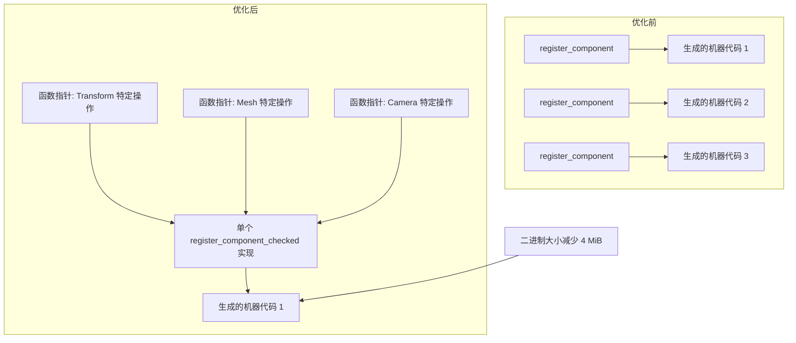

+++
title = "#22919 Cut down on register_component codegen"
date = "2026-02-12T00:00:00"
draft = false
template = "pull_request_page.html"
in_search_index = false

[extra]
current_language = "zh-cn"
available_languages = {"en" = { name = "English", url = "/pull_request/bevy/2026-02/pr-22919-en-20260212" }, "zh-cn" = { name = "中文", url = "/pull_request/bevy/2026-02/pr-22919-zh-cn-20260212" }}
+++

# Title: Cut down on register_component codegen

## Basic Information
- **标题**: 减少 register_component 代码生成
- **PR链接**: https://github.com/bevyengine/bevy/pull/22919
- **作者**: cart
- **状态**: 已合并
- **标签**: A-ECS, C-Performance
- **创建时间**: 2026-02-12T00:45:32Z
- **合并时间**: 2026-02-12T22:24:52Z
- **合并者**: cart

## 描述翻译
#20934 [导致了]我们的二进制文件大小增加。通过将 register_component 的通用部分提取出来，允许更多代码共享，这在一个 release 版本的 `3d_scene` 上回收了 4 MiB。根据我的估计，这其中有 0.9 MiB 属于因 Resources as Components 导致的 8.3 MiB 增长部分。

## 本次 Pull Request 的技术分析

### 问题与背景
这个 PR 旨在解决一个二进制大小膨胀（binary bloat）问题。在 Bevy 的 ECS（实体组件系统）中，`register_component` 方法是一个泛型函数，它会为每个组件类型（component type）生成独立的机器代码。这导致了二进制文件中存在大量重复的、几乎相同的代码，从而增加了最终可执行文件的大小。

具体来说，PR #20934 引入了二进制大小增长，特别是在 Resources as Components 功能中。问题在于编译器会为每个组件类型生成 `register_component` 的独立副本，这些副本在逻辑上几乎相同，只是使用了不同的类型参数。当有大量组件类型时，这种代码重复会显著增加二进制大小。

### 解决方案方法
核心思路是将泛型函数中的通用逻辑提取到非泛型函数中，通过函数指针传递类型特定的部分。这是一种常见的减少代码重复的技术，有时被称为 "type erasure" 或 "monomorphization reduction"。

开发者没有选择修改泛型系统的设计，而是在现有架构内优化了实现。通过分析 `register_component` 的工作流程，识别出可以参数化的类型特定操作，然后将其提取为函数指针参数。

### 实现细节
主要修改集中在 `crates/bevy_ecs/src/component/register.rs` 文件中。关键的变化是将原本的泛型方法拆分为参数化的版本。

**原始设计的问题**:
```rust
// 原始代码 - 每个 T 都会生成独立副本
pub fn register_component<T: Component>(&mut self) -> ComponentId {
    self.register_component_checked::<T>()
}

pub(super) fn register_component_checked<T: Component>(&mut self) -> ComponentId {
    // 类型特定的代码
    let type_id = TypeId::of::<T>();
    // ... 更多类型特定的操作
}
```

**改进后的设计**:
```rust
// 新代码 - 通用逻辑，类型特定操作通过参数传递
pub fn register_component<T: Component>(&mut self) -> ComponentId {
    self.register_component_checked(
        TypeId::of::<T>(),
        ComponentDescriptor::new::<T>,
        T::register_required_components,
        ComponentHooks::update_from_component::<T>,
    )
}

// 非泛型函数，只生成一次
fn register_component_checked(
    &mut self,
    type_id: TypeId,
    descriptor: fn() -> ComponentDescriptor,
    register_required_components: fn(ComponentId, &mut RequiredComponentsRegistrator),
    update_from_component: fn(&mut ComponentHooks) -> &mut ComponentHooks,
) -> ComponentId {
    // 通用逻辑，使用参数化的函数指针
}
```

相同的重构也应用于 `register_component_unchecked` 方法。这些改变确保了：
1. 通用逻辑（如哈希表查找、ID 分配、安全检查）只编译一次
2. 类型特定的操作（如创建描述符、注册必需组件、更新钩子）通过函数指针调用
3. 保持相同的功能和安全保证

### 技术洞察
这种方法有几个关键的技术点：

1. **函数指针 vs 泛型**: 函数指针允许运行时动态分发，而泛型在编译时生成特定类型的代码。这里使用函数指针是为了减少代码重复，但会引入微小的运行时开销（函数调用）。然而，这种开销通常可以忽略不计，尤其是考虑到内存和编译时间的节省。

2. **类型擦除（Type Erasure）**: 虽然这个实现没有完全擦除类型信息（仍然传递 `TypeId`），但它将类型特定的操作抽象为函数指针，这是类型擦除模式的一种形式。

3. **编译时优化**: 编译器现在可以更好地优化单个 `register_component_checked` 的实现，而不是优化多个几乎相同的副本。这可能会带来更好的指令缓存（instruction cache）使用率。

4. **向后兼容性**: 公共 API `register_component<T: Component>()` 保持不变，所以现有代码无需修改。这是内部实现优化。

### 影响与结果
根据 PR 描述，这个优化在一个 release 版本的 `3d_scene` 上回收了 4 MiB 的二进制大小。特别值得注意的是，这其中有 0.9 MiB 属于 Resources as Components 功能导致的 8.3 MiB 增长中的一部分。

更广泛的影响包括：
- **更小的二进制文件**: 减少部署包大小，改善加载时间
- **更好的缓存局部性**: 更少的代码意味着更好的 CPU 缓存使用率
- **更快的编译时间**: 减少重复代码生成可能加快编译速度
- **内存使用优化**: 减少的内存占用对资源受限环境特别有益

这种优化特别有价值，因为 Bevy 鼓励使用大量小型的、特定用途的组件类型，这原本会导致显著的二进制膨胀。

## 可视化表示



## 关键文件修改

### `crates/bevy_ecs/src/component/register.rs` (+41/-14)

这个文件包含了所有重要的修改。核心变化是将泛型的 `register_component_checked` 和 `register_component_unchecked` 方法重构为非泛型版本，使用函数指针参数。

**关键修改 1: `register_component` 方法的入口点**
```rust
// 修改前:
pub fn register_component<T: Component>(&mut self) -> ComponentId {
    self.register_component_checked::<T>()
}

// 修改后:
pub fn register_component<T: Component>(&mut self) -> ComponentId {
    self.register_component_checked(
        TypeId::of::<T>(),
        ComponentDescriptor::new::<T>,
        T::register_required_components,
        ComponentHooks::update_from_component::<T>,
    )
}
```

**关键修改 2: 新的非泛型 `register_component_checked` 方法**
```rust
// 新增的非泛型方法:
fn register_component_checked(
    &mut self,
    type_id: TypeId,
    descriptor: fn() -> ComponentDescriptor,
    register_required_components: fn(ComponentId, &mut RequiredComponentsRegistrator),
    update_from_component: fn(&mut ComponentHooks) -> &mut ComponentHooks,
) -> ComponentId {
    // 实现细节保持不变，但使用传递的参数而不是泛型类型 T
}
```

**关键修改 3: 更新的 `register_component_unchecked` 方法**
```rust
// 修改前:
unsafe fn register_component_unchecked<T: Component>(&mut self, id: ComponentId) {
    // 使用类型 T 特定的操作
}

// 修改后:
unsafe fn register_component_unchecked(
    &mut self,
    type_id: TypeId,
    id: ComponentId,
    descriptor: ComponentDescriptor,
    register_required_components: fn(ComponentId, &mut RequiredComponentsRegistrator),
    update_from_component: fn(&mut ComponentHooks) -> &mut ComponentHooks,
) {
    // 使用传递的参数而不是泛型类型 T
}
```

**关键修改 4: `ComponentsQueuedRegistrator` 中的相应更新**
```rust
// 在注册排队组件时也使用新的参数化方法
registrator.register_component_unchecked(
    TypeId::of::<T>(),
    id,
    ComponentDescriptor::new::<T>(),
    T::register_required_components,
    ComponentHooks::update_from_component::<T>,
);
```

这些修改确保了整个代码库中保持一致的方法调用模式，同时最大程度地减少了生成的代码量。

## 进一步阅读

1. **Rust 泛型和单态化（Monomorphization）**:
   - [Rust 文档：泛型](https://doc.rust-lang.org/book/ch10-01-syntax.html)
   - [单态化的工作原理](https://rustc-dev-guide.rust-lang.org/backend/monomorph.html)

2. **二进制大小优化技术**:
   - [Rust 性能优化指南](https://nnethercote.github.io/perf-book/title-page.html)
   - [减小 Rust 二进制文件大小](https://github.com/johnthagen/min-sized-rust)

3. **ECS 架构模式**:
   - [Bevy ECS 文档](https://bevyengine.org/learn/book/ecs/)
   - [实体组件系统模式](https://en.wikipedia.org/wiki/Entity_component_system)

4. **类似优化模式**:
   - [类型擦除在 C++ 和 Rust 中的应用](https://blog.benjamin-cook.com/blog/type-erasure-in-rust/)
   - [动态分发 vs 静态分发](https://www.possiblerust.com/pattern/3-things-to-try-when-you-can-not-make-trait-object)
