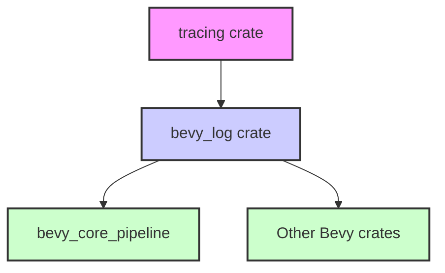

+++
title = "#22920 Use bevy_log instead of tracing in bevy_core_pipeline"
date = "2026-02-12T00:00:00"
draft = false
template = "pull_request_page.html"
in_search_index = true

[taxonomies]
list_display = ["show"]

[extra]
current_language = "en"
available_languages = {"en" = { name = "English", url = "/pull_request/bevy/2026-02/pr-22920-en-20260212" }, "zh-cn" = { name = "中文", url = "/pull_request/bevy/2026-02/pr-22920-zh-cn-20260212" }}
labels = ["D-Trivial", "A-Rendering", "C-Code-Quality"]
+++

# Title: Use bevy_log instead of tracing in bevy_core_pipeline

## Basic Information
- **Title**: Use bevy_log instead of tracing in bevy_core_pipeline
- **PR Link**: https://github.com/bevyengine/bevy/pull/22920
- **Author**: IceSentry
- **Status**: MERGED
- **Labels**: D-Trivial, A-Rendering, C-Code-Quality, S-Ready-For-Final-Review
- **Created**: 2026-02-12T00:50:36Z
- **Merged**: 2026-02-12T19:50:12Z
- **Merged By**: alice-i-cecile

## Description Translation
# Objective

- bevy_core_pipeline was using tracing directly instead of going through bevy_log

## Solution

- Yeet the tracing dep and use bevy_log instead

## Testing

- The logs in the examples still work

## The Story of This Pull Request

This PR addresses a consistency issue in the Bevy engine's logging infrastructure. The problem was that the `bevy_core_pipeline` crate was directly using the `tracing` crate for logging functionality, while other parts of the codebase were using `bevy_log`, which serves as a wrapper around `tracing` with Bevy-specific configurations and feature flags.

The issue stems from Bevy's architectural approach to logging. `bevy_log` acts as an abstraction layer that provides consistent logging behavior across the entire engine. It handles feature flags like `trace` that enable or disable logging instrumentation, and it ensures that all logging goes through Bevy's configured pipeline. By bypassing `bevy_log` and using `tracing` directly, the `bevy_core_pipeline` crate was creating an inconsistency that could lead to:
1. Logs not being properly filtered or formatted according to Bevy's configuration
2. Potential build issues when certain feature flags are disabled
3. Maintenance complexity when Bevy needs to update or change its logging infrastructure

The solution was straightforward but required changes across multiple files. The developer removed the direct `tracing` dependency from `bevy_core_pipeline`'s `Cargo.toml` and replaced all imports from `tracing` with equivalent imports from `bevy_log`. This change affected several key rendering components including 2D and 3D opaque/transparent pass nodes, deferred rendering nodes, prepass nodes, OIT (Order Independent Transparency) systems, mipmap generation, tonemapping, and the rendering schedule.

The implementation followed a consistent pattern across all files. For example, where previously code would import `tracing::error` and `tracing::info_span`, it now imports `bevy_log::error` and `bevy_log::info_span`. The `#[cfg(feature = "trace")]` attribute is preserved because `bevy_log` handles this feature flag internally and only provides the `info_span` macro when the `trace` feature is enabled.

One important aspect of this change is that it maintains backward compatibility. The `bevy_log` crate re-exports the same logging macros as `tracing`, so the logging calls themselves don't need to change - only the import statements do. This is why the testing was minimal: the developer verified that logs in examples still work, which confirms that the logging behavior remains the same.

From an architectural perspective, this change reinforces Bevy's pattern of using internal abstractions rather than directly depending on external crates. This approach makes it easier to:
1. Update dependencies (only `bevy_log` needs to be updated when `tracing` changes)
2. Maintain consistent feature flag behavior across the codebase
3. Potentially switch to a different logging backend in the future with minimal changes

The PR is categorized as trivial because it doesn't change any functionality - it only changes the import paths. However, from a code quality perspective, it's significant because it enforces consistency and reduces technical debt. By ensuring all logging goes through `bevy_log`, the engine becomes more maintainable and predictable in its logging behavior.

## Visual Representation



## Key Files Changed

The PR modified 13 files in total. Here are the most significant changes:

### 1. `crates/bevy_core_pipeline/Cargo.toml`
**Change:** Removed the direct `tracing` dependency
```toml
# Before:
tracing = { version = "0.1", default-features = false, features = ["std"] }

# After:
# tracing dependency removed entirely
```

### 2. `crates/bevy_core_pipeline/src/core_2d/main_opaque_pass_2d_node.rs`
**Change:** Replaced `tracing` imports with `bevy_log` imports
```rust
// Before:
use tracing::error;
#[cfg(feature = "trace")]
use tracing::info_span;

// After:
use bevy_log::error;
#[cfg(feature = "trace")]
use bevy_log::info_span;
```

### 3. `crates/bevy_core_pipeline/src/core_3d/main_opaque_pass_3d_node.rs`
**Change:** Same import replacement pattern
```rust
// Before:
use tracing::error;
#[cfg(feature = "trace")]
use tracing::info_span;

// After:
use bevy_log::error;
#[cfg(feature = "trace")]
use bevy_log::info_span;
```

### 4. `crates/bevy_core_pipeline/src/deferred/node.rs`
**Change:** Same import replacement pattern
```rust
// Before:
use tracing::error;
#[cfg(feature = "trace")]
use tracing::info_span;

// After:
use bevy_log::error;
#[cfg(feature = "trace")]
use bevy_log::info_span;
```

### 5. `crates/bevy_core_pipeline/src/schedule.rs`
**Change:** Updated span creation to use `bevy_log`
```rust
// Before:
let _span = tracing::info_span!("camera_schedule").entered();

// After:
let _span = bevy_log::info_span!("camera_schedule").entered();
```

### 6. `crates/bevy_core_pipeline/src/core_3d/mod.rs`
**Change:** Replaced `tracing::warn` with `bevy_log::warn`
```rust
// Before:
use tracing::warn;

// After:
use bevy_log::warn;
```

### 7. `crates/bevy_core_pipeline/src/mip_generation/experimental/depth.rs`
**Change:** Replaced `tracing::debug` with `bevy_log::debug`
```rust
// Before:
use tracing::debug;

// After:
use bevy_log::debug;
```

### 8. `crates/bevy_core_pipeline/src/oit/mod.rs`
**Change:** Replaced `tracing::trace` with `bevy_log::trace`
```rust
// Before:
use tracing::trace;

// After:
use bevy_log::trace;
```

### 9. `crates/bevy_core_pipeline/src/tonemapping/mod.rs`
**Change:** Replaced `tracing::error` with `bevy_log::error`
```rust
// Before:
#[cfg(not(feature = "tonemapping_luts"))]
use tracing::error;

// After:
#[cfg(not(feature = "tonemapping_luts"))]
use bevy_log::error;
```

## Further Reading

1. **Bevy Logging Documentation**: For understanding how logging works in Bevy and how to use `bevy_log` in custom projects
2. **Tracing Crate Documentation**: The underlying logging library that `bevy_log` wraps
3. **Rust Feature Flags**: Understanding how conditional compilation with `#[cfg(feature = "...")]` works in Rust
4. **Dependency Management in Cargo**: How to properly manage dependencies in Rust projects
5. **Bevy's Architectural Patterns**: How Bevy uses abstraction layers to maintain flexibility and consistency