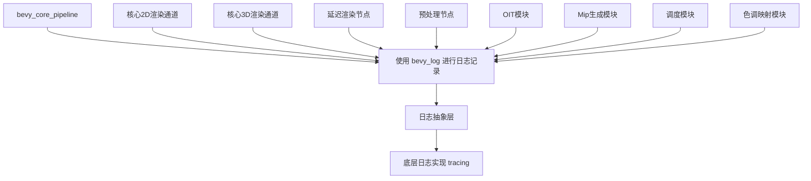

+++
title = "#22920 Use bevy_log instead of tracing in bevy_core_pipeline"
date = "2026-02-12T00:00:00"
draft = false
template = "pull_request_page.html"
in_search_index = false

[extra]
current_language = "zh-cn"
available_languages = {"en" = { name = "English", url = "/pull_request/bevy/2026-02/pr-22920-en-20260212" }, "zh-cn" = { name = "中文", url = "/pull_request/bevy/2026-02/pr-22920-zh-cn-20260212" }}
labels = ["D-Trivial", "A-Rendering", "C-Code-Quality"]
+++

# Title

## Basic Information
- **Title**: Use bevy_log instead of tracing in bevy_core_pipeline
- **PR Link**: https://github.com/bevyengine/bevy/pull/22920
- **Author**: IceSentry
- **Status**: MERGED
- **Labels**: D-Trivial, A-Rendering, C-Code-Quality, S-Ready-For-Final-Review
- **Created**: 2026-02-12T00:50:36Z
- **Merged**: 2026-02-12T19:50:12Z
- **Merged By**: alice-i-cecile

## Description Translation
### 目标
- bevy_core_pipeline 直接使用了 tracing 而不是通过 bevy_log

### 解决方案
- 移除 tracing 依赖并改用 bevy_log

### 测试
- 示例中的日志仍然正常工作

## The Story of This Pull Request

这个PR的核心是一个依赖统一和代码质量改进的简单更改。在Bevy引擎中，`bevy_log` 作为一个统一的日志抽象层存在，它封装了底层的日志实现（如`tracing`），为整个引擎提供了一个一致的日志接口。

问题的发现很直接：在`bevy_core_pipeline`模块中，开发者直接使用了`tracing`库来进行日志记录，而不是通过引擎提供的`bevy_log`抽象层。这种直接依赖会导致几个问题：首先，它破坏了项目内部依赖的一致性；其次，它使得未来更换日志后端变得更加困难；最后，它增加了不必要的直接依赖，使得构建配置更加复杂。

从技术角度看，这个问题的解决方案相当简单明了。开发者需要做两件事：第一，从`Cargo.toml`中移除对`tracing`的直接依赖；第二，将所有使用`tracing`宏的地方替换为对应的`bevy_log`宏。这是一个典型的依赖抽象和统一的工作。

具体实施时，开发者需要修改13个文件。这些文件分布在渲染管线的不同部分，包括2D和3D的核心渲染通道、延迟渲染、预处理、OIT（顺序无关透明）等多个模块。每个文件的修改模式都相同：将`use tracing::xxx`语句替换为`use bevy_log::xxx`，并相应地更新宏调用。

值得注意的是，这个PR还处理了条件编译的情况。例如，在多个文件中，当`trace`特性启用时，代码使用了`info_span`宏。在修改后，这些条件编译的导入也相应地从`tracing`改为`bevy_log`。这确保了在不同构建配置下代码都能正常工作。

从工程实践的角度看，这个更改有几个重要意义。首先，它减少了直接依赖，使得项目的依赖图更加清晰。其次，它提高了代码的一致性，所有模块现在都通过同一个接口进行日志记录。最后，它为未来的维护提供了便利，如果需要调整日志行为，只需要修改`bevy_log`抽象层，而不需要逐个修改使用日志的模块。

测试这个更改相对简单，主要需要验证日志功能仍然正常工作。正如PR描述中提到的，开发者测试了示例中的日志，确认它们仍然按预期工作。由于`bevy_log`本身是基于`tracing`的封装，这个更改不应该影响实际的日志输出，只是改变了调用的路径。

从代码质量的角度看，这个PR属于维护性改进。它不添加新功能，也不修复bug，但通过统一依赖接口提高了代码的可维护性。这类改进虽然在功能上不显著，但对长期项目健康至关重要。

这个PR的合并过程很顺利，从创建到合并不到一天时间，标签显示它被认为是"微不足道的"（D-Trivial）和"代码质量"（C-Code-Quality）改进。这表明团队对这种类型的重构有共识，认为它是有益的且风险较低。

## Visual Representation



## Key Files Changed

以下是本次PR中修改的关键文件：

### 1. `crates/bevy_core_pipeline/Cargo.toml` (+0/-1)
**修改说明**：移除了对`tracing`库的直接依赖。

**代码变更**：
```toml
# 修改前：
tracing = { version = "0.1", default-features = false, features = ["std"] }

# 修改后：
# tracing依赖被完全移除
```

### 2. `crates/bevy_core_pipeline/src/core_3d/mod.rs` (+1/-1)
**修改说明**：将`tracing::warn`导入替换为`bevy_log::warn`。

**代码变更**：
```rust
// 修改前：
use tracing::warn;

// 修改后：
use bevy_log::warn;
```

### 3. `crates/bevy_core_pipeline/src/core_2d/main_opaque_pass_2d_node.rs` (+3/-3)
**修改说明**：将`tracing`导入替换为`bevy_log`导入，包括`error`和条件编译的`info_span`。

**代码变更**：
```rust
// 修改前：
use tracing::error;
#[cfg(feature = "trace")]
use tracing::info_span;

// 修改后：
use bevy_log::error;
#[cfg(feature = "trace")]
use bevy_log::info_span;
```

### 4. `crates/bevy_core_pipeline/src/schedule.rs` (+1/-1)
**修改说明**：将`tracing::info_span`导入替换为`bevy_log::info_span`，并更新了代码中的宏调用。

**代码变更**：
```rust
// 修改前：
use tracing::info_span;
// ...
let _span = tracing::info_span!(...)

// 修改后：
use bevy_log::info_span;
// ...
let _span = bevy_log::info_span!(...)
```

### 5. `crates/bevy_core_pipeline/src/tonemapping/mod.rs` (+2/-2)
**修改说明**：将条件编译的`tracing::error`导入替换为`bevy_log::error`。

**代码变更**：
```rust
// 修改前：
#[cfg(not(feature = "tonemapping_luts"))]
use tracing::error;

// 修改后：
#[cfg(not(feature = "tonemapping_luts"))]
use bevy_log::error;
```

## Further Reading

1. **Bevy日志系统**：了解Bevy如何抽象日志记录，可查看[bevy_log crate文档](https://docs.rs/bevy_log/)
2. **Rust日志记录最佳实践**：了解Rust项目中日志抽象层设计模式
3. **Tracing库**：了解底层日志库的功能和使用，参见[tracing crate文档](https://docs.rs/tracing/)
4. **条件编译在Rust中的使用**：学习如何使用`#[cfg]`属性进行条件编译
5. **依赖管理**：了解Cargo.toml中依赖声明的各种选项和最佳实践