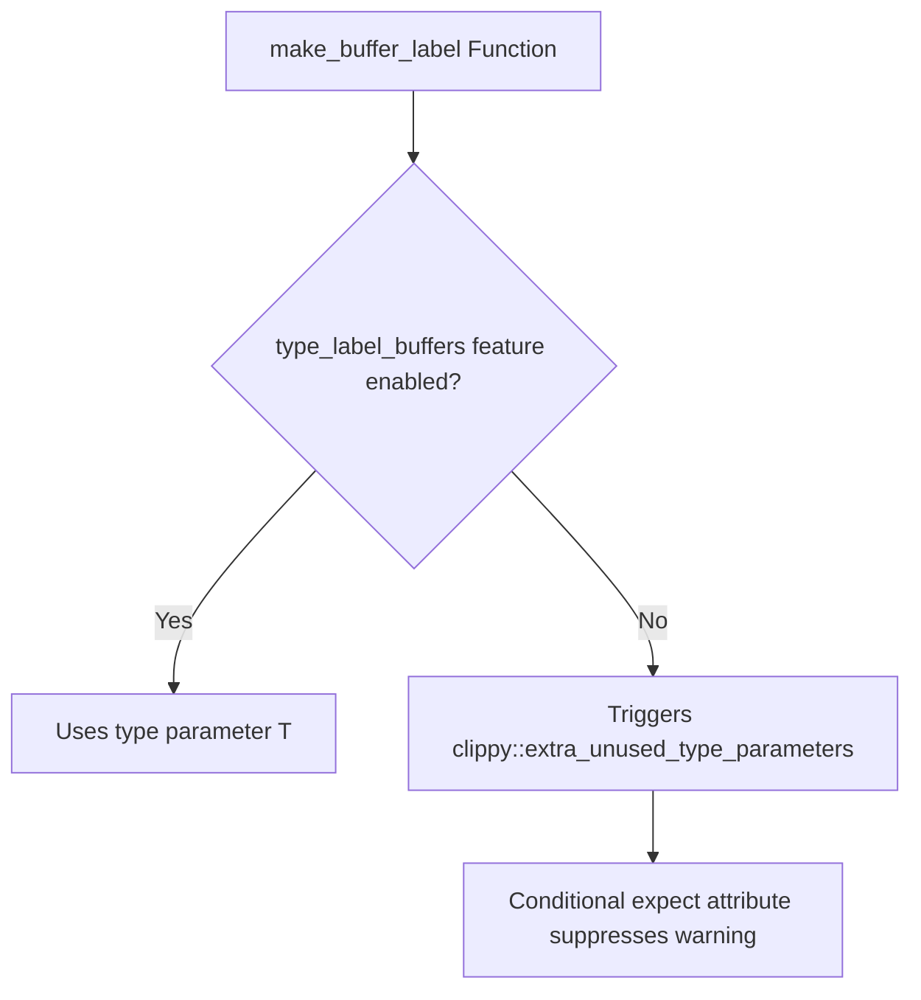

+++
title = "#22924 suppress warning caused by conditional compilation"
date = "2026-02-12T00:00:00"
draft = false
template = "pull_request_page.html"
in_search_index = true

[taxonomies]
list_display = ["show"]

[extra]
current_language = "en"
available_languages = {"en" = { name = "English", url = "/pull_request/bevy/2026-02/pr-22924-en-20260212" }, "zh-cn" = { name = "中文", url = "/pull_request/bevy/2026-02/pr-22924-zh-cn-20260212" }}
labels = ["D-Trivial", "C-Code-Quality"]
+++

# Title
suppress warning caused by conditional compilation

## Basic Information
- **Title**: suppress warning caused by conditional compilation
- **PR Link**: https://github.com/bevyengine/bevy/pull/22924
- **Author**: Person-93
- **Status**: MERGED
- **Labels**: D-Trivial, C-Code-Quality, S-Ready-For-Final-Review
- **Created**: 2026-02-12T08:09:38Z
- **Merged**: 2026-02-12T20:30:59Z
- **Merged By**: alice-i-cecile

## Description Translation

# Objective

Suppress a warning caused by conditional compilation

## Solution

Conditionally add an `expect` attribute

## Testing

none

## The Story of This Pull Request

This pull request addresses a straightforward but important code quality issue: eliminating a Clippy lint warning that was generated due to the interaction between conditional compilation and Rust's type system.

The problem originated in the `make_buffer_label` function within Bevy's render resource module. The function is defined with a generic type parameter `T`, but this parameter is only used when a specific feature flag, `type_label_buffers`, is enabled. When this feature is disabled, the compiler sees an unused type parameter, which triggers Clippy's `clippy::extra_unused_type_parameters` lint. While this doesn't cause functional issues, it creates noise in the build output and could potentially obscure other, more important warnings.

The developer took a targeted approach to solve this. Instead of restructuring the function or adding a dummy usage of the type parameter, they used Rust's conditional attribute system. The solution adds a `#[cfg_attr]` attribute that conditionally applies Clippy's `#[expect]` attribute. When the `type_label_buffers` feature is *not* enabled, the code tells Clippy to expect and suppress the specific lint warning, with a clear reason provided: "conditional compilation". This approach is clean and self-documenting—it explicitly states why the lint is being suppressed and ties the suppression directly to the conditional compilation logic that causes it.

From an engineering perspective, this change demonstrates good practice in handling compiler warnings in a codebase with feature flags. The `#[expect]` attribute is preferable to `#[allow]` because it indicates the warning is expected and should be tracked, potentially alerting developers if the warning stops occurring (which might indicate the conditional compilation logic has changed). The change is minimal, non-invasive, and maintains the existing functionality while improving code hygiene.

The impact of this PR is primarily on developer experience. It removes a source of noise from the build process, making it easier to spot genuine issues. It also sets a good example for handling similar situations elsewhere in the codebase, showing how to use Rust's attribute system to manage lints in the context of conditional compilation.

## Visual Representation



## Key Files Changed

### `crates/bevy_render/src/render_resource/buffer_vec.rs` (+7/-0)

This file contains the `make_buffer_label` function, which generates buffer labels for debugging purposes. The change adds a conditional attribute to suppress a Clippy warning that occurs when the `type_label_buffers` feature is disabled.

**Key Modification:**
```rust
// Before the change (simplified for context):
#[inline]
pub(crate) fn make_buffer_label<'a, T>(label: &'a Option<String>) -> Option<&'a str> {
    #[cfg(feature = "type_label_buffers")]
    if label.is_none() {
        return Some(std::any::type_name::<T>());
    }
    label.as_deref()
}

// After the change:
#[inline]
#[cfg_attr(
    not(feature = "type_label_buffers"),
    expect(
        clippy::extra_unused_type_parameters,
        reason = "conditional compilation"
    )
)]
pub(crate) fn make_buffer_label<'a, T>(label: &'a Option<String>) -> Option<&'a str> {
    #[cfg(feature = "type_label_buffers")]
    if label.is_none() {
        return Some(std::any::type_name::<T>());
    }
    label.as_deref()
}
```

The change adds a `#[cfg_attr]` attribute that conditionally applies Clippy's `#[expect]` attribute for the `clippy::extra_unused_type_parameters` lint when the `type_label_buffers` feature is not enabled. This directly addresses the warning described in the PR.

## Further Reading

1. **Rust `#[cfg_attr]` attribute**: [The Rust Reference - Conditional Compilation](https://doc.rust-lang.org/reference/conditional-compilation.html#the-cfg_attr-attribute)
2. **Clippy Lints**: [Rust Clippy Documentation](https://doc.rust-lang.org/clippy/)
3. **`#[expect]` attribute**: [Rust RFC 2383 - Lint Reasons](https://rust-lang.github.io/rfcs/2383-lint-reasons.html)
4. **Conditional Compilation in Rust**: [The Rust Book - Conditional Compilation](https://doc.rust-lang.org/book/ch14-06-conditional-compilation.html)

# Full Code Diff
```
diff --git a/crates/bevy_render/src/render_resource/buffer_vec.rs b/crates/bevy_render/src/render_resource/buffer_vec.rs
index 62eb53c81bfd5..2a18be1711469 100644
--- a/crates/bevy_render/src/render_resource/buffer_vec.rs
+++ b/crates/bevy_render/src/render_resource/buffer_vec.rs
@@ -622,6 +622,13 @@ pub enum WriteBufferRangeError {
 }
 
 #[inline]
+#[cfg_attr(
+    not(feature = "type_label_buffers"),
+    expect(
+        clippy::extra_unused_type_parameters,
+        reason = "conditional compilation"
+    )
+)]
 pub(crate) fn make_buffer_label<'a, T>(label: &'a Option<String>) -> Option<&'a str> {
     #[cfg(feature = "type_label_buffers")]
     if label.is_none() {
```