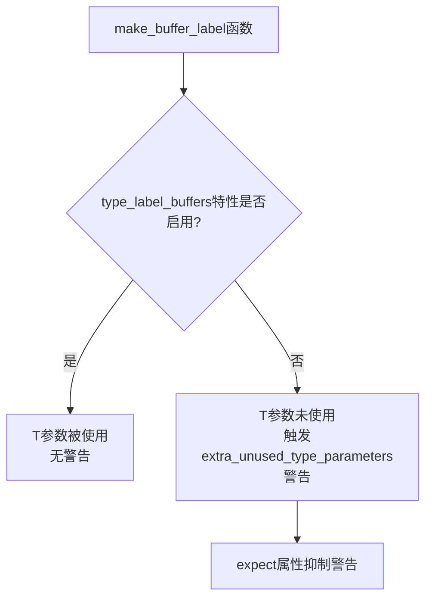

+++
title = "#22924 suppress warning caused by conditional compilation"
date = "2026-02-12T00:00:00"
draft = false
template = "pull_request_page.html"
in_search_index = false

[extra]
current_language = "zh-cn"
available_languages = {"en" = { name = "English", url = "/pull_request/bevy/2026-02/pr-22924-en-20260212" }, "zh-cn" = { name = "中文", url = "/pull_request/bevy/2026-02/pr-22924-zh-cn-20260212" }}
+++

# suppress warning caused by conditional compilation

## 基本信息
- **标题**: suppress warning caused by conditional compilation
- **PR链接**: https://github.com/bevyengine/bevy/pull/22924
- **作者**: Person-93
- **状态**: 已合并
- **标签**: D-Trivial, C-Code-Quality, S-Ready-For-Final-Review
- **创建时间**: 2026-02-12T08:09:38Z
- **合并时间**: 2026-02-12T20:30:59Z
- **合并者**: alice-i-cecile

## 描述翻译

# 目标

抑制由条件编译引起的警告

## 解决方案

有条件地添加 `expect` 属性

## 测试

无

## 这个PR的故事

这是一个关于代码质量和编译器警告处理的简单但重要的PR。在Bevy渲染系统的 `buffer_vec.rs` 文件中，开发者遇到了一个由条件编译触发的Clang警告。问题的核心在于一个泛型函数的设计。

`make_buffer_label` 函数定义如下：
```rust
pub(crate) fn make_buffer_label<'a, T>(label: &'a Option<String>) -> Option<&'a str> {
```

这个函数接受一个泛型参数 `T`，但实际上这个类型参数只在特定条件下被使用。当启用 `type_label_buffers` 特性时，代码会根据类型 `T` 生成缓冲区标签。但当这个特性被禁用时，`T` 参数就变成了一个未使用的类型参数。

未使用的泛型参数会触发Clippy的 `extra_unused_type_parameters` 警告。这是Clippy中的一个合理检查，因为未使用的类型参数可能表明代码设计有问题，或者应该使用更简单的非泛型函数。

开发者Person-93识别到了这个问题并提供了一个优雅的解决方案。他们没有移除泛型参数（这会在特性启用时破坏代码），也没有简单地用 `allow` 属性忽略警告（这可能会隐藏真正的问题），而是使用了 `expect` 属性。

`expect` 属性是Rust中的一个相对较新的特性，它类似于 `allow`，但有一个关键区别：如果警告实际上没有触发，它会生成一个错误。这确保了属性只在实际需要抑制警告时有效，防止了"死代码"警告抑制的情况。

解决方案是条件性地添加 `expect` 属性：
```rust
#[cfg_attr(
    not(feature = "type_label_buffers"),
    expect(
        clippy::extra_unused_type_parameters,
        reason = "conditional compilation"
    )
)]
```

这个属性只在 `type_label_buffers` 特性未启用时应用。当特性未启用时，我们期望会有未使用类型参数的警告，因此使用 `expect` 来抑制它。当特性启用时，类型参数被使用，不会产生警告，因此也不需要抑制。

这个更改虽然只有几行代码，但体现了良好的软件工程实践：
1. **精确性**: 只在特定条件下抑制警告
2. **自我文档化**: 通过 `reason` 参数说明了为什么需要抑制警告
3. **安全性**: 使用 `expect` 而不是 `allow`，防止了不必要的警告抑制
4. **条件编译的优雅处理**: 正确处理了特性标志对代码结构的影响

这种模式在条件编译场景中特别有用，因为它允许代码在不同的特性配置下保持正确的语义，同时避免不必要的编译器警告。这是一个小型但重要的代码质量改进，展示了如何在维护代码整洁性的同时处理不可避免的编译器警告。

## 视觉表示



## 主要更改文件

### `crates/bevy_render/src/render_resource/buffer_vec.rs` (+7/-0)

这个文件包含了Bevy渲染系统中缓冲区向量的实现。更改涉及一个辅助函数，该函数为缓冲区生成标签。

**更改内容**：
在 `make_buffer_label` 函数上方添加了条件编译属性，以抑制未使用泛型参数时产生的Clippy警告。

**代码片段**：
```rust
#[inline]
#[cfg_attr(
    not(feature = "type_label_buffers"),
    expect(
        clippy::extra_unused_type_parameters,
        reason = "conditional compilation"
    )
)]
pub(crate) fn make_buffer_label<'a, T>(label: &'a Option<String>) -> Option<&'a str> {
    #[cfg(feature = "type_label_buffers")]
    if label.is_none() {
        return Some(std::any::type_name::<T>());
    }
    label.as_deref()
}
```

这个更改解决了条件编译场景下的一个常见问题：当泛型参数只在特定条件下使用时，编译器会警告未使用的参数。通过条件性地应用 `expect` 属性，代码在保持功能完整性的同时避免了不必要的警告。

## 延伸阅读

1. **Rust条件编译**: [The Rust Programming Language - Conditional Compilation](https://doc.rust-lang.org/reference/conditional-compilation.html)
2. **Clippy警告系统**: [Rust Clippy Lints](https://rust-lang.github.io/rust-clippy/master/index.html)
3. **Rust属性系统**: [The Rust Reference - Attributes](https://doc.rust-lang.org/reference/attributes.html)
4. **expect属性**: [Rust RFC 2383 - lint reasons](https://rust-lang.github.io/rfcs/2383-lint-reasons.html)

# 完整代码差异
```diff
diff --git a/crates/bevy_render/src/render_resource/buffer_vec.rs b/crates/bevy_render/src/render_resource/buffer_vec.rs
index 62eb53c81bfd5..2a18be1711469 100644
--- a/crates/bevy_render/src/render_resource/buffer_vec.rs
+++ b/crates/bevy_render/src/render_resource/buffer_vec.rs
@@ -622,6 +622,13 @@ pub enum WriteBufferRangeError {
 }
 
 #[inline]
+#[cfg_attr(
+    not(feature = "type_label_buffers"),
+    expect(
+        clippy::extra_unused_type_parameters,
+        reason = "conditional compilation"
+    )
+)]
 pub(crate) fn make_buffer_label<'a, T>(label: &'a Option<String>) -> Option<&'a str> {
     #[cfg(feature = "type_label_buffers")]
     if label.is_none() {
```