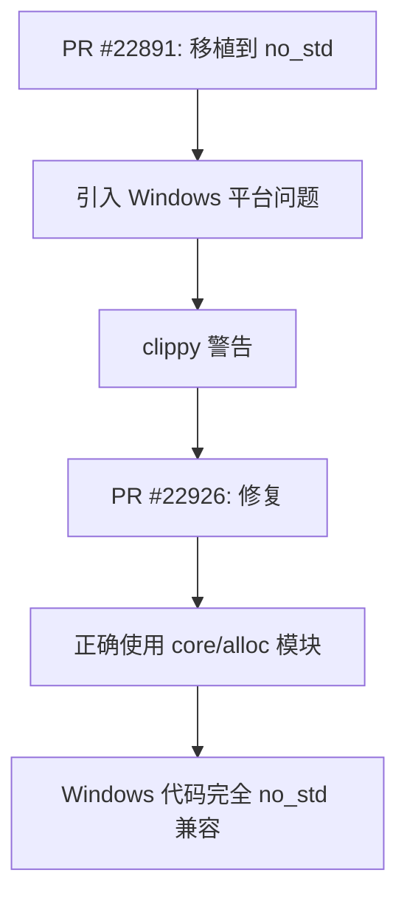

+++
title = "#22926 Fix clippy issues with `bevy_platform::dirs` on Windows"
date = "2026-02-12T00:00:00"
draft = false
template = "pull_request_page.html"
in_search_index = false

[extra]
current_language = "zh-cn"
available_languages = {"en" = { name = "English", url = "/pull_request/bevy/2026-02/pr-22926-en-20260212" }, "zh-cn" = { name = "中文", url = "/pull_request/bevy/2026-02/pr-22926-zh-cn-20260212" }}
+++

# Title

## 基本信息
- **标题**: Fix clippy issues with `bevy_platform::dirs` on Windows
- **PR链接**: https://github.com/bevyengine/bevy/pull/22926
- **作者**: greeble-dev
- **状态**: MERGED
- **标签**: D-Trivial, O-Windows, C-Code-Quality, S-Ready-For-Final-Review, A-Utils
- **创建时间**: 2026-02-12T11:22:48Z
- **合并时间**: 2026-02-12T18:13:14Z
- **合并者**: mockersf

## 描述翻译
修复了由 #22891 引入的、仅在 Windows 上出现的 clippy 问题。

通过在 Win10 上修改 `hello_world` 示例以打印 `preferences_dir()` 来进行了测试。

## 本次PR的故事

这个PR主要解决了一个在 Windows 平台上出现的代码质量问题。问题的根源在于之前的一个 PR (#22891) 在移植代码到 `no_std` 环境时，对 Windows 平台的特定文件处理不够彻底。

**问题和背景**

Bevy 游戏引擎的 `bevy_platform` crate 在设计上支持 `no_std` 环境，这意味着它不能直接使用标准库（std）中的功能，而需要使用核心库（core）和分配器（alloc）。PR #22891 将目录处理功能移植到 `no_std` 环境，但在 Windows 平台的实现文件 `windows.rs` 中，仍然残留了一些对 `std` 的直接依赖。这些依赖在 `no_std` 环境下会导致编译问题。

具体来说，Windows 平台的目录处理使用了 Windows API 调用，其中涉及指针操作和内存分配。原始代码使用了 `std::ptr::null_mut()` 和 `std::slice::from_raw_parts()`，这在 `no_std` 环境中是不可用的。同时，代码中还存在一个 `extern crate` 声明，这在现代 Rust 中通常是多余的。

**解决方案**

开发者采取了一个直接的技术方案：将剩余的 `std` 依赖替换为对应的 `core` 和 `alloc` 实现。这个方案的关键在于理解 Rust 不同库模块的分工：

1. **core**: 提供不依赖分配器和操作系统的核心功能
2. **alloc**: 提供基于堆分配的功能
3. **std**: 提供完整的标准库功能

对于这个特定的 Windows 目录处理代码，需要：
- 将 `std::ffi::c_void` 替换为 `core::ffi::c_void`
- 将 `std::ptr::null_mut()` 替换为 `core::ptr::null_mut()`
- 将 `std::slice` 替换为 `alloc::slice`
- 移除多余的 `extern crate` 声明

**具体实现**

实际的代码修改集中在 `crates/bevy_platform/src/dirs/windows.rs` 文件中。变化包括：

1. **导入语句重构**：重新组织了导入语句，确保使用正确的模块。
2. **指针操作标准化**：将所有指针相关操作都改为使用 `core` 模块。
3. **切片操作修复**：将 `std::slice::from_raw_parts` 改为 `alloc::slice::from_raw_parts`。
4. **代码质量改进**：将 `#[allow(unsafe_code)]` 改为 `#[expect(unsafe_code)]`，这提供了更好的文档说明。

**技术洞察**

这个 PR 展示了在 `no_std` 环境编程时需要注意的几个重要点：

1. **模块边界清晰**：在 `no_std` 代码中，必须明确知道每个功能属于哪个模块。指针操作属于 `core`，动态切片属于 `alloc`，文件系统操作属于 `std`。

2. **Windows API 的特殊性**：Windows 平台的目录处理使用了 `SHGetKnownFolderPath` API，这个 API 返回一个需要手动释放的字符串。Rust 代码通过 `unsafe` 块调用这个 API，然后将其转换为 Rust 的 `PathBuf`。这种模式在跨平台开发中很常见。

3. **clippy 工具的作用**：clippy 作为 Rust 的静态分析工具，能够发现这类 `no_std` 兼容性问题。开发者通过修复 clippy 警告，确保了代码质量。

**影响**

这个 PR 的主要影响是：
1. **修复编译问题**：确保 Windows 平台上的 `bevy_platform` 在 `no_std` 环境下能正确编译。
2. **提高代码一致性**：使 Windows 平台的实现与其他平台保持一致。
3. **改善代码质量**：通过使用 `#[expect]` 属性而不是 `#[allow]`，提供了更好的文档说明。

这是一个相对简单的修复，但展示了在跨平台、`no_std` 环境开发中需要注意的细节问题。正确处理这些细节对于维护一个健康的代码库很重要。

## 可视化表示



## 关键文件变更

**文件**: `crates/bevy_platform/src/dirs/windows.rs` (+6/-5)

这个文件包含了针对 Windows 平台的目录处理实现。主要变更包括：

1. **导入语句重构**：从使用 `std` 模块改为使用 `core` 和 `alloc` 模块。
2. **指针操作修复**：将 `std::ptr::null_mut()` 改为 `core::ptr::null_mut()`。
3. **切片操作修复**：将 `std::slice` 改为 `alloc::slice`。
4. **属性更新**：将 `#[allow(unsafe_code)]` 改为 `#[expect(unsafe_code, reason = "...")]`。

```rust
// 文件: crates/bevy_platform/src/dirs/windows.rs
// 之前:
extern crate windows_sys as windows;
use std::ffi::{c_void, OsString};
use std::os::windows::ffi::OsStringExt;
use std::path::PathBuf;
use std::slice;

// 之后:
use alloc::slice;
use core::ffi::c_void;
use std::ffi::OsString;
use std::os::windows::ffi::OsStringExt;
use std::path::PathBuf;

// 之前:
#[allow(unsafe_code)]
fn known_folder(folder_id: windows::core::GUID) -> Option<PathBuf> {
    unsafe {
        let mut path_ptr: windows::core::PWSTR = std::ptr::null_mut();
        let result =
            Shell::SHGetKnownFolderPath(&folder_id, 0, std::ptr::null_mut(), &mut path_ptr);

// 之后:
#[expect(unsafe_code, reason = "Uses unsafe Windows API functions")]
fn known_folder(folder_id: windows::core::GUID) -> Option<PathBuf> {
    unsafe {
        let mut path_ptr: windows::core::PWSTR = core::ptr::null_mut();
        let result =
            Shell::SHGetKnownFolderPath(&folder_id, 0, core::ptr::null_mut(), &mut path_ptr);
```

这些变更确保了 Windows 平台的目录处理代码完全兼容 `no_std` 环境，同时保持了原有的功能不变。

## 进一步阅读

对于想了解更多相关概念的读者，建议参考以下资源：

1. **Rust no_std 编程指南**: https://rust-embedded.github.io/book/intro/no-std.html
2. **Windows API 在 Rust 中的使用**: https://microsoft.github.io/windows-docs-rs/
3. **Rust 的 core、alloc 和 std 模块区别**: https://doc.rust-lang.org/core/index.html
4. **Rust clippy 工具使用**: https://github.com/rust-lang/rust-clippy
5. **Bevy 引擎的跨平台支持**: https://bevyengine.org/learn/book/getting-started/setup/#platform-specific-setup

# Full Code Diff
```
diff --git a/crates/bevy_platform/src/dirs/windows.rs b/crates/bevy_platform/src/dirs/windows.rs
index 983ef26b7e3c4..b5729401adeef 100644
--- a/crates/bevy_platform/src/dirs/windows.rs
+++ b/crates/bevy_platform/src/dirs/windows.rs
@@ -1,19 +1,20 @@
 extern crate windows_sys as windows;
-use std::ffi::{c_void, OsString};
+use alloc::slice;
+use core::ffi::c_void;
+use std::ffi::OsString;
 use std::os::windows::ffi::OsStringExt;
 use std::path::PathBuf;
-use std::slice;
 use windows::Win32::UI::Shell;
 
 /// Returns the path to the directory used for application settings.
 // From https://github.com/dirs-dev/dirs-sys-rs/blob/main/src/lib.rs
-#[allow(unsafe_code)]
+#[expect(unsafe_code, reason = "Uses unsafe Windows API functions")]
 fn known_folder(folder_id: windows::core::GUID) -> Option<PathBuf> {
     // SAFETY: SHGetKnownFolderPath allocates path_ptr which must be freed with CoTaskMemFree.
     unsafe {
-        let mut path_ptr: windows::core::PWSTR = std::ptr::null_mut();
+        let mut path_ptr: windows::core::PWSTR = core::ptr::null_mut();
         let result =
-            Shell::SHGetKnownFolderPath(&folder_id, 0, std::ptr::null_mut(), &mut path_ptr);
+            Shell::SHGetKnownFolderPath(&folder_id, 0, core::ptr::null_mut(), &mut path_ptr);
         if result == 0 {
             let len = windows::Win32::Globalization::lstrlenW(path_ptr) as usize;
             let path = slice::from_raw_parts(path_ptr, len);
```