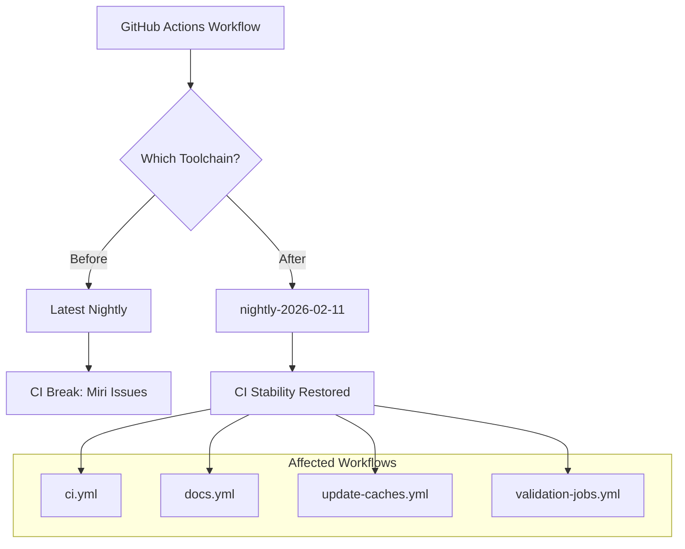

+++
title = "#22927 Specify nightly toolchain version in CI config"
date = "2026-02-12T00:00:00"
draft = false
template = "pull_request_page.html"
in_search_index = true

[taxonomies]
list_display = ["show"]

[extra]
current_language = "en"
available_languages = {"en" = { name = "English", url = "/pull_request/bevy/2026-02/pr-22927-en-20260212" }, "zh-cn" = { name = "中文", url = "/pull_request/bevy/2026-02/pr-22927-zh-cn-20260212" }}
labels = ["D-Trivial", "A-Build-System"]
+++

# Title

## Basic Information
- **Title**: Specify nightly toolchain version in CI config
- **PR Link**: https://github.com/bevyengine/bevy/pull/22927
- **Author**: Person-93
- **Status**: MERGED
- **Labels**: D-Trivial, A-Build-System
- **Created**: 2026-02-12T11:45:09Z
- **Merged**: 2026-02-12T13:40:51Z
- **Merged By**: mockersf

## Description Translation
**Objective**

There is an issue with miri

**Solution**

Pin miri to `2026-02-11` as suggested by @mockersf in discord

## The Story of This Pull Request

This PR addresses a CI stability issue by pinning the Rust nightly toolchain to a specific date across all GitHub Actions workflows in the Bevy project. The problem emerged when the miri interpreter, which runs on nightly Rust, encountered issues with the latest nightly build. This is a common scenario in projects that depend on nightly toolchains—unstable features or regressions in new nightly releases can break CI pipelines unpredictably.

The solution follows a standard practice in Rust projects that use nightly features: when CI breaks due to a nightly toolchain issue, you pin to a known-working version until the issue is resolved upstream. The developer @mockersf identified the specific nightly version (`2026-02-11`) that worked correctly with miri and suggested this fix via Discord discussion.

The implementation is straightforward but systematic—the `NIGHTLY_TOOLCHAIN` environment variable was updated in four separate workflow files to ensure consistency across all CI jobs. This variable controls which Rust toolchain version is installed and used for jobs requiring nightly Rust. By changing it from the generic `nightly` (which always fetches the latest version) to `nightly-2026-02-11`, the CI system now uses a fixed, known-good version.

This approach provides immediate stability while the upstream issue with miri is investigated. It's a pragmatic solution that balances two competing needs: using nightly features for tools like miri while maintaining CI reliability. The existing codebase already included a comment indicating this variable should be modified if nightly breaks CI, showing this was an anticipated use case.

The changes affect multiple aspects of the CI pipeline: main CI builds, documentation generation, cache updates, and validation jobs. Each workflow uses the same environment variable pattern, demonstrating good DRY principles in the CI configuration. The fix ensures that all CI components remain synchronized on the same toolchain version, preventing subtle inconsistencies that could arise if different workflows used different nightly versions.

From an engineering perspective, this PR demonstrates effective CI maintenance practices. The solution is minimal, targeted, and follows established patterns within the project. It temporarily trades automatic updates for stability, which is the correct trade-off when CI is broken. Once the upstream issue is resolved, the team can revert to using the generic `nightly` or update to a newer stable nightly version.

## Visual Representation



## Key Files Changed

1. **`.github/workflows/ci.yml`** (+1/-1)
   - **Change**: Updated `NIGHTLY_TOOLCHAIN` environment variable from `nightly` to `"nightly-2026-02-11"`
   - **Why**: The main CI workflow uses nightly Rust for miri and other nightly-only features
   - **Code**:
     ```yaml
     # Before:
     NIGHTLY_TOOLCHAIN: nightly
     
     # After:
     NIGHTLY_TOOLCHAIN: "nightly-2026-02-11"
     ```

2. **`.github/workflows/docs.yml`** (+1/-1)
   - **Change**: Same environment variable update
   - **Why**: Documentation generation may use nightly features or tools
   - **Code**:
     ```yaml
     # Before:
     NIGHTLY_TOOLCHAIN: nightly
     
     # After:
     NIGHTLY_TOOLCHAIN: "nightly-2026-02-11"
     ```

3. **`.github/workflows/update-caches.yml`** (+1/-1)
   - **Change**: Same environment variable update
   - **Why**: Cache update jobs need consistency with other workflows
   - **Code**:
     ```yaml
     # Before:
     NIGHTLY_TOOLCHAIN: nightly
     
     # After:
     NIGHTLY_TOOLCHAIN: "nightly-2026-02-11"
     ```

4. **`.github/workflows/validation-jobs.yml`** (+1/-1)
   - **Change**: Same environment variable update
   - **Why**: Validation jobs (like iOS builds) use nightly toolchain
   - **Code**:
     ```yaml
     # Before:
     NIGHTLY_TOOLCHAIN: nightly
     
     # After:
     NIGHTLY_TOOLCHAIN: "nightly-2026-02-11"
     ```

All changes follow the same pattern and serve the same purpose: ensuring consistent toolchain usage across the entire CI pipeline to resolve miri-related issues.

## Further Reading

1. **Rustup Toolchain Management**: https://rust-lang.github.io/rustup/concepts/toolchains.html
2. **GitHub Actions Environment Variables**: https://docs.github.com/en/actions/learn-github-actions/environment-variables
3. **Miri - Rust MIR Interpreter**: https://github.com/rust-lang/miri
4. **Rust Nightly vs Stable**: https://doc.rust-lang.org/book/appendix-07-nightly-rust.html
5. **CI/CD Best Practices for Rust Projects**: https://www.shuttle.rs/blog/2023/08/23/ci-cd-for-rust-projects

# Full Code Diff
diff --git a/.github/workflows/ci.yml b/.github/workflows/ci.yml
index 9ae460d5128f7..2a08b4d1ceea7 100644
--- a/.github/workflows/ci.yml
+++ b/.github/workflows/ci.yml
@@ -17,7 +17,7 @@ env:
   CARGO_PROFILE_TEST_DEBUG: 0
   CARGO_PROFILE_DEV_DEBUG: 0
   # If nightly is breaking CI, modify this variable to target a specific nightly version.
-  NIGHTLY_TOOLCHAIN: nightly
+  NIGHTLY_TOOLCHAIN: "nightly-2026-02-11"
   RUSTFLAGS: "-D warnings"
 
 concurrency:
diff --git a/.github/workflows/docs.yml b/.github/workflows/docs.yml
index 6bf97af9f6fea..1aab6d328e476 100644
--- a/.github/workflows/docs.yml
+++ b/.github/workflows/docs.yml
@@ -11,7 +11,7 @@ env:
   CARGO_TERM_COLOR: always
   RUSTDOCFLAGS: --html-in-header header.html
   # If nightly is breaking CI, modify this variable to target a specific nightly version.
-  NIGHTLY_TOOLCHAIN: nightly
+  NIGHTLY_TOOLCHAIN: "nightly-2026-02-11"
 
 # Sets the permissions to allow deploying to Github pages.
 permissions:
diff --git a/.github/workflows/update-caches.yml b/.github/workflows/update-caches.yml
index db265e6af4b76..6647b1906604c 100644
--- a/.github/workflows/update-caches.yml
+++ b/.github/workflows/update-caches.yml
@@ -20,7 +20,7 @@ env:
   CARGO_PROFILE_TEST_DEBUG: 0
   CARGO_PROFILE_DEV_DEBUG: 0
   # If nightly is breaking CI, modify this variable to target a specific nightly version.
-  NIGHTLY_TOOLCHAIN: nightly
+  NIGHTLY_TOOLCHAIN: "nightly-2026-02-11"
 
 jobs:
   env:
diff --git a/.github/workflows/validation-jobs.yml b/.github/workflows/validation-jobs.yml
index a3e365ba60a83..fbe8eb3f531a4 100644
--- a/.github/workflows/validation-jobs.yml
+++ b/.github/workflows/validation-jobs.yml
@@ -21,7 +21,7 @@ env:
   CARGO_PROFILE_TEST_DEBUG: 0
   CARGO_PROFILE_DEV_DEBUG: 0
   # If nightly is breaking CI, modify this variable to target a specific nightly version.
-  NIGHTLY_TOOLCHAIN: nightly
+  NIGHTLY_TOOLCHAIN: "nightly-2026-02-11"
 
 jobs:
   build-and-install-on-iOS: