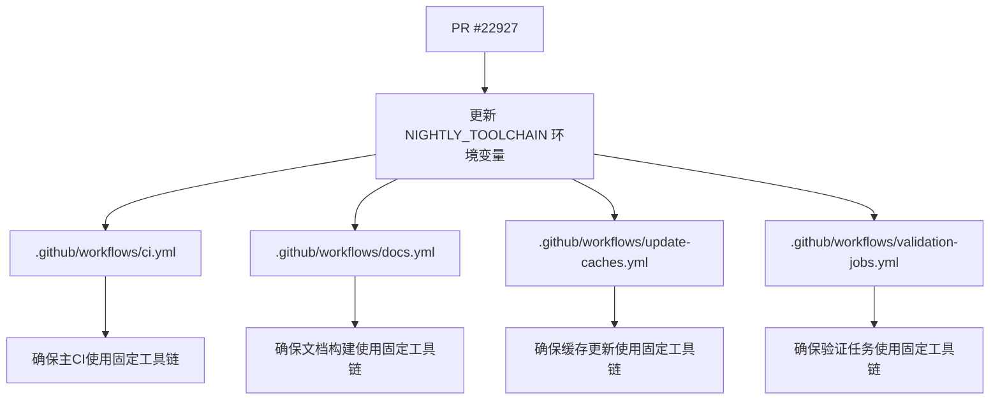

+++
title = "#22927 Specify nightly toolchain version in CI config"
date = "2026-02-12T00:00:00"
draft = false
template = "pull_request_page.html"
in_search_index = false

[extra]
current_language = "zh-cn"
available_languages = {"en" = { name = "English", url = "/pull_request/bevy/2026-02/pr-22927-en-20260212" }, "zh-cn" = { name = "中文", url = "/pull_request/bevy/2026-02/pr-22927-zh-cn-20260212" }}
labels = ["D-Trivial", "A-Build-System"]
+++

# Title

## Basic Information
- **Title**: Specify nightly toolchain version in CI config
- **PR Link**: https://github.com/bevyengine/bevy/pull/22927
- **Author**: Person-93
- **Status**: MERGED
- **Labels**: D-Trivial, A-Build-System
- **Created**: 2026-02-12T11:45:09Z
- **Merged**: 2026-02-12T13:40:51Z
- **Merged By**: mockersf

## Description Translation
**目标 (Objective)**
miri 存在一个问题。

**解决方案 (Solution)**
按照 @mockersf 在 Discord 中的建议，将 miri 的 nightly 工具链固定到 `2026-02-11` 版本。

## The Story of This Pull Request

这次 Pull Request 的故事始于一个典型的持续集成（CI，Continuous Integration）流水线中断问题。Bevy 项目的 GitHub Actions 工作流配置为使用 Rust 的 `nightly` 工具链来执行某些任务，例如运行 miri（Rust 的内存检查器）。`nightly` 工具链的特点是每日更新，包含了最新的、可能尚未稳定的语言特性和编译器更改。这种不稳定性是把双刃剑：它让开发者能尽早使用新功能，但也意味着任何一天的 nightly 版本都可能引入导致项目构建或测试失败的回归（regression）。

在 2026 年 2 月 12 日左右，一个这样的回归发生了。具体来说，是在使用 miri 时遇到了问题。这直接导致了 CI 流水线失败，阻碍了其他开发者的代码合并和项目的正常开发流程。这类问题在依赖 `nightly` 工具链的项目中并不少见，也是 CI/CD（持续集成/持续部署，Continuous Integration/Continuous Deployment）实践中一个已知的风险点。

面对这个问题，项目维护者 @mockersf 在 Discord 社区频道中提出了一个直接且有效的解决方案：不再使用浮动的 `nightly` 标签，而是将工具链固定到已知良好的特定日期版本，即 `nightly-2026-02-11`。开发者 Person-93 随后将这个建议具体实施为代码变更，创建了本 PR。

这个解决方案体现了在 CI 环境中管理依赖版本的一个核心最佳实践：确定性和可重复性。将工具链固定到一个具体的版本，可以确保无论未来的 `nightly` 版本如何变化，当前的 CI 流程都能基于一个稳定的环境执行，从而立即修复流水线的中断。这为团队赢得了调查和适配新版本 `nightly` 工具链所引入问题的缓冲时间。变更本身非常简洁，只涉及修改 GitHub Actions 工作流文件中的环境变量 `NIGHTLY_TOOLCHAIN` 的值。

从技术实现上看，这个修改需要在所有使用 `nightly` 工具链的 CI 工作流中保持一致。Person-93 准确地找到了项目中的四个相关 YAML 配置文件：主构建流程 (`ci.yml`)、文档生成流程 (`docs.yml`)、缓存更新流程 (`update-caches.yml`) 以及一个验证任务流程 (`validation-jobs.yml`)。在每个文件中，他们都进行了同样的修改，将 `NIGHTLY_TOOLCHAIN: nightly` 替换为 `NIGHTLY_TOOLCHAIN: "nightly-2026-02-11"`。这里给值加上引号是 YAML 格式的良好实践，可以避免日期格式被误解。

这次变更的影响是立竿见影且积极的。它立即解除了由于 `nightly` 工具链更新导致的 CI 阻塞状态，恢复了开发团队的正常工作流。更重要的是，它强化了项目的 CI 配置，使其对上游工具链的潜在不稳定变更具有了韧性（resilience）。这个模式本身也很有价值：通过一个集中的环境变量来控制工具链版本，使得将来需要更新或回滚到其他 nightly 日期版本时，只需在同一个地方修改即可，维护成本很低。

从这次 PR 中，我们可以学到几点：首先，在 CI 中对于构建和测试的关键依赖，使用固定版本是保证流水线稳定的有效手段。其次，通过环境变量或类似的配置中心化手段来管理这些版本，能极大提升可维护性。最后，面对由上游依赖更新导致的 CI 失败，快速定位并固定到已知良好的旧版本，是一个行之有效的应急处理策略，能为深入排查根本原因争取时间。

## Visual Representation

这个 PR 修改了四个独立但相关联的 GitHub Actions 工作流文件，它们都引用了同一个环境变量 `NIGHTLY_TOOLCHAIN`。下图展示了它们之间的关系：



## Key Files Changed

本次 PR 修改了四个 GitHub Actions 工作流配置文件，变更模式完全一致。

1.  **文件**: `.github/workflows/ci.yml`
    *   **修改原因**: 这是主 CI 构建流程，可能包含使用 nightly 工具链的检查步骤（如 miri）。
    *   **代码变更**:
        ```yaml
        # Before:
        # If nightly is breaking CI, modify this variable to target a specific nightly version.
        NIGHTLY_TOOLCHAIN: nightly

        # After:
        # If nightly is breaking CI, modify this variable to target a specific nightly version.
        NIGHTLY_TOOLCHAIN: "nightly-2026-02-11"
        ```

2.  **文件**: `.github/workflows/docs.yml`
    *   **修改原因**: 文档生成流程可能使用了 nightly 工具链中的 `rustdoc` 或其他特性来构建文档。
    *   **代码变更**:
        ```yaml
        # Before:
        # If nightly is breaking CI, modify this variable to target a specific nightly version.
        NIGHTLY_TOOLCHAIN: nightly

        # After:
        # If nightly is breaking CI, modify this variable to target a specific nightly version.
        NIGHTLY_TOOLCHAIN: "nightly-2026-02-11"
        ```

3.  **文件**: `.github/workflows/update-caches.yml`
    *   **修改原因**: 缓存更新流程需要与主 CI 使用相同的工具链环境来保证缓存的有效性。
    *   **代码变更**:
        ```yaml
        # Before:
        # If nightly is breaking CI, modify this variable to target a specific nightly version.
        NIGHTLY_TOOLCHAIN: nightly

        # After:
        # If nightly is breaking CI, modify this variable to target a specific nightly version.
        NIGHTLY_TOOLCHAIN: "nightly-2026-02-11"
        ```

4.  **文件**: `.github/workflows/validation-jobs.yml`
    *   **修改原因**: 该文件定义的验证任务（如 iOS 构建）同样依赖 nightly 工具链。
    *   **代码变更**:
        ```yaml
        # Before:
        # If nightly is breaking CI, modify this variable to target a specific nightly version.
        NIGHTLY_TOOLCHAIN: nightly

        # After:
        # If nightly is breaking CI, modify this variable to target a specific nightly version.
        NIGHTLY_TOOLCHAIN: "nightly-2026-02-11"
        ```

**总体关系**: 这四个文件中的 `NIGHTLY_TOOLCHAIN` 环境变量共同决定了整个项目 CI/CD 流水线中所使用的 Rust nightly 工具链版本。本次 PR 将它们统一从浮动的 `nightly` 更改为固定的 `nightly-2026-02-11`，以解决特定 nightly 版本引入的构建问题，确保所有 CI 任务在一个一致且稳定的工具链环境中运行。

## Further Reading

1.  **Rustup 工具链管理**: 了解如何安装和管理特定的 Rust 工具链版本（如 `nightly-2026-02-11`）。
    *   [Rustup 手册](https://rust-lang.github.io/rustup/)
2.  **GitHub Actions 环境变量**: 深入学习如何在 GitHub Actions 工作流中定义和使用环境变量。
    *   [GitHub Docs: Using environment variables](https://docs.github.com/en/actions/learn-github-actions/variables#using-environment-variables)
3.  **Miri**： 本次问题中涉及的 Rust 内存检查器。
    *   [Miri GitHub Repository](https://github.com/rust-lang/miri)
4.  **CI/CD 最佳实践**： 关于依赖固定、构建可重复性等主题的通用讨论。
    *   [Martin Fowler: Continuous Integration](https://martinfowler.com/articles/continuousIntegration.html)

# Full Code Diff
diff --git a/.github/workflows/ci.yml b/.github/workflows/ci.yml
index 9ae460d5128f7..2a08b4d1ceea7 100644
--- a/.github/workflows/ci.yml
+++ b/.github/workflows/ci.yml
@@ -17,7 +17,7 @@ env:
   CARGO_PROFILE_TEST_DEBUG: 0
   CARGO_PROFILE_DEV_DEBUG: 0
   # If nightly is breaking CI, modify this variable to target a specific nightly version.
-  NIGHTLY_TOOLCHAIN: nightly
+  NIGHTLY_TOOLCHAIN: "nightly-2026-02-11"
   RUSTFLAGS: "-D warnings"
 
 concurrency:
diff --git a/.github/workflows/docs.yml b/.github/workflows/docs.yml
index 6bf97af9f6fea..1aab6d328e476 100644
--- a/.github/workflows/docs.yml
+++ b/.github/workflows/docs.yml
@@ -11,7 +11,7 @@ env:
   CARGO_TERM_COLOR: always
   RUSTDOCFLAGS: --html-in-header header.html
   # If nightly is breaking CI, modify this variable to target a specific nightly version.
-  NIGHTLY_TOOLCHAIN: nightly
+  NIGHTLY_TOOLCHAIN: "nightly-2026-02-11"
 
 # Sets the permissions to allow deploying to Github pages.
 permissions:
diff --git a/.github/workflows/update-caches.yml b/.github/workflows/update-caches.yml
index db265e6af4b76..6647b1906604c 100644
--- a/.github/workflows/update-caches.yml
+++ b/.github/workflows/update-caches.yml
@@ -20,7 +20,7 @@ env:
   CARGO_PROFILE_TEST_DEBUG: 0
   CARGO_PROFILE_DEV_DEBUG: 0
   # If nightly is breaking CI, modify this variable to target a specific nightly version.
-  NIGHTLY_TOOLCHAIN: nightly
+  NIGHTLY_TOOLCHAIN: "nightly-2026-02-11"
 
 jobs:
   env:
diff --git a/.github/workflows/validation-jobs.yml b/.github/workflows/validation-jobs.yml
index a3e365ba60a83..fbe8eb3f531a4 100644
--- a/.github/workflows/validation-jobs.yml
+++ b/.github/workflows/validation-jobs.yml
@@ -21,7 +21,7 @@ env:
   CARGO_PROFILE_TEST_DEBUG: 0
   CARGO_PROFILE_DEV_DEBUG: 0
   # If nightly is breaking CI, modify this variable to target a specific nightly version.
-  NIGHTLY_TOOLCHAIN: nightly
+  NIGHTLY_TOOLCHAIN: "nightly-2026-02-11"
 
 jobs:
   build-and-install-on-iOS: