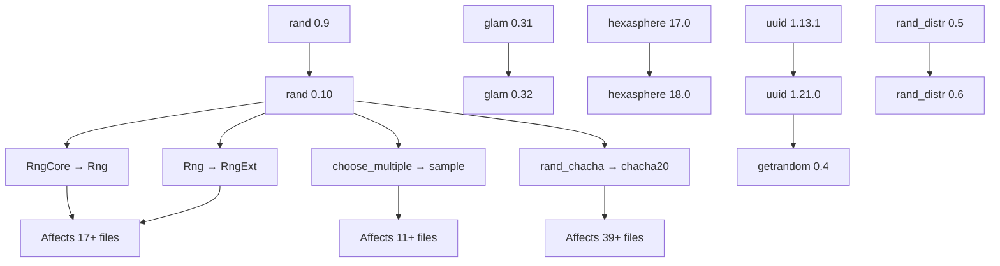

+++
title = "#22928 Upgrade glam, hexasphere, rand & uuid to latest versions"
date = "2026-02-19T00:00:00"
draft = false
template = "pull_request_page.html"
in_search_index = true

[taxonomies]
list_display = ["show"]

[extra]
current_language = "en"
available_languages = {"en" = { name = "English", url = "/pull_request/bevy/2026-02/pr-22928-en-20260219" }, "zh-cn" = { name = "中文", url = "/pull_request/bevy/2026-02/pr-22928-zh-cn-20260219" }}
labels = ["C-Dependencies", "A-Math"]
+++

# Title

## Basic Information
- **Title**: Upgrade glam, hexasphere, rand & uuid to latest versions
- **PR Link**: https://github.com/bevyengine/bevy/pull/22928
- **Author**: Bluefinger
- **Status**: MERGED
- **Labels**: C-Dependencies, S-Ready-For-Final-Review, A-Math
- **Created**: 2026-02-12T16:49:13Z
- **Merged**: 2026-02-19T22:47:18Z
- **Merged By**: alice-i-cecile

## Description Translation

# Objective

- `glam`, `hexasphere` & `rand` have released their latest versions, update Bevy to support them.

## Solution

- The above have been updated to their compatible versions. `rand_distr` updated as well to match `rand` v0.10 support.
- `rand_chacha` is soft deprecated and no longer used by `rand`, so its usage has been changed to `chacha20` to match `rand` dep tree.
- `uuid` is in the process of updating to `getrandom` v0.4, which `rand` v0.10 supports. This PR remains in draft until a new `uuid` release hits crates.io.
- `RngCore` is now `Rng`, and `Rng` is now `RngExt`, so this required updating across many files.
- `choose_multiple` method is deprecated, changed to `sample`.

## Testing

- Chase all compiler errors, since this should not regress any already existing behaviour.
- This must pass CI without regressions.

## Additional Notes

`getrandom` v0.4 doesn't add anything new for Web WASM support, so the same `wasm_js` feature is used.

## The Story of This Pull Request

### The Problem and Context
Dependency management is a critical but often overlooked aspect of maintaining a large open-source project like Bevy. This PR addresses a common yet important challenge: keeping core dependencies up to date to benefit from performance improvements, bug fixes, and new features. The specific issue was that three major dependencies - `glam` (math library), `hexasphere` (mesh generation), and `rand` (random number generation) - had released new major versions, while `uuid` was also preparing an update to support newer `getrandom` versions.

The technical constraints were significant: `rand` v0.10 introduced breaking API changes that affected almost every part of the codebase that used random number generation. Additionally, the update needed to maintain compatibility with the existing codebase while ensuring no regressions in behavior. The timing was also important because `uuid` was waiting for `getrandom` v0.4 support, creating a dependency chain that required careful coordination.

### The Solution Approach
The developer took a systematic approach to the upgrade process. First, they identified the exact version changes needed for each dependency and their compatibility requirements. The key insight was recognizing that `rand_chacha` had been soft-deprecated and should be replaced with the standalone `chacha20` crate to align with `rand`'s updated dependency tree. This required changing imports in numerous benchmark and example files.

For the breaking changes in `rand`, the developer methodically updated all trait bounds from `RngCore` to `Rng` and from `Rng` to `RngExt`. This change was particularly widespread because Bevy's math library extensively uses random sampling for geometric operations. The developer also identified that the `choose_multiple` method had been deprecated in favor of `sample`, requiring updates in several stress test examples.

### The Implementation
The implementation followed a clear pattern: update dependency versions in Cargo.toml files, then fix the resulting compilation errors. The changes were extensive but consistent:

1. **Dependency updates in Cargo.toml files**: Updated version constraints across the entire workspace, including 17 crate files and 11 benchmark files.

2. **RNG trait updates**: Changed all occurrences of `RngCore` to `Rng` and `Rng` to `RngExt`. This affected mathematical sampling code, benchmark files, and examples.

```rust
// Before:
fn make_entity(rng: &mut impl Rng, size: usize) -> Entity {

// After:
fn make_entity(rng: &mut impl RngExt, size: usize) -> Entity {
```

3. **Method updates**: Replaced deprecated `choose_multiple` with `sample`:
```rust
// Before:
let components: Vec<ComponentId> = component_ids
    .choose_multiple(&mut rng, num_components)
    .copied()
    .collect();

// After:
let components: Vec<ComponentId> = component_ids
    .sample(&mut rng, num_components)
    .copied()
    .collect();
```

4. **ChaCha20 RNG replacement**: Updated all imports from `rand_chacha::ChaCha8Rng` to `chacha20::ChaCha8Rng` while maintaining the same API.

The changes were most concentrated in the mathematical sampling code, where the `ShapeSample` trait methods needed updated trait bounds throughout the implementation. Documentation comments were also updated to reflect the new trait names while maintaining clarity.

### Technical Insights
This PR demonstrates several important software engineering practices:

1. **Cascading dependency management**: The update revealed how dependency chains work in Rust ecosystems. `uuid` needed `getrandom` v0.4, which `rand` v0.10 supported, creating a natural upgrade path.

2. **API evolution patterns**: The `rand` crate's approach of renaming `RngCore` to `Rng` and `Rng` to `RngExt` shows a common pattern in Rust library design - using extension traits (`Ext`) to add functionality without breaking existing trait implementations.

3. **Backward compatibility strategy**: The maintainers handled soft-deprecated crates (`rand_chacha`) by providing a migration path to the new standalone crate (`chacha20`) while maintaining API compatibility.

4. **Testing through compilation**: The PR description emphasizes that testing involved "chasing all compiler errors" - a practical approach for dependency updates where behavior shouldn't change, but APIs do.

### The Impact
The concrete improvements from this PR include:

1. **Access to latest features**: Bevy now benefits from performance improvements and new functionality in `glam` 0.32.0 and `rand` 0.10.

2. **Reduced technical debt**: By updating to supported versions, the project avoids accumulating dependency version gaps that become harder to fix over time.

3. **Improved ecosystem alignment**: Using `chacha20` directly instead of `rand_chacha` aligns with the broader Rust ecosystem's direction.

4. **Documentation for users**: The included migration guide (`rand_glam_uuid_update.md`) helps downstream users understand and apply the same changes in their own codebases.

The technical lessons from this PR include the importance of systematic dependency updates, the value of clear migration documentation, and the need for comprehensive testing even when "only" updating dependencies.

## Visual Representation



## Key Files Changed

### 1. `crates/bevy_math/src/sampling/shape_sampling.rs` (+46/-46)
This file contains the `ShapeSample` trait implementation for various geometric primitives. The changes update all method signatures from `Rng` to `RngExt` to match the new `rand` v0.10 API.

```rust
// Before:
fn sample_interior<R: Rng + ?Sized>(&self, rng: &mut R) -> Vec2;

// After:
fn sample_interior<R: RngExt + ?Sized>(&self, rng: &mut R) -> Vec2;
```

The documentation examples were also updated to reflect the new trait names while maintaining the same functionality.

### 2. `crates/bevy_math/src/sampling/standard.rs` (+10/-10)
This file provides standard distribution implementations for Bevy math types. The changes update trait bounds and documentation to use `RngExt` instead of `Rng`.

```rust
// Before:
impl Distribution<Dir2> for StandardUniform {
    fn sample<R: Rng + ?Sized>(&self, rng: &mut R) -> Dir2 {

// After:
impl Distribution<Dir2> for StandardUniform {
    fn sample<R: RngExt + ?Sized>(&self, rng: &mut R) -> Dir2 {
```

### 3. `examples/gizmos/axes.rs` (+7/-7)
This example demonstrates gizmo axes functionality. The changes update function signatures to use `RngExt` instead of `Rng` for consistency with the updated `rand` crate.

```rust
// Before:
fn random_transform(rng: &mut impl Rng) -> Transform {

// After:
fn random_transform(rng: &mut impl RngExt) -> Transform {
```

### 4. `crates/bevy_math/Cargo.toml` (+6/-6)
Updated dependency versions for the math crate:
- `glam` from `0.31.0` to `0.32.0`
- `rand` from `0.9` to `0.10`
- `rand_distr` from `0.5` to `0.6`
- Dev dependencies updated from `rand_chacha` to `chacha20`

### 5. `release-content/migration-guides/rand_glam_uuid_update.md` (+10/-0)
A new migration guide was added to help users update their code. It explains the key changes:
- `RngCore` is now `Rng`, and `Rng` is now `RngExt`
- `choose_multiple` is deprecated in favor of `sample`
- `getrandom` v0.4 doesn't add new Web WASM features

## Further Reading

1. **[rand v0.10 Migration Guide](https://rust-random.github.io/book/update-0.10.html)** - Official documentation for migrating from rand 0.9 to 0.10

2. **[glam Changelog](https://github.com/bitshifter/glam-rs/blob/main/CHANGELOG.md)** - Details on changes between glam versions

3. **[Rust Dependency Management Best Practices](https://doc.rust-lang.org/cargo/guide/dependencies.html)** - Cargo documentation on managing dependencies

4. **[Semantic Versioning in Rust](https://doc.rust-lang.org/cargo/reference/semver.html)** - How versioning works in Rust ecosystems

5. **[Extension Traits Pattern](https://rust-lang.github.io/rfcs/0445-extension-trait-conventions.html)** - Explanation of the `Ext` trait pattern used in rand v0.10