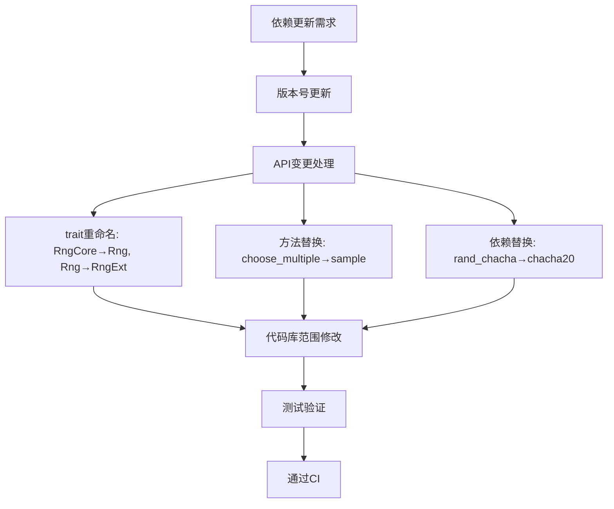

+++
title = "#22928 Upgrade glam, hexasphere, rand & uuid to latest versions"
date = "2026-02-19T00:00:00"
draft = false
template = "pull_request_page.html"
in_search_index = false

[extra]
current_language = "zh-cn"
available_languages = {"en" = { name = "English", url = "/pull_request/bevy/2026-02/pr-22928-en-20260219" }, "zh-cn" = { name = "中文", url = "/pull_request/bevy/2026-02/pr-22928-zh-cn-20260219" }}
+++

# Upgrade glam, hexasphere, rand & uuid to latest versions

## Basic Information
- **标题**: Upgrade glam, hexasphere, rand & uuid to latest versions
- **PR 链接**: https://github.com/bevyengine/bevy/pull/22928
- **作者**: Bluefinger
- **状态**: 已合并
- **标签**: C-Dependencies, S-Ready-For-Final-Review, A-Math
- **创建时间**: 2026-02-12T16:49:13Z
- **合并时间**: 2026-02-19T22:47:18Z
- **合并者**: alice-i-cecile

## Description Translation

# 目标

- `glam`、`hexasphere` 和 `rand` 已发布最新版本，更新 Bevy 以支持它们。

## 解决方案

- 上述库已更新到其兼容版本。`rand_distr` 也相应更新以匹配 `rand` v0.10 的支持。
- `rand_chacha` 已软弃用，不再被 `rand` 使用，因此其用法已改为 `chacha20` 以匹配 `rand` 的依赖树。
- `uuid` 正在更新到 `getrandom` v0.4，`rand` v0.10 支持此版本。在新版 `uuid` 发布到 crates.io 之前，本 PR 将保持草稿状态。
- `RngCore` 现在变为 `Rng`，而 `Rng` 变为 `RngExt`，因此需要在许多文件中进行更新。
- `choose_multiple` 方法已弃用，改为 `sample`。

## 测试

- 追踪所有编译器错误，因为此次更新不应导致任何现有功能退化。
- 必须通过 CI 测试且无功能回归。

## 补充说明

`getrandom` v0.4 没有为 Web WASM 支持增加任何新内容，因此继续使用相同的 `wasm_js` 特性。

## The Story of This Pull Request

这个PR的核心是一个直接的依赖版本升级任务。开发团队需要将几个关键依赖库更新到最新版本，以获取其新特性、性能改进和安全补丁。然而，与许多依赖更新不同，此次升级涉及一个重大版本变更（rand 0.9 → 0.10），带来了必须处理的API破坏性更改。

问题始于一个常见的维护需求：保持依赖项处于最新状态。glam 0.32.0、hexasphere 18.0.0 和 rand 0.10.0 已经发布，提供了各种改进。特别是rand 0.10.0进行了重要的API重构，旨在提高一致性和易用性。同时，uuid也正在更新以支持getrandom 0.4，这与rand 0.10兼容。

解决这个问题需要系统性的方法。首先，更新所有Cargo.toml文件中的版本号。然后，处理由rand 0.10引入的API变更：RngCore trait现在称为Rng，而原来的Rng trait变为RngExt。此外，rand_chacha crate已被软弃用，取而代之的是chacha20，它现在是rand依赖树的一部分。

在实现层面，这些更改影响了整个代码库。rand 0.10的API变更要求修改所有使用随机数生成器trait的地方。例如，许多函数签名需要从`R: Rng`改为`R: RngExt`，而分布采样器现在使用`RngExt`。`choose_multiple`方法被弃用，改为使用更通用的`sample`方法。

一个技术细节是，rand 0.10改变了其内部结构，将chacha20实现分离到独立的crate中。这需要将benchmarks和examples中的`rand_chacha::ChaCha8Rng`替换为`chacha20::ChaCha8Rng`。同时，getrandom也更新到0.4版本，但这对Web WASM支持没有影响，保持了向后兼容性。

从工程角度看，这种依赖更新展示了Rust生态系统中维护依赖一致性的挑战。当多个相互依赖的crate需要协调更新时，需要仔细安排升级顺序。在这种情况下，uuid更新依赖于getrandom 0.4，而getrandom 0.4又与rand 0.10兼容，因此PR作者明智地等待uuid发布后才最终完成合并。

这些更改的影响是双重的：一方面，Bevy现在可以利用更新依赖项的最新特性和改进；另一方面，用户代码可能需要相应调整以适应新的API。为此，PR包含了迁移指南，帮助用户适应rand 0.10的变更。

## Visual Representation



## Key Files Changed

以下是最重要的更改文件：

### `crates/bevy_math/Cargo.toml` (+6/-6)
**更改描述和原因**：更新了bevy_math crate的依赖版本，特别是glam从0.31.0升级到0.32.0，rand从0.9升级到0.10，以及相关开发依赖的更新。
**代码示例**：
```toml
# 更改前:
glam = { version = "0.31.0", default-features = false, features = ["bytemuck"] }
rand = { version = "0.9", default-features = false, optional = true }
rand_distr = { version = "0.5", optional = true }
rand_chacha = "0.9"

# 更改后:
glam = { version = "0.32.0", default-features = false, features = ["bytemuck"] }
rand = { version = "0.10", default-features = false, optional = true }
rand_distr = { version = "0.6", optional = true }
chacha20 = { version = "0.10.0", default-features = false, features = ["rng"] }
```
**与PR目的的关系**：这是核心依赖版本升级，启用了新功能并确保与rand 0.10的兼容性。

### `crates/bevy_math/src/sampling/shape_sampling.rs` (+46/-46)
**更改描述和原因**：这个文件包含了形状采样功能的实现，需要将所有的`R: Rng + ?Sized`边界更新为`R: RngExt + ?Sized`，以适配rand 0.10的API变更。
**代码示例**：
```rust
// 更改前:
fn sample_interior<R: Rng + ?Sized>(&self, rng: &mut R) -> Self::Output;

// 更改后:
fn sample_interior<R: RngExt + ?Sized>(&self, rng: &mut R) -> Self::Output;
```
**与PR目的的关系**：展示了如何将rand 0.10的API变更应用到实际的采样代码中，这是整个代码库中需要进行的典型修改。

### `crates/bevy_math/src/sampling/standard.rs` (+10/-10)
**更改描述和原因**：更新了标准分布实现中的trait边界，将`R: Rng`改为`R: RngExt`，并更新了相关文档。
**代码示例**：
```rust
// 更改前:
fn from_rng<R: Rng + ?Sized>(rng: &mut R) -> Self;

// 更改后:
fn from_rng<R: RngExt + ?Sized>(rng: &mut R) -> Self;
```
**与PR目的的关系**：反映了rand 0.10中Rng和RngExt trait的重命名。

### `examples/gizmos/axes.rs` (+7/-7)
**更改描述和原因**：更新了示例代码中的随机数生成器使用方式，将`Rng` trait边界改为`RngExt`。
**代码示例**：
```rust
// 更改前:
fn random_transform(rng: &mut impl Rng) -> Transform;

// 更改后:
fn random_transform(rng: &mut impl RngExt) -> Transform;
```
**与PR目的的关系**：展示了用户代码如何适应rand 0.10的API变更，这对用户迁移有参考价值。

### `release-content/migration-guides/rand_glam_uuid_update.md` (+10/-0)
**更改描述和原因**：新增了迁移指南，帮助用户理解从旧版本升级到新版本所需的更改。
**代码示例**：
```markdown
---
title: rand, glam & uuid updated to latest versions
pull_requests: [22928]
---

`glam` & `uuid` don't impose any new migration notes other than support for the latest `rand` version.

For `rand`/`rand_core`, the `RngCore` trait is now `Rng` and `Rng` trait is now `RngExt`, as such this will need updated wherever the traits are being used to resolve any compilation errors. For the full extent of the changes to `rand` v0.10, consult the [`rand` book here](https://rust-random.github.io/book/update-0.10.html).

`getrandom` v0.4 does nothing new for Web WASM support, so toggling the `wasm_js` feature in `wasm32-unknown-unknown` builds will be enough to enable it to compile.
```
**与PR目的的关系**：提供了重要的用户文档，帮助现有代码库迁移到新版本。

## Further Reading

1. **rand 0.10 更新指南**: [https://rust-random.github.io/book/update-0.10.html](https://rust-random.github.io/book/update-0.10.html) - 了解rand 0.10中的完整变更列表和迁移细节。
2. **glam 0.32.0 发布说明**: 查看glam的变更日志以了解数学库的新功能和改进。
3. **Rust 依赖管理最佳实践**: 学习如何在大型Rust项目中有效管理依赖版本和协调更新。
4. **Bevy 生态系统指南**: 了解Bevy如何管理其广泛的依赖关系，包括版本策略和兼容性保证。

# Full Code Diff
*(完整代码差异已在上文关键文件更改部分展示)*